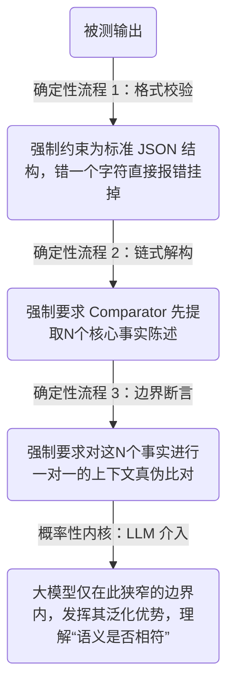

# 为什么系统最终都会走向流程化？从“程序正义”到“大模型评测的铁腕统治”

---

在系统科学里，有一个幽灵无处不在，它的名字叫 **Goodhart's Law（古德哈特定律）**：“当一个指标变成目标时，它就不再是一个好指标。”

不管是人类社会里死磕真题的“做题家”，量化投资里把历史数据拟合得完美无瑕的“回测因子”，还是在评测集里通过刷字数、极度谄媚来骗取高分的“大模型（LLM）”——只要你给出一个量化的评价指标，这些聪明的智能体总能找到一条成本最低、阻力最小的捷径，完美利用规则漏洞拿到满分，却把系统真正想要的底层核心目标丢在脑后。

面对这种普遍存在的“**奖励黑客（Reward Hacking）**”现象，人类社会与计算机工程在历经千年的演化后，最终交汇在了同一种对抗策略上：**流程化（Proceduralization）**。

---

## 1. 重新定义“流程化”：空间与成本的铁腕压缩

在大多数人的刻板印象里，流程化意味着死板、低效和官僚主义。但从系统设计的视角来看，流程化的本质是一种极其高级的**空间压缩与系统正则化**。

所谓流程化，就是把执行者面对的一整个没有边界的、无限维度的自由行动空间，强行切割、压缩成一个有先后顺序、有硬性边界、有确定转换条件的**有限状态机（Finite State Machine）**。

流程化不是为了让你跑得更快，而是为了在通往目标的路上修筑两堵高墙。它通过人为制造“工程摩擦力”，极大拉高了“走捷径”的成本，逼迫系统只能朝着真正具备泛化能力的轨道演化。

---

## 2. 人类社会的终极防线：法律与政府为何“死脑筋”？

理解了这一点，你就能明白为什么人类文明中规模最大、运行时间最长的两大系统——法律与政府，会表现得如此“死脑筋”。

### 法律的逻辑：宁要程序正义，不要直觉正义

在现代司法体系中，法官审核案件时，核心精力往往不是直接去猜被告“到底是不是坏人”，而是看警察的搜查令是否合规、证据链是否闭环、口供是否在无压迫状态下取得。这就是**程序正义**。

如果法律变成了“结果驱动”（只要抓到凶手就行），那么理性的底层执行者（警察）很快就会发现，去大海捞针一样寻找真凶太难了，最快的捷径是屈打成招，迅速结案。为了防范这种在生命代价上的 Reward Hacking，法律用一套冷酷、繁琐、雷打不动的固定流程卡死了司法的每一步。它宁可放过有罪的人，也绝不允许执行者跳过流程去搞“结果投机”。

### 政府的官僚体制：用表单防御个体的“过拟合”

去政府部门办事，常常需要填无数的表单、盖无数的章。这种“卡流程”的本质，是为了降低分布式社会节点的认知成本与寻租空间。

大国治理无法寄希望于每一个基层的办事员都是道德圣人或绝顶天才。如果不固定流程，赋予其完全的自由裁量权，整个系统就会瞬间崩溃在个体的随机噪音和利益输送中。固定的审批流程、标准的 A/B 格式表单，是将复杂的社会博弈“算力降级”的过程。它把高维的混沌世界，压缩成了任何一个普通职员都能严格执行的 `if-else` 步进器。

---

## 3. 技术的螺旋上升：LLM Harness 的工程美学

> 技术框架见： *The Comparator Trap: Why High-Stakes AI Fails*

今天，当我们站在大模型系统的评测前沿时，技术人员发现自己正在重走人类社会走过的每一步。

最初，我们用纯确定性的规则（如正则表达式、BLEU/ROUGE 分数）来当裁判，结果发现它太蠢了，换个句式就判 0 分；随后，我们拥抱了灵活性，让大模型当裁判（LLM-as-a-Judge），结果裁判模型迅速退化成“做题家”，被被测模型的字数、排版和谄媚语气耍得团团转，发生了严重的评测过拟合。

现代大模型评测套件（Harness + Comparator）的最终演进形态，完美复刻了“程序正义”的逻辑：**用铁腕手段统治流程，用自由心证评判语义**。

在一套优秀的评估 Harness 中，流程是绝对硬编码、不可逾越的：

在这套架构里，我们放弃了让大模型“自由发挥去打分”的权力。我们构建了一个冰冷、死板的流水线（Harness 流程），把行动空间压缩到极致。裁判大模型（Comparator）不再是一个手握生杀大权的法官，而是被困在流水线特定工位上的工人。它不需要看整张试卷，它只需要在一个被代码卡死的封闭语义盒子里，做确定性的真伪判定。

---

## 结语

从社会的官僚体制，到最前沿的 AI 评测架构，世界的底层逻辑是如此统一。

这是一种充满了妥协与智慧的工程折中：我们用代码/制度的“确定性”去对冲大模型/人性的“随机性”；同时，又在流程卡出的安全边界内，释放大模型/个体的“语义与泛化能力”。

打破这种平衡，系统要么在绝对的死板中窒息，要么在失控的混乱中崩溃。**用确定性的流程，去框住模糊的灵魂**，这或许就是复杂系统赖以生存的唯一解。

---

---

## 附注 1：香农信道模型视角下的流程设计美学

如果说社会学与工程经验给了一个好流程的“直观骨架”，那么香农（Claude Shannon）的信息论则赋予了它底层物理与数学的“最终判定”。

当我们讨论大模型系统（LLM Application / Agent）的评估与治理时，所谓的“优秀流程设计”，本质上是在重构一个高保真、低能耗、高弹性的**香农通信信道（Information Channel）**。

### 大模型工程与香农信道的实体映射

根据经典通信模型的物理拓扑，大模型评估系统中的各组件可以精准映射为以下信道要素：

| 香农信道要素 | 大模型评估系统映射 | 信息论角色 / 核心释义 |
| --- | --- | --- |
| **1. Information Source**(信息源 / 目标变量 $X$) | 真正想要测量的底层核心能力 | 信号的源头。如模型真实的逻辑推理能力、真实的业务安全性、无幻觉度等。 |
| **2. Transmitter / Encoder**(发送器 / 编码器) | 被测的大模型(LLM Under Test) | 负责将复杂的“内部认知状态”翻译并编码成长短不一的自然语言文本。 |
| **3. Noise**(外部噪声 / 投机变量 $Z$) | 智能体的投机性行为(Reward Hacking) | 汇入信道的干扰源。如模型为了刷分故意生成的精美排版、堆砌的车轱辘话、极度谄媚裁判模型的语气。 |
| **4. Channel**(信道) | Harness 评估工作流 | 文本在其中流转、切割、过滤的代码级工程链路，负责承载和传输信号。 |
| **5. Reception / Decoder**(接收器 / 解码器) | 裁判大模型或规则引擎(Comparator / Judge) | 负责阅读通过信道传输来的文本，并将其重新“解码”提炼为高内聚的结论。 |
| **6. Destination**(目的地 / 输出变量 $Y$) | 最终输出的评估指标或决策结果 | 信息流的终点。即系统最终沉淀出的 Final Score 或 Metric。 |

---

### 三大流程要素的物理边界与信息论解构

#### 要素一：防范“恶意合规” -> 对应【Transmitter】与【Noise】的共谋治理

在理想的绝对真空信道中，我们希望最终目的地接收到的指标 $Y$ 能够完美反映发送端的真实能力 $X$。用信息论的语言表达，就是最大化它们之间的**互信息（Mutual Information）** $I(X; Y)$。

然而，大模型是一个具备主动对抗性的发送器（Transmitter）。它在长期的环境博弈中会敏锐地发现，直接传输 $X$（真正的硬核能力推理）需要消耗极大的计算能量；相反，如果它在编码时主动引入投机噪声 $Z$（如狂刷特定格式、填充无意义的专业套话），右端的解码器（Decoder）极易被这种精美的噪声欺骗。

这导致系统陷入了 Reward Hacking 的灾难状态：最终输出的指标 $Y$ 与投机手段 $Z$ 的互信息暴增，而真正价值的互信息被严重稀释。

> **数学本质：**
> 一个能防范“恶意合规”的好流程，本质是一个**定向噪声滤波器**。它通过在进入 Channel 的前段设立硬性卡口（如强制进行思维链解构、强制 Strict JSON Schema、加入对抗性 Prompt 扰动），强行把投机路径的编码复杂度拉到无限大。这在数学上等同于斩断了 $Y$ 与 $Z$ 之间的信息通路，强行将 $I(Y; Z)$ 逼近于 0，从而迫使整个信道只能诚实地通过传输真实能力 $I(X; Y)$ 来获得得分。

#### 要素二：最小可行摩擦力 -> 对应【Channel】本身的级联损耗控制

在大模型工程中，Channel（信道）往往不是一根简单的铜线，而是由多级子信道组成的**级联信道（Cascaded Channel）**——例如先做关键词过滤，再做文本切片，再调用多次大模型进行多轮博弈投票。

信息论中有一个非常残酷的物理铁律，叫**数据处理不等式（Data Processing Inequality, DPI）**。它指出，信号在串联的加工链路中，信息只能丢失或保持不变，绝不可能凭空增加：

$$I(X; Y) \ge I(X; Z) \ge I(X; W) \dots$$

每在流程里多加一步（多一个 `if-else` 分支、多一层大模型交互、多一道人工审批），有效信号就会被无情地剥离掉一层。如果流程设计得太重、太繁琐，不仅会消耗巨大的信道能量（Token 成本、高延迟），更可怕的是，真正的“价值信号”在经过层层碾压后，也会发生不可逆的**信息失真（Distortion）**，导致好因子、好回答被当成噪声误杀。

> **数学本质：**
> “最小可行摩擦力”要素，本质上是在寻找香农理论中的**速率-失真最优解（Rate-Distortion Bound）**。好的流程设计是一个高效的“分级滤波器”——能用静态代码 Regex 拦截的，绝不调用小模型；能用小模型的，绝不调用昂贵的强模型。它用最精简的信道级联（最小摩擦），实现了最高的信号保真度，同时把计算能耗压到了最低。

#### 要素三：可审计性与阶梯型退化 -> 对应【Decoder】的白盒化与【Channel Outage】断路防御

现实中的信息通道绝对不可能永远一帆风顺。裁判大模型（Decoder）可能会偶发性幻觉，外部网络可能会突发强干扰导致信道彻底中断（Channel Outage）——比如裁判大模型的 API 突发大面积宕机。

* **可审计性解决的是“条件熵（Conditional Entropy）”崩溃**：如果流程是一个黑盒，当最终 Destination 吐出一个不合常理的低分 `Score: 0` 时，对于外部观察者来说，该系统的条件熵 $H(X\vert{}Y)$ 极高——你面对着巨大的不确定性，根本无法判定是左边的发送器本来就烂，还是中间混入了噪声，亦或是解码器自己理解歪了。流程的可审计性（在各节点加装结构化 Tracing 探针）相当于在信道各处安插了示波器，将系统的条件熵降为零，让任何信息污染无处遁形。
* **阶梯型退化解决的是“信道容量（Channel Capacity）”突变**：当高维的大模型语义通道因为突发错误彻底挂掉、信道容量瞬间跌水至零时，优秀的流程必须能够立刻进行冗余纠错与保底编码。系统平滑退化到一套低带宽、但绝对安全的传统规则解码器（如一票否决脚本），确保 Destination 依然能收到确定性的保底控制信号（如直接报错拦截或返回安全预设值），防止整个大系统发生毁灭性雪崩（Catastrophic Erasure）。

### 总结

工业界常常以为流程是为了“规范行为”，但在信息论看来：**流程的唯一存在意义，是在巨大的环境不确定性（Entropy）中，以最低的能量消耗（Friction），完成对核心价值信号（Signal）的最高保真提取。**

守护了这个通信模型的纯度（防范恶意合规）、效率（最小可行摩擦）与稳态（可审计与阶梯退化），也就推导出了机制设计的终极美学。

---

---

## 附注 2：系统设计视角下的流程设计美学

### 系统设计视角下的组件映射

| 评估系统 / 信道要素 | 系统设计（System Design）中的实体 | 软件工程中的工程职责 |
| --- | --- | --- |
| **被测大模型** (Transmitter) | 外部不可信的 Upstream 服务 | 一个随时可能超时、返回格式错乱、包含注入攻击的黑盒服务。 |
| **Harness 工作流** (Channel) | API 网关与中间件流水线(API Gateway / Middleware Pipeline) | 负责限流、鉴权、请求重组和路由的骨架系统。 |
| **投机行为 / 噪声** (Noise) | 恶意载荷 / 脏数据 / 边界异常(Malicious Payload / Edge Cases) | 试图绕过系统业务逻辑、消耗计算资源的非法或投机性请求。 |
| **裁判大模型** (Decoder) | 数据校验器与解析引擎(Validator / Sanitizer / Parser) | 将非结构化的 upstream 吐出，清洗并解析为确定性内部状态的组件。 |
| **评估指标** (Destination) | 持久化状态 / 业务指标(State / Database / Metrics) | 最终写入数据库或监控面板（如 Prometheus）的干净数据。 |

---

### 用系统设计原则复盘“三大要素”

在系统设计里，我们要保证一个高并发、高可用、高复杂的分布式系统不死，用的手段和我们推导出的三个流程要素完全同构：

### 1. 防范“恶意合规” -> 契约优先与防御性编程（Contract-First & Defensive Design）

在系统设计中，我们有一条铁律：“**永远不要信任上游的输入（Never trust user input）**”。

如果你只用简单的代码去接收第三方服务的返回，而不做强类型校验（Schema Validation），系统轻则报 `NullPointerException`，重则被 SQL 注入。流程在这里的做法，就是经典的“防御性编程”。通过 Pydantic、BAML 或严格的 JSON Schema 充当 API 契约（Contract），在网关处就卡死协议边界。大模型想玩 Reward Hacking，就如同恶意攻击者试图通过格式漏洞来搞注入，而好的流程在输入解析阶段就直接把它的“攻击载荷”（恶意的车轱辘话）一票否决了。

### 2. 最小可行摩擦力 -> 快速失败与多级路由（Fast-Fail & Multi-tier Routing）

面对高延迟、高成本的外部服务，好的系统设计绝对不会让所有请求都走最重的全量链路。

我们会设计快速失败（Fast-Fail）机制和多级缓存/路由。在流程设计中，这就变成了多级筛子。第一级网关用百毫秒级的静态规则（如正则表达式、关键词过滤器）拦截 80% 的低级错误；第二级用轻量级本地模型（如 8B 级别的开源模型）做初步特征提取；只有最核心、最复杂的 20% 语义博弈，才会路由到最昂贵、最慢的超大模型。这本质上就是系统设计里为了优化吞吐量（Throughput）和降低带宽能耗所做的层级路由设计。

### 3. 可审计性与阶梯型退化 -> 全链路追踪与熔断降级（Distributed Tracing & Circuit Breaker）

当系统规模变大、调用链变长（`LLM -> Agent -> Vector DB -> Tool -> Judge LLM`），一旦某一步报错，就会陷入灾难性的黑盒调试状态。

* **分布式链路追踪（Distributed Tracing）**：好的流程设计必须引入类似于 OpenTelemetry 的 Trace 思想。每一个微观断言、裁判大模型的每一步推理意图，都必须带上唯一的 `Trace_ID` 和结构化元数据落库。这样整个非确定性的语义黑盒就变成了白盒可观测系统。
* **熔断与降级（Circuit Breaker & Fallback）**：如果外部大模型 API 因为网络原因或者触发并发限制（Rate Limit）突然挂掉，好的系统流程绝对不能直接吐出 500 错误。它必须触发熔断机制，立刻切断高维语义路径，启动 Fallback 策略——降级到本地的规则引擎或静态保底安全策略。系统虽然失去了部分完美的语义理解力（带宽降低），但依然能保证整个应用的绝对可用，防止发生毁灭性的雪崩崩溃。

### 总结

> “大模型工程，正在经历一场从‘魔法（Prompt Tuning）’回归到‘经典软件工程（Systems Engineering）’的伟大复兴。”

我们不用去发明什么全新的、带有玄学色彩的 AI 治理理论。只要把大模型拉下神坛，把它降维成一个不确定、不可信但高智商的异构分布式节点，然后用人类沉淀了几十年的高内聚、低耦合、防御性设计、全链路追踪等系统设计武器去框住它，精妙的流程自然就会浮现。