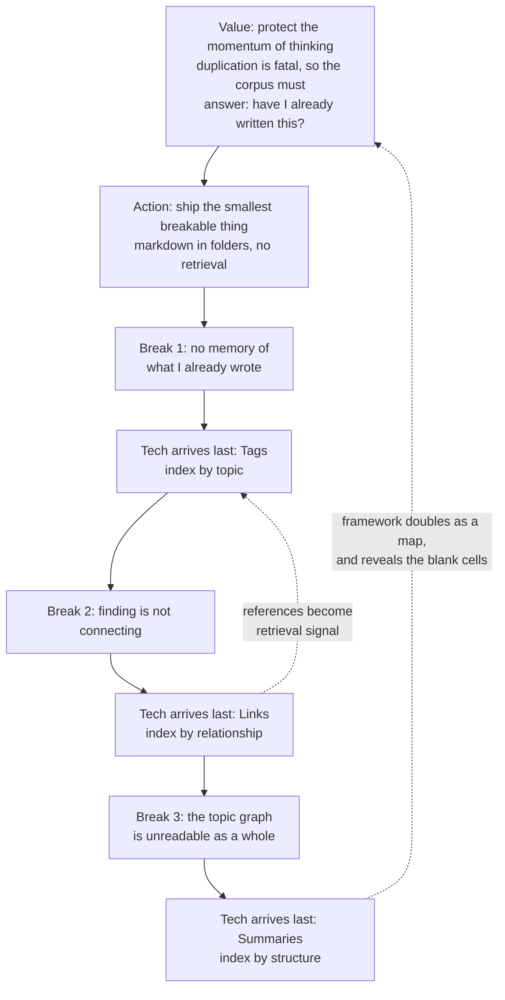

A friend has spent months choosing an architecture. He has read the standard designs, compared storage engines, drawn a diagram he still isn't willing to commit to, and shipped nothing. Listening to him describe the block, I finally put a name on it: it isn't weak execution. A perfect architecture isn't hard to find — it is undecidable. Every architecture question is a trade-off, and every trade-off needs someone to answer "what are we protecting here, and what are we willing to lose?" Research cannot supply that answer, because it isn't out there. He put technology first, so he got stuck on a question technology is unable to answer.

I hit the same wall on a smaller stage and got out in the opposite order. The value this blog protects is one scarce resource: the momentum of thinking. The threat was never a lack of ideas; it was everything that isn't writing. Sessions kept leaking time into admin — filing, re-finding, re-deriving, re-formatting — so the design brief was economic from day one: human thinking, zero busywork.

Once that value is named, the trade-offs stop being open questions. If the resource is thinking momentum, duplication is fatal: a second half-finished treatment of an idea makes both halves worth less. So before anything else worked, the system had to answer one question — have I already written this? That is where my first layer came from, and it arrived as a problem, not as a design choice. Value, then action, then technology: the order is the argument of this article, and the three layers of my blog are the evidence for it.

## Step one is to ship something that can break

The trap the research loop falls into is subtler than impatience. When you are designing against an empty field, the problems don't exist yet. My first version had no retrieval at all: markdown files in folders, which is to say a pile. That was the right amount of engineering, because the first real problem — forgetting what you wrote — only exists once there is enough writing to forget. You cannot research your way to a requirement. You can only ship your way into one.

The collection then broke three times, and each time I patched it with the cheapest thing I could think of. Watch where the technology sits in each round.

## Tags: value decides, then the dumbest possible fix

The break was ordinary. Six months after publishing an analysis I have no reliable memory of it, so I wrote it again.

The smallest action was dumber than any design review would accept: have the AI generate a handful of tags per finished article, and at draft time match the new topic against them. No embeddings, no vector database, no pipeline. The lookup also returns the delta — what this draft says that the archive doesn't yet — which is what lets me start a piece with confidence that nothing like it is already in there.

The technology is genuinely weak. Tags carry the accidental vocabulary of the moment an article was written, and they rank badly at anything interesting. It worked anyway, because the hard part of personal retrieval isn't ranking; it's knowing the corpus contains anything at all. A crude index that exists beats a perfect one that never gets built — which happens to be the sentence my friend needs.

## Links: the system starts feeding itself

The next break: tags can tell me a topic has been touched, but they cannot express that two articles run on one mechanism. The action was small and specific — when drafting, run the search skill first and insert a cross-reference at the exact spot where the connection lives, not a bibliography at the end. The new piece says "the mechanism behind this claim is worked out here" instead of re-deriving it. An argument that already exists should be cited, not repeated; cross-referencing is how two articles share one copy of the same idea.

Then something returned that I hadn't asked for. Once articles carry reference lists, their links describe their content more truthfully than their tags do, because the connection is structural rather than lexical — you can link to an article whose tags you'd never have matched. The references became retrieval signal, and the system started bootstrapping itself while the search algorithm stayed untouched.

That loop broke too, eventually. A web of cross-referenced articles is individually fine and collectively unreadable; to re-enter a mature topic I'd traverse half the graph and arrive more scattered than before. Each article held a local patch of truth. No object held the map.

## Summaries: frameworks you didn't know you needed

The unreadable graph set the task: step back from a cluster, invent a framework, and hang the articles on it as detail. The framework has to be MECE or it collapses on contact, which is exactly why writing one is not free. The best example is a collection of about thirty pieces on organizations, incentives, and public governance. Each had been written one argument at a time; each is locally sound; together they had no way in. The overview I eventually wrote for that section — [极简组织行为学与管理学概论](https://cj9208.github.io/blog/systems_and_governance/ob-management-overview/) — had to invent a frame to hold them: three permanent constraints every organization inherits (information asymmetry, bounded rationality, incomplete contracts), the three standard patches management invented against them (split the process, measure the outcome, bond people with a story), and the one switch — inflow or stock — that decides whether those patches cooperate or turn into weapons. To place thirty finished articles into that frame, I had to rule on which distinctions were load-bearing, which pieces were about the same constraint wearing different clothes, and in what order the pieces fit. Several had to be demoted from standalone claims to examples. Writing the summary taught me the subject; the articles had not.

I built these to organize the corpus, then noticed I was using them to navigate it. A framework answers "where does this new question live?" better than any tag search, and once it's a map it hands out slots. Three governance pieces now open by naming the chapter of that overview they occupy: [终极的管理学悖论](https://cj9208.github.io/blog/systems_and_governance/goodhart-law-management/) and [间断平衡](https://cj9208.github.io/blog/systems_and_governance/chinese_government/punctuated-equilibrium-system-reform/) were both written before the overview existed and were re-pointed at it afterwards, while [拒绝充当系统的缓冲垫](https://cj9208.github.io/blog/systems_and_governance/malicious-compliance-organization-game/) came later and declared its slot in advance. The map also keeps generating work: an empty cell implies an article that should exist and doesn't, and more than one piece was dictated by a blank in a framework rather than by inspiration. Those are the requirements no advance research could have surfaced, since the map that exposes them is itself a product of having shipped.

## The chores don't count

Alongside these three stages sits a layer that evolved nothing: the skills that generate tags, unify link formats, bump `lastmod`, and apply house conventions. They are pure repetition, and automating them is what kept the three real mechanisms affordable. The line that emerged: if a task's rules change as the system learns, it's architecture; if they never change, it's a chore. Most of these skills began as design decisions and only became chores once the system settled — a chore is architecture that has stabilized. Rules stop moving only after the problem they answer has been solved, so the migration from judgment to command is the clearest signal that a problem is genuinely finished.

## The order is the point

Laid out in sequence, the three fixes look ad hoc. Tags index the corpus by topic, links by relationship, summaries by structure — but that taxonomy is the least interesting thing here, and it is also the thing my friend is trying to buy with research. What actually happened is that the goal never changed, and only my definition of "knowing what I've already written" did. The technology looks like the substance of the story; it is only the shape each answer happened to take, and it arrived late, cheap, and reluctantly. I didn't design this architecture. Volume selected it.

## I reinvented my day job

And here is the confession. I spend my working hours designing RAG systems — [my RAG orchestration notes](https://cj9208.github.io/blog/ai_study/rag-orchestration-architecture/ch00_preface/) describe an intention and filtering layer, an enrichment layer, an indexing layer, and summarization for when context outgrows the window. Building this blog by hand, one pain at a time, I reinvented my own day job, with myself as both the user and the corpus.

The uncomfortable part is what the two halves say about order. At work I start from the layers, and that is a luxury: someone else has already paid the value question. A brief arrives saying what to protect, so technology can legitimately sit first in my sequence while actually sitting second in reality. On the blog there was no brief, only a resource I wanted back — so I went value, then a pile of markdown, then whatever patched the last break. Same three layers, far less design wasted. The wrong order doesn't merely produce a worse architecture. It produces no architecture at all, because you never find out what the thing was for.

## There are no standard answers

My friend is asking a question that has no answer. "What is the standard architecture for this?" assumes the answer exists somewhere outside his own problem — and if the order above is right, it cannot, because the question turns on what he has decided to protect. Someone once asked me what the standard way is to use AI for this kind of work, and I said:

> There are no standard answers in the AI area. Just try, just use, and build your own way of using AI to solve the task. If you succeed, you are the standard.

I have since watched that sentence hold for architecture as well. None of my three layers was a standard answer — tags were cheap, links unglamorous, summaries unplanned — and each survived only because it fixed a problem I had actually observed. Survival is the only test available where no benchmark exists yet. I argued the negative case before, that tech is important but never the object, in [技术的终点是解决问题](https://cj9208.github.io/blog/ai_era_engineering_careers/hardcore-worship-system-design/) and [Think Beyond the Code](https://cj9208.github.io/blog/ai_era_engineering_careers/beyond-the-code-workflow-design/); this blog adds the order to put in its place, and one rule for living inside that order — hand over whatever no longer needs judgment, and keep everything that still does.

So he has three questions, in this order. What are you protecting, and what will you let break in order to protect it? What can you ship this week that is small enough for a real problem to reach it? Which technology fixes the first thing that actually broke, rather than the fifth thing you fear? He has spent months on the third one — the only question research can answer — while the first two went unasked. That is the whole shape of the stall.

## Attachments

Two slide decks accompany this article, one on each side of the order:

- [AI-Augmented Personal Blogging (PDF, 8 pages, 2026-09-20)](/blog-system-evolution/AI-Augmented-Personal-Blogging-2026-Sep-20.pdf) — the value and workflow side: what the system is for, and what it gave back.
- [My Personal Knowledge Engine (PDF, 12 pages)](/blog-system-evolution/My-Personal-Knowledge-Engine.pdf) — the technology side: the three index layers, and how they map onto a production RAG stack.
