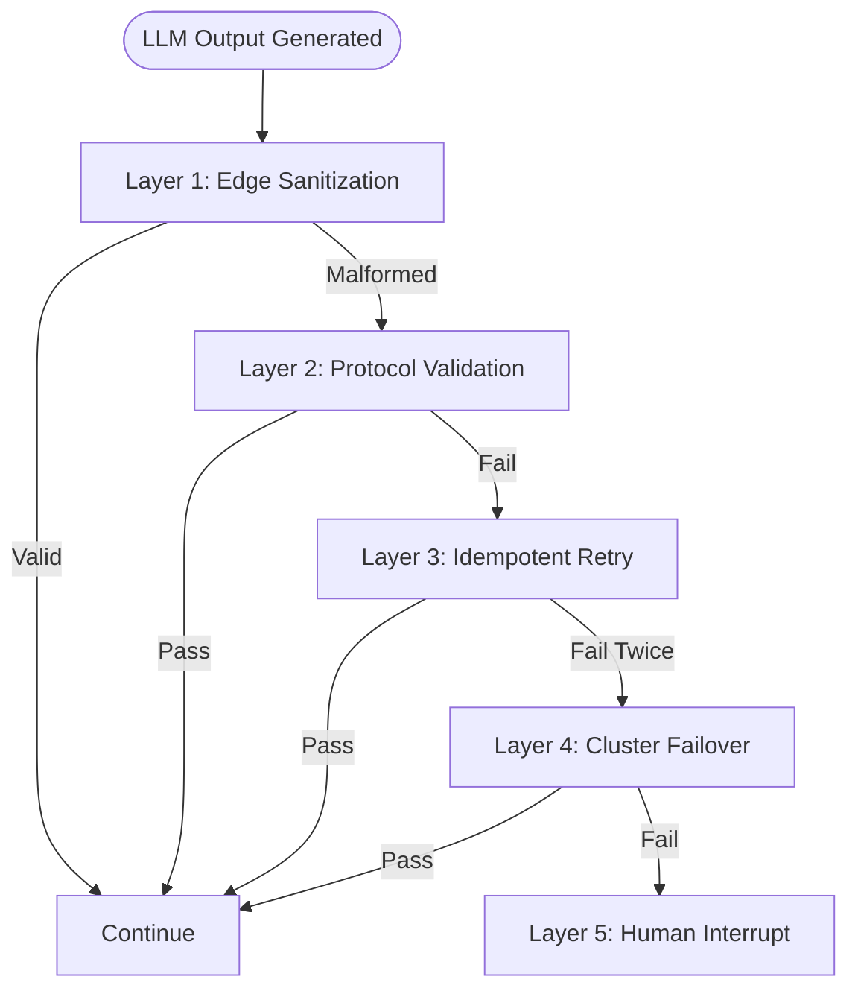

Reasonix is an advanced LLM harness engineered for non-deterministic environments, designed natively to exploit the unique context-caching and compute architectures of DeepSeek models. Moving past the era of ephemeral prompt scripts, Reasonix treats the underlying LLM not merely as an API endpoint, but as an unconventional, non-deterministic compute core.

To govern this core with strict predictability, cost efficiency, and structural resilience, Reasonix implements two foundational system-level architectures: **Deterministic Prefix Caching** and a **Unified Graceful Fallback Pipeline**.

---

## 1. Deterministic Prefix Caching: Memory Layout Optimization

In long-context agentic workflows, prompt drift is an economic and performance killer. If a single token changes at the beginning of a 100k-token repository map, the entire downstream prompt cache is invalidated. This triggers full-price processing fees and significant latency penalties.

### The Design: Explicit Invariant Zones
Rather than leaving cache optimization to the runtime's black-box heuristics, Reasonix enforces byte-level prefix stability directly at the harness level by segregating the context window into three rigid memory layout zones:

*   **PinnedPrefix Zone (Immutable):** Contains the system prompt, comprehensive tool definitions, and the codebase/repository map. This layer is strictly immutable throughout the agent's entire lifecycle.
*   **AppendLog Zone (Append-Only):** Tracks the execution history. Reasonix guarantees that logs are strictly appended with zero intermediate truncation or dynamic modifications, ensuring that DeepSeek's historical cache chain remains unbroken.
*   **TurnScratch Zone (Volatile):** Reserved for temporary metadata, dynamic task evaluations, and intermediate multi-turn calculations. This data is systematically wiped or isolated at turn boundaries so it never corrupts the upstream cache layout.

### The "Why": The Harsh Economics of Token Compute
DeepSeek’s radical pricing divergence makes cache management a primary engineering constraint. It offers up to a 90% discount on cached input tokens compared to uncached inputs. In long-running developer loops, maintaining an unbroken cache prefix shifts the financial profile of an agent from a commercial liability to a highly viable production utility.

### Architectural Comparison: Reasonix vs. Claude Code

| Architectural Vector | Claude Code | Reasonix |
| :--- | :--- | :--- |
| **Cache Orchestration** | **Heuristic & Imperative:** Relies on injecting dynamic `cache_control` flags via programmatic heuristics. | **Structural & Declarative:** Enforces an invariant memory contract directly via the context data layout. |
| **State Mutation** | Frequently rewrites or trims intermediate conversation history to save total token windows, regularly invalidating downstream blocks. | Preserves an append-only transaction log to guarantee up to 99% cache persistence across extended loops. |
| **Boundary Isolation** | Mixes tool execution contexts and structural system metadata within the same historical linear sequence. | Explicitly separates transient per-turn computation from long-lived state invariants. |

---

## 2. The Unified Graceful Fallback Pipeline: Distributed Exception Management

When an LLM outputs malformed syntax or hits a complexity wall, treating it as an unrecoverable crash is a systemic failure. Reasonix addresses this by integrating local linting, contextual retries, and multi-tier model shifting into a cohesive, five-layer fault-tolerance control flow.

### Layer 1: Edge Data Sanitization (Local, <1ms)
*   **System Analogy:** Edge Node Data Sanitization
*   **The Mechanism:** The moment a lower-tier model (e.g., DeepSeek-V4-Flash) returns a response, the harness intercepts it locally using Abstract Syntax Tree (AST) or regular expression parsers.
*   **The Logic:** If the foundational logic is intact but wrapped in minor structural defects (e.g., clipped JSON wrappers or missing closing XML tags), the harness repairs the envelope instantly on the client side. The execution proceeds smoothly, leveraging the warm cache of the flash model without notifying the external environment of a fault.

### Layer 2: Protocol & Schema Validation (Local, <20ms)
*   **System Analogy:** Protocol Compliance Verification
*   **The Mechanism:** The sanitized payload is passed to local linters, type checkers, or strict compiler validation tools.
*   **The Logic:** This layer confirms the structural and logical integrity of the generated output. If the code compiles or matches the schema exactly, it is approved for execution. If the compiler returns a hard failure, the system immediately flags the flash model's response node as corrupted and escalates the fault.

### Layer 3: Idempotent Retry with Context Mutation (Remote, Seconds)
*   **System Analogy:** Stateful Transient Exponential Backoff
*   **The Mechanism:** The harness clears the mangled output block, appends a precise, localized error payload to the end of the prompt sequence, and requests a single-shot regeneration from the flash model (`max_retries = 1`).
*   **The Logic:** Because the upstream cache prefix remains perfectly locked, a localized retry is incredibly fast and cheap. Given the low cost profile of flash models, giving the model one immediate, well-contextualized chance to correct its mistake is highly cost-effective.

### Layer 4: Cross-Cluster Failover to Premium Service (Remote, High Cost)
*   **System Analogy:** Circuit Breaking with Premium Cluster Routing
*   **The Mechanism:** If the flash model fails to pass validation after a localized retry, it signals that the underlying task complexity has broken through the cognitive ceiling of the lower-cost tier. The harness cuts the execution track and transparently migrates the clean, uncorrupted historical prefix to a high-cognition model tier (e.g., DeepSeek-V4-Pro / R1 reasoning chains).
*   **The Logic:** The premium reasoning engine completely restructures the logic to break the dead-end. To prevent costly, repetitive ping-ponging between model tiers, the harness locks the execution track to the Pro model for the remainder of that specific task's lifecycle.

### Layer 5: Human-in-the-Loop Interrupt (Infinite Wait)
*   **System Analogy:** Sysadmin Escalation / PagerDuty Alert
*   **The Mechanism:** If even the premium reasoning engine fails to compile or resolve the problem within its execution loop—typically caused by hard environment conflicts or logical paradoxes—the system relinquishes automated orchestration.
*   **The Logic:** The harness preserves the exact state of the environment, halts execution, and drops control back down to the developer terminal, awaiting explicit manual diagnostics or a direct interactive command (e.g., `/fix`).

### The Financial Elasticity and Self-Healing of the Pipeline
Integrating this tiered hierarchy reveals a key architectural truth: maximizing cost-efficiency does not mean sacrificing output quality.

*   **The Baseline State:** Under normal operating conditions, 90% of routine development tasks are successfully resolved between Layer 1 and Layer 2. The remote GPU clusters only process low-cost flash-model inputs and normal outputs, keeping operational expenditures minimal.
*   **The Exception State:** Only the remaining 10% of highly complex problems manage to breach the lower defensive lines and trigger Layer 4 premium cluster routing. Because this represents a small fraction of the total token budget, the overall financial footprint remains highly predictable and stable.

---

## 3. Conclusion: The Harness as an Operating System

When we look closely at how Reasonix manages these layers, it becomes clear that building advanced AI systems is no longer about writing clever prompts. It is a rigorous exercise in system engineering.

The parallels to classic operating system design are exact:
1. **Prefix Caching** functions precisely like an **OS Page Cache** or **CPU L3 Cache**, enforcing strict layout boundaries to minimize expensive, cold I/O operations down to the model's weights.
2. **The Unified Fallback Pipeline** operates as a sophisticated **Kernel Exception Handler**, intercepting faults at the lowest privileged level before escalating them gracefully through asymmetric compute cores (reminiscent of hardware-level **big.LITTLE** scheduling architectures).

By shifting the engineering focus away from brittle prompt tuning and placing it squarely onto self-healing, resource-disciplined software architectures, Reasonix demonstrates how to convert erratic AI behaviors into resilient, production-grade distributed systems.
