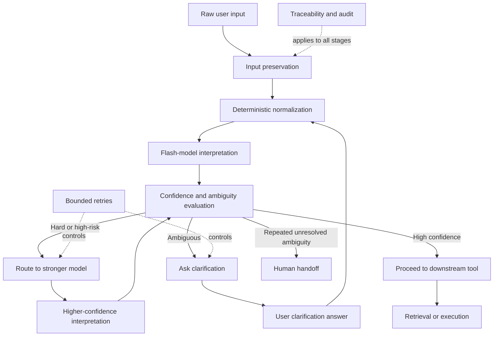

## Purpose

The intention recognition layer is the control layer that sits between raw user input and retrieval/reasoning.

Its job is not only to "understand the user", but to reduce ambiguity, narrow search space, control cost, and decide when the system should proceed, clarify, escalate, or stop.

This is a harnessed design rather than a single-model black box.

This document describes the focused upstream component. For the broader company-wide architecture that extends this layer into capability routing, governed execution, domain-scoped subsystems, and human escalation, see `CH02_Request-Orchestration-Layer.md`.

## Whole Picture

The layer combines:

1. deterministic normalization
2. lightweight model-based interpretation
3. confidence-gated routing
4. clarification-first disambiguation
5. bounded retries
6. graceful fallback to stronger models or a human agent

The key idea is simple:

> It is better to spend one extra turn resolving ambiguity than to produce a fast but wrong answer.

### Whole-Picture Diagram



The logic is:

1. clean and shape the request first
2. evaluate whether the interpretation is safe enough
3. only then proceed, clarify, escalate, or hand off

## Design Goals

1. improve precision before retrieval starts
2. reduce retrieval and rerank cost by shrinking the search space early
3. avoid low-confidence guesses when user intent is ambiguous
4. use cheap methods first and reserve expensive reasoning for harder cases
5. make failures observable, controlled, and recoverable
6. support clean handoff to a human agent when automation does not converge

## Core Principles

### 1. Deterministic First

Use deterministic methods whenever possible because they are cheaper, more stable, and more auditable than model-only reasoning.

Examples:

- typo repair
- short-name recovery
- alias expansion
- canonical entity mapping
- metadata-based lookup
- exact or fuzzy matching

### 2. Lightweight Model Use

Use a flash model for low-cost interpretation tasks that benefit from language understanding but do not justify a larger model by default.

Examples:

- query rewrite
- intent shaping
- extracting likely target entities
- identifying requested fields or attributes
- generating structured confidence-aware interpretations

### 3. Confidence-Gated Routing

Model output is not trusted blindly.

The system uses confidence and other signals to decide what path to take next.

Typical routing outcomes:

- high confidence, simple task: proceed directly
- medium confidence: proceed conservatively or broaden retrieval
- ambiguity detected: ask clarification question
- hard or high-risk case: route to stronger model
- repeated unresolved ambiguity: hand off to human agent

### 4. Clarification Before Deep Retrieval

If the target entity or requested detail is not clear, the system should ask a focused clarification question before spending larger retrieval or reasoning budget.

This avoids strong reasoning on top of a weak interpretation.

### 5. Bounded Retries

The system should not loop indefinitely.

After a small number of clarification or retry attempts, it should escalate gracefully.

### 6. Graceful Human Fallback

If the system cannot resolve ambiguity after bounded attempts, it should transfer the case to a human agent with a structured handoff packet.

## High-Level Flow

```text
User query
-> Deterministic normalization
-> Flash-model interpretation
-> Confidence and ambiguity evaluation
-> Route decision
   -> Proceed
   -> Clarify
   -> Stronger model
   -> Human handoff
-> Retrieval and downstream reasoning
```

## Stage-by-Stage Design

### Stage 1: Input Preservation

Always preserve the original user message.

Why:

- original wording may contain subtle intent clues
- later corrections should remain traceable
- human handoff must include untouched user input

Artifacts:

- original query
- session context
- relevant chat history

### Stage 2: Deterministic Normalization

This stage performs cheap and reliable cleanup before model reasoning.

Functions:

- spelling or typo repair
- shorthand expansion
- short-name recovery
- alias mapping
- canonical entity resolution when exact mapping is available
- basic syntax cleanup

Outputs:

- normalized query
- canonicalized entities, if resolved
- deterministic match candidates
- deterministic match scores or rule hits

Notes:

- automatic transforms should be limited to low-risk changes
- all applied transformations should be traceable
- if deterministic methods strongly resolve the intent, later stages can stay cheap

### Stage 3: Flash-Model Interpretation

This stage uses a lightweight model to refine understanding after deterministic cleanup.

Functions:

- rewrite ambiguous wording into clearer search language
- infer likely user target from context
- identify what detail type the user wants
- extract task structure for later retrieval
- output confidence and structured reasoning artifacts

Recommended structured output:

```text
normalized_query
intent_type
target_entity_guess
requested_attributes
confidence
ambiguity_flags
alternative_interpretations
```

Important constraint:

- the model should shape the query, not silently replace the user's intent with a speculative one

### Stage 4: Confidence and Ambiguity Evaluation

This stage decides whether the current interpretation is safe enough to use.

Possible signals:

- flash model confidence
- deterministic match strength
- score gap between top candidates
- number of competing candidates
- consistency between deterministic and model outputs
- missing required constraints
- prior clarification failures

Typical conditions:

- clear single match: proceed
- several close matches: clarify
- low confidence on high-impact request: escalate to stronger model
- repeated unresolved ambiguity: human handoff

Important note:

- model self-confidence alone is not sufficient; confidence should be combined with external signals

### Stage 5: Routing Logic

The routing layer chooses the next action.

### Route A: Cheap Direct Path

Use when:

- task is simple
- deterministic or flash interpretation is high confidence
- ambiguity is low

Action:

- proceed with normalized query into retrieval or execution

### Route B: Clarification Path

Use when:

- there are multiple plausible targets
- the user request is under-specified
- requested details are unclear

Action:

- ask a short, targeted clarification question

Good clarification examples:

- "Did you mean promotion A, B, or C?"
- "Are you asking for eligibility, time period, or reward details?"
- "I found multiple likely matches. Which one should I use?"

Clarification rules:

- ask only when ambiguity materially affects the result
- use specific candidate options when possible
- keep friction low
- avoid vague prompts like "please clarify" without guidance

### Route C: Stronger Model Path

Use when:

- the question is complex
- the request is high-value or high-risk
- flash-model output is not stable enough
- multi-step decomposition is needed

Action:

- send the conditioned query and context to a stronger model

### Route D: Human Handoff Path

Use when:

- deterministic and model methods do not converge
- bounded retries are exhausted
- ambiguity remains material
- business or safety constraints require human judgment

Action:

- escalate with structured context

### Stage 6: Clarification Strategy

Clarification is a first-class design choice, not a failure.

Why it matters:

- one extra turn is often cheaper than broad retrieval plus rerank over the wrong entity space
- it prevents confident garbage output
- it increases user trust

Clarification should answer a concrete missing decision point, such as:

- which entity is intended
- which attribute is requested
- which time period or business scope applies

### Stage 7: Bounded Retry Policy

Retries should be limited.

Example policy:

1. initial deterministic + flash pass
2. first clarification turn
3. second clarification or stronger-model retry
4. escalate to human agent

Rationale:

- repeated retries can increase latency without improving truth
- bounded escalation makes the system predictable

### Stage 8: Human Handoff Design

When the system escalates, the handoff should be structured and compact.

It should not dump raw free-form "AI thinking". It should provide a scan-friendly case packet.

Recommended handoff packet:

### Conversation Context

- full message history
- original user query

### System Summary

- concise state summary

### Candidate Interpretations

- top likely meanings
- why each is plausible

### Evidence and Signals

- deterministic match results
- candidate scores
- normalized query
- model interpretation
- confidence level
- ambiguity flags

### Attempt History

- what the system tried
- clarifications already asked
- what remained unresolved

### Suggested Next Step

- best next question for the human to ask
- or best likely resolution path

## Relationship to Retrieval and RAG

This layer should run before expensive retrieval and rerank steps.

Its value is that it improves retrieval quality by making the query more precise.

Effects on downstream RAG:

1. smaller search space
2. better top-k relevance
3. lower rerank cost
4. less reasoning drift
5. better decomposition for complex tasks

For multi-step or agentic RAG, this layer is especially important because retrieval may happen several times in one run.

If the early interpretation is weak, every downstream step becomes more expensive and less reliable.

## Relationship to Summary-First Retrieval

This layer works well with summary-based retrieval.

Pattern:

```text
User query
-> Intention recognition and query conditioning
-> Retrieve or rerank over summaries/metadata
-> Select top raw chunks
-> Use raw chunks for final grounding
```

This pairing is useful because:

- intention recognition narrows what to search
- summaries reduce repeated token cost during candidate selection
- raw chunks are still available for exact grounding later

## Why This Is a Harness

This design is a harness because the system does not rely on one model call to do everything.

Instead, it surrounds model reasoning with:

- deterministic preprocessing
- structured outputs
- confidence gating
- routing logic
- clarification policy
- bounded retries
- explicit escalation
- human handoff support

In other words, the model is a component inside a governed system.

## Example Scenario

User asks:

```text
Tell me about spring saver
```

System behavior:

1. deterministic layer finds several close aliases
2. flash model infers that this is likely a promotion lookup request
3. confidence is medium because multiple matches remain
4. system asks:
   "I found multiple likely matches for 'spring saver': Spring Saver 2025, Spring Saver Plus, and Student Spring Saver. Which one did you mean?"
5. user selects one option
6. retrieval proceeds on the narrowed entity space
7. if the user never clarifies after bounded attempts, escalate to human agent with summary, candidates, and prior attempts

## Implementation Guidance

1. keep all transformations auditable
2. preserve original query alongside rewritten forms
3. prefer deterministic transformations for low-risk cleanup
4. require evidence before high-cost retrieval branches
5. ask clarification only when ambiguity is material
6. limit retries and make escalation explicit
7. treat handoff artifacts as product features, not debug leftovers

## Suggested Internal Naming

This layer can be described as:

- query conditioning layer
- intention recognition layer
- confidence-gated retrieval harness
- clarification-first query routing layer

The most complete description is:

> A confidence-gated retrieval harness with clarification-first disambiguation and bounded human escalation.

## Relationship to the Broader Architecture

In the broader platform design, this layer becomes the front half of the request orchestration layer.

Its main responsibilities remain:

1. request preservation and conditioning
2. intent and ambiguity framing
3. clarification-first disambiguation
4. confidence-aware routing preparation

The downstream responsibilities move into the broader orchestration layer:

1. domain routing
2. capability selection
3. adaptive schema loading
4. governed execution
5. cross-domain coordination
6. structured logging and escalation
