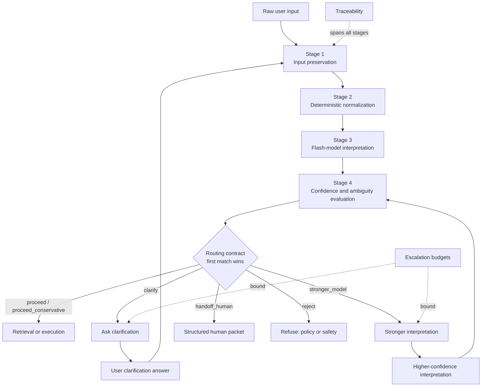

## Purpose

The intention recognition layer is the control layer that sits between raw user input and retrieval/reasoning.

Its job is not only to "understand the user", but to reduce ambiguity, narrow search space, control cost, and decide when the system should proceed, clarify, escalate, or stop.

The key idea is simple:

> It is better to spend one extra turn resolving ambiguity than to produce a fast but wrong answer.

This is a harnessed design rather than a single-model black box: the model is one component inside a governed pipeline, and every non-model behavior — normalization, confidence evaluation, routing, escalation, handoff — is deterministic application logic.

This document describes the focused upstream component. For the broader company-wide architecture that extends this layer into capability routing, governed execution, domain-scoped subsystems, and human escalation, see `CH02_Request-Orchestration-Layer.md`.

## Mental Model

The whole chapter reduces to three constructs:

```text
1. PIPELINE   four straight-through stages that condition the request
2. CONTRACT   one first-match routing table with five outcomes
3. POLICIES   two cross-cutting controls (escalation budgets, traceability)
              that bound every loop the pipeline can enter
```

### Whole-Picture Diagram


```mermaid
flowchart TD
    A[Raw user input] --> B[Stage 1<br>Input preservation]
    B --> C[Stage 2<br>Deterministic normalization]
    C --> D[Stage 3<br>Flash-model interpretation]
    D --> E[Stage 4<br>Confidence and ambiguity evaluation]

    E --> F{Routing contract<br>first match wins}

    F -->|proceed / proceed_conservative| L[Retrieval or execution]
    F -->|clarify| G[Ask clarification]
    F -->|stronger_model| H[Stronger interpretation]
    F -->|handoff_human| I[Structured human packet]
    F -->|reject| R[Refuse: policy or safety]

    G --> J[User clarification answer]
    J --> B

    H --> K[Higher-confidence interpretation]
    K --> E

    P[Escalation budgets] -. bound .-> G
    P -. bound .-> H
    T[Traceability] -. spans all stages .-> B
```

Only the vertical path from raw input down to retrieval is sequential. Everything else — clarify loops, stronger-model retries, human handoff — is an outcome of the routing contract, bounded by the cross-cutting policies. This is why there are exactly four stages and no stage called "retry".

## The Pipeline

Four stages run in order. Each transforms the request and emits artifacts for audit and downstream use.

### Stage 1: Input Preservation

Always preserve the original user message unchanged.

Why:

- original wording may contain subtle intent clues
- later corrections should remain traceable against what was actually asked
- human handoff must include untouched user input

Artifacts:

- original query
- session context
- relevant chat history

### Stage 2: Deterministic Normalization

Cheap and reliable cleanup before any model reasoning. Deterministic methods come first because they are cheaper, more stable, and fully auditable — whenever they strongly resolve the intent, later stages can stay cheap.

Functions:

- spelling or typo repair
- shorthand expansion
- short-name recovery
- alias mapping
- canonical entity resolution when exact mapping is available
- basic syntax cleanup

Outputs:

- normalized query
- canonicalized entities, if resolved
- deterministic match candidates
- deterministic match scores or rule hits

Control notes:

- automatic transforms are limited to low-risk changes
- all applied transformations must be traceable

### Stage 3: Flash-Model Interpretation

A lightweight model refines understanding after deterministic cleanup, handling the parts that need language understanding but do not justify a larger model by default.

Functions:

- rewrite ambiguous wording into clearer search language
- infer likely user target from context
- identify what detail type the user wants
- extract task structure for later retrieval

Recommended structured output:

```text
normalized_query
intent_type
target_entity_guess
requested_attributes
confidence
ambiguity_flags
alternative_interpretations
```

Important constraint:

- the model shapes the query; it never silently replaces the user's intent with a speculative one

### Stage 4: Confidence and Ambiguity Evaluation

This stage decides whether the current interpretation is safe enough to act on.

Signals consumed:

- flash model confidence
- deterministic match strength
- score gap between top candidates
- number of competing candidates
- consistency between deterministic and model outputs
- missing required constraints
- prior clarification failures

Two design rules worth stating explicitly:

- **model self-confidence alone is not sufficient** — it is always combined with external signals such as deterministic matches and candidate gaps
- signals are evaluated as a pattern, not averaged into one scalar (the structured confidence assessment lives in `CH02_03_Confidence-Safety-and-Validation.md`)

The emitted signal pattern is the input to the routing contract below.

## The Routing Contract

Routing is one first-match-wins decision table. Every row condition must hold; the first matching row returns the action. This table is the intention-layer routing contract.

### Decision Table

| # | Condition (all must hold) | Action |
| --- | --- | --- |
| 1 | permission denied, policy violation, injection pattern, or off-scope request | `reject` |
| 2 | any escalation budget exhausted | `handoff_human` |
| 3 | missing required constraint that only the user can supply | `clarify` |
| 4 | user-resolvable ambiguity present (multiple close candidates, low policy risk) | `clarify` |
| 5 | high-risk or write action and confidence is not strong | `stronger_model` |
| 6 | low confidence and stronger-model budget still available | `stronger_model` |
| 7 | strong evidence, low ambiguity, acceptable confidence | `proceed` |
| 8 | acceptable confidence but not strong, low-risk read-only path | `proceed_conservative` |
| 9 | anything else not covered above | `handoff_human` |

Row order is deliberate:

- rows 1 and 2 are hard constraints that dominate every confidence judgment
- rows 3 and 4 prefer user clarification over expensive reasoning
- rows 5 and 6 reserve stronger models for risky or genuinely weak cases
- rows 7 and 8 are the normal cheap-success paths
- row 9 is the safe default that prevents silent or unhandled cases

Note: row 1 (`reject`) is normally decided by the upstream safety gate in [`CH02_03_Confidence-Safety-and-Validation.md`]() before interpretation even starts; it is listed here so this contract stays complete. The execution-stage and validation decision tables also live in `CH02_03`.

The four subsections below describe what each non-terminal outcome does in practice.

### Outcome: proceed / proceed_conservative

Use when the task is simple and the signal pattern is strong (row 7) or acceptable on a low-risk read-only path (row 8).

Action:

- pass the normalized query to retrieval or execution
- conservative mode broadens retrieval slightly instead of trusting the interpretation fully

### Outcome: clarify

Clarification is a first-class design choice, not a failure.

Why it pays:

- one extra turn is often cheaper than broad retrieval plus rerank over the wrong entity space
- it prevents confident garbage output
- it increases user trust

A good clarification question answers a concrete missing decision point — which entity is intended, which attribute is requested, which time period or business scope applies.

Rules:

- ask only when ambiguity materially affects the result
- offer specific candidate options when possible:
  - "Did you mean promotion A, B, or C?"
  - "Are you asking for eligibility, time period, or reward details?"
- keep friction low; avoid vague prompts like "please clarify" without guidance

Each clarification consumes budget from the escalation-budget policy below.

### Outcome: stronger_model

Use when flash-level interpretation genuinely cannot carry the case:

- the question is complex or needs multi-step decomposition
- the request is high-value or high-risk while confidence is not strong
- flash-model output remains unstable across candidates

Action:

- send the conditioned query and accumulated context to a stronger model
- the stronger interpretation re-enters Stage 4 evaluation; it does not bypass the contract

Each stronger-model attempt consumes its own escalation budget.

### Outcome: handoff_human

Use when automation does not converge: budgets exhausted, ambiguity remains material after clarification attempts, or business or safety constraints require human judgment regardless of confidence.

Handoffs are product features, not debug leftovers. The packet handed to a human should be scan-friendly rather than a dump of raw free-form reasoning:

| Packet section | Contents |
| --- | --- |
| conversation context | full message history, original user query |
| system summary | concise current state |
| candidate interpretations | top likely meanings and why each is plausible |
| evidence and signals | deterministic matches, scores, normalized query, model interpretation, confidence, ambiguity flags |
| attempt history | what was tried, clarifications already asked, what stayed unresolved |
| suggested next step | best next question for the human, or best likely resolution path |

### Worked Routing Cases

The following cases show how the contract applies in practice.

Signal values are illustrative examples, not calibrated production thresholds.

#### Case 1: Ambiguous Entity, Low Risk → `clarify`

Signals:

- deterministic top match: 0.78
- top-2 gap: 0.04
- model confidence: 0.68
- ambiguity flags: `multiple_candidate_entities`
- task risk: low, action type: read-only

Decision trace:

- row 1: not a policy or injection violation, skip
- row 2: budgets not exhausted, skip
- row 3: the missing piece is which entity, and the user can supply it — row 3 applies

Result: `clarify`.

#### Case 2: Off-Scope Request → `reject`

Signals:

- safety gate returns `refuse`
- matched signals include `unsupported_general_advice_request`

Decision trace:

- row 1 matches immediately

Result: `reject`.

#### Case 3: Clear Exact Lookup, High Confidence → `proceed`

Signals:

- deterministic exact match: 0.96
- top-2 gap: 0.31
- model confidence: 0.9
- ambiguity flags: none
- task risk: low, action type: read-only

Decision trace:

- rows 1 through 6 do not match
- row 7 applies

Result: `proceed`.

#### Case 4: Budgets Exhausted After Repeated Ambiguity → `handoff_human`

Signals:

- clarification turns: 2 of 2 used
- reinterpretations: 2 of 2 used
- user never confirmed a candidate

Decision trace:

- row 1: no policy violation, skip
- row 2 applies because an escalation budget is exhausted

Result: `handoff_human`.

These worked cases should be turned into reusable golden cases in the testing note (`CH04`) rather than staying only as prose.

## Cross-Cutting Policies

Two controls apply everywhere the pipeline can loop. They are not stages — nothing flows sequentially through them.

### Escalation Budgets

Every loop-back route — clarification turns, reinterpretations, stronger-model retries — spends a finite budget. Example policy:

1. initial deterministic + flash pass (free)
2. first clarification turn
3. second clarification or stronger-model retry
4. escalate to human agent

Rationale:

- repeated retries increase latency without improving truth
- bounded escalation makes system behavior predictable and cost-bounded
- budget state must be visible to the routing contract at all times (that is how row 2 fires)

Whenever this chapter says "budgets" elsewhere — decision-table rows, worked cases — it means these counters.

### Traceability And Auditability

Every transformation and decision records enough to replay the request end to end:

- original query preserved next to rewritten forms
- all applied transformations traceable
- each routing decision stored with the signal pattern that produced it
- handoff packets retained with full attempt history

The concrete artifacts live in `CH02_01_Runtime-Objects.md`; this chapter only requires that nothing inside the layer be unrecorded.

## Downstream Effects

This layer runs before expensive retrieval and rerank steps. Its value is entirely upstream leverage:

1. smaller search space
2. better top-k relevance
3. lower rerank cost
4. less reasoning drift
5. better decomposition for multi-step tasks

If early interpretation is weak, every downstream step becomes more expensive and less reliable — which is why the clarify-first stance exists.

It pairs naturally with summary-based retrieval:

```text
User query
-> intention recognition and query conditioning
-> retrieve or rerank over summaries/metadata
-> select top raw chunks
-> use raw chunks for final grounding
```

Intent recognition narrows what to search, summaries reduce repeated token cost during candidate selection, and raw chunks remain available for exact grounding later.

## Scenario Walkthrough

User asks:

```text
Tell me about spring saver
```

System behavior through the three constructs:

1. Pipeline — deterministic normalization finds several close aliases ("spring saver" could map to multiple products); flash-model interpretation infers a promotion lookup and outputs medium confidence with `multiple_candidate_entities`
2. Contract — the signal pattern hits row 4: user-resolvable ambiguity, low risk → `clarify`; the system asks: "I found multiple likely matches for 'spring saver': Spring Saver 2025, Spring Saver Plus, and Student Spring Saver. Which one did you mean?"
3. Loop — the clarified answer re-enters Stage 1; the narrowed entity space now routes to `proceed`, and retrieval runs cheaply
4. Policy boundary — if the user never clarifies within two turns, the escalation budget empties and row 2 hands off with a structured packet: summary, candidate interpretations, attempt history

## Implementation Checklist

1. keep all transformations auditable
2. preserve original query alongside rewritten forms
3. prefer deterministic transformations for low-risk cleanup
4. require evidence before high-cost retrieval branches
5. ask clarification only when ambiguity is material
6. keep escalation budgets explicit, visible to routing, and never unlimited
7. treat handoff packets as product features, not debug leftovers

In one sentence, this layer is a confidence-gated retrieval harness with clarification-first disambiguation and bounded human escalation.

## Relationship To The Broader Architecture

In the broader platform design, this layer becomes the front half of the request orchestration layer.

What stays here:

1. request preservation and conditioning
2. intent and ambiguity framing
3. clarification-first disambiguation
4. confidence-aware routing preparation

What moves downstream into orchestration (`CH02_Request-Orchestration-Layer.md`):

1. domain routing
2. capability selection
3. adaptive schema loading
4. governed execution
5. cross-domain coordination
6. structured logging and escalation
