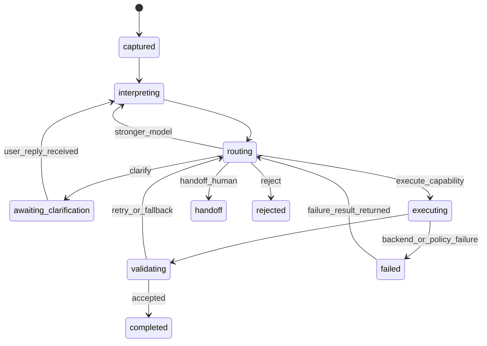

## Purpose

This note defines how the request orchestration runtime moves.

It focuses on lifecycle control rather than object structure.

The main questions are:

1. what states can a request enter
2. how control returns to routing
3. how retries and loop caps are bounded
4. how fallback remains harness-owned
5. what events the runtime should emit

Related notes:

- [`CH02_Request-Orchestration-Layer.md`]()
- [`CH02_01_Runtime-Objects.md`]()
- [`CH02_03_Confidence-Safety-and-Validation.md`]()

## Why This Design Exists

This note exists because LLM-driven orchestration can appear simple in a flowchart while still becoming unstable in implementation.

The main risks are:

- unclear current state
- hidden control flow
- unbounded retries
- ad hoc fallback behavior
- poor replayability after failure

The state machine and control loop are therefore designed to make control explicit, bounded, and replayable.

## Request State Machine

The runtime needs a minimal state model so each request has one current status.

Recommended first-version states:

1. `captured`
2. `interpreting`
3. `awaiting_clarification`
4. `routing`
5. `executing`
6. `validating`
7. `completed`
8. `handoff`
9. `rejected`
10. `failed`

State intent:

- `captured`: request has been received and preserved
- `interpreting`: normalization and framing are running
- `awaiting_clarification`: user response is required before safe continuation
- `routing`: harness is selecting the next path
- `executing`: a governed capability is running
- `validating`: the system is checking whether the result is acceptable
- `completed`: a final answer or valid partial answer has been produced
- `handoff`: the case has been escalated to a human
- `rejected`: the system declined to execute
- `failed`: execution stopped because of system or dependency failure

### State Transition View



Minimal transition rules:

- only one active state per request
- every transition should record timestamp and trigger
- clarification and human handoff are terminal for the current turn, but not necessarily for the broader session

Why this exists:

- A request runtime needs one shared lifecycle model so every component understands where the request is now.

What it prevents:

- spaghetti retry logic spread across multiple handlers
- disagreement between components about whether a request is still running, waiting, failed, or done
- ambiguous ownership of next-step decisions

Boundary with nearby components:

- the state machine describes allowed lifecycle movement
- the runtime objects describe what data each state works with

Main tradeoff:

- a defined state model adds lifecycle discipline, but it greatly improves predictability and operator understanding

## Control Loop Principle

The control loop should remain the single authority for what happens next.

That means:

- execution should return a structured result
- validation should return a structured weak-result or acceptance signal
- neither execution nor validation should decide retry, escalation, rejection, or handoff on their own
- routing should decide the next branch after reading the returned result

This keeps the harness boundary clean.

Why this exists:

- The harness must remain the control authority even when the model proposes the next step.

What it prevents:

- tools or validators deciding their own retries or escalations
- control logic being duplicated in multiple places
- unclear ownership when the system loops or fails

Boundary with nearby components:

- execution and validation report status
- routing decides what happens next

## Loop Budget And Fallback Policy

If the runtime uses an LLM to think about the next step, it still needs a harness-owned limit on how many times each branch may repeat.

The key rule is:

- the LLM may propose the next action
- the harness checks whether that action is still allowed
- if the branch is at cap, the harness blocks that branch and chooses the next legal fallback through the routing loop

Why this exists:

- LLM-driven control is useful, but it is naturally inclined to keep trying unless the harness imposes explicit limits.

What it prevents:

- runaway loops
- rising cost and latency with weak user value
- repeated retries that look active but are no longer productive

Boundary with nearby components:

- loop budget answers whether a branch may continue
- fallback policy answers what legal branch remains after a cap is hit

### Attempt Budget Fields

These counters should live on the request runtime state.

Example shape:

```yaml
execution_budget:
  max_total_loops: 6
  max_reinterpretations: 2
  max_execution_retries: 2
  max_clarification_turns: 2
  max_model_escalations: 1
  max_wall_clock_ms: 8000

attempt_counters:
  total_loops: 0
  reinterpretations: 0
  execution_retries: 0
  clarification_turns: 0
  model_escalations: 0
```

Why separate counters matter:

- reinterpretation loops and execution retries are different failure modes
- clarification loops consume user attention rather than compute only
- stronger-model escalation is expensive and should usually be tightly capped
- total loop count prevents the whole request from cycling too long even if individual branch caps are not yet exhausted

### Control-Loop Decision Rule

Every time control returns to `routing`, the harness should do four things in order:

1. read the latest result object from interpretation, execution, or validation
2. increment the relevant attempt counter
3. compare counters against the request budget
4. either allow the proposed next action or replace it with a fallback action

The LLM may propose actions such as:

- `clarify`
- `reinterpret`
- `stronger_model`
- `retry_execution`
- `switch_capability`
- `handoff_human`
- `reject`

But the harness is the final authority on whether that branch is still legal.

### Fallback Decision Table

When a branch hits its cap, the system should not fail open or keep looping.

Instead, routing should consult a small fallback policy.

| Cap reached | Typical meaning | Allowed fallback actions | Preferred fallback |
| --- | --- | --- | --- |
| Reinterpretation cap | The system has already tried enough low-cost reinterpretation passes. | clarify, stronger model, human handoff | clarify if the ambiguity is user-resolvable; otherwise stronger model or handoff |
| Clarification cap | The user-facing ambiguity loop is no longer productive. | conservative execution, human handoff, reject | human handoff unless a conservative low-risk path is clearly available |
| Execution retry cap | The selected capability or dependency is not recovering fast enough. | switch capability, partial answer, human handoff, failed | switch capability first if a real fallback exists; otherwise handoff or fail |
| Model escalation cap | The system already used the stronger-model budget. | clarify, human handoff, reject | clarify if the user can resolve it; otherwise handoff |
| Total loop cap | The request has consumed enough control-loop churn overall. | answered, partial answer, human handoff, rejected, failed | choose a terminal outcome only |

### Fallback Selection Rules

The fallback table should not be treated as one fixed string per cap.

The actual fallback choice should still consider:

- ambiguity type
- risk level
- whether user clarification is still meaningful
- whether an alternate capability actually exists
- whether the path is read-only or action-taking
- whether partial answer is acceptable
- whether policy allows any further automated action

So the better model is:

- cap exhaustion limits what is no longer allowed
- fallback policy defines what is still allowed
- routing chooses the best remaining legal action

Why this exists:

- A cap only says "stop doing this." The system still needs a principled answer to "what next?"

What it prevents:

- brittle dead ends after cap exhaustion
- arbitrary fallback behavior chosen differently by different engineers or prompts
- systems that are bounded but not operationally complete

### Clean Failure Handling Rule

Execution and validation should return structured results to routing rather than branching on their own.

Examples:

- execution returns `dependency_timeout`
- execution returns `permission_denied`
- validation returns `grounding_insufficient`
- validation returns `result_incomplete`

Routing then decides whether to:

- retry the same capability
- switch capability
- ask clarification
- escalate to stronger model
- hand off to a human
- reject
- fail the request

### First-Version Default Caps

Reasonable first serious defaults are:

- `max_reinterpretations: 2`
- `max_execution_retries: 1` or `2`
- `max_clarification_turns: 2`
- `max_model_escalations: 1`
- `max_total_loops: 5` or `6`

These values are not universal. They are only good starting points until evaluation data justifies tighter or looser bounds.

## Event Model

Even if the runtime stores object snapshots, it should also emit simple events.

Useful first-version events:

- `request_captured`
- `interpretation_created`
- `routing_decided`
- `clarification_requested`
- `clarification_received`
- `capability_execution_started`
- `capability_execution_completed`
- `validation_completed`
- `human_handoff_created`
- `request_completed`
- `request_rejected`
- `request_failed`

This makes monitoring and replay easier without requiring a fully event-sourced system.

Why this exists:

- The runtime needs a lightweight, durable trace of what happened without requiring full event-sourcing complexity.

What it prevents:

- weak observability around routing, retries, and escalation
- difficulty reconstructing request history during incident review
- over-reliance on raw logs for operational understanding
