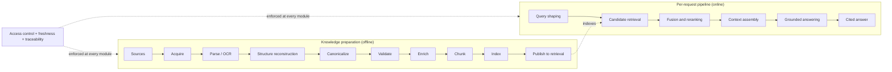

## Purpose

The RAG layer is the knowledge access and grounding capability inside the orchestration runtime.

Its job is not simply to "retrieve documents". Its real job is to:

1. transform source material into retrievable knowledge
2. retrieve the right evidence with high recall and precision
3. assemble grounded context and turn it into cited output
4. enforce security, freshness, and traceability constraints
5. make retrieval quality observable, tunable, and governable

The key idea:

> Good generation cannot compensate for bad retrieval, weak structure extraction, or missing operational controls.

In the broader architecture, RAG is one capability family among several — not the default answer path for every request.

## Mental Model

```text
1. KNOWLEDGE PREPARATION   an offline pipeline that turns sources
                           into retrievable, governed knowledge
2. ONLINE PIPELINE         a per-request evidence path: query shaping
                           -> candidate retrieval -> fusion/reranking
                           -> context assembly -> grounded answering
3. CROSS-CUTTING CONTROLS  access, freshness, observability - defined
                           centrally, enforced locally in every module
```



The two pipelines meet at the published indexes. The offline side decides what can be found; the online side decides what should be used. Neither compensates for defects in the other.

### Position Relative To Upstream Layers

Upstream layers (`CH01`, `CH02`) hand over:

- normalized wording, clarified target entity or scope
- task type and requested attributes
- confidence and ambiguity signals
- domain routing decision and permission context

This layer hands back:

- evidence retrieval with citation-ready context
- source grounding
- retrieval confidence signals
- abstention or insufficiency signals when evidence is weak

Full request context:

```text
User request
-> Intention recognition
-> Request orchestration
-> RAG retrieval pipeline
-> Grounded generation or execution
```

## Component 1: Knowledge Preparation (Offline)

Prepares source material into retrievable knowledge through two independent subsystems.

| Subsystem | Scope | Detailed design |
| --- | --- | --- |
| Ingestion and validation | acquire, parse / OCR, structure reconstruction, canonicalize / normalize, validate, publish-and-quarantine policy | `CH03_01_Ingestion-Validation-Layer.md` |
| Enrichment, chunking, and indexing | enrich, chunk, index, publish to retrieval | `CH03_02_Enrichment-Chunking-Indexing-Layer.md` |

Compact flow:

```text
Source
-> Acquire
-> Parse / OCR
-> Structure reconstruction
-> Canonicalize / normalize
-> Validate
-> Enrich
-> Chunk
-> Index
-> Publish to retrieval
```

Only validated canonical documents move forward from validation into enrichment, chunking, and indexing.

Design rationales carried by this component (detailed in the subchapters):

- **structure matters**: headings, tables, lists, forms, captions, page boundaries, and section hierarchy carry meaning retrieval quality depends on — flat-text processing destroys it
- fresh, versioned, canonical knowledge beats stale near-duplicates in the index

## Component 2: Retrieval (Online)

Finds, ranks, and assembles evidence for the current request in five stages:

1. query shaping
2. metadata and security filtering
3. candidate retrieval
4. fusion and reranking
5. context assembly

Detailed design: `CH03_03_Retrieval-Layer.md`.

Design rationales carried by this component:

- **retrieval is a pipeline, not a single search call** — each stage exists to correct a known failure mode
- **exact match and semantic match are complementary**: sparse retrieval wins on names, ids, codes, and keyword-heavy lookup; dense retrieval wins on paraphrase and concept recall — hybrid beats either alone

## Component 3: Grounded Answering

Turns retrieved evidence into a cited, user-facing output with explicit outcomes when evidence is weak: grounded answer, partial answer with uncertainty, clarification, insufficient-evidence statement, or escalation.

Detailed design: `CH03_04_Grounded-Answering-Layer.md`.

Design rationale carried by this component:

- **generation should be grounded and thin** — the hard part is retrieving the right evidence and assembling the right window, so keep answer construction disciplined rather than compensating for weak retrieval with stronger models

## Cross-Cutting Controls

Not a fourth component — a set of constraints every module enforces locally while policy stays centrally defined. Each component chapter carries its own Control and Governance section.

| Concern | Where it must be enforced |
| --- | --- |
| access control | captured in ingestion, propagated in chunking and indexing, enforced in retrieval, respected again in grounded answering |
| freshness and versioning | preserved across ingestion, chunking, indexing, and publish boundaries |
| evaluation | measured at the layer where the failure occurs |
| observability | logged at each module boundary |
| failure analysis | traced across layers using lineage, ids, and structured logs |

Operations are part of correctness: a RAG system that retrieves unauthorized content, serves stale content, or cannot explain its failures is not correct regardless of answer quality.

The detailed control behavior lives in `CH03_01`, `CH03_02`, `CH03_03`, and `CH03_04`.

## Baseline Architecture

For a practical default system, a strong baseline is:

1. layout-aware ingestion with validation and quarantine
2. structure-aware chunking and field-aware indexing
3. confidence-aware query shaping and filtering
4. hybrid retrieval with bounded reranking
5. grounded answering with citation and abstention
6. explicit ops, freshness, and observability controls

## Reference Stack

The component chapters each carry their own tooling section. This page assembles them into one end-to-end default so the set has a single named implementation path.

| Pipeline stage | Default choice | Secondary / fallback | Where detailed |
| --- | --- | --- | --- |
| document parsing and extraction | MinerU | domain-specific commercial parsers for hard formats | `CH03_01` |
| chunking primitives | LangChain text splitters or LlamaIndex node parsers | tokenizer-aware custom splitters | `CH03_02` |
| lexical plus metadata index | Elasticsearch | OpenSearch as drop-in alternative | `CH03_02`, `CH03_03` |
| vector index | Qdrant | pgvector when Postgres is already core and scale is modest | `CH03_02`, `CH03_03` |
| embeddings | language-aware or multilingual model matched to corpus language mix | swap based on measured retrieval quality, not preference | `CH03_02` |
| reranking | BGE reranker family | Cohere Rerank as managed fallback | `CH03_03` |
| generation | direct LLM API plus explicit application logic | Instructor and Guardrails AI for structured output and response validation | `CH03_04` |

Why Elasticsearch rather than OpenSearch as the named default:

- both are technically equivalent for this design; the choice between them is rarely an engineering decision
- Elasticsearch is assumed here only to remove the either-or from the text; substituting OpenSearch changes nothing in any chapter

Why one named stack at all:

- readers can reproduce the notes with fewer decisions of their own
- every component keeps its secondary option, so the stack stays swappable without rewriting the architecture

## Final Note

This document is the entry point and overview for the RAG subsystem.

The detailed design lives in the three component chapters; this page keeps the two-pipeline shape, the cross-cutting controls, and the reference stack visible in one place.
