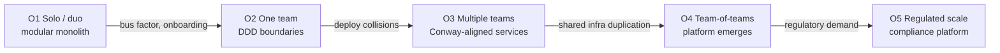

Architecture is usually taught as a property of machines: services, databases, replication, consensus. But every machine is built by an organization, and the machine regime hides an uncomfortable fact—its own trigger story is often an *organizational* event. This article makes that dimension explicit. **Coordination friction**—how context and cognitive load flow between teams—determines which machine patterns can actually ship, and it is governed by three well-understood mechanisms: Conway's Law, cognitive-load budgeting, and platform engineering.

**How to use this guide.** Where the [System Design Master Roadmap](https://cj9208.github.io/blog/ai_study/system_design/system-design-master-roadmap/) answers *which bottleneck triggers which architectural step*, this article answers *why the team looks the way it does* and *how to shape the team to get the architecture you want*. 
* Part 1 exposes the hidden org dimension in the machine ladder; 
* Part 2 walks an organizational growth ladder; 
* Part 3 covers the core levers; 
* Part 4 treats developer experience as a measurable SLO; 
* Part 5 bridges org decisions back to machine mechanisms; 
* Part 6 maps books to concepts.

---

## Part 1 — The Hidden Dimension in the Machine Ladder

**Core thesis.** The machine roadmap's Stage 2→3 trigger ("multi-team collisions") is already an organizational bottleneck: org architecture is the dimension the ladder embeds but never names.

Look closely at why the roadmap says systems leave the monolith. "Multiple engineering teams cannot deploy independently without lockstep testing and deployment collisions." That is not a statement about load, data volume, or latency—it is a statement about **people**: coordination cost exceeded what the org structure could absorb. The machine ladder presents this as a technical migration to microservices, but the underlying pressure is organizational. A single team of five will never hit that trigger, however large the codebase; a company of forty engineers across four teams will hit it at modest traffic, because the friction is in how they coordinate, not in how fast the servers answer.

* **Decompose the trigger:** deploy collisions, review latency, and merge conflicts are *team events*, not physics.
* **Conway's Law:** systems copy the communication structure of the organizations that build them—a system's service boundaries will mirror the org chart that produced it.
* **Why scale guides hide it:** interview and tech literature flatten org dynamics into "scale" so the problem looks purely technical; the coordination dimension is real but invisible to a load test.

**Key trade-off:** team structure determines which machine patterns can actually ship. Microservices are not "more scalable" in the abstract—they are the architecture that an N-team organization can actually build and operate. Org is the meta-architecture, not a footnote to it.

---

## Part 2 — The Organizational Ladder: Team Growth as the Real Curve

**Core thesis.** Architecture evolves with team count and cognitive load. Each organizational milestone forces a structural response exactly as the machine ladder's stages force a technical one—and crossing rungs too early or too late both misprice the system.

* **O1 — solo/duo.** The cheapest insurance is a *modular monolith* (Ousterhout's deep modules): simple public interfaces, encapsulated internals. It buys the option to split later without a rewrite, and it caps cognitive load because only a few people hold the whole context.
* **O2 — one team.** DDD bounded contexts and database-per-service seeds begin here. The team is small enough that architecture maps to *domain*, not to organization.
* **O3 — multiple teams.** Service boundaries now follow *team* boundaries (Conway, made explicit). Each team owns a deployable unit it can change and ship independently; the trade-off is the integration tax—contracts, API versioning, and cross-team feature coordination that did not exist in the monolith.
* **O4 — team-of-teams.** When several product teams each run their own database and CI, they start duplicating infrastructure. A *platform team* emerges to productize the shared substrate: deployment, observability, identity, messaging. This rung is the org-level equivalent of the roadmap's Stage-2 caching/H A layer—turned inward at the developers instead of at the users.
* **O5 — regulated scale.** A company under audit and compliance obligations grows dedicated platform teams for risk, security, and compliance controls—the organization form that implements the [Trust Regime](https://cj9208.github.io/blog/ai_study/system_design/trust-governance-regime/)'s requirements as owned, funded units.

**Key trade-off:** each rung trades autonomy against coordination cost. Split too early and you pay distributed-systems complexity for problems one team never had; split too late and the monolith becomes a single-team bottleneck with a bus-factor cliff. The correct trigger is organizational, not technical: hire the second team only when the first team's context genuinely cannot cover the second product surface.

---

## Part 3 — Core Levers: Conway, Cognitive Load & Team Topologies

**Core thesis.** Three levers convert org design into system design: reverse Conway (reshape teams to reach the architecture you want), cognitive-load budgets (the capacity bound on what one team can own), and Team Topologies' team archetypes plus interaction modes (the org design system).

### Reverse Conway: Design the Teams to Get the Architecture

Conway's Law is descriptive—your system *will* mirror your org. The engineering move is to make it normative: **decide the target architecture, then reorganize the teams so that their natural communication pattern produces it**. This is the "reverse Conway maneuver": if you want platform/microservice/event-driven architecture, staff platform teams, give product teams independent deployability, and let the org chart pull the system toward the design instead of the other way around.

### Cognitive Load: How Much Can One Team Own?

Sweller's load theory, applied to teams, distinguishes three load types: **intrinsic** (the inherent complexity of the domain), **germane** (the effort of learning and mastering it), and **extraneous** (the overhead of the environment, tools, and coordination around it). A team's real budget is its ability to hold *one* subsystem's intrinsic plus germane load; extraneous load from bad tooling and heavy coordination silently eats the budget and makes even a "simple" service feel unowned.

* **The load ceiling:** when a team's cognitive load overflows, quality degrades, ownership becomes nominal, and the org re-couples—microservices become a distributed monolith glued by escalating coordination.
* **The hiring-wave signal:** onboarding time and context-holding burden are the measurable overload indicators. When no one person can hold a bounded context end-to-end, the team is overloaded regardless of headcount.

### Team Topologies: The Archetype System

Skelton & Pais's *Team Topologies* reduces team design to four archetypes and three interaction modes:

* **Stream-aligned team** — owns a bounded business flow end-to-end; the default building block, aligned to a DDD bounded context.
* **Platform team** — owns the internal developer platform as a *product* with its own roadmap; absorbs the extraneous load of infrastructure so stream teams keep their capacity.
* **Enabling team** — transfers capability (practices, tooling literacy) without owning code; the org's "teaching" arm.
* **Complicated-subsystem team** — owns the specialist physics other teams cannot amortize (e.g., the roadmap's Stage-4 sharding expertise, or a fraud engine), isolated precisely because its cognitive load is deep and narrow.

Interaction modes: **collaboration** (two teams work together on a shared problem), **X-as-a-service** (one team consumes another's product through an interface), and **facilitating** (one team helps another improve without co-owning). Choosing the wrong mode is an org anti-pattern: forcing collaboration where X-as-a-service suffices guarantees the coupling the machine regime warned against.

**Key trade-off:** team autonomy vs platform centralization. Standardization buys cognitive capacity back but steals decision rights; the design problem is choosing which decisions belong to stream teams (their domain) and which are rightly centralized (security, observability, identity).

---

## Part 4 — Platform Engineering & DX: Coordination Friction as an SLO

**Core thesis.** Once org design is explicit, coordination cost becomes *measurable*. DORA metrics and the internal developer platform treat the developer workflow with the same rigor the machine regime applies to p99 latency—coordination friction is an SLO, not a mood.

### The Internal Developer Platform

The platform team productizes the "golden path"—the supported, secure, self-service route from idea to production: templates for services, CI/CD, environments, observability, and identity baked in. A stream-aligned team on the golden path never reinvents deployment or arguing with a security review; those costs are paid once by the platform and amortized across every team. This is the machine regime's "self-hosted vs managed" axis (roadmap II.8) applied to the org itself: the platform is the managed service, the stream team is the consumer.

### DORA: The Four Delivery Metrics

* **Deploy frequency** — how often the org ships.
* **Lead time for change** — idea to production.
* **Mean time to restore (MTTR)** — recovery from failure.
* **Change-failure rate** — how often a release breaks production.

Together they form the coordination regime's SLIs. Crucially, DORA is not a productivity scoreboard (Goodhart traps aside); it is a *capability* measure of the system-of-teams—the org analog of the machine regime's SLOs and error budgets. A low deploy frequency usually signals coordination friction, not laziness: heavyweight review, manual release steps, or an unowned integration surface.

**Key trade-off:** golden-path standardization (fast, consistent, secure) vs team freedom (flexible, heterogeneous, org-debt-prone). The discipline is to make the golden path *compelling*—fast and obviously superior—rather than mandatory, so adoption is pulled by DX rather than pushed by policy.

---

## Part 5 — Bridge Table: Org Decision → Machine Mechanism

**Core thesis.** Every org shape decision maps to a machine-roadmap mechanism it makes legal or illegal. This table closes the loop back to the machine regime: coordination regime selects the mechanism, trust regime filters the legal poles, machine physics sets the price.

| Org Decision | Maps To (Machine Mechanism) | Roadmap Reference |
| :--- | :--- | :--- |
| One team owning a bounded context | Database-per-service; the monolith boundary is an org fact first | Stage 1–2 |
| Team count > deploy-collision threshold | Service decomposition into independently deployable units | Stage 2→3 |
| Stream team owns a business flow end-to-end | Event-driven decoupling; ownership follows the stream | Stage 3 |
| Cross-team shared substrate duplicated | Platform team; internal managed services | II.8 (self-hosted vs managed) |
| Dedicated complicated-subsystem team | Specialist physics isolated (sharding, fraud, storage engines) | Stage 4, II.3 |
| Compliance/security platform team | The Trust Regime's controls owned as funded org units | Trust Regime, Part 2 |
| Team cognitive-load overflow | Re-coupling disguised as "refactor"; org-debt symptoms in the machine | Every stage |

**Key trade-off:** the three regimes are coupled, not independent. Org topology picks the mechanism; trust constraints filter the legal poles; machine physics sets the latency and complexity price. A design that optimizes only one regime will be sabotaged by the other two.

---

## Part 6 — Reading Map

**Core thesis.** The coordination regime's literature is broad but the practitioner filter is narrow: anchor on concepts that map to a machine mechanism, and use the bridge table (Part 5) as the relevance test.

| Org Topic | Canonical Reference | Bridges To |
| :--- | :--- | :--- |
| Team archetypes & interaction modes | Skelton & Pais, *Team Topologies* | Org ↔ system design (Part 3) |
| Delivery metrics & capabilities | Forsgren et al., *Accelerate* (DORA) | Coordination friction as SLI (Part 4) |
| Architecture & the org lens | Hohpe, *The Software Architect Elevator* | Why architects must speak org language |
| Microservices & team boundaries | Newman, *Building Microservices* | The roadmap's Stage 3 from the team side |
| Cognitive load theory | Sweller's load theory; *Team Topologies* ch. on load | Load budgeting (Part 3) |
| Conway's Law & its inversion | Conway's original 1968 paper; Thoughtworks "reverse Conway maneuver" | The core lever (Part 3) |

**Key trade-off:** breadth of the org literature vs a working filter. Most org books are case studies, not mechanisms; read them for the mechanism (a bridge-table row), not for the anecdote.

---

## Closing Note: The Boundary Between the Regimes

The coordination regime is not a replacement for the machine regime—it is the layer that decides *which* machine problems get solved at all. The roadmap's Stage 2→3 trigger was organizational before it was technical; this article makes that explicit and adds the tools to act on it. Together with the [Trust Regime](https://cj9208.github.io/blog/ai_study/system_design/trust-governance-regime/), it completes the three-friction model introduced in this section's [landing map](https://cj9208.github.io/blog/ai_study/system_design/): machine friction sets the physical price, trust friction forbids the untrustworthy poles, and coordination friction decides whether any of it can be built and sustained by the people who must ship it.
