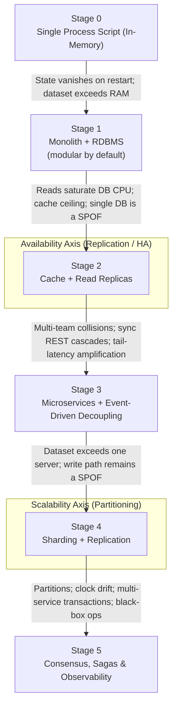

System design can feel overwhelming to beginners because architectural patterns are often taught in isolation without context. In reality, system design is the discipline of solving scaling bottlenecks. Every architectural pattern—whether it is a cache, a microservice, an LSM-tree, an event broker, or a saga—exists solely to solve a specific physical or organizational bottleneck that broke the previous, simpler design.

---

## 1. The System Design Evolutionary Graph

This diagram illustrates the natural lifecycle of an application as load, data volume, and engineering team size grow. Each transition is triggered by a concrete physical, operational, or architectural bottleneck:

Each of these transitions is unpacked in Section 2 as a bottleneck → requirement → implementation chain.

**Two orthogonal axes.** Two concerns cut across the ladder rather than forming their own rungs. The *availability axis* (replication / HA) enters at Stage 2 with read replicas and culminates in Stage 5's consensus. The *scalability axis* (partitioning) enters at Stage 4 with sharding. They are independent levers: you can replicate without sharding (Stage 2) or shard without replication (a fragile choice you will later regret). Production clusters are where the axes meet—Stage 4 is both at once, and Stage 5 is what replicated, sharded systems must learn to survive.

**Cross-cutting tool choices.** Two optimizations are chosen by workload, not by position on the ladder: *(1) IPC*—REST/JSON → gRPC/Protocol Buffers over HTTP/2 when internal payloads and p99 latency matter; *(2) storage engine*—B-Trees → LSM-Trees (in-memory Memtable + Write-Ahead Log + SSTables, Bloom filters) when write-heavy sequential I/O dominates. Access-pattern analysis (read/write ratio) decides, not the stage number.

---

## 2. Stage-by-Stage Breakdown: Problems, Logic, & Physical Solutions

### Stage 0 ➔ Stage 1: Persistence & In-Process Structure
* **The Bottleneck:** In-memory data structures are volatile and limited by RAM; as the codebase grows, modules reach into each other's private state, making changes risky and unpredictable.
* **Logical Requirement (What/Why):** Durable state storage, ACID transactional safety, structured query capabilities; information hiding, cognitive load reduction, clear interface definitions.
* **Physical Implementation (How):**
  * **Persistence:** Connect the application to an RDBMS (e.g., PostgreSQL) writing to non-volatile disk storage.
  * **Structure:** Build the monolith as a *modular monolith* from the start—"Deep Modules" (Ousterhout): simple interfaces backed by substantial implementation logic, private helpers strictly encapsulated. This is the cheapest architectural insurance you will ever buy.

### Stage 1 ➔ Stage 2: Read Scaling — Cache & Read Replicas (Availability Axis)
* **The Bottleneck:** Read traffic saturates relational database CPU and maxes out connection pools, creating point-read latency spikes. Caching raises the ceiling, but hit ratios plateau on working-set-bound or write-heavy data—and the single primary database remains a single point of failure.
* **Logical Requirement (What/Why):** Sub-millisecond reads, read/write separation, horizontal read scaling, controlled memory retention, automatic failover, and explicit awareness of consistency tradeoffs under replication lag.
* **Physical Implementation (How):**
  * **Caching Topologies:** Deploy an in-memory key-value cache (Redis/Memcached) with LRU/TTL eviction.
  * **Write Patterns:** Choose Cache-Aside (Look-Aside), Write-Through, or Write-Back/Write-Behind.
  * **Cache Stampede Mitigations:** Distributed Mutex Locks (Redlock), Probabilistic Early Expiration (XFetch), or Background Cache Warming workers.
  * **Read Replicas:** Deploy primary-secondary replicas with asynchronous (or synchronous) replication; route reads through read-write splitting in connection pools or proxies (e.g., PgBouncer, HAProxy) while writes stay pinned to the primary.
  * **Failover:** Add automatic promotion tooling (e.g., Patroni for PostgreSQL, managed failover in cloud RDS). Contrast asynchronous replication (replication lag, small data-loss window on failover) with synchronous replication (no data loss, higher write latency).
  * **Consistency Caveats:** Preserve read-your-writes and monotonic reads via session affinity or pinning to the primary; track replication lag as a first-class observable, not an afterthought.

### Stage 2 ➔ Stage 3: Service Decomposition & Decoupling (Microservices + Events)
* **The Bottleneck:** Multiple engineering teams cannot deploy independently without lockstep testing and deployment collisions; once services are split, synchronous REST/JSON calls cause cascading tail-latency spikes, downstream outages take down upstream callers, and synchronous write processing caps overall throughput.
* **Logical Requirement (What/Why):** Domain autonomy, clear service ownership, independent deployability; temporal decoupling, write-path buffering, publish/subscribe messaging models, asynchronous event handling.
* **Physical Implementation (How):**
  * **Decomposition:** Split the application using Domain-Driven Design (DDD) Bounded Contexts (Newman); give each service its own database to eliminate cross-domain schema coupling.
  * **Message Brokers:** Integrate distributed event streams (Apache Kafka) or message queues (RabbitMQ) for asynchronous event handling.
  * **Transactional Reliability:** Implement the Transactional Outbox Pattern paired with Change Data Capture (CDC / Debezium) to prevent dual-write inconsistencies between the database and event broker.
  * **Delivery Semantics:** Configure consumers for At-Least-Once delivery with idempotent handlers, or Exactly-Once processing where strictly required.

### Stage 3 ➔ Stage 4: Distributed Data — Sharding & Replication (Scalability Axis)
* **The Bottleneck:** Dataset size exceeds the largest available server's disk/RAM; a single server represents a write-path single point of failure (SPOF).
* **Logical Requirement (What/Why):** Horizontal scalability, fault isolation, workload-adaptive data placement, high availability.
* **Physical Implementation (How):**
  * **Sharding:** Partition/shard data using consistent hashing with virtual nodes; choose partition keys that keep hot keys balanced; plan for cross-shard fan-out queries and secondary-index maintenance.
  * **Replication:** Replicate each shard using leader-follower or leaderless quorums ($R + W > N$). The availability axis applies per shard, not just to the whole cluster.

### Stage 4 ➔ Stage 5: Distributed Failure Realities, Consensus & Observability
* **The Bottleneck:** Networks drop packets, garbage collection causes pauses, clocks drift, multi-service transactions cannot use slow blocking 2PC locks, and distributed environments create operational black boxes.
* **Logical Requirement (What/Why):** Fault tolerance, eventual consistency, distributed workflow coordination, total system visibility.
* **Physical Implementation (How):**
  * **Consensus & Workflow:** Deploy Raft/Paxos consensus algorithms for single-writer correctness within a replication group; handle cross-service transactions via the Saga Pattern (Orchestration or Choreography) with compensating transactions; implement circuit breakers, bulkheads, and rate limiters.
  * **Observability & Telemetry Layer:** Implement OpenTelemetry distributed context propagation across microservices; collect metrics via Prometheus and visualize via Grafana; establish structured log correlation IDs; track p99 SLAs and Service Level Objectives (SLOs).

---

## 3. Master Learning Matrix: Mapping Evolutionary Stages to Core Literature

| Evolution Stage | Core Problem To Solve | Layer 1: Logical Requirement | Layer 2: Physical Engineering | Book Mapping |
| :--- | :--- | :--- | :--- | :--- |
| **Stage 1: Monolith — Persistence & In-Process Structure** | Volatile state; spaghetti code; leaky abstractions | Durable state, ACID, structured queries; information hiding, simple interfaces | RDBMS; Deep Modules, encapsulated helpers | Ousterhout: Ch. 4, 5, 6, 21 Kleppmann: Ch. 1 |
| **Stage 2: Read Scaling — Cache + Replicas** *(Availability Axis)* | DB CPU saturation, read latency spikes, single DB SPOF | Sub-ms reads, read/write separation, failover, consistency tradeoffs | Redis/Memcached LRU/TTL, Cache-Aside, XFetch; primary-secondary replicas, read-write splitting, Patroni, session affinity | Redis Architecture Docs Kleppmann: Ch. 5 |
| **Stage 3: Service Decomposition & Decoupling** | Team deployment collisions; sync REST cascades; tight coupling | Domain autonomy, temporal decoupling, async events | DDD Bounded Contexts, database per service; Kafka/RabbitMQ, Outbox + CDC, idempotent consumers | Newman: Ch. 1–5 Kleppmann: Ch. 11 |
| **Stage 4: Distributed Data — Sharding + Replication** *(Scalability Axis)* | Dataset exceeds one server; write-path SPOF | Horizontal scalability, fault isolation, high availability | Consistent hashing, partition-key design, cross-shard fan-out; per-shard replication, quorums | Kleppmann: Ch. 5, 6 |
| **Stage 5: Consensus, Sagas & Telemetry** | Network partitions, clock drift, partial failures, black-box ops | Consistency tradeoffs (Linearizable vs Eventual), observability | Raft/Paxos, Sagas, Circuit Breakers, OpenTelemetry, Prometheus/Grafana | Kleppmann: Ch. 5–9 Newman: Ch. 6, 8, 12, 13 Google SRE Book (Ch. 6) |

---

## 4. Actionable 3-Step Synthetic Mastery Loop

Reading alone creates a false sense of security. Convert theory into practical engineering intuition using this 3-step execution loop for controlled, synthetic practice:

1. **Topic-Based Comparative Reading:** Read topically across books for a given evolutionary stage rather than sequentially reading cover-to-cover. Maintain a *Trade-Off Card* for every mechanism:
   * What exact problem does this solve?
   * What does it sacrifice (complexity, latency, consistency)?
   * At what exact bottleneck threshold does it fail?

2. **Build Micro-Primitives in Code:** Write isolated lightweight prototypes to directly benchmark physical mechanics:
   * *Storage Lab:* Implement an append-only log with an in-memory hash index (a mini LSM-tree). Benchmark write throughput vs. point lookup latency against a SQLite database.
   * *Cache Stampede Lab:* Simulate 1,000 concurrent requests hitting an expired cache key. Implement Redlock vs. XFetch early expiration and compare database hit spikes.
   * *Replication Lab:* Stand up a primary plus two read replicas locally (Docker Compose + PostgreSQL). Kill the primary and measure failover time; then induce replication lag and benchmark stale-read behavior under read-your-writes workload.
   * *Event Queue Lab:* Implement the Transactional Outbox pattern with SQLite and an in-memory queue. Verify zero message loss under simulated app crashes.
   * *Resilience Lab:* Implement a sliding-window rate limiter and circuit breaker. Run a local load test (using k6 or hey) to observe thread starvation and p99 latency under simulated failure.

3. **"What-If" Whiteboarding Simulations:** Practice whiteboarding system design problems using a structured 3-step audit:
   * *Step A (Logical Scope):* Define functional features, read/write QPS, payload size, and required p99 SLA.
   * *Step B (Minimal Flow):* Sketch a minimal working skeleton (Client → API Gateway → App → Storage).
   * *Step C (Stress-Test Shift):* Apply sudden constraint shifts mid-session ("Write volume spikes 100x", "A network partition disconnects Region B"). Evolve the design step-by-step using the evolutionary roadmap.

---

## 5. Empirical Real-World Case Studies & Migration Analysis

Theoretical models tell you how systems *should* work; production post-mortems show you how systems *actually fail* under uncontrolled real-world scale. Analyzing engineering blog posts from high-scale engineering organizations bridges the gap between abstract design patterns and real operational survival.

### 5.1 The 5-Step Post-Mortem Audit Framework
Whenever analyzing an engineering migration or incident post-mortem, systematically extract answers to these 5 audit questions:

1. **The Primary Trigger Metric:** What exact SLA/SLO breach forced the migration or rewrite? (e.g., p99 read latency > 2s, compaction stalls, disk I/O saturation).
2. **The Mechanical Cause of Failure:** Why did the existing system break down at a physical/hardware level? (e.g., B-Tree index size exceeding RAM, GC pauses, write amplification).
3. **The Evaluated Alternatives:** What alternative architectures or databases were evaluated, and why were they rejected?
4. **The Zero-Downtime Migration Strategy:** How was the transition executed without customer interruption? (e.g., dual-writing, shadow traffic validation, backfill pipelines, canary deployments).
5. **The New Trade-offs Introduced:** What new operational complexity, resource requirements, or consistency guarantees were accepted in exchange?

### 5.2 Canonical Production Migrations to Study
* **Database Limits & Compaction Stalls:** [Discord's Migration from MongoDB → Cassandra → ScyllaDB](https://discord.com/blog/how-discord-stores-billions-of-messages). Examine how read-seek latency and SSTable compaction pauses at billions of messages forced continuous storage evolution.
* **Relational Database Scaling & Sharding:** [Figma's Journey from Monolithic Postgres → Vertical Partitioning → Horizontal Sharding](https://www.figma.com/blog/how-figma-scaled-to-multiple-databases/). Analyze how single-database connection limits and query CPU saturation were systematically managed under rapid growth.
* **Architectural Paradigm Evolution:** [Uber's Transformation from Monolith → Microservices → Domain-Oriented Microservice Architecture (DOMA)](https://www.uber.com/blog/domain-oriented-microservice-architecture/). Study how untamed microservice fan-out complexity forced a regrouping into higher-level domain gateways.
* **Event-Driven Decoupling:** The [Transactional Outbox Pattern](https://microservices.io/patterns/data/transactional-outbox.html) guarantees dual-write consistency in asynchronous write paths, and [Confluent's Kafka case studies](https://www.confluent.io/blog/) document real-world event-stream and audit-pipeline migrations at scale.

---

## 6. Core Reading References

* [A Philosophy of Software Design](https://web.stanford.edu/~ouster/cgi-bin/book.php) — John Ousterhout (Ch. 4 *Modules Should Be Deep*, Ch. 5 *Information Hiding and Leakage*, Ch. 6 *General-Purpose Modules Are Deeper*, Ch. 21 *Software Trends*).
* [Designing Data-Intensive Applications](https://dataintensive.net/) — Martin Kleppmann (Ch. 3 *Storage and Retrieval*, Ch. 4 *Encoding and Evolution*, Ch. 5–9 *Replication, Partitioning, Transactions, Distributed Systems, Consistency & Consensus*, Ch. 11 *Stream Processing*).
* [Building Microservices](https://samnewman.io/books/building_microservices/) — Sam Newman.
* [Site Reliability Engineering](https://sre.google/sre-book/table-of-contents/) — Google SRE Book.
* [Redis Documentation](https://redis.io/docs/latest/develop/) — cache eviction policies, persistence, and cluster architecture.
* [Microservices.io Pattern Catalog](https://microservices.io/) — transactional outbox, saga, and other microservice patterns.
