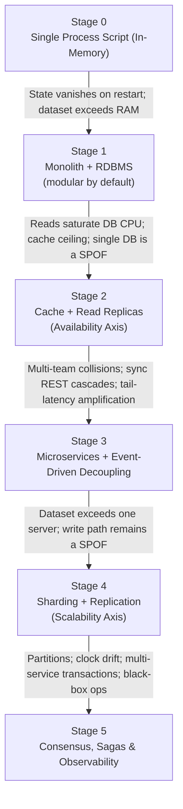

System design can feel overwhelming to beginners because architectural patterns are often taught in isolation without context. In reality, system design is the discipline of solving scaling bottlenecks. Every architectural pattern—whether it is a cache, a microservice, an LSM-tree, an event broker, or a saga—exists solely to solve a specific physical or organizational bottleneck that broke the previous, simpler design.

**How to use this guide.** The material is organized into three parts plus one verification loop:
* **Part I — The Stage Ladder & Two Axes:** the growth narrative—which bottleneck triggers which architectural step.
* **Part II — Cross-Cutting Trade-offs:** a different angle from Part I—when a decision offers two valid poles, this is where the choice is made.
* **Part III — Post-Mortems & Empirical Experience:** other people's failures and your own benchmarks—the evidence that the model holds in reality.
* **Verifying What You Learned:** audits to confirm the model you built is actually correct.

---

## Part I — The Stage Ladder & Two Axes

### I.1 The System Design Evolutionary Graph

This diagram illustrates the natural lifecycle of an application as load, data volume, and engineering team size grow. Each transition is triggered by a concrete physical, operational, or architectural bottleneck:

Each of these transitions is unpacked in I.2 as a bottleneck → requirement → implementation chain.

**Two orthogonal axes.** The ladder above is a *timeline* of bottleneck-triggered growth; the two axes are *longitudinal dimensions* that recur across multiple rungs instead of each having a rung of their own. The axis annotations in the diagram are not extra stages—read them as "the rung where this dimension first becomes the dominant bottleneck":
* The *availability axis* (replication / HA) first becomes decisive at Stage 2 with read replicas and culminates in Stage 5's consensus.
* The *scalability axis* (partitioning) first becomes decisive at Stage 4 with sharding; Stage 3's service boundaries provide logical isolation but not physical data scaling.
* The axes are independent levers: you can replicate without sharding (Stage 2) or shard without replication (a fragile choice you will later regret). Production clusters are where the axes meet—Stage 4 is both at once, and Stage 5 is what replicated, sharded systems must learn to survive.

**Side-track: cross-cutting trade-offs.** The ladder answers *when* a bottleneck appears; it does not answer *which pole to pick* when a decision offers two valid options. Choices like sync vs async, B-Tree vs LSM, or strong vs eventual consistency are workload-driven and orthogonal to the ladder—the full catalog of decision axes, each with its trade-off, decision criterion, and stage relevance, lives in **Part II**.

---

### I.2 Stage-by-Stage Breakdown: Problems, Logic, & Physical Solutions

#### Stage 0 ➔ Stage 1: Persistence & In-Process Structure
* **The Bottleneck:** In-memory data structures are volatile and limited by RAM; as the codebase grows, modules reach into each other's private state, making changes risky and unpredictable.
* **Logical Requirement (What/Why):** Durable state storage, ACID transactional safety, structured query capabilities; information hiding, cognitive load reduction, clear interface definitions.
* **Physical Implementation (How):**
  * **Persistence:** Connect the application to an RDBMS (e.g., PostgreSQL) writing to non-volatile disk storage.
  * **Structure:** Build the monolith as a *modular monolith* from the start—"Deep Modules" (Ousterhout): simple interfaces backed by substantial implementation logic, private helpers strictly encapsulated. This is the cheapest architectural insurance you will ever buy.
  * **Related trade-off axes:** II.3 (storage engine & data-model fit), II.8 (self-hosted vs managed database).

#### Stage 1 ➔ Stage 2: Read Scaling — Cache & Read Replicas (Availability Axis)
* **The Bottleneck:** Read traffic saturates relational database CPU and maxes out connection pools, creating point-read latency spikes. Caching raises the ceiling, but hit ratios plateau on working-set-bound or write-heavy data—and the single primary database remains a single point of failure.
* **Logical Requirement (What/Why):** Sub-millisecond reads, read/write separation, horizontal read scaling, controlled memory retention, automatic failover, and explicit awareness of consistency tradeoffs under replication lag.
* **Physical Implementation (How):**
  * **Caching Topologies:** Deploy an in-memory key-value cache (Redis/Memcached) with LRU/TTL eviction.
  * **Write Patterns:** Choose Cache-Aside (Look-Aside), Write-Through, or Write-Back/Write-Behind.
  * **Cache Stampede Mitigations:** Distributed Mutex Locks (Redlock), Probabilistic Early Expiration (XFetch), or Background Cache Warming workers.
  * **Read Replicas:** Deploy primary-secondary replicas with asynchronous (or synchronous) replication; route reads through read-write splitting in connection pools or proxies (e.g., PgBouncer, HAProxy) while writes stay pinned to the primary.
  * **Failover:** Add automatic promotion tooling (e.g., Patroni for PostgreSQL, managed failover in cloud RDS). Contrast asynchronous replication (replication lag, small data-loss window on failover) with synchronous replication (no data loss, higher write latency).
  * **Consistency Caveats:** Preserve read-your-writes and monotonic reads via session affinity or pinning to the primary; track replication lag as a first-class observable, not an afterthought.
  * **Related trade-off axes:** II.4 (cache consistency), II.1 (replication consistency & staleness), II.7 (data lifecycle & TTL).

#### Stage 2 ➔ Stage 3: Service Decomposition & Decoupling (Microservices + Events)
* **The Bottleneck:** Multiple engineering teams cannot deploy independently without lockstep testing and deployment collisions; once services are split, synchronous REST/JSON calls cause cascading tail-latency spikes, downstream outages take down upstream callers, and synchronous write processing caps overall throughput.
* **Logical Requirement (What/Why):** Domain autonomy, clear service ownership, independent deployability; temporal decoupling, write-path buffering, publish/subscribe messaging models, asynchronous event handling.
* **Physical Implementation (How):**
  * **Decomposition:** Split the application using Domain-Driven Design (DDD) Bounded Contexts (Newman); give each service its own database to eliminate cross-domain schema coupling.
  * **Message Brokers:** Integrate distributed event streams (Apache Kafka) or message queues (RabbitMQ) for asynchronous event handling.
  * **Transactional Reliability:** Implement the Transactional Outbox Pattern paired with Change Data Capture (CDC / Debezium) to prevent dual-write inconsistencies between the database and event broker.
  * **Delivery Semantics:** Configure consumers for At-Least-Once delivery with idempotent handlers, or Exactly-Once processing where strictly required.
  * **Related trade-off axes:** II.2 (communication style & delivery semantics).

#### Stage 3 ➔ Stage 4: Distributed Data — Sharding & Replication (Scalability Axis)
* **The Bottleneck:** Dataset size exceeds the largest available server's disk/RAM; a single server represents a write-path single point of failure (SPOF).
* **Logical Requirement (What/Why):** Horizontal scalability, fault isolation, workload-adaptive data placement, high availability.
* **Physical Implementation (How):**
  * **Sharding:** Partition/shard data using consistent hashing with virtual nodes; choose partition keys that keep hot keys balanced; plan for cross-shard fan-out queries and secondary-index maintenance.
  * **Replication:** Replicate each shard using leader-follower or leaderless quorums ($R + W > N$). The availability axis applies per shard, not just to the whole cluster.
  * **Related trade-off axes:** II.1 (quorum tuning), II.3 (partition-key & engine interplay), II.7 (data lifecycle & tiering).

#### Stage 4 ➔ Stage 5: Distributed Failure Realities, Consensus & Observability
* **The Bottleneck:** Networks drop packets, garbage collection causes pauses, clocks drift, multi-service transactions cannot use slow blocking 2PC locks, and distributed environments create operational black boxes.
* **Logical Requirement (What/Why):** Fault tolerance, eventual consistency, distributed workflow coordination, total system visibility.
* **Physical Implementation (How):**
  * **Consensus & Workflow:** Deploy Raft/Paxos consensus algorithms for single-writer correctness within a replication group; handle cross-service transactions via the Saga Pattern (Orchestration or Choreography) with compensating transactions; implement circuit breakers, bulkheads, and rate limiters.
  * **Observability & Telemetry Layer:** Implement OpenTelemetry distributed context propagation across microservices; collect metrics via Prometheus and visualize via Grafana; establish structured log correlation IDs; track p99 SLAs and Service Level Objectives (SLOs).
  * **Related trade-off axes:** II.5 (coordination & transactions), II.6 (observability & latency budget).

---

### I.3 Master Learning Matrix: Mapping Evolutionary Stages to Core Literature

| Evolution Stage | Core Problem To Solve | Layer 1: Logical Requirement | Layer 2: Physical Engineering | Book Mapping |
| :--- | :--- | :--- | :--- | :--- |
| **Stage 1: Monolith — Persistence & In-Process Structure** | Volatile state; spaghetti code; leaky abstractions | Durable state, ACID, structured queries; information hiding, simple interfaces | RDBMS; Deep Modules, encapsulated helpers | Ousterhout: Ch. 4, 5, 6, 21 Kleppmann: Ch. 1 |
| **Stage 2: Read Scaling — Cache + Replicas** *(Availability Axis)* | DB CPU saturation, read latency spikes, single DB SPOF | Sub-ms reads, read/write separation, failover, consistency tradeoffs | Redis/Memcached LRU/TTL, Cache-Aside, XFetch; primary-secondary replicas, read-write splitting, Patroni, session affinity | Redis Architecture Docs Kleppmann: Ch. 5 |
| **Stage 3: Service Decomposition & Decoupling** | Team deployment collisions; sync REST cascades; tight coupling | Domain autonomy, temporal decoupling, async events | DDD Bounded Contexts, database per service; Kafka/RabbitMQ, Outbox + CDC, idempotent consumers | Newman: Ch. 1–5 Kleppmann: Ch. 11 |
| **Stage 4: Distributed Data — Sharding + Replication** *(Scalability Axis)* | Dataset exceeds one server; write-path SPOF | Horizontal scalability, fault isolation, high availability | Consistent hashing, partition-key design, cross-shard fan-out; per-shard replication, quorums | Kleppmann: Ch. 5, 6 |
| **Stage 5: Consensus, Sagas & Telemetry** | Network partitions, clock drift, partial failures, black-box ops | Consistency tradeoffs (Linearizable vs Eventual), observability | Raft/Paxos, Sagas, Circuit Breakers, OpenTelemetry, Prometheus/Grafana | Kleppmann: Ch. 5–9 Newman: Ch. 6, 8, 12, 13 Google SRE Book (Ch. 6) |

---

## Part II — Cross-Cutting Trade-offs: The Workload-Driven Toolbox

The ladder in Part I answers *when* a bottleneck appears; it does not answer *which pole to pick* when a decision offers two valid options. Part I and this part are two different angles on the same system: Part I is the *timeline* (when a problem shows up); Part II is the *decision space* (how to choose between the valid alternatives a problem leaves you with). The right pole is decided by workload, access patterns, and business tolerance—not by which rung you currently stand on.

Two of the axes below (II.7, II.8) are operational and economic rather than purely technical—in real engineering, data growth and the cloud bill are often the first bottleneck a system hits, before any single physical threshold.

Each axis follows the same shape: **two poles → the trade-off → the decision criterion → where in the ladder it matters most.** The stage breakdown in I.2 cross-references these axes wherever a choice point hides.

| Decision Axis | The Two Poles | Trade-off Dimension | Decision Criterion | Matters Most At |
| :--- | :--- | :--- | :--- | :--- |
| **II.1 Consistency** | Strong (Linearizable) vs Eventual | Correctness window vs latency/availability | Cross-account invariants, staleness tolerance | Stage 2, 4, 5 |
| **II.2 Communication** | Sync (REST/gRPC) vs Async (Events) | Simplicity vs decoupling/throughput | Fan-out, burst tolerance, ownership | Stage 3 |
| **II.3 Storage Engine** | B-Tree vs LSM; Row vs Columnar | Read vs write amplification | Read/write ratio, dataset vs working set | Stage 1, 4 |
| **II.4 Cache Consistency** | Cache-Aside vs Write-Through vs Write-Back | Read amplification vs write latency vs staleness | Miss cost, staleness bound | Stage 2 |
| **II.5 Coordination & Transactions** | 2PC vs Saga vs Outbox; Lock vs Optimistic | Atomicity vs availability | Money vs profile data, single-writer need | Stage 4, 5 |
| **II.6 Observability & Latency** | Logs/Metrics/Traces; SLOs | Debuggability vs effort | p99 SLA, black-box risk | Stage 2, 5 |
| **II.7 Data Lifecycle & Tiering** | Active vs Archived/Cold | Storage cost vs access latency vs query simplicity | Access distribution, retention compliance | Stage 2–4 |
| **II.8 Cost & Managed Services** | Self-Hosted vs Managed Cloud | Ops burden vs TCO/velocity | Team capacity, workload variability | All stages |

### II.1 Consistency Axis: How Much Staleness Can Your Business Tolerate?

* **The two poles:** Strong consistency (Linearizable—reads see the latest acknowledged write) at one end; Sequential, Causal, then Eventual consistency at the other (Kleppmann Ch. 9).
* **The trade-off:** Stronger guarantees cost latency and availability—more coordination, larger quorums, and harder partitions. Weaker guarantees let replicas answer quickly and stay available during partitions, but can surface stale or divergent reads.
* **Sub-decisions:**
  * *Replication mode:* asynchronous (low write latency, small data-loss window on failover) vs synchronous (no loss, higher write latency)—the durability/latency dial first turned at Stage 2.
  * *Quorum sizing:* quorum-based writes/reads ($R + W > N$) vs a single leader—how many nodes must agree, and what happens when the cluster splits.
  * *Session guarantees:* read-your-writes / monotonic reads via session affinity or pinning to the primary, when linearizability is too expensive.
* **Decision criterion:** Where an invariant must never break across accounts (balances, inventory), pay for strong or linearizable. Where a slightly stale read is acceptable (profiles, counts, feeds), pick eventual + session guarantees.
* **Matters most at:** Stage 2 (replication lag), Stage 4 (per-shard quorums), Stage 5 (consensus as the strong end of the spectrum).

### II.2 Communication Style Axis: Request-Response vs Event-Driven

* **The two poles:** synchronous request/response (REST/JSON, gRPC/Protobuf) vs asynchronous events (Kafka, RabbitMQ).
* **The trade-off:** Sync is simple to reason about and natural for request/response, but couples callers to downstream availability and propagates tail latency. Async decouples producers and consumers in time and ownership, buffers bursts, and raises throughput—at the cost of idempotency, ordering, and debugging complexity.
* **Sub-decisions:**
  * *Delivery semantics:* at-least-once delivery with idempotent handlers vs exactly-once processing where strictly required.
  * *Serialization & schema evolution:* JSON (human-readable, weakly typed) vs Protobuf/Avro (compact, typed, explicit schema-evolution rules)—chosen when internal payloads and p99 latency count.
* **Decision criterion:** Does the consumer need the answer immediately (sync) or can it react later (async)? Is burst tolerance/backpressure needed? Does cross-team ownership demand temporal decoupling?
* **Matters most at:** Stage 3 (the microservice/event transition), and any flow that must fan out to multiple consumers.

### II.3 Storage Engine Axis: Match the Engine to the Access Pattern

* **The two poles:** B-Tree vs LSM-Tree (Memtable + Write-Ahead Log + SSTables + Bloom filters); row-oriented vs columnar; relational vs document vs wide-column vs graph.
* **The trade-off:** B-Trees are read-optimized with predictable point-lookup latency but pay write amplification; LSM-Trees are write-optimized for sequential I/O but pay read amplification and compaction stalls. Row stores serve OLTP point access; column stores compress and scan wide ranges for OLAP. Relational models enforce joins and transactions; NoSQL models trade those for flexible schema and horizontal scaling.
* **Sub-decisions:** *Delete & expiry handling*—tombstones and TTL compaction; expired or deleted data is the usual trigger behind LSM compaction stalls and B-Tree index bloat (see II.7).
* **Decision criterion:** Read/write ratio; whether the dataset exceeds the working set (a working set that fits in cache cheapens the read path); query shape (point vs range vs scan).
* **Matters most at:** Stage 1 (the RDBMS baseline), Stage 4 (partition-key design interacting with the engine), and any point where the workload shifts—Discord's migration in III.2 is exactly this axis in action.

### II.4 Cache Consistency Axis: What Staleness Will Your Cache Sell You?

* **The two poles:** Cache-Aside (look-aside) vs Write-Through vs Write-Back/Write-Behind.
* **The trade-off:** Cache-Aside is simple and keeps the database authoritative, but can serve stale data and stampede on cold misses. Write-Through keeps the cache fresher at the cost of write-path latency. Write-Back gives the lowest write latency but risks losing unflushed data and complicates consistency.
* **Sub-decisions:** Eviction policy (LRU / TTL / LFU); stampede mitigation (Redlock distributed mutex vs XFetch probabilistic early expiration vs background warming); session affinity to preserve read-your-writes through the cache layer.
* **Decision criterion:** How expensive is a cache miss (database read amplification)? How fresh must reads be? Can you tolerate lost or reordered writes?
* **Matters most at:** Stage 2 (read scaling)—then persists, because caches remain at every layer of a mature system.

### II.5 Coordination & Transactions Axis: Atomicity vs Availability

* **The two poles:** 2PC-style atomicity vs Saga/Outbox eventual consistency; distributed locks vs optimistic concurrency (CAS / version numbers).
* **The trade-off:** Blocking 2PC gives atomicity but needs slow, fragile coordination across partitions. Sagas and Outbox+CDC accept temporary intermediate states and compensate, in exchange for availability and throughput. Distributed locks simplify concurrent access but misbehave under partitions and GC pauses (the Redlock debate); CAS/versioning avoids locks at the cost of retries.
* **Decision criterion:** Is the invariant money-like (needs correct compensation) or profile-like (casual overwrite tolerable)? Do you need a single writer, or can conflicts be resolved optimistically?
* **Matters most at:** Stage 3 (Outbox for dual-write consistency), Stage 4–5 (multi-service transactions, Raft/Paxos for single-writer correctness).

### II.6 Observability & Latency Budget Axis: Can You See the Black Box?

* **The components:** structured logs with correlation IDs; metrics (Prometheus) and dashboards (Grafana); distributed tracing (OpenTelemetry); SLOs/SLIs and error budgets.
* **The trade-off:** Full telemetry costs engineering effort and operational noise; too little turns a distributed system into the Stage 5 black box you can no longer debug.
* **Sub-decisions:**
  * *Latency budget:* set the end-to-end p99 target first, then allocate per-hop deadlines so no single service can silently consume the whole budget (apply it in V.2's whiteboarding Step A).
  * *Load shedding:* timeouts, retries with jitter/backoff, rate limiters, circuit breakers, bulkheads—the mechanisms that protect the p99 you promised.
* **Decision criterion:** What p99 SLA must the product promise? How expensive is an undebuggable incident?
* **Matters most at:** Stage 2 (replication lag as a first-class observable), Stage 5 (SLOs and error budgets), and every whiteboarding session in the Verifying chapter.

### II.7 Data Lifecycle & Cold Tiering Axis: What Happens to Data Nobody Reads Anymore?

* **The two poles:** keeping every record in active hot storage vs tiering data across hot/warm/cold tiers (TTL expiration, cold shards, archival to object storage like S3/Glacier).
* **The trade-off:** Hot storage answers any query instantly but is expensive, and unbounded retention inflates LSM compaction work and B-Tree index size. Tiering cuts storage cost and shrinks the active working set, but adds pipeline complexity and makes cold-data access slow.
* **Sub-decisions:**
  * *TTL & retention policies:* expire records at write time so dead data never reaches the database at all.
  * *Hot/cold separation:* move cold shards to cheaper storage tiers; archive to object storage with a documented retrieval path when compliance requires it.
  * *Delete-aware engines:* tombstones and compaction-friendly deletes—expired data is the hidden killer behind compaction stalls and index bloat (see II.3 and the Discord migration in III.2).
* **Decision criterion:** The access distribution of your data (Zipf-like hotspots vs long tails); retention/compliance requirements; how fast cold data must be recoverable.
* **Matters most at:** Stage 2–4, as the dataset and retention window grow—often it is the data you stop reading that breaks the system.

### II.8 Cost & Managed Services Axis: Self-Hosted vs Managed Cloud

* **The two poles:** self-hosted infrastructure (running Postgres/Redis/Kafka or Kubernetes yourself) vs managed cloud services (RDS, DynamoDB, Spanner, Lambda, MSK).
* **The trade-off:** Self-hosting gives full control, predictable fixed cost, and the deepest learning experience, but you own patching, failover, and capacity planning. Managed services outsource that operational burden and ship faster, but add per-request pricing, vendor lock-in, and less control over the internals you are trying to learn.
* **Key insight:** in real engineering, the cloud bill often hits before the physical bottleneck does—cost is frequently the actual trigger for the migrations the ladder describes (audit question 1 in III.1).
* **Decision criterion:** Team size and operational capacity; total cost of ownership vs variable spend; fixed vs bursty workload; learning goals vs production goals. There is no universal default—the answer is situational.
* **Matters most at:** every stage—and it is usually the *first* axis to force a decision, long before a stage rung demands a new mechanism.

---

## Part III — Post-Mortems & Empirical Experience

Theory explains how systems *should* work; experience shows how they *actually* behave. Two sources of that experience: post-mortems from production systems (other people's failures) and micro-benchmarks you run yourself (your own experiments). Analyze both systematically.

### III.1 The 5-Step Post-Mortem Audit Framework

Whenever analyzing an engineering migration or incident post-mortem, systematically extract answers to these 5 audit questions:

1. **The Primary Trigger Metric:** What exact SLA/SLO breach forced the migration or rewrite? (e.g., p99 read latency > 2s, compaction stalls, disk I/O saturation).
2. **The Mechanical Cause of Failure:** Why did the existing system break down at a physical/hardware level? (e.g., B-Tree index size exceeding RAM, GC pauses, write amplification, tombstone pressure or table bloat from expired data).
3. **The Evaluated Alternatives:** What alternative architectures or databases were evaluated, and why were they rejected?
4. **The Zero-Downtime Migration Strategy:** How was the transition executed without customer interruption? (e.g., dual-writing, shadow traffic validation, backfill pipelines, canary deployments).
5. **The New Trade-offs Introduced:** What new operational complexity, resource requirements, or consistency guarantees were accepted in exchange?

### III.2 Canonical Production Migrations to Study

* **Database Limits & Compaction Stalls:** [Discord's Migration from MongoDB → Cassandra → ScyllaDB](https://discord.com/blog/how-discord-stores-billions-of-messages). Examine how read-seek latency and SSTable compaction pauses at billions of messages forced continuous storage evolution.
* **Relational Database Scaling & Sharding:** [Figma's Journey from Monolithic Postgres → Vertical Partitioning → Horizontal Sharding](https://www.figma.com/blog/how-figma-scaled-to-multiple-databases/). Analyze how single-database connection limits and query CPU saturation were systematically managed under rapid growth.
* **Architectural Paradigm Evolution:** [Uber's Transformation from Monolith → Microservices → Domain-Oriented Microservice Architecture (DOMA)](https://www.uber.com/blog/domain-oriented-microservice-architecture/). Study how untamed microservice fan-out complexity forced a regrouping into higher-level domain gateways.
* **Event-Driven Decoupling:** The [Transactional Outbox Pattern](https://microservices.io/patterns/data/transactional-outbox.html) guarantees dual-write consistency in asynchronous write paths, and [Confluent's Kafka case studies](https://www.confluent.io/blog/) document real-world event-stream and audit-pipeline migrations at scale.

### III.3 Build Micro-Primitives in Code

Post-mortems are other people's experience; this lab generates your own. Write isolated lightweight prototypes to directly benchmark physical mechanics:

* *Storage Lab:* Implement an append-only log with an in-memory hash index (a mini LSM-tree). Benchmark write throughput vs. point lookup latency against a SQLite database.
* *Cache Stampede Lab:* Simulate 1,000 concurrent requests hitting an expired cache key. Implement Redlock vs. XFetch early expiration and compare database hit spikes.
* *Replication Lab:* Stand up a primary plus two read replicas locally (Docker Compose + PostgreSQL). Kill the primary and measure failover time; then induce replication lag and benchmark stale-read behavior under read-your-writes workload.
* *Event Queue Lab:* Implement the Transactional Outbox pattern with SQLite and an in-memory queue. Verify zero message loss under simulated app crashes.
* *Resilience Lab:* Implement a sliding-window rate limiter and circuit breaker. Run a local load test (using k6 or hey) to observe thread starvation and p99 latency under simulated failure.

---

## Verifying What You Learned

Reading alone creates a false sense of security. The three parts above build a mental model; this chapter checks that the model is correct. Run these two audits against every topic you study, and fix whatever the audit exposes.

### V.1 Topic-Based Comparative Reading

Read topically across books for a given evolutionary stage rather than sequentially reading cover-to-cover. Maintain a *Trade-Off Card* for every mechanism:

* What exact problem does this solve?
* What does it sacrifice (complexity, latency, consistency)?
* At what exact bottleneck threshold does it fail?

### V.2 "What-If" Whiteboarding Simulations

Practice whiteboarding system design problems using a structured 3-step audit:

* *Step A (Logical Scope):* Define functional features, read/write QPS, payload size, and required p99 SLA (set the latency budget per II.6).
* *Step B (Minimal Flow):* Sketch a minimal working skeleton (Client → API Gateway → App → Storage).
* *Step C (Stress-Test Shift):* Apply sudden constraint shifts mid-session ("Write volume spikes 100x", "A network partition disconnects Region B"). Evolve the design step-by-step using the evolutionary roadmap in Part I.

---

## Core Reading References

* [A Philosophy of Software Design](https://web.stanford.edu/~ouster/cgi-bin/book.php) — John Ousterhout (Ch. 4 *Modules Should Be Deep*, Ch. 5 *Information Hiding and Leakage*, Ch. 6 *General-Purpose Modules Are Deeper*, Ch. 21 *Software Trends*).
* [Designing Data-Intensive Applications](https://dataintensive.net/) — Martin Kleppmann (Ch. 3 *Storage and Retrieval*, Ch. 4 *Encoding and Evolution*, Ch. 5–9 *Replication, Partitioning, Transactions, Distributed Systems, Consistency & Consensus*, Ch. 11 *Stream Processing*).
* [Building Microservices](https://samnewman.io/books/building_microservices/) — Sam Newman.
* [Site Reliability Engineering](https://sre.google/sre-book/table-of-contents/) — Google SRE Book.
* [Redis Documentation](https://redis.io/docs/latest/develop/) — cache eviction policies, persistence, and cluster architecture.
* [Microservices.io Pattern Catalog](https://microservices.io/) — transactional outbox, saga, and other microservice patterns.

---

## Closing Note: The Boundary This Roadmap Draws

The ladder above is scoped to *general* distributed systems. One adjacent regime is deliberately excluded: AI / LLM serving. GPU-memory limits (KV-Cache sizing), tensor parallelism, and vector-database indexing are a distinct scaling regime with their own physics—too specific to be a rung of this evolution ladder, and closer to a separate discipline than to another pattern you could reach from Stage 5.

This exclusion is intentional, not a gap. If you look at a problem and find no rung on this ladder, that is the correct answer rather than an omission: the general playbook has a boundary, and knowing where it ends is part of mastering it. (The one exception that *does* generalize: vector-database indexing is a specialization of the storage-engine trade-off in II.3—the serving regime around it is not.)

**Two further boundaries are deliberately drawn around the *trigger*, not the technology.** This roadmap answers *scale* bottlenecks: every rung is workload-driven. Two sibling articles cover the regimes that arrive through different triggers—and they compose with this ladder rather than replace it:

* **The Trust Regime** ([Architecting Systems That Must Prove Themselves](https://cj9208.github.io/blog/ai_study/system_design/trust-governance-regime/)): obligations, not load, are the trigger—regulators, auditors, courts and enterprise clients demand evidence. It filters *which poles of Part II are legal*; the mechanisms it lands on (audit pipelines as event streams, immutable stores, RPO/RTO contracts) are this ladder's own machinery pointed at proof instead of throughput.
* **The Coordination Regime** ([Conway's Law, Cognitive Load & the Platform](https://cj9208.github.io/blog/ai_study/system_design/coordination-regime/)): teams, not servers, are the bottleneck—the Stage 2→3 trigger ("multi-team collisions") was organizational before it was technical. Team topology decides which machine patterns can actually ship; the org ladder in that article is this ladder's Stage-0→5 read as team growth.
