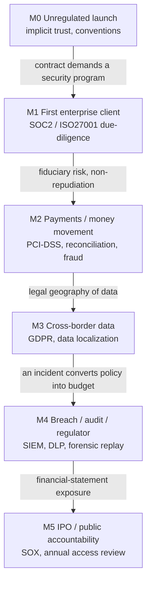
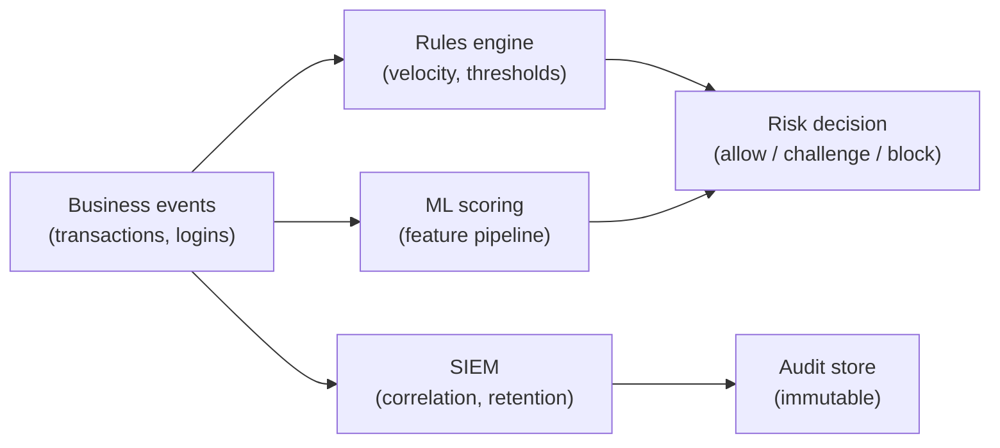

The System Design Master Roadmap is a machine-friction narrative: every rung is the answer to a *scale* bottleneck—reads that saturate a database, datasets that outgrow a server, teams that collide. This article covers the second regime of the same architecture problem: **trust friction**. A system in the trust regime must do more than stay fast under load; it must *prove* itself—to regulators, auditors, courts, and enterprise clients. Proof is an architectural property, not a policy document, and it rewrites which design poles are even legal.

**How to use this guide.** Where the roadmap answers *when a bottleneck appears* and *which pole to pick for the workload*, this article answers a prior question: *which poles is your system allowed to pick at all?* 
* Part 1 reframes the regime; 
* Part 2 walks the organizational milestones that trigger trust requirements; 
* Part 3 is the constraint-axis catalog that filters the roadmap's Part II poles; 
* Part 4 handles the risk plane as its own distributed system; Part 5 covers the AI-era delta; Part 6 maps books to topics.

---

## Part 1 — The Regime Shift: Compliance Is Not a Workload

**Core thesis.** Compliance is not a second kind of system design driven by QPS; it is a constraint field a product acquires the moment it touches money, personal data, health records, or regulated markets—and it vetoes poles the workload alone would allow.

The common framing pits "internet architecture" against "bank architecture" as two species of company. It is a false dichotomy. The real axis is **regulatory and trust intensity**, and every product travels along it. Stripe, a payments API, is governed like a bank; any SaaS that stores EU consumer data is governed like a privacy-regulated enterprise; a health-tech app inherits HIPAA-grade obligations the day it stores a diagnosis. The trust regime is not an alternative to the machine regime—it is a **constraint layer** that a business acquires by market and mandate, and the two regimes must be designed together.

The mechanism matters. The roadmap's ladder is *workload-driven*: bottlenecks appear as numbers climb. Trust requirements are *constraint-driven*: they appear as **obligations**, often long before any load figure matters. This is why the roadmap's bottleneck narrative never surfaces them—not because they are rare, but because they arrive through a different trigger. A system can be trivially small in QPS terms and still be architecturally dominated by the demand that every money movement be reconstructable, every data access attributable, and every claim externally auditable.

- **Reframe:** not "internet vs enterprise," but a regulatory/trust-intensity axis every product climbs.
- **Constraint vs workload:** why the roadmap's Part I/II never shows compliance (different trigger, not different scale).
- **Regime boundaries:** which poles each regime makes legal/illegal—the trust regime filters the roadmap's Part II axis poles.

**Key trade-off:** proof (evidence, isolation, recoverability) costs latency, throughput, and engineering. This article maps each cost to the specific obligation that justifies it, so you pay only where the law or the contract demands.

---

## Part 2 — The Milestone Ladder: When the Outside World Starts Asking

**Core thesis.** Every enterprise-grade mechanism enters as the answer to a concrete external event—a contract clause, a regulation, an incident, a fiduciary duty—not to a throughput figure. The trust regime has its own ladder, and each rung is climbed because the outside world started asking.

Each milestone is a *requirement shift*, and each shift maps to concrete mechanisms:

* **M1 — first enterprise client.** A big contract arrives with a security questionnaire and an audit clause. The response is a security program: access review, control design, evidence that the environment is configured and patched. Mechanisms: IAM + RBAC baseline, logging of privileged access, configuration-as-code that can be attested. This is often the first time an org is forced to treat *access* as auditable state rather than an engineering convenience.
* **M2 — payments / money movement.** Money introduces non-repudiation and reconciliation. Mechanisms: PCI-DSS-scoped card-data handling (tokenization), append-only transaction ledgers, 4-eyes approval for high-value movements, and a fraud-detection path (Part 4). Reconciliation demands a *second authoritative record*: totals from the ledger must be provably derivable from events, which is where the machine regime's event architecture becomes a compliance artifact.
* **M3 — cross-border data.** GDPR and data-localization laws constrain *where* data may live. Mechanisms: region-scoped deployments, residency-aware data placement, and—critically—a topology change. Residency is one of the few trust requirements that forces a *physical* migration: it is a roadmap Stage-4 partition decision driven by law, not by volume.
* **M4 — breach / audit / regulator.** An incident or a regulator turns previously theoretical controls into funded engineering. Mechanisms: SIEM correlation across all event sources, DLP at data-export boundaries, and *forensic replay*—the ability to reconstruct exactly who did what from retained evidence. This is the rung where audit trails stop being a tick-box and become an operations capability.
* **M5 — IPO / public accountability.** Financial-statement exposure under SOX demands integrity of financial data and *annualized access certification*: someone must annually attest that the access-control list matches reality. Mechanisms: automated access reviews, segregation-of-duties checks, and control evidence that survives an external auditor.

**Key trade-off:** reacting to each milestone vs pre-building. Governance built early is cheap insurance—access control and audit design are nearly free at the monolith stage and brutal after a microservice split. But a product nobody is auditing yet pays a velocity tax on controls it does not yet need. The rational path is *stage-appropriate*: design access and event capture for auditability from M0, but defer heavyweight certification machinery until a milestone demands it.

---

## Part 3 — Constraint Axes: The Poles Regulation Removes

**Core thesis.** The machine roadmap's Part II axes remain valid, but the trust regime filters their pole sets: a system that must be believed cannot pick several poles the workload alone permits. Each axis below follows the roadmap's shape—two poles, the trade-off, the decision criterion—but the poles are *legal* choices, not merely *fast* ones.

### Evidence Axis: Logging vs Audit Trail

The cheapest and most dangerous confusion in the trust regime is treating **logs** and **audit trails** as the same thing. Logs are for engineers: they can be sampled, rotated, and lost without legal consequence. Audit trails are for compliance officers, regulators, and courts: they are *evidence*, and losing them is an incident.

* **The two poles:** ephemeral debug logging vs immutable, non-repudiable audit records.
* **Mechanisms at the immutable pole:** WORM (Write-Once-Read-Many) storage; hash-chaining where each record carries the previous record's hash (a hash chain, generalized to Merkle trees); HSM-signed records so even a database operator with shell access cannot rewrite history undetected; Event Sourcing where state is derived by replaying an append-only event stream rather than by mutating a snapshot.
* **Projection onto the machine regime:** the audit pipeline is not a new pattern—it is the roadmap's **Stage-3 event architecture repurposed**: the transactional outbox + CDC feeds business events to a downstream audit sink; that sink is an immutable store chosen with the roadmap's II.3 storage-engine trade-off (write-heavy, append-only → LSM-friendly); replayable streams are the roadmap's event-driven decoupling pointed at a compliance consumer.
* **Decision criterion:** does anyone outside engineering ever need to prove *what happened*? Money movement, access to sensitive data, model decisions, and privileged admin actions are auditable by default; transient operational noise is logged, not audited.

### Retention Axis: Keep vs Delete

Two obligations pull on the same records in opposite directions. **Legal hold** says keep: KYC/AML regimes require 5–7 years of transaction and identity records; a pending lawsuit freezes everything relevant. **Data minimization** (GDPR Article 5, and the growing default posture) says delete: store only what the purpose requires, for only as long as it needs it.

* **The two poles:** indefinite retention with legal-hold fences vs aggressive minimization with expiry.
* **Mechanisms:** TTL and lifecycle policies applied at write time (the roadmap's II.7 tiering becomes a compliance instrument); *legal-hold fencing* that pauses deletion for records covered by an active obligation; separation of "retention logic" (driven by compliance) from "deletion logic" (driven by privacy).
* **Decision criterion:** classify each data class by its retention mandate (regulatory minimum), its minimization duty (purpose limitation), and the conflict resolution between the two—when regulations collide, the *longer* mandated hold generally governs for the specific class, and the design must make that conflict explicit rather than accidental.

### Identity Axis: Implicit Trust vs Zero-Trust

* **The two poles:** implicit trust inside the network perimeter vs zero-trust where every access request is authenticated and authorized regardless of origin.
* **Mechanisms:** RBAC (role → permission) for coarse control; ABAC (attribute → policy) for fine-grained, context-aware decisions; per-tenant isolation in multi-tenant SaaS where one customer's data must be provably unreachable by another—a *compliance* property, not merely a performance concern (noisy-neighbor isolation is the performance half; logical and cryptographic tenant separation is the trust half).
* **Decision criterion:** who must be able to *prove* they cannot reach what they are not allowed to reach? Regulated multi-tenant products default to ABAC + tenant-keyed encryption; internal tools can start with RBAC inside a trusted network.

### Protection Axis: Masking, Tokenization & Residency

* **The two poles:** plaintext sensitive data in the primary store vs transformed/ciphered representations (masked, tokenized, encrypted at rest and in transit).
* **Mechanisms:** PCI-style tokenization (the token is useless outside the vault); dynamic masking at read time so support staff never see full card numbers; KMS/HSM-backed encryption for at-rest and in-transit protection where the key is hardware-protected and access is itself audited.
* **Residency as a topology constraint:** data-localization law is the rare trust requirement that forces physical placement decisions—regional storage, region-scoped keys, and geo-fenced replication—i.e., the roadmap's replication and partitioning dials turned by legal geography.
* **Decision criterion:** data class sensitivity (card data, health data, credentials → tokenize/encrypt; derived analytics → masked aggregate), and the legal geography where the data originates.

### Control Axis: Full Automation vs Human-In-The-Loop

* **The two poles:** fully automated execution vs 4-eyes / human-approval gates on consequential actions.
* **Mechanisms:** approval workflows as *queue/event patterns* (the roadmap's Stage-3 asynchronous machinery repurposed as a governance valve): a transfer above a threshold, a mass-delete, a permission grant, or—increasingly—an agentic action lands on an approval queue; a second authorized human (or a policy engine standing in for one) releases it.
* **Decision criterion:** consequence and reversibility. Reversible, low-stakes actions stay automated; irreversible or high-stakes actions (money, data deletion, security changes, model-triggered external effects) cross a control gate. The gate's latency is a deliberate price paid for attestation.

### Recovery Axis: RPO/RTO as a Compliance Contract

* **The two poles:** asynchronous replication (low write latency, small data-loss window on failover) vs synchronous multi-region replication targeting RPO = 0 (no acknowledged write lost on a site failure).
* **Mechanisms:** the roadmap's Stage-2 replication and Stage-5 consensus dialed to financial-grade targets; "two-site, three-center" (同城双活 + 异地灾备) or its international equivalents; and, crucially, **DR drills and chaos engineering as the only proof** that the promised RTO/RPO is real—an undrilled RPO=0 claim is a paper guarantee, the trust-regime equivalent of a cache with no eviction test.
* **Decision criterion:** the cost of losing *x* minutes of data and the contractual/regulatory floor. Financial core systems buy RPO=0 with synchronous replication; analytical systems tolerate RPO measured in minutes. The SLO must be written, measured, and periodically proven under failure injection.

---

## Part 4 — The Risk Plane Is Its Own Distributed System

**Core thesis.** Fraud detection and security monitoring are not governance add-ons bolted onto the edges; they are real-time distributed systems in their own right, and they reuse the machine roadmap's Stage 2–4 toolkit rather than inventing a separate discipline.

* **Real-time risk engine:** scoring a payment in milliseconds means streaming feature computation (the roadmap's stream-processing world) with a low-latency decision path—the fraud counterpart of the roadmap's read-path latency budget.
* **SIEM as a downstream consumer:** the same events that drive the business are aggregated and correlated for security operations; SIEM is a Stage-3-style fan-out consumer that must not perturb the primary path.
* **DLP:** monitoring API and export boundaries for sensitive-data exfiltration—the data-protection axis applied at runtime rather than at rest.

**Key trade-off:** blocking fraud fast (risk latency) vs not annoying legitimate users (false-positive cost)—the trust-regime echo of the machine regime's cache hit-ratio tuning, but with financial and reputational stakes on both sides of the error.

---

## Part 5 — The AI-Era Delta: Model Risk Becomes Trust Friction

**Core thesis.** When models and agents act on money, data, and external systems, the trust regime extends from databases to *decisions*: evaluation, auditability, and human oversight of autonomous action become architectural requirements, not ML-process afterthoughts.

* **Evaluation & accountability.** The blog's own argument that systems inevitably become process-driven—见 [《为什么系统最终都会走向流程化：从"程序正义"到大模型评测的铁腕统治》](https://cj9208.github.io/blog/ai_study/systems-processification-evaluation/)—is the trust regime applied to models: when an automated decision can cause harm, someone must define the "program justice" by which it is judged, and the evaluation harness becomes the audit trail of the model. The economic inversion this creates for AI businesses is traced in [《破局"审计师陷阱"》](https://cj9208.github.io/blog/ai_study/auditor-trap-compute-deflation/).
* **Decision auditability.** An agent that acted on a customer's behalf must be *replayable*: the input state, the reasoning context, the tool calls, and the output that triggered an external effect must be reconstructable post-hoc. This is the Evidence Axis extended to reasoning chains.
* **Human oversight gates.** The 4-eyes axis moves from the data layer to the action layer: an agent that would issue a refund, delete a record, or transfer funds crosses the same approval gate a human operator would—and the gate's decision is itself audited.

**Key trade-off:** automation reach vs oversight cost. Pushing autonomy to the edge maximizes throughput but multiplies the points where a decision must be explainable and gated; the control valve is the same as Part 3's, now applied to model-triggered action.

---

## Part 6 — Reading Map

**Core thesis.** The trust regime has no single canonical textbook—its canon is scattered across standards bodies, regulation, and distributed-systems literature. The pragmatic order is: classify the milestone you face, then read the framework that governs it.

| Trust Topic | Canonical Reference | What It Gives You |
| :--- | :--- | :--- |
| Risk & control frameworks | NIST RMF · ISO/IEC 27001 · SOC2 · PCI-DSS · GDPR | The obligation vocabulary: what must be controlled, attested, retained |
| Zero-trust architecture | NIST SP 800-207 · Google BeyondCorp whitepaper | The identity/authorization pole set |
| Threat modeling | Shostack, *Threat Modeling: Designing for Security* | Systematic enumeration of what an adversary can do |
| Immutable/audit storage | Kleppmann (replication, partition, event streams, Ch. 5–6, 11) | The distributed-systems machinery under audit pipelines |
| Fraud / real-time risk | Apache Flink / Kafka stream-processing references | The risk plane's own scaling toolkit |
| AI governance | The blog's AI-study evaluation & harness series | The trust regime's model-era extension |

**Key trade-off:** framework breadth vs depth. Reading four full control frameworks is a career, not a chapter; start from the milestone you are actually facing (Part 2), read the one framework that governs it (Part 6 table), and treat the rest as on-demand reference.

---

## Closing Note: The Boundary Between the Regimes

The trust regime and the machine regime ([System Design Master Roadmap](https://cj9208.github.io/blog/ai_study/system_design/system-design-master-roadmap/)) are not competing architectures; they are two friction types acting on the same system. The machine regime sets the price of a mechanism in latency and complexity; the trust regime forbids the cheap poles where evidence, isolation, or recoverability is at stake. A payments system is not a "different kind of distributed system"—it is a distributed system whose consistency, replication, and event choices were filtered by the obligation to prove itself. The third regime, how teams are organized to build any of this, is covered separately in the [Coordination Regime](https://cj9208.github.io/blog/ai_study/system_design/coordination-regime/).
