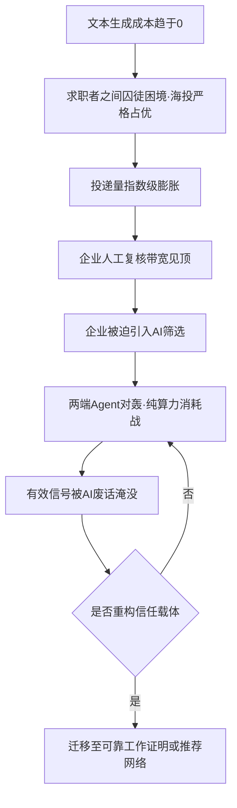
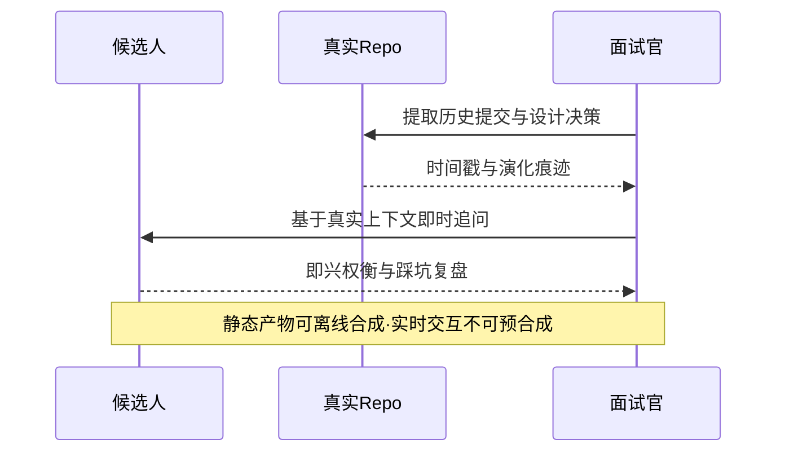

招聘市场正在经历一场典型的**技术军备竞赛**。求职者用 Agent 批量生成定制简历并自动投递，单次"攻势"的边际成本只有几分钱和几秒钟；企业若完全依赖人工筛选，吞吐量存在物理上限。当生成成本趋近于零，任何"限制技术"的呼吁都退化为道德约束，在博弈中瞬间失效。

本文不讨论某一方 Agent 的胜负，而是把这场博弈拆成三段：**囚徒困境**决定了军备竞赛的必然；**生成成本归零**让真实信号被噪声淹没、鉴别失效；而当鉴别失效，唯一的出路是基于**斯宾塞昂贵信号理论**重建分离均衡，把信任重新锚定到**伪造代价高昂的资源**上（即重建 $C_{\text{fake}} \gg C_{\text{real}}$）——要么是可靠的工作证明，要么是可靠的推荐人。贯穿这三段的，是同一个底层命题：**信任的强度，取决于伪造它的代价。**

---

## 囚徒困境：军备竞赛的必然

这场军备竞赛的起点，是**求职者之间的囚徒困境**。当 AI 把定制简历的边际成本压到几分钱，单个求职者的最优选择必然是海投：别人都在批量投递时，"只投少量精准岗位"的人会被瞬间淹没。无论同行怎么选，"跟进"都是严格占优策略——于是所有人一起跟进，投递量指数级膨胀。

关键在于：囚徒困境并不发生在"企业与候选人"之间（二者并非对称博弈），而发生在**同一侧的同质参与者之间**。企业面对的不是一个对手，而是一个被横向内卷推高的投递量。

企业的 AI 化是这条链的被动结果。人工复核的带宽有物理上限，面对爆表的收件箱，企业只有两个选项：要么放弃筛选、在噪声里错过真正的候选人，要么引入 AI 筛选。**这不是对称的博弈选择，而是带宽约束下的被迫升级。**

| 层级 | 参与者 | 单次成本 / 吞吐上限 | 不跟进的后果 |
| --- | --- | --- | --- |
| 第一层 · 求职者横向内卷 | 同质求职者 | 几分钱、几秒 / 无上限（脚本并发） | 被他人投递淹没，失去面试机会 |
| 第二层 · 企业带宽约束 | 企业筛选端 | 人工成本、分钟级 / 受复核带宽硬约束 | 收件箱积压，错过有效候选人 |

这不是某一方的恶意，而是**囚徒困境的必然解**：任何单方面"停止海投"的承诺，都会被仍在批量投递的同行瞬间收割；投递量因此只增不减，而企业一旦面对爆表的收件箱，也不得不引入 AI——否则在人工带宽见顶的情况下，连有效候选人都捞不出来。求职者的横向内卷与企业的带宽瓶颈首尾相接，把招聘变成一场纯算力的消耗战：**生成成本越低，军备竞赛越没有终点**。

死局的本质不是技术过剩，而是**信任载体与生成成本脱钩**：载体越容易被批量复制，其承载的信任就越稀薄。这里存在一对不可回避的张力——**开放投递的公平性，与无门槛机制必然被廉价伪造套利**。任何仅靠提高筛选算力、而不改变准入与验证协议的方案，都只是在为崩溃的验证机制续命。

---

## 信号淹没：真实信号为何无法鉴别

当生成成本趋零，投递量指数级膨胀。真正的麻烦不是"谁在撒谎"，而是**噪声把真实信号稀释到了不可辨识的密度**。

用信息经济学的语言，这就是**信号筛选**（Screening）：信息较少的一方（企业）设计鉴别机制，在极低信噪比下把真信号从噪声里挑出来。它与拜占庭共识问题的区别，见文末[延伸阅读](#延伸阅读)。

单靠文本，鉴别会先在统计上崩溃。设真实候选人比例为 $p$（先验），真简历被正确放行的概率为真阳性率 $\text{TPR}$，假简历被误判为合格的概率为 $\text{FPR}$，则一条"看起来合格"的简历确为真实的概率为：

$$P(\text{真实} \mid \text{合格}) = \frac{p \cdot \text{TPR}}{p \cdot \text{TPR} + (1-p)\cdot \text{FPR}}$$

直观读法：分子是"真人且被放行"，分母是"所有被放行的人（被放行的真人 + 混进来的假人）"。当 AI 生成的假简历在文本上与真简历不可区分时，$\text{FPR} \to 1$——假人几乎全被放行，分母被噪声撑大，整个分数被拽回到先验 $p$。用大白话说：**筛选完的"合格池"里真人的占比，和闭眼从投递池里随机捞一个差不多——筛选器白干了**。实践中，未经过 AI 润色的真候选人反而更容易被规则硬误杀（$\text{TPR}$ 下降），结果比 $p$ 还差。更麻烦的是，$p$ 本身也不是常数：当投递有成本时，求职者会自我筛选、只投有把握的岗位，$p$ 维持在较高水平；当海投成本趋零，投递池被大量低匹配投递稀释，$p$ 迅速下降。于是是双重坍塌：**一是筛选器失效（后验塌回先验），二是先验本身在下坠**——最终几乎筛不出真正合格的人。也就是说：**当噪声以趋零成本无限注入，筛选器的输出会被拽回到一个本身还在下坠的先验**——这不是筛选者不够努力，而是信噪比层面的不可能。简历的失效，不是企业"选错了"，而是可信信号在文本总量中的占比被稀释到了不可辨识的密度。

---

## 声明式与证明式：文本为何承载不了信任

PDF 简历是典型的"声明式"载体。用自然语言声称具备架构能力、主导过高并发系统、精通某一技术栈，只需要几行 Token；而验证这些声明的成本，却完全由接收方承担。这种**声明成本与验证成本的结构性错位**，是信号失效的根源。

| 信号类型 | 典型载体 | 生成成本 | 验证成本 | 防伪能力 |
| --- | --- | --- | --- | --- |
| **声明式 (Declarative)** | PDF 简历、自填标签 | 趋近于 0 | 极高（需履历核查/面试） | 极低（LLM 秒级合成） |
| **证明式 (Proof-based)** | 开源 PR、工程交付、实时交互 | 高（时间+认知开销） | 低（可直接看运行结果） | 高（无法瞬时伪造） |

用斯宾塞的语言，当 $C_{\text{fake}} \to 0$，市场从**分离均衡**坠入**混同均衡**：人人都能发出完美信号，文本彻底丧失区分度。学历与奥数的异化是先例；AI 只是把这一失效推广到一切纯文本信号。唯一的出路在文本之外：寻找无法瞬时伪造的成本锚点。

---

## 破局：可靠的工作证明，或可靠的推荐人

当单向验证失效，信任的重建只剩两条路：要么让声明本身变得**昂贵**（可靠的工作证明），要么把判断权交给**可信的人**（可追责的推荐网络）。

这两条路都是**事前筛选**：在简历之前，用伪造成本高昂的资源先筛一遍。它们与拜占庭容错、女巫攻击的解法高度相似，不是因为同一个问题，而是共享同一个根：**信任所锚定的稀缺资源，被技术进步变得廉价了**。拜占庭的口头消息模型失败，是因为消息无法防伪（伪造免费）；女巫攻击得手，是因为身份可以无限复制；简历失效，是因为声明可以零成本生成——问题表述各异，失效前提一致。因此修复方向也必然收敛：**把信任重新锚定到一种伪造代价高昂、且无法瞬时转移的资源上**。工作量证明与信任网络，正是两个这样的通用原语。而当静态产物也能被批量伪造，筛选必须再向后挪一道——**事中验证**，即不可预合成的实时交互。下文先讲两条事前路，再讲这道事中闸门。

### 1. 工作量证明：事前筛选的时间深度

中本聪在 PoW 中的核心设计，是让作恶不再只是改改代码（信息成本趋零），而必须消耗真实的物理电能（热力学成本极高）。映射到招聘，就是引入**不可瞬时伪造的时间深度（Temporal Depth）**：长期维护逻辑自洽的技术博客，或在真实开源项目中连续数年合并非 trivial 的 PR。AI 可以瞬间合成十篇看似深奥的文章，却极难伪造伴随真实工程踩坑痕迹的连续时间轴——**时间轴上的连续性，是防御单点伪造最强悍的屏障。**

### 2. 信任网络：事前筛选的声誉质押

工作证明解决的是个体交付；但真正稀缺的是**可信背书**。当单向验证失效，信任只能从网络里"借"出来。一个由推荐人组成的声誉网络，最接近一个**拜占庭式**的结构：多个节点要对"某人是否可信"给出判断，其中既有诚实的背书者，也可能混入被收买、被话术操纵、或对不同人给出不同评价（equivocation）的节点。系统要在这张不可靠的网络上收敛出稳定的信任评级，就必须支付共识成本。

当文本与作品的生成成本都被压到趋零，"信任"成为全网最稀缺的硬通货。系统会退回至基于声誉（PBFT/PoS）的准入共识：企业重新依赖高信任度节点——同行强力背书、深度合作过的项目伙伴、可靠的内推渠道；同时将背书人的声誉与被背书人的表现绑定（Proof of Reputation），使信任网络具备可追责的质押结构，而非纯粹的人情担保。

这一迁移并非没有代价。高信任网络的识别力强，但其封闭性会天然排斥圈外候选人，并可能在声誉质押中滋生寻租。BFT 路径安全但代价高昂，现实中组织往往退回到小规模、高信任、准入受控的共识网络。信任网络不是"更公平"的机制，而是在信号全面失效时的**最不坏选择**。

### 3. 执行证明：事中的实时验证

事前筛选并非终局。水军很快也会用 AI 脚本去"刷 GitHub 绿格子"、批量生成伪技术博客。只要验证对象是**已固化的产物**，攻击方就有充足时间在离线状态下合成它；破解之道是把验证挪到**不可预合成的实时交互现场（Proof of Execution）**：

> "你两年前写的这个并发锁机制，当时为什么没有选用乐观锁？"

这类问题无法通过预制答案通过，因为它检验的不是知识存量，而是在未知问题、冲突与架构权衡下的即兴思考脉络与工程直觉。

验证深度提升的代价，是面试成本与候选人体验的双重上升。执行证明因此无法成为大规模初筛的默认手段，而更适合作为高价值岗位或最终环节的验证闸门——它的作用不是提高吞吐，而是**把信任锚点重新钉死在不可伪造的现场**。

---

## 结语：重新引入人类摩擦

要打破军备竞赛，终极解法不是限制技术，而是**重构规则与信任载体**：事前用工作证明抬高海投的边际成本、用信任网络重塑背书链条（强推荐、小圈子验证），事中再以针对真实工程问题的现场协作设闸，并主动重新引入**有意义的人类摩擦**。商业与技术演进了几十年，一直试图消灭招聘流程里所有的摩擦；但极致的无摩擦最终引爆了信任危机。

| 机制 | 成本锚点 | 目标 | 主要代价 |
| --- | --- | --- | --- |
| 提高海投边际成本 | 真实验证的准入门槛 | 破坏脚本化海投的经济模型 | 抬高普通候选人准入门槛 |
| 信任网络（Web of Trust） | 社交声誉与网络质押 | 用声誉锚定真实交付 | 圈层封闭与寻租风险 |
| 执行证明（Proof of Execution） | 实时认知算力（不可预合成） | 验证不可预合成的现场能力 | 面试成本与体验成本上升 |
| 人类摩擦 | 面对面相处与协同成本 | 重建面对面信任 | 降低匹配吞吐与速度 |

这些机制的共同点，是**用成本换信任**：主动放弃一部分自动化效率，换回信号的纯度。

这场魔法对轰的最终结局，大概率不是某一方的 AI 赢得了战争，而是 **"简历"这种延续了几十年的形式本身走向终结**：我们用最尖端的 AI 把自动化推向极致，最后却把所有人逼回最原始、也最抗脆弱的验证方式——基于人与人之间真实相处、共同作战所建立起来的信任。对个体而言，结论同样清晰：当文本不再具备证明能力，可积累的护城河只剩下两样——**可被时间验证的真实交付，与可被网络背书的高信任声誉**。在一个无限重复的博弈里，不作恶与互相信任，仍然是长期最优解。

---

## 延伸阅读

**机制底座与概念辨析**

- [《混沌中的信任重构：从"拜占庭将军"到企业通信架构》](https://cj9208.github.io/blog/systems_and_governance/byzantine-trust-reconstruction/)：拜占庭容错、女巫攻击与工作量证明的机制底座。注意区分：女巫攻击是"噪声为何廉价"的成因之一（身份与声明可趋零成本批量复制），而本文的失效是**单向鉴别**（信号筛选），并非共识崩溃——两者共享"信任锚点被变廉价"这一失效前提。
- [《声明式与过程式：系统工程视角下"人治"与"法治"的四大差异》](https://cj9208.github.io/blog/systems_and_governance/declarative-imperative-governance/)：术语辨析——该文的"声明式/过程式"描述执行范式，与本文"声明式/证明式"（自我声明 vs 可验证证明）不是同一组概念。

**结构同源与现象前身**

- [《个体风控与系统鉴权：社交平台虚假身份欺诈的 Post-Mortem 复盘》](https://cj9208.github.io/blog/systems_and_governance/social-platform-fraud-postmortem/)：同一失败路径——把未经核实的自填标签当作高权重特征，鉴权成本被转嫁给终端个体。
- [《廉价文凭与昂贵青春：高等教育背后的机会成本与社会避险机制》](https://cj9208.github.io/blog/systems_and_governance/diploma-opportunity-cost/)：信号失真与选拔军备竞赛的早期形态，本文"昂贵信号"论断的现象前身。

**机制对照**

- [《指标的内爆与协议的重构：现代系统如何硬核对抗"古德哈特定律"？》](https://cj9208.github.io/blog/systems_and_governance/goodharts-law-protocol-reconstruction/)：用刚性工作量作为"证明场"对抗指标异化的治理样本。
- [《破局存量内卷的终极解法：现代商业的"Spec 固定逻辑"》](https://cj9208.github.io/blog/systems_and_governance/chinese_government/breaking-involution-spec-fixed-logic/)：与本文"用成本换信任"同源的"用确定性规则约束对抗人性脆弱"。

**筛选与博弈延伸**

- [《组织如何筛选"高解题、零阻力"的人：招聘端与应试教育的共构》](https://cj9208.github.io/blog/systems_and_governance/talent-screening-exam-culture/)：招聘端筛选偏好如何被组织架构塑造。
- [《职场的"分布式共生"：从博弈论的 Tit-for-Tat 到技术团队的系统架构》](https://cj9208.github.io/blog/ai_era_engineering_careers/distributed-symbiosis-tit-for-tat/)：无限重复博弈下"不作恶与互信"的长期最优性。
