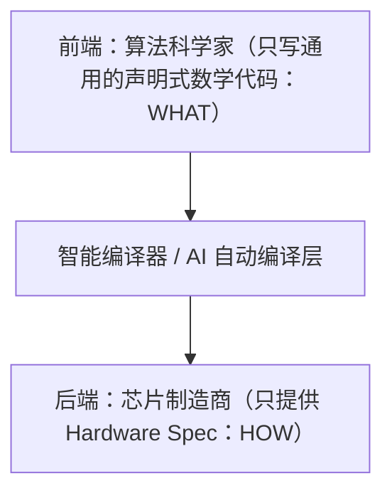

## 一、 引言：AI 算力战场的“钟摆定律”

在计算机体系结构的演进史上，存在一个无法逃避的“钟摆定律”（Pendulum Swing）：技术总是从“为了速度而无视成本的暴力堆砌”，走向“为了生存而精打细算的极致优化”。

过去几年，整个 AI 行业顺着 Scaling Law 的惯性疯狂向前线性外推。在资金和算力额度近乎无限的上行期，“用资产换时间”是唯一的最高指挥棒。全行业崇尚着优雅、解耦的通用抽象层，遇到显存或通信瓶颈时，最符合大厂商业理性的解法往往是简单粗暴的“再加 5,000 张卡”。

然而，随着行业跨入存量竞争的冰冷周期，算力开支（CapEx）和推理成本（AI COGS）开始被死死卡在 CFO 的 Excel 账本上。当暴力堆砌走到尽头，精打细算的极致优化便成了刚需。

但这提出了一个终极问题：优化的终局，难道是让每一个算法团队都变成精通底层硬件的特种兵吗？ 历史给出的答案是否定的。优化的最终宿命，从来不是全民黑客化，而是底层技术的“大工业化沉淀”与“软硬件契约的分离”。

---

## 二、 极限的悖论：DeepSeek 模式是破局的妖刀，而非长治久安的王道

在这轮打破行业沉闷的算力风暴中，DeepSeek 的做法无疑是一场极致的“重工业黑客美学”。他们用最硬核的工程事实证明，通过彻底砸碎算法与系统（Infra）之间的组织高墙，通用芯片（英伟达 GPU）可以被榨干到令人发指的程度。

### 1. 软硬绑定的“手工业巅峰”

DeepSeek 团队没有在高级抽象层里被动等待硬件降价，而是直接将英伟达显卡的物理特性（如 HBM 带宽上限、SRAM 缓存行大小、NVLink 通信延迟）作为变量，反向设计了算法。

* **MLA（多头潜在注意力机制）：** 从数学层面给 KV Cache 疯狂瘦身，用算法的妥协去弥补硬件显存带宽的缺陷。
* **DualPipe 调度：** 贴着 8 卡 NVLink 的特定网络拓扑，通过 PTX 汇编级重写，让 GPU 的计算与点对点通信做到 100% 完美重叠。

### 2. 漂亮，但不够优雅的战略技术债

这种模式在当下展现出了惊艳的破局爆发力，但在长期的商业闭环中，它是一把“漂亮但不优雅”的妖刀。

* **人才的极端不可复制性：** 这种“微雕工程”需要极其稀缺的、横跨高维数学大模型与底层物理微架构的“全栈特种兵”，无法进行大规模工业化流水线复制。
* **架构的脆弱性（换个机房就抓瞎）：** 由于代码被深度硬编码（Hardcode）在特定的硬件拓扑和通信机制上，这种底层抽象极度缺乏弹性。一旦硬件架构发生断代特征的跃升（例如英伟达从 Blackwell 走向 Rubin 架构，彻底重构了内存微块缩放），原有的精妙设计就会在一夜之间变成无法维护的技术债。

### 3. 历史必然的“撞钟人”

即便如此，我们无法否认 DeepSeek 在特定历史时期的特殊性。在一个全行业盲目堆卡的混沌期，他们充当了急先锋。他们用高风险的底层肉搏，强行把全行业的思维惯性一拳砸向了性价比的另一端，完成了“强行让钟摆回摆”的历史使命。

---

## 三、 历史的韵脚：所有伟大的优化，最终宿命都是“契约分离”

> 整个计算机发展史都在重复一个朴素的铁律：优化以下沉为终局，下沉以契约分离为核心。大工业的解法，必然是让“用的人”与“实现的人”彻底分离。

为了看清 AI 算力的终局，我们可以把目光投向历史上的三次经典战役：

### 1. 数据库领域：从“物理指针”到 SQL（声明式的终极图腾）

* **前 SQL 时代：** 在 70 年代，程序员要想从数据库查一条数据，必须手写代码去指定底层的物理指针怎么跳、在磁盘的哪个扇区进行遍历。这与今天人肉手写 PTX 汇编去对齐 GPU 线程块如出一辙。
* **SQL 的分离：** SQL 诞生后，重新确立了“声明式（Declarative）”的契约。用的人只负责表达“我要什么数据”（WHAT），而把具体的“怎么去拿、怎么走索引、怎么跨物理通道”（HOW）的脏活，全部交给了底层的查询优化器（Query Optimizer）。

### 2. PC 游戏领域：3D 图形大战中的英伟达驱动神话

* **当年的线性外推：** 2000 年代初，微软推出了通用的 DirectX 标准 API。当时全行业线性外推，认为既然所有游戏开发商都只调用相同的通用接口，底层的显卡就同质化了，未来只能拼价格。
* **底层的专门优化：** 现实是，英伟达靠着庞大的图形驱动团队在通用层以下“开挂”。每当游戏调用标准的 Shader 接口，驱动程序就会在底层实时拦截这段代码，自动将其重写为完全适配自家显卡硬件流水线的极致汇编代码。游戏开发者以为自己写的是通用代码，其实全靠底层驱动完成了像素级的专门优化。

### 3. 互联网泡沫破裂后的 Java HotSpot JIT 编译器

* **当年的现状：** Java 依靠极致通用的虚拟机（JVM）构建了“一次编写，到处运行”的宏大叙事，但也因为太通用，性能烂得像幻灯片，在上行期备受嘲讽。
* **底层的专门优化：** 随着互联网泡沫破裂，性价比成为生存刚需。Sun 公司推出了 HotSpot JIT（即时编译器）。开发人员继续用最标准、最通用的业务代码写业务，而 JIT 编译器在运行那一刻，死死盯着底层的物理 CPU，自动进行循环展开和逃逸分析，榨干硬件。

---

## 四、 理想的终局：硬件提供 Spec，AI 自动实现

顺着“契约分离”的历史轨迹，未来的 AI 基础设施演进已经展露出了清晰的轮廓。近期在 KernelBench-Mega 算子基准测试中，Claude Fable 5 表现出了一绝的性能，通过“纯手搓”的方式直接为 RTX PRO 6000 自动生成了高并发的定制 CUDA 内核，速度狂飙了 18.7 倍。

这个最新的技术切片，直接印证了你我所设想的性价比时代的工业化流水线：专业的人做专业的事，用的人和实现的人彻底解耦。

### 1. 前端（用的人）保持绝对的通用

算法科学家应当拥有最高的开发效率和专注度。他们继续使用最标准的数学语言、最通用的框架（如 PyTorch 或标准 Triton 接口）去描述模型架构和 Agent 逻辑。他们不需要感知底层的显存大小、不需要操心通信和计算怎么重叠，更不需要为硬件本身的缺陷买单。

### 2. 后端（实现的人）提供冰冷的 Spec

不管是英伟达的通用 GPU、博通定制的 ASIC，还是谷歌的 TPU，硬件厂商只需要交出一份客观的 Hardware Spec（硬件规格契约）：网络互联带宽是多少、寄存器数量有多少、特定精度的算子加速器在哪里。

### 3. 智能编译层（黑盒自动桥接）

真正属于大工业时代的“全自动优化”，将由通用层底下的智能编译器后端（Compiler Backend）来接管。

DeepSeek、Fable 5 以及开源社区这几年来肉身踩坑、人肉趟出来的“正确解题思路”（如 MLA 显存压缩思想、无辅助损失的 MoE 路由、100% 通信重叠调度），将被全部制度化地收编、沉淀为编译器的自动图优化（Graph IR）算法和成本模型（Cost Model）。

当通用的代码被丢进编译器，后端会自动读取当前硬件的 Spec，自动进行代数等价变换，自动把标准计算图塌陷成最贴合当前硬件物理特性的底层汇编。

---

## 五、 结语：商业周期是最无情的清道夫

商业周期是残酷的，但也是最高明的清道夫。在泡沫高涨的狂热期，它放任人类用暴力的资源堆砌去掩盖工程上的低效与浪费；在冷酷的低谷期，它又用生存的铁拳逼迫最聪明的黑客肉身冲锋，去测探出软硬件压榨的极限边界。

DeepSeek 以时代冒险者的姿态，用一套无法复制的极致黑客流派，为全行业撞响了性价比时代的警钟。但历史的钟摆不会停留在手工业的作坊里。

当性价比时代的潮水彻底铺开，那些曾经需要顶尖天才闭关数月才能人肉雕刻出来的底层优化，终将被重工业化的智能编译器彻底收编。它们将退居幕后，下沉为基础设施的一部分，变成未来 AI 世界里，普通工程师按一下按钮就能享受到的、润物细无声的水和电。

---

## 附注：底层基因的路径依赖——组织 DNA 与战略本能的非线性共振

### 一、 引言：技术选择背后的“思想钢印”

企业的战略路线不仅是基于当下财务和技术参数的最优解，更是组织原生 DNA 在面对不确定性时的“肌肉记忆”。

在行业狂热期，宏大叙事往往会掩盖底层的文化分歧；但当周期转入深水区，决定一家公司是走向软硬一体的像素级压榨，还是坚守高级抽象的通用道路，往往取决于他们诞生之初为了生存而练就的“核心肌肉群”。

本附注旨在拆解技术选择背后的组织行为学，审视英伟达、DeepSeek 以及硅谷前沿实验室各自的“思想钢印”，并剖析它们如何在更大尺度上共同构成了科技工业的全球大分工。

### 二、 DeepSeek 的量化基因：纳秒战场的“极致生存学”

DeepSeek 的母公司源自顶级量化私募幻方。量化和高频交易（HFT）这门生意的底层逻辑极其残酷：天下武功，唯快不破。慢了一个纳秒，你的订单就会被对手盘无情绞杀。

* **对延迟与硬件的病态压榨：** 在这种高烈度环境下长大的工程团队，天然具备对操作系统内核进行像素级压榨的肌肉记忆（如魔改 Linux 内核、用 DPDK 绕过标准网络栈）。
* **脱掉玄学外衣的 LLM 观：** 传统学术大厂将大模型视为充满数学玄学的神圣实体；而量化基因的工程师看大模型，其底层就是一个超大规模、超高并发、内存带宽严重受限的“分布式数据吞吐流”。

在他们的工程哲学里，优雅的通用抽象层不是资产，而是为了掩盖无能而征收的“性能税”。为了在算力受限的极端约束下拿满生存权，他们敢于砸碎契约，直接用算法向硬件肉搏。

### 三、 英伟达的驱动基因：在硬件泥潭里练就的“补锅匠”

今天全人类都在享受 CUDA 生态的红利，但英伟达这套“软件在底层为全行业开挂”的本能，是在 90 年代末 PC 硬件极度混乱、驱动天天崩溃的蛮荒时代跪着练出来的。

* **像素级的补锅匠：** 游戏开发商的代码写得千奇百怪，显卡稍微跑不对就会死机、花屏。英伟达为了活下来，逼着自己建立了一支全世界最庞大、战斗力最强悍的图形驱动团队。
* **软件干脏活的传统：** “开发者可以写烂代码，但英伟达在驱动层必须把屁股擦干净。”这种实时拦截通用 API、在底层人肉重写汇编的传统，是黄仁勋自诞生起就刻在骨子里的策略本能。

CUDA 并不是一个凭空出现的科学神话，它本质上就是英伟达驱动基因的终极进化版：你们科学家和算法工程师尽管在上层写通用的、粗糙的代码，底层的复杂性和极限硬件压榨，由我英伟达用编译器和软件团队帮全人类抹平。

### 四、 科学家与补锅匠：更广泛的全球工业大分工

当我们看清了底层基因的路径依赖，就会发现，行业内不同玩家的选择并没有绝对的对错，而是全球科技工业分工在组织形态上的终极体现。

OpenAI 这样的顶级实验室，主导的是“声明式（Declarative）”的科学探索。

这群由顶尖科学家构成的组织，其核心使命是推高人类智力的天花板、验证 Scaling Law 的物理极限、探索全新范式的边界。在这场与时间的赛跑中，让科学家去手写 PTX 汇编、去对齐 8 卡 NVLink 的微秒级气泡，在组织效率上是极其低效且不经济的。

他们不需要做所有的事情，因为英伟达和开源社区的“补锅匠”们会替他们完成底层的极限优化。

* **科学家的主场：** 负责定义 WHAT（要实现什么范式）。他们利用标准的 PyTorch 契约，把复杂性推给下游，保持最高频的算法创新。
* **极客与硬件厂商的主场：** 负责交付 HOW（如何在物理世界高效实现）。英伟达用海量的底层软件工程师维护 CUDA 库来承接科学家的创意，而 DeepSeek 则用极致的量化精算本能去探测当前硬件的成本底线。

这正是“用的人和实现的人分离”这一工程铁律在行业最高维度的非线性共振。学术型大厂不需要具备底层黑客的基因，因为整个芯片和编译基础设施，都在自发地、拼命地为了迎合他们的科学猜想而进行专门优化。

这种组织基因的各司其职，才共同拼凑出了现代 AI 工业化狂飙的完整版图。

---

## 附注2：技术演进的非线性与确定性积累

### 一、 引言：顶层设计的局限与演化的偶然性

在商业回顾中，人们往往习惯于从事后寻找因果关系，将成功者的每一步跨越归功于长远的顶层设计或精准的五年战略规划。这种线性思维忽略了技术和市场演进的剧烈不确定性。

真实的科技发展往往表现出极强的非线性。组织在蛮荒期为了解决特定、务实的生存问题，会深度培养某一项特定的工程能力与肌肉记忆。当外部行业环境、资本结构或技术范式发生剧烈的、不可预测的突变时，这种长期积累的特定工程能力，如果恰好切中了新范式的物理刚性需求，就会在客观上表现为跨越周期的巨大优势。

这并非源于对未来的精确计划，而是演化过程中的一种阶段性共振。

### 二、 英伟达：从碎片化驱动优化中沉淀出的底层资产

今天全人类都在讨论英伟达由 GPU 与 NVLink 构成的系统级壁垒，但从历史路径来看，这一格局并非源于数十年前对通用人工智能的精准预测，而是源于其早期在图形芯片市场中积累的软件工程本能。

在 90 年代末至 2000 年代，PC 硬件生态和多媒体接口标准极度碎片化，游戏开发商的软件实现质量参差不齐。为了保证显卡在实际运行中的稳定性和帧率，英伟达被迫组建了极其庞大的图形驱动团队。其核心工作是在驱动层实时拦截通用 API（如 DirectX 或 OpenGL），并在底层将其重新编译、重写为完全适配自家显卡流水线的定制汇编代码。

这种长期为全行业“擦屁股”、做底层软硬件像素级适配的软件工程策略，在当年被普遍视为重资产、重人力的边缘工作。然而，正是这种在驱动泥潭里锻炼出来的、对硬件寄存器和编译器的绝对控制力，最终内化为了其开发 CUDA 生态时最核心的组织肌肉。时代范式在多年后突然转向了并行计算，而英伟达恰好提前具备了接住这一浪潮的软件工具箱。

### 三、 DeepSeek：量化背景下的高通量数据精算

同样，DeepSeek 在大模型推理成本上的突破，其底色也源自其母公司幻方量化所固有的组织基因。

在高频交易（HFT）和量化私募领域，对延迟（Latency）和吞吐量（Throughput）的压榨是绝对的生存刚需。量化团队的日常工程实践，就是去魔改 Linux 内核、利用 DPDK 绕过标准网络栈、用 C++ 和汇编去精确计算和优化每一行代码的显存与缓存命中率。

当这支团队进入大模型领域时，他们很自然地卸下了学术界的玄学包袱，从纯粹的数据吞吐与硬件限制出发，将大模型推理视为一个超大规模、内存带宽严重受限的分布式工程问题。在资本高涨、全行业热衷于堆砌卡片时，这种“精算到每一分钱、每一个 Token”的抠门基因并不显眼。但当行业周期转入深水区、性价比成为核心指标时，这套针对硬件拓扑（如基于 8 卡 NVLink 设计 DualPipe 调度）和显存带宽（如 MLA）的极致压榨能力，在成本账本上展现出了极高的实用价值。

### 四、 结语：做好自己的事，然后等待周期

英伟达与 DeepSeek 的案例揭示了一个更为务实的常识：技术和商业的演进中，核心从来不是去赌某一个具体的未来范式，而是你手里有没有握着足够坚固的、属于自己的工具和能力。

我们无法预测风口。你不能期待你自己的技术特点就一定会成为下一个风口，更不能期待风暴来临的时间节点刚刚好对齐你的准备。在非线性的周期面前，任何自以为是的“扬帆起航”都可能变成盲目触礁。

真正符合工程师理性的策略是：做好当前场景下的核心刚需，在自己的边界里，把架构、契约和工具链打磨得足够纯粹。

不要去为了想象中的宏大叙事过度设计，要在具体的实际问题中培养自己最扎实的核心肌肉。把工具造好，把积木码齐，保持随时能解耦和重构的底座弹性。剩下的，就是做好手头的事，然后平静、耐心地等待周期和风口的检验。风若不来，你依然在自己的生态位里活得很好；风若恰好吹过来，你手里的工具箱，才是你参与下一场游戏的入场券。
