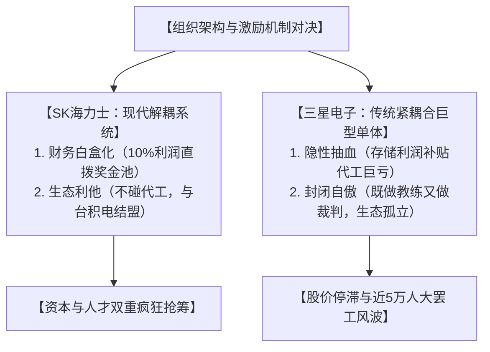

在半导体行业狂飙的AI强周期与高带宽内存（HBM）供不应求的黄金节点，三星电子却迎来了历史上前所未有的全面大罢工。这场看似由薪酬引发的劳资纠纷，实则是工会一场精确的“跨期套利”博弈。它如同一把手术刀，无情地刺破了三星沿用多年的IDM（集成器件制造）一体化体制，暴露出深层的结构性系统溃疡。

## 一、 强周期下的“跨期套利”：工会精准踩中管理层死穴

半导体是典型的强周期行业。工会选择在AI行情最火爆、英伟达HBM3e认证进入分秒必争的关键窗口开启全面罢工，底层的经济学逻辑非常清晰：**在行业最高点，用产能作为筹码绑架管理层。**

> **工会的心理账本：** 在前两年的行业低谷期，负责芯片的DS（Device Solutions）部门亏损惨重，员工奖金实质性归零。如今迎来AI超级红利，如果员工不在最赚钱、公司最缺产能的“时间窗口”内，通过制度化契约废除50%的绩效奖金（OPI）天花板，并将利润分成（如营业利润的15%）锁死在长期劳动合同中；等两三年后周期退潮，管理层将再次以“行业不景气”为由将奖金清零。

工会不是不懂周期，他们是在利用当下的极限溢价，对冲未来下行周期的不确定性。

## 二、 内部的“隐性抽血”：存储部门的利润黑盒

三星的IDM模式在内部制造了一个巨大的“大锅饭”系统。由于缺乏彻底的业务解耦，三星电子内部衍生出了扭曲的利益流转机制：

* **成熟部门极限抽血：** 负责存储芯片（Memory）的部门是集团绝对的印钞机。然而，这些利润并不能完全转化为存储工程师的薪酬，而是被集团大量抽调，去补贴处于巨额亏损、且需要天文数字资本开支（CapEx）的代工（Foundry）与逻辑芯片部门，去堆先进制程的研发。
* **亏损部门旱涝保收：** 处于亏损的代工部门，因为身处高度耦合的“集团大盘”内，其高昂的设备折旧成本和运营开支被悄悄分摊到了DS部门的公共账上。

这种“风险共同承担，收益内部均摊”的财务黑盒，直接导致了严重的利益冲突：赚钱最多的存储部门感觉被剥削，而亏损的代工部门由于缺乏生存危机，逐渐丧失了对市场定价的敏感度。

## 三、 对标SK海力士：分钱规则的“白盒”代差

同样经历了低谷期的亏损导致奖金归零，SK海力士的员工能认赌服输，三星员工却要掀翻桌子，这背后的核心差异在于“切蛋糕的规则”是否解耦与透明。

| 维度 | 三星电子（旧帝国模式） | SK海力士（现代解耦模式） |
| --- | --- | --- |
| **业务形态** | 制造、设计、代工高度耦合 | 聚焦存储与AI HBM的纯粹专业公司 |
| **财务规则** | 考核指标不透明，属于财务黑盒 | 白纸黑字承诺将10%营业利润直拨奖金池 |
| **机制上限** | 50%年薪硬性封顶，红利向高管倾斜 | 彻底取消奖金上限，利润多则奖金多 |

SK海力士在体制上实现了现代控股模式下的独立运营。它没有一个烧钱的代工兄弟需要贴补，规则完全“白盒化”，因此在AI周期爆发时，能够最大化地用重金留住核心人才，在HBM战场上给三星精准一击。

## 四、 系统内耗的深度危害：高耦合体制的致命反噬

亏损得不到出清，落后部门靠着组织耦合合法地“寄生”在盈利部门身上拿高薪，这种“软预算约束”正在对三星产生全方位的系统性毒害：

### 1. 扼杀创造性毁灭，导致代工业务“慢性钝化”

在晶圆代工（Foundry）行业，良率是靠海量外部客户的真实订单“喂”出来的。三星代工因为有存储部门源源不断地输血平账，失去了由于巨额亏损而必须面临的破产、重组或裁员危机。缺乏生存危机，就失去了死磕工艺和降本的动力。这种长期的温水煮青蛙，导致其2纳米/3纳米先进制程的真实良率迟迟无法突破，在外部竞争中被台积电越甩越远。

### 2. 引发逆向淘汰，核心资产（存储）严重失血

当存储部门的核心工程师发现，自己日夜加班创造的AI红利被拿去填补代工部门的黑洞，且自身奖金死死卡在50%的天花板时，最理性的选择就是“向下看齐”或“主动跳槽”。这直接导致三星最核心的存储技术团队被SK海力士、美光及硅谷巨头大肆挖角，白白将行业高点的统治力拱手让人。

### 3. 制造外部“信任赤字”，丧失巨头订单

因为没有实现彻底的法务和财务解耦，三星代工天然带着“既做教练、又做裁判”的原罪。当苹果、英伟达等设计巨头想要交付最核心的AI芯片图纸时，它们时刻担心数据会泄泄露给三星自家的手机（DX）和芯片设计（System LSI）部门。这种架构上的不解耦，直接切断了代工业务获取全球顶级客户信任的可能。

### 4. 组织熵增，决策链错失AI黄金窗口期

在Alphabet（谷歌母公司）等现代科技架构中，子公司合作走的是标准商业合同，边界清晰。而三星由于大锅饭体制，任何一次资源调配和利益再分配，都需要通过层层财阀官僚体制进行内部妥协。这种极高的协调成本，导致三星在HBM爆发初期反应迟钝，决策链严重滞后，直接错失了第一阶段的市场红利。

## 五、 终局药方：走向“Alphabet化”的解耦重组

三星要走出眼前的死结，靠行政命令和内部“一次性红包”掩盖矛盾已经走到了尽头。最彻底的解法是推行Alphabet模式：**将“资本分配”与“日常运营”彻底分离。**

各业务线应走向彻底的独立自治：

* 将存储、代工、手机剥离为财务、法务完全独立的上市子公司。
* 母公司只充当资产配置的控股人，各子公司作为独立的市场竞争主体明算账。
* 存储部门利润上不封顶、重金留人；代工部门则作为长线风险资产，由母公司通过股权资本定向注资，自负盈亏并直接接受市场的毒打。

**明账不清，必生妖孽。** 这场大罢工不是偶然的利益冲突，而是底层工程师用脚投票，逼迫三星帝国去切除“大锅饭”毒瘤的倒计时。如果三星在这一轮强周期顶点依然无法痛下决心完成组织解耦，那么其引以为傲的存储红利，终将被臃肿、低效的代工黑洞彻底蚕食。

---

## 实证证据：人才“用脚投票”与内核造血机的空心化

高管可以用精心粉饰的财报和宏观叙事来掩盖组织内部的效率黑盒，但市场上最顶尖的技术精英绝不会用自己的职业黄金期去陪葬管理层的政治账本。如果说宏观指标的下滑还存在周期的辩护空间，那么近年来三星电子核心技术人才向竞争对手的单向集体倒戈，则是该体制走向功能性衰竭最具说服力的微观实证。

### 1. 机制代差的致命诱因：“白盒契约”对“黑盒大锅饭”的套利

引发这场人才大逃亡的导火索，表面上是薪酬数字的落差，本质上则是薪酬分配机制透明度与激励逻辑的降维打击。三星电子与SK海力士在AI存储周期的顶点，向工程师展现了两种截然不同的财富兑现哲学：

* **三星的“EVA黑盒”与刚性封顶：** 三星的超额利润奖金（OPI）挂钩的是经济增加值（EVA），该指标在扣除复杂的资本成本后计算。由于公式和资本成本假设对员工完全不透明，管理层拥有巨大的最终解释权。在过去的下行周期中，当存储部门的员工发现利润被强制调配去填补代工与系统LSI部门的巨额亏损黑洞时，内部积怨便已埋下。此外，三星长期执行的年薪50%的刚性奖金封顶机制，在强周期中成了惩罚奋斗者的制度枷锁。
* **SK海力士的“白盒分红”与全面解耦：** 相比之下，SK海力士利用纯粹的存储专注（Pure-play）优势，推行了完全市场化的“白盒契约”。其利润分享（PS）制度直接与公司全年营业利润的10%刚性挂钩，并在2025年通过劳资协议彻底废除了奖金上限。在HBM爆发的红利下，SK海力士员工的年终回报直接飙升至数倍于基本薪资的水平，部分核心岗位甚至拿到了45万至90万美元的惊人年薪。

| 维度 | 三星电子（DS部门） | SK海力士 |
| --- | --- | --- |
| **分配公式** | 经济增加值（EVA），公式不对外公开 | 固定挂钩全公司营业利润的10%，规则透明 |
| **奖金上限** | 刚性封顶（通常为年薪的50%） | 劳资协议已彻底取消上限限制 |
| **业务关联** | 存储红利强制填补代工与逻辑芯片亏损 | 纯粹聚焦存储业务，无非核心业务内耗 |

### 2. 核心研发的成建制失血：百人级别的“单向迁徙”

这种机制代差导致的直接后果，就是三星最核心的HBM与先进DRAM研发团队出现了历史性的单向人才流出。根据韩国主流科技媒体与行业调研数据，这场“用脚投票”的迁徙呈现出以下三个确凿特征：

* **百人级别的精准流失：** 仅在最近的一个四个月窗口期内，就有超过200名三星成熟晶圆与设计工程师通过社招渠道直接跳槽至SK海力士。而在最核心的HBM研发细分领域，流失的工程师更是不计其数，甚至出现部分项目小组整体离职的极端现象。
* **企业品牌溢价的逆转：** 在韩国知名的职场匿名社交平台 Blind 上，三星DS（半导体）版块自发形成了规模庞大的“跳槽海力士备战群”。一位在平泽厂区工作的年轻工程师公开表示：“留在三星意味着要在不透明的体制内遭受经济惩罚。看同事成批离开，留下来的人只有幻灭感。”
* **“金马车”激励的失效：** 三星曾长期引以为傲的高端人才保留计划——全额资助核心员工赴美攻读MBA或名校博士的海外研修项目，近期遭到了底层员工的集体退单。由于留在岗位上能拿到的潜在超级奖金远超留学补贴，大批员工宁可放弃极难争取的留学名额也要返回一线，组织原有的长线人才培养梯队在短期利益的巨大撕裂下陷入停滞。

### 3. 内部分裂与司法围堵：围墙内的秩序破产

面对空前的人才失血，三星管理层采取的防御手段非但没有解决底层矛盾，反而加剧了系统内部的撕裂。

```
[三星存储利润爆发] 
       │
       ▼
[后台强制抽调] ──► [贴补Foundry/LSI亏损] 
       │
       ▼
[研发精英大出逃] 
       │
       ▼
[仓促推出607%差异化奖金] ──► [引发代工部门暴动与5万人大罢工]

```

* **“拆东墙补西墙”的防御激化内讧：** 为了遏制存储团队的离职潮，三星仓促提出向存储部门发放高达年薪607%的差异化特殊奖金，而受亏损拖累的代工与系统LSI部门则只能拿到50%~100%。这种巨大的“同工不同酬”鸿沟彻底激怒了非存储部门的员工。它将原本企业与外部的竞争，直接转化为了内部跨部门的阶级对立，严重重创了协同作战的组织军心。
* **司法防线的全面溃败：** 三星被迫频繁向韩国首尔中央地方法院提起“禁止转职假处分申请”（竞业禁止令），试图通过法律武器锁死涉及高层数TSV封装、芯片集成设计等核心岗位技术人才的流动。然而，韩国法院在近期的诉讼判例中，开始倾向于保护劳工的“职业自由权”，尤其在原东家未给予对等巨额竞业补偿的情况下，多次驳回了三星的诉求。法律高墙的坍塌，让三星失去了最后的防线。
* **体制反噬的终极形态：** 人才流失引发的焦虑与分配不公，最终催生了全国三星电子工会（NSEU）历史上最大规模的全面总罢工。超过45,000名员工走上街头，他们最核心的诉求不再是简单的涨薪，而是要求彻底砸碎大锅饭的奖金上限，将利润分红公式完全复制SK海力士的15%利润白盒化。

隐性知识（Tacit Knowledge）是半导体制造中最硬的护城河，那些存在于顶级工程师脑中的流片微调经验与工艺Know-how，正在随着成建制的离职潮流向对手。冰冷的离职数据、撕裂的内部大罢工以及法庭上无奈的控诉，共同构成了一条无可辩驳的证据链：三星的体制危机绝非管理层宣称的“技术调优阵痛”，而是一场正在从根部发生的、由于利益错配引发的核心造血功能性衰竭。

---

## 续篇：致命的慢性失血与财阀体制的基因原罪

### 长期维度的深层危害：从“局部溃疡”走向“帝国黄昏”

如果说短期罢工动摇的是三五个月的产能，那么这种亏损不出清、依靠大锅饭强行维持的耦合体制，在长期维度上正在对三星完成系统性的“基因剔除”：

#### 1. 组织文化的精神溃败：从“技术信仰”沦为“精致利己”

这是最不可逆的伤害。三星昔日之所以能完成“反周期注资”的壮举，靠的是全员近乎疯狂的狼性拼搏精神。但当大锅饭体制让“生产率与薪酬”彻底脱钩后，组织的生态就变了：

* **奋斗者心寒：** 存储部门的顶级科学家和工程师发现，自己日夜加班创造的AI红利被平摊给了不赚钱的部门，他们会停止自发性创新，选择“划水”或“静默退出”（Quiet Quitting）。
* **平庸者寄生：** 亏损部门的官僚和员工，习惯了躺在“集团编制”的温床里拿高薪，其核心技能会从“死磕工艺良率”异化为“如何进行内部游说和PPT表功”。

整个组织将不可避免地从一家技术驱动型企业，退化为一家内耗严重的官僚行政机构。

#### 2. 资本错配（Capital Misallocation）扼杀下一代颠覆性创新

在AI和半导体技术大爆炸的今天，除了HBM和先进制程，硅光子（Silicon Photonics）、类脑芯片（Neuromorphic）、以及下一代全新架构的存储技术（如CXL、PIM）正在悄然蓄力。

三星并非没有看准这些方向，但它的财务血液（自由现金流）被死死绑定在了代工（Foundry）这个百亿美金级别的无底洞里。为了维持2纳米、3纳米这种消耗性的行业阵地战，三星不得不缩减对前沿无人区技术的试错资本。这种长期的资本错配，正在让三星慢慢失去押注下一个时代的“入场券”。

#### 3. 资本市场的“全面抛弃”：永久性的财阀折价

在华尔街和国际资本眼中，三星电子不再是一个纯粹、透明的优质科技资产。由于各业务板块高度耦合、关联交易错综复杂，外界无法对其单一业务进行精准估值。这导致三星在资本市场上承受着长期的“多元化经营折价（Conglomerate Discount）”。

当对手SK海力士可以通过高透明度的存储纯度获取极高的市盈率（P/E）和低成本融资时，三星却在因为架构臃肿而导致资本成本不断上升，丧失了在资本市场上“高效造血”的功能。

### 深度根源分析：三星明知是毒药，为何还要一口咽下？

外界无数分析师都开出了“分拆上市、业务解耦”的药方，三星内部的智囊团也心知肚明，但之所以迟迟无法自拔，是因为三星卡在了三个无法逾越的“基因原罪”里：

#### 1. 路径依赖的“成功陷阱”：无法忘却的昔日荣光

三星在20世纪80-90年代之所以能称霸全球，靠的就是“一体化IDM”模式的降维打击。当时，三星用手机和家电赚来的钱，疯狂砸向处于行业低谷的存储芯片，最终把日本对手全部拖死。

这种“交叉补贴、反周期注资”的模式，已经写进了三星的集体无意识和管理DNA里。管理层产生了一种致命的路径依赖：他们坚信只要存储部门的血足够厚，就能像当年养活存储一样，把代工业务也“生生耗到胜利的那一天”。他们没有意识到，如今先进制程代工的烧钱量级和技术跨度，已经远远超出了单一财阀的承受极限。

#### 2. 控制权保卫战：李氏家族的“接班人焦虑”

这是最隐秘、但也最核心的政治账本。李氏家族对三星电子的实际持股比例极低，他们是通过复杂的子公司环形持股来行使绝对控制权的。

```
[李氏家族] ──► [三星物产] ──► [三星生命保险] ──► [三星电子 (核心资产)]
```

一旦按照Alphabet模式把存储、代工、手机彻底剥离独立上市，这个脆弱的控制权链条就会瞬间断裂。在没有“双层股权（AB股）”保护的韩国法律体系下，独立上市的子公司会立刻暴露在华尔街激进对冲基金的国际资本狼群面前。对于李氏家族而言，组织的效率降低、甚至大罢工，都是可以忍受的内部矛盾；但如果为了效率而分家，导致家族丢掉了祖传的控制权，那就是阶层跌落的敌我矛盾。

#### 3. 组织异化：行政官僚权力对市场敏捷性的绞杀

在长期的财阀体制演进中，三星内部演化出了一个高高在上的“太上皇”机构——企业战略办公室（前称未来战略室）。这个机构不直接负责任何一线的研发和销售，却掌握着全集团的资本调配权、高管任免权和奖金分配权。

这就导致了一个体制性的黑盒：一线的市场炮火（如工会的愤怒、HBM的错失、代工良率的真实溃败）在向上汇报的过程中，会被各层级官僚为了利益平衡而过滤、美化。行政逻辑彻底战胜了市场逻辑，当官僚们忙于在内部搞平衡、玩转移支付来向高层交差时，整个帝国就已经丧失了对市场高压的进化本能。

---

### 结语

三星的困局，是一场“现代化科技竞争”与“传统财阀家族治理”的世纪追尾。大锅饭和隐性补贴不是管理层的失误，而是为了维持家族集权而不得不支付的组织代价。

当AI时代的强周期轰然驶来，高纯度、高敏捷的对手正在轻装上阵，而三星却依然拖着沉重的历史枷锁在温床里喘息。这场大罢工，只是这个庞大系统在底层逻辑失效后，爆发出的第一声组织裂变。

---

## 对照篇1：索尼如何剜骨疗毒，给三星上最后一课

三星今天遭遇的“大企业病”与“内部抽血内耗”，日本电子巨头索尼（Sony）在20年前几乎一模一样地体验过。2003年，索尼爆发震惊全球的“索尼震撼”（Sony Shock），利润暴跌98%，引以为傲的特丽珑电视、Walkman被时代无情抛弃，电视业务连续亏损10年，组织内部山头林立。

但索尼活了下来，并在2010年代完成了堪称商业史上最奇迹的涅槃。它是如何自救的？这恰恰是三星最需要、但也最害怕看懂的教科书。

### 一、 索尼当年的“三星病”：内部藩镇与致命的交叉补贴

在出事之前，索尼也是一个自给自足的“大锅饭”帝国。它拥有硬件（电视、相机、Walkman）、软件、半导体（CMOS）以及娱乐内容（影视、音乐）。当时索尼内部长期的毒瘤主要有两个：

1. **“唯我独尊”的部门墙（Silo Effect）：** 索尼的硬件工程师极度傲慢，拒绝与软件部门配合。结果在苹果推出 iPod + iTunes 跨界绝杀时，索尼的硬件部门、软件部门和音乐版权部门还在为了内部利益分配吵得不可开交，眼睁睁看着数码音乐的江山被夺走。
2. **盈利部门给亏损部门“尽孝”：** 当年索尼的金融（索尼人寿）和游戏（PlayStation）部门非常赚钱，但这些利润被总部大量抽调，去填补电视（Bravia）业务长达十年的亏损黑洞。亏损的电视部门因为有集团输血，躺在温床里抗拒转型，整个集团的财务血液被生生吸干。

### 二、 索尼剜骨疗毒的“三刀”

面对这个庞大官僚机器的系统性坍塌，索尼通过两代 CEO（霍华德·斯金格、平井一夫）的铁腕，连续切下了三刀：

#### 刀刃一：财务白盒化与业务彻底“子公司化（Spin-off）”
平井一夫上台后，推出了著名的“One Sony”改革，核心第一步就是“亲兄弟，明算账”。他将连续亏损的电视业务彻底剥离，成立了法务和财务完全独立的子公司。
* *断绝奶水：* 电视子公司必须自负盈亏，总部不再进行无底线的财务平账。
* *市场的毒打：* 独立后的电视业务如果买不到集团内部最便宜的面板，就必须去市场上买竞争对手的。这种彻底的财务解耦，逼着电视业务在一年内就扭亏为盈。随后，索尼将音频、相机等所有核心硬件板块全部“子公司化”。


#### 刀刃二：去家族化与英美化治理（引入外部制衡）
索尼在创始人井深大和盛田昭夫时代之后，就逐步建立起了彻底的职业经理人制度。索尼很早就废除了日本传统的“终身雇佣”和“年功序列”糟粕，转而引入了美式的“委员会制”治理结构。董事会中外部独立董事占据绝大多数，高管的任免和薪酬完全由独立委员会决定，而不是由某个“太上皇”或者创始人家族说了算。这赋予了管理层极大的政治资本，让他们敢于在2014年力排众议，直接将创始人盛田昭夫视为图腾的 VAIO 笔记本电脑业务整体打包出售。

#### 刀刃三：资本重新配置，向高毛利与轻资产转型**
索尼清醒地意识到，硬件内卷的阵地战已经打不赢了，必须把资本从无底洞里抽出来。它果断缩减了传统硬件的投入，将所有赚来的现金流死死砸向三个具有绝对统治力的赛道：
  1. CMOS 图像传感器（半导体核心，高技术壁垒利润源）
  2. PlayStation 游戏生态（高粘性软件抽成）
  3. 动漫与影视版权（轻资产、跨周期现金流）


这种彻底的资本重新配置，让索尼从一家“快要破产的硬件组装厂”，蜕变为一家“科技娱乐巨头”。

### 三、 顶层架构大对决：索尼 vs 三星

| 维度 | 索尼（Sony）—— 涅槃后的现代控股矩阵 | 三星电子（Samsung）—— 胶着中的传统财阀治理 |
| --- | --- | --- |
| **核心权力** | 职业经理人+强力外部独董（市场逻辑） | 家族世袭控制权（政治逻辑） |
| **内部财务** | 业务板块100%子公司化，严禁交叉平账 | IDM一体化大黑盒，存储利润无限贴补代工 |
| **出清决心** | VAIO等亏损业务直接出售、裁员、剥离 | 亏损部门靠“编制”维持，工会躺平跨期套利 |
| **资本效率** | 聚焦高毛利壁垒（CMOS/游戏），放弃内卷 | 坚守消耗性阵地（先进制程代工），背负天量折旧 |

### 四、 三星看懂了，但为什么学不会？

索尼的作业就摆在桌子上：分拆、解耦、白盒化、让亏损者直面破产风险、让奋斗者拿走属于他的利润。但三星面临着两个无解的“制度死结”，导致它无法复制索尼：

1. **索尼没有“继承人原罪”：** 索尼在盛田家族退场后，就是一个纯粹的公众上市公司。管理层的唯一目标是“对股价和股东利益负责”。分拆电视、卖掉 VAIO，对股东有利，管理层就能干。而三星管理层的首要目标是“在不引发股权稀释的前提下，保住李氏家族的世袭统治”。一旦把存储、代工、手机分拆成独立上市公司，三星内部错综复杂的互持股份链条就会断裂。为了保住“江山不改姓”，李家被迫维持着“大锅饭”的混沌状态，用一体化来掩盖股权的脆弱。
2. **三星管理层的“政治套利”：** 在索尼，平井一夫做不好可以引咎辞职，吉田宪一郎做得好可以拿高薪。但在三星的财阀政治下，DS等业务部门的负责人们并不是纯粹的商业动物，他们是财阀意志的执行者。他们最安全的策略不是冒险去推动“业务独立、直面破产风险”的架构重组（这会得罪集团内部无数既得利益官僚），而是用漂亮话敷衍过去，继续用存储部门的利润来粉饰代工部门的无能，直到自己平安退休、把炸弹传给下一任。

**结语：** 索尼的成功证明了：商业世界没有常青的帝国，只有顺应市场的组织演进。不把亏损出清，不把利益解耦，再厚的家底也会被消耗殆尽。索尼当年付出了整整十年“失去的时光”才剜骨疗毒成功。而留给三星在AI强周期高点进行架构大手术的时间窗口，可能只剩下一两年了。

---

## 对照篇2：资本与人才的双重反击：SK海力士的金融奇迹与“引力场”

这是一部在资本市场与人才市场上演的顶级逆袭史诗。在股市与职场这两块最冷酷、最聪明的试金石面前，曾经不可一世的绝对主宰被打破，而一个数度濒临破产的九死之辈，却在AI时代的狂飙中完成了不可思议的“资本+智力”双重双向大反扑。

### 一、 资本史上的“三星帝国时代”：无人可以撼动的绝对主宰

在2023年之前，全球半导体投资界和工程师圈子里只有一条铁律：买半导体、找工作，第一选择永远只有三星。在那个时代，三星电子在DRAM和NAND闪存市场的市占率长期维持在50%的恐怖区间。在资本与人才市场上，三星展现出了绝对的统治力：

* **定价权的绝对垄断：** 只要三星动一动扩产或者减产的念头，全球内存现货价格就会瞬间狂飙或暴跌。在韩国综合股价指数（KOSPI）中，三星电子一家独占接近30%的权重，是全球主权基金雷打不动的核心资产。
* **人才的绝对垄断：** 过去的几十年里，三星电子几乎垄断了首尔大学、KAIST（韩国科学技术院）等顶级名校最优秀的理工科毕业生。在韩国民间，“三星人”三个字等同于社会地位与高额年薪的代名词，其组织内部的隐性知识（Tacit Knowledge）厚度无人能及。

在那个时期，SK海力士在股市上的外号是“万年老二”，市值通常只有三星的十几分之一。在人才市场上，它往往只能捡三星挑剩下的毕业生，每当行业下行，海力士的股价就会率先跌入无底洞，时刻面临破产重组的窒息感。

### 二、 惊天大逆转：资本与人才向SK海力士的“双重单向迁徙”

然而，进入AI超级周期后，全球资本市场的资金流向与硬科技行业的人才流向，同时发生了一场历史性的惊天大调头。SK海力士不仅在股市上完成了对三星的财富收割，更在人才市场上对三星的核心内核进行了釜底抽薪式的精准围猎。

#### 1. 资本市场的乾坤大挪移：AI纯度的金融溢价

在股价的涨幅和资金的净流入上，SK海力士完成了一次史诗级的跃升：

| 资本市场指标 | 三星电子（帝国失速） | SK海力士（逆袭奇迹） |
| --- | --- | --- |
| **AI红利期股价表现** | 股价陷入长期的拉锯和停滞，甚至一度大跌。 | 股价一路狂飙，数次刷新历史最高纪录。 |
| **外资（Wall Street）态度** | 华尔街对冲基金大幅减持，资金呈现净流出。 | 成为全球主动型基金疯狂抢筹的“AI纯度最高标的”。 |
| **估值乘数（P/E）** | 遭受严重的“财阀折价”，市场只愿意给传统周期股的估值。 | 享受到了前所未有的“AI科技股溢价”，估值大幅攀升。 |

#### 2. 人才市场的“重力场逆转”：核心造血机的空心化

比股市失速更让三星绝望的，是底层技术精英成建制地“用脚投票”：

* **百人级别的技术倒戈：** 过去，是海力士的员工想方设法跳槽去三星；而在最近的周期顶点，仅在一个季度内，就有超过200名三星成熟晶圆与设计工程师通过社招渠道直接跳槽至SK海力士。在最核心的HBM（高带宽内存）和先进TSV封装领域，三星的项目小组甚至出现了成建制整体离职的奇观。
* **雇主品牌的彻底颠覆：** 在韩国职场匿名社交平台 Blind 上，两家公司的口碑发生了解构性的反转。三星DS（半导体）版块自发形成了规模庞大的“跳槽海力士备战群”。甚至三星长期引以为傲的“金马车”激励（资助核心员工赴美攻读名校博士的海外研修项目），都遭到了底层员工的集体退单，员工宁可放弃名额也要离职去海力士，整个三星的品牌溢价在工程师心中彻底破产。

### 三、 逆转背后的深层原因：为什么资本与人才同时抛弃了“大帝国”？

当大潮退去，资本市场给出的暴涨、人才市场给出的出逃，其背后的根源绝非运气，而是由两家公司底层组织架构和生态策略决定的必然结果：


#### 1. 纯粹性（Pure-play）VS 复合拖累（Conglomerate Drag）

在资本与人才眼里，大家都讨厌自己的价值被“黑盒”稀释。

* **海力士的“白盒清晰”：** SK海力士是一家纯粹的存储芯片公司。这意味着它赚到的每一分AI红利，都能100%反映在每股收益（EPS）上。同时，其分钱公式白纸黑字：直接将公司全年营业利润的10%作为员工奖金池，上不封顶。高透明度让股市能精准估值，让工程师能算清自己的汗水值多少钱。
* **三星的“隐性抽血”：** 三星是一个庞大的紧耦合单体。存储部门拼命赚来的暴利，在合并报表里被连年巨亏、背负天量折旧的代工（Foundry）业务生生吞噬。在投资者眼里，买三星存储等于被迫搭售了一个无底洞；在工程师眼里，自己加班给公司创新，年终奖却因为代工部门亏损而被刚性封顶（OPI最高50%）。资本和人才自然选择抛弃黑盒，投奔海力士。

#### 2. 生态利他（Decoupled Ally）VS 全栈孤立（Full-Stack Isolation）

AI时代的竞争，已经从单体企业的规模战，异化为生态同盟的流速战。

* **海力士的解耦盟友：** 因为海力士组织边界清晰，不碰代工、不碰手机设计，它对整个生态是“无害的插件”。这让它得以用极低的信任成本，与掌握着全球AI算力命脉的台积电（先进封装）和英伟达（芯片设计）迅速结成“铁三角”同盟。有了世界最强的生态背书，其产品在市场上自然一路绿灯，股价和研发成就同时起飞。
* **三星的封闭宿敌：** 三星坚持“全栈自研”、既做代工又做手机的帝国架构，让它在生态圈中处于“既做教练、又做裁判”的尴尬原罪中。台积电防备它，英伟达不信任它。这种组织架构带来的信任赤字，直接导致它在AI最疯狂的窗口期被排除在核心供应链之外，空有天量产能却无法变现。

**结语：** 资本与人才，从来不为过去的体量买单，他们只为未来的敏捷性和规则的透明度定价。三星在资本与人才市场上的全面被动，是其“大锅饭、紧耦合、控制欲”传统财阀体制在AI生态时代付出的最惨痛代价；而SK海力士的双重胜利，则是“解耦、专注与生态利他”的现代化架构赢得的最高奖赏。
