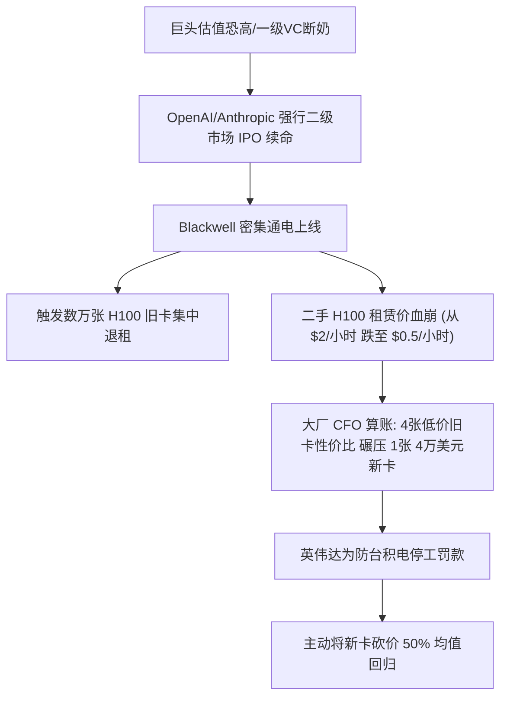
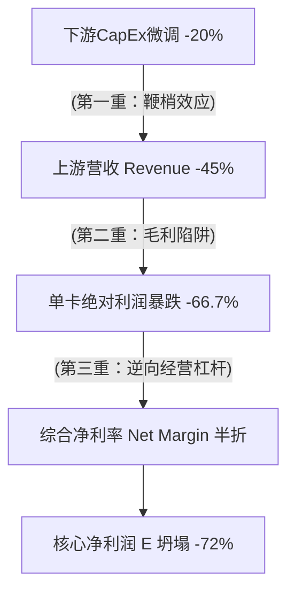

## 引言：分母型泡沫的“低估值陷阱”

在人类现代商业史上，75%的综合毛利率是一道泾渭分明的经济学分水岭。这道分水岭的上方，通常只躺着三种极为特殊的轻资产或高溢价行业：生产成本几乎为零的纯软件（SaaS）、靠配方和品牌垄断的高端白酒（如茅台），以及收割情绪溢价的顶级奢侈品。

而硬核工业品、通信设备、芯片硬件，向来在20%到50%的重引力泥潭里贴地肉搏。即便作为全球消费电子统治者的苹果公司（Apple），其硬件毛利率也仅长期卡在46%左右；手握全球最尖端制造光环的台积电（TSMC），其毛利率也死守在53%的防线。

然而，作为一家卖芯片、组装服务器机柜、跨国跑重型物流的重工业硬件厂商，英伟达（NVIDIA）却将自己的综合毛利率活生生钉在了75%以上（根据英伟达近几个财季的Non-GAAP财务报告）。

这种反常的“经济学奇迹”能够发生，唯一的解释是：全球科技巨头正在为免于被时代抛弃的绝望交税。这是一种由“恐慌性溢价（Panic Premium）”催生的无重力狂欢。

但任何工业品都无法逃离均值回归的万有引力。这场历史上最昂贵的AI算力大狂欢，由于其底层的畸形，正将自己推向一场多米诺骨牌式的重力大清算。

---

## 一、 历史的镜像：2000年思科（Cisco）的“首席卖铲人”宿命

太阳底下没有新鲜事。要看清英伟达今天所处的繁荣与危机，只需将时钟拨回26年前的互联网络泡沫（Dot-com Bubble）。当时的“首席卖铲人”不是英伟达，而是垄断了全球骨干网络80%以上路由器和交换机的通信巨头——思科。

### 1. 虚假的永动机与恐慌订单（Double Booking）

1999年前后，华尔街疯狂炒作互联网叙事，坚定地相信“全球网络流量每三个月就会翻倍”。无数刚拿到风投的Dot-com初创网站、激进扩张的电信运营商（如世通公司 WorldCom），为了防止硬件设备断货、为了比对手早一天开通带宽，开始向思科抛出天量订单。

在这种恐慌情绪下，供应链最致命的恶魔出现了——**恐慌性重复下单（Double Booking）**。一家运营商实际只需要100台路由器，但因为害怕拿不到货，它会同时向思科和渠道商下300台的订单。思科的销售部门看着塞满的Excel表格和排到后年的生产线，狂喜地向华尔街宣布：“我们的产品无限稀缺，订单根本接不完。”

思科凭借这一手“硬件搭售网络操作系统（IOS）”的垄断生态，将一个重工业硬件公司的综合毛利率强行推高到了65% — 67%。2000年3月27日，思科市值冲破5550亿美元超越微软，动态市盈率（P/E）飙升到150倍以上。

### 2. 预期的微调与22亿美金的“废铁”

到了2001年初，风向在一夜之间变了。美联储连续加息导致热钱断流，大批互联网初创公司开始倒闭，运营商猛然发现市场需求根本没有翻倍，他们手里积压的带宽这辈子也卖不出去。

由于下游需求稍微下调了15%，传导到供应链最上游的思科，就变成了“订单瞬间归零”。

这还没完，那些破产倒闭、或者为了活命的运营商，开始把库房里还没拆封的全新思科路由器，以两折、一折的流血价甩向二手市场。一手市场需求萎缩，二手市场疯狂踩踏，思科耗资百亿扩建的芯片和路由器产线却根本停不下来（停产折旧费更恐怖）。

2001年4月，思科CEO钱伯斯被迫在财报中宣布：直接注销、减记价值22亿美元的过剩库存。 那些曾被华尔街奉为“人类技术圣物”的路由器，因为爆仓、没人要，在一夜之间沦为连废铁都不如的坏账。

思科股价在此后两年内狂泻88%，从80美元跌到8.6美元。最冷酷的启示在于：思科不是骗子公司，其后的二十年里，思科的营收增长了数倍，至今仍是网络设备老大，但在泡沫破裂后的26年里，其股价再也没有摸到过2000年的大顶。

```
思科（2000年）狂欢终局路径：

[互联网流量翻倍叙事]
└──> [恐慌重复下单]
└──> [毛利冲高67% / 估值150x P/E]
└──> [宏观抽水/需求放缓]
└──> [订单归零 + 二手设备流血踩踏]
└──> [减记22亿美元库存 / 股价暴跌88%]
```

---

## 二、 数据对撞：英伟达与残酷的工业物理学

回看思科，再看今天的英伟达，你会发现两者的财务曲线和商业模式重合得令人发指。但英伟达面对的，是一个抗风险能力远比思科更脆弱的、极度畸形的买家生态。

### 1. 制造硬成本 vs 船票溢价

我们以英伟达的前旗舰神卡 H100 为例，来看看老黄（黄仁勋）在这场重工业制造中含泪赚了多少。根据第三方拆解机构（如 TechInsights 及 Raymond James 财务分析）的BOM（物料清单）成本估算：

| 组件名称 | 详细规格 | 估计成本 (USD) |
| --- | --- | --- |
| 先进晶圆制造 | 台积电 4nm 顶级晶圆代工（单片分割摊销） | ~$155 |
| 先进封装 | 台积电 CoWoS 封装服务 | ~$725 |
| 高带宽显存 | 6颗 SK海力士/三星 HBM3 显存芯片 | ~$1,150 |
| 外围元器件 | PCB基板、高精度电容、散热片、连接器 | ~$350 |
| **基础制造硬成本** | **物理BOM总计** | **~$2,380 — $3,000** |

然而，在过去两年那场丧心病狂的抢卡大潮中，这样一张硬成本不到3000美元的工业硬件，其官方建议零售价高达3.5万至4万美元。

它的毛利率在硬件层面超过了90%！老黄采用的商业阳谋极其冷酷：大模型推理和训练本质上是一场“显存带宽战争（Memory-Bound）”，大模型需要吞噬海量的HBM高速显存。英伟达故意将紧缺的 HBM 显存与最昂贵的训练算力核心强行捆绑搭售。买家哪怕只是跑纯推理，也不得不为了那口显存，顺便买下整张卡上溢价极高的训练算力。

### 2. 超级买家俱乐部：无法承受的集中度风险

当年思科的订单虽然崩了，但它面对的是全球成百上千家分布式客户——从跨国电信巨头、地方运营商到数不清的 Dot-com 创业网站。在这条长尾生态里，即使倒下一批，只要总网流量还在跑，思科依然能找到接盘的买家。

而今天，英伟达高达 75% 的毛利率和千亿美金营收的脊梁骨，绑在了一个极其狭窄、甚至可以用两只手数得过来的超级俱乐部身上。

我们无需去听华尔街分析师那些绕来绕去的模糊报告。穿透英伟达向美国证券交易委员会（SEC）递交的最新官方财报（10-Q/10-K），按照合规要求匿名披露的、营收贡献超过 10% 的超级大客户，其底层真实的采购图谱早已暴露无遗：

| 财报匿名代号 | 供应链穿透的真实身份 | 贡献英伟达的营收份额 | 采购核心驱动力 |
| --- | --- | --- | --- |
| 客户 A | 微软 (Microsoft / Azure) | ~22% | 自研算力基建 + 独家供养 OpenAI 消耗 |
| 客户 B | Meta (扎克伯格) | ~15% | Llama 矩阵训练 + 推荐算法与广告精准投放 |
| 客户 C | 亚马逊 (Amazon / AWS) | ~13% | 维持其全球第一大公有云的算力资源池储备 |
| 客户 D | 谷歌 (Alphabet / GCP) | ~11% | 作为自研 TPU 之外的 CUDA 生态防御性采购 |
| **合计** | **前四大巨头总计** | **💥 ~61%** | **买断了英伟达超过六成的 AI 芯片产能** |

💥 **一个冷酷的财务事实：仅仅上述 4 家硅谷巨头，就直接买断了英伟达超过 61% 的 AI 芯片产能。**

这根本不是一个健康的、具备抗风险韧性的散户分布式消费市场。这是一个高度集权、同气连枝的“巨头修仙俱乐部”。

英伟达的生杀大权，完全掌握在微软、Meta 这几位 CFO 的 Excel 记账本里。在这场博弈中，英伟达的抗风险能力甚至比当年的思科还要脆弱。

一旦大模型商业化在应用端出现卡壳，或者华尔街对 AI 投资回报率（ROI）开始强势审计，这四家公司里哪怕只有任意两家（例如微软和 Meta）决定拉长现有 H100 的折旧周期，将明年的资本开支（CapEx）微调 20%——通过供应链的“鞭梢效应”，传导到英伟达身上就是订单的断崖式停滞。届时，叠加前面所说的“毛利率陷阱”，英伟达由四个人撑起来的红色帝国，会在瞬间迎来多米诺骨牌式的惊天踩踏。

---

## 三、 隐藏的延时引信：数据中心滞后与隐性堰塞湖

在此之前，华尔街为了维持AI叙事的癫狂，经常拿英伟达财报中“不可取消的在手订单”来当防弹衣。然而，一个正在物理世界里发生的宏观供应链灾难，正在成为引爆更大海啸的延时引信——物理基建的“时差错配”。

半导体和算力芯片的生产周期是按“月”算的。台积电只要CoWoS封装线扩产完毕，芯片就能像流水一样从产线上吐出来。 但是，现在容纳数万张超算集群的超级数据中心（AI Data Center），其建设和投入使用的周期是按“年”算的。

这个物理时差正在制造一个巨大的、隐秘的“芯片堰塞湖”：

### 1. 幽灵库存的放血效应

现在全球最大的算力瓶颈已经不是芯片本身，而是电力拉线、特高压变压器审批以及液体冷却基建。那些为了做高估值、在过去两年向银行举债疯狂抢卡的算力云独角兽（如 CoreWeave、Lambda Labs、甚至马斯克旗下的 xAI/SpaceX 阵营），为了抢产能，卡一出厂就必须付全款。

由于变压器短缺或电网延迟交付，数以万计的 H100/H200 芯片买回来后，根本无法“通电变现”。它们只能躺在冷冰冰的物流仓库盒子里吃灰。

芯片资产贬值的速度比买新车还快。在盒子里不开封，其残值也会随着英伟达新架构（Blackwell）的密集交付而每天缩水。这种“高额利息天天滚、资产天天贬值、却无法通电换成现金流”的恐怖放血，正在把二房东们的财务链条拉到断裂的边缘。

### 2. “期房爆雷”与大暴洪宣泄

这就像房地产泡沫期：开发商疯狂买了一大堆高档家具和家电，结果整栋楼因为配套电网没搞定无法交房。

一旦到了某个临界点（预计在未来的6到12个月内），这批由于基建滞后囤积的“幽灵库存”会迎来双重反噬：

* 要么，二房东们撑不住债务利息，被迫把这些全新未拆封、从未通电的旧卡订单，打包打折扔回二手市场变现换命。
* 要么，电网和变压器的物理瓶颈在明后年突然被阶段性攻克，前期积压在库房里的存量卡，与台积电和英伟达全线全速开工生产的新卡（Blackwell 阵营），在极短时间内集中、爆发式地涌入市场。

最大的物理供应洪峰，极大概率会撞上由于大模型商业化不及预期而全面冷静下来的需求。这就是你所能见到的，比当年思科库存更惨烈的供应链海啸。

---

## 四、 多米诺骨牌的清算推演：英伟达的 Trigger（诱因）


当这个充满了恐慌性重复下单、高度集中的买家俱乐部、以及隐性芯片堰塞湖的系统，撞上物理现实，多米诺骨牌的倒塌路线清晰可见：

### 骨牌一：一级市场血干，公开股市成为“终极血包”

大模型现在是一个一天不喂几千万美金电费和算力费就会饿死的巨婴。在过去三年里，OpenAI、Anthropic 靠着巨头的战略投资续命。但到了今天，战略巨头（如微软）自己都面临华尔街对利润率的严苛压榨，不可能无限期给钱，甚至已经把投资换成了“服务器折旧资产划转”。

能随手掏出几百亿美金的一级市场风投（VC）基本拿不出更多的现钱。所以，大模型巨头们只剩下唯一的一条活路：不惜一切代价推进 IPO，冲向二级公开股市。 只有通过维持“AGI马上改变世界”的宏大叙事，把泡泡维持到上市那天，才能让全球散户、共同基金、养老保险基金成为接盘的“终极血包”。

### 骨牌二：Blackwell 密集通电与旧卡的“合同集中到期潮”

物理交付的节点卡得非常精准。随着英伟达新一代 Blackwell（B200/B300）在微软、Meta、谷歌的数据中心里成批、密集地通电上线，那些各大厂在2023-2024年恐慌性囤积、或者签了2-3年长约租用的旧卡（H100/H200）集群，将在明后年迎来史诗级的“合同集中到期与退租潮”。

当这些被淘汰的卡被二房东们成批甩回市场，算力云转租市场的价格战会瞬间打响。

### 骨牌三：两代硬件的“性价比肉搏”与老黄割肉

当算力二房东（如 xAI、CoreWeave）为了活命，把手里的 H100 转租价格直接腰斩再腰斩（比如每卡每小时从原先的 $2 美元流血踩踏到 $0.5 美元，整卡市场残值从 3.5 万美元跌到 5000 美元附近）。

各大厂极其精明的 CFO 们眼睛立刻就亮了。他们会拍着桌子告诉技术部门：

> “慢着。新卡 B200 确实好，但现在市场上二手的、转租的 H100 便宜得跟大白菜一样。如果我用 5000 美元的代价去清仓扫货、用四张旧卡连成一个集群，换算下来每美元买到的 Token 吞吐量，竟然比直接买一张 4 万美元的 B200 还要划算 50% 以上！”

一旦这个性价比平衡点被打破，B200 的“不可替代神话”就会被上一代产品的尸体无情反噬。英伟达为了不让台积电刚切给它的先进产能空转、为了稳住基本盘，唯一的选择就是利用自己 75% 的高毛利放血槽，主动开启第一轮踩踏式官降，强行把 4 万美元的旗舰降到 2 万美元上下。

---

## 五、 生存本能的分化——Google 的冷血账本与 OpenAI 的被迫狂飙

在算力大祛魅的周期前夜，科技巨头们的生态阵营开始出现了一道极其诡异的裂痕。面对高昂的芯片折旧与冰冷的 ROI（投资回报率）压力，古典老钱与 AI 新贵做出了截然相反的战略抉择。

这种生存本能的分化，恰恰是科技泡沫走向总清算前最典型的产业转折期奇观。

### 1. Google 的工业化退烧：从 90% 降本走向“全面去英伟达化”

回看这场疯狂算力军备竞赛的节点，古典互联网巨头体内流淌的“冷血记账本”血液，其实早就开始发挥作用了。

📊 **一个不可忽视的历史转折点：** 在 **2024 年 7 月 23 日** 的 Alphabet 第二季度财报电话会议上，谷歌 CEO 桑达尔·皮柴（Sundar Pichai）抛出了一枚震撼华尔街的深水炸弹：在 AI Overviews 推出短短 14 个月内，谷歌通过硬件、软件和模型的系统性重构，已将 AI 搜索的单次查询成本疯狂砍掉了 90% 以上。

这场惊天降本的背后，不是什么神迹，而是谷歌自下而上、精心布局的一场系统性“拧水”脱水运动：

* **流量的“降维分流”（Gemini 1.5 Flash）：** 谷歌通过极致轻量化的 Flash 模型，全面接管了搜索端超过 80% 的日常长尾请求。高并发、低延迟的低参数模型，让用户在毫无察觉中避开了高能耗的顶级大模型。
* **硬件的“去英伟达税”（TPU Trillium）：** 谷歌正在以最激进的速度在自家数据中心切断英伟达的供氧。全面接管推理端的，是每瓦特性能暴涨 67% 的自研第六代 AI 芯片 Trillium。在谷歌财务部眼里，多买一张英伟达 GPU，就是在替老黄分摊那 75% 的畸形毛利。

这套“小模型 + 自研芯片”的防守组合拳，让谷歌筑起了坚固的防波堤。它要做的，就是冷血地把 AI 变成低成本的“数字水泥”——只要重力场降临，成本足够低的人才能活下来。

### 2. OpenAI 与 Anthropic 的“囚徒游戏”：被万亿估值绑架的狂飙

相比之下，处于算力漩涡中心的 OpenAI 和 Anthropic 两家新贵，在明面上对“全面降本”四个字依然讳莫如深。他们必须在公开场合不知疲倦地向市场布道：Scaling Laws（尺度定律）没有撞墙，我们需要十倍、百倍的算力。

他们不是不会算账，而是他们根本没有退路。他们是一群被估值绑架的囚徒。

* **不能停下的绞肉机：** 如今，OpenAI 与 Anthropic 两家头部的估值在资本的疯狂推高下，已经合力绑架了近万亿规模的恐怖资本面。支撑这个人类历史上最高昂、最畸形估值矩阵的唯一底层逻辑，是一个绝对不能破灭的宗教式图腾——“我们正在通往 AGI（通用人工智能）的终极路上，我们是通往未来的唯一飞船。”
* **神话破灭的代价：** 在背后的顶级风投和主权基金眼里，两家新贵必须每隔几个月就掏出一个让人目瞪口呆的“神迹”（如下一代超级模型或全新的推理红利）。如果他们的 CFO 明天突然在董事会上提议：“兄弟们，我们学谷歌搞个微调降本，把运营成本砍 80% 吧。”
* **重力场的惩罚：** 华尔街会瞬间醒悟过来：原来你技术撞墙了，你不是上帝，你只是个高能耗的软件外壳公司。 一旦共识瓦解，这近万亿的估值泡沫会在极短时间内面临毁灭性的大崩盘，一级市场的巨额融资将连夜断奶。

因此，他们必须在明面上继续维持假装狂热的“堆料狂飙”，以此来稳住庞氏叙事，直到成功推进 IPO——将公开股市变成他们最后的、最庞大的“终极血包”。

### 3. 终极摊牌：当“强撑者”撞上“公开账本”

这种务实与狂热的割裂，正在将英伟达推向最后的清算临界点。

在过去，英伟达可以指着这两家新贵资产负债表上源源不断的战投资金，去向台积电锁定下一代乃至下两代的高端产能。但戏剧性的转折点，恰恰会发生在这些“强撑者”不得不向二级市场提交 IPO 招股书的那一天。

公开股市的散户和共同基金是极其冷血的，他们不听 AGI 的宗教布道，他们只看每股收益（EPS）、自由现金流和真实的资产折旧。

当这两家背负近万亿估值的超级独角兽为了成功上市，被迫把那份“一年烧掉数十亿美金电费、硬件两三年就得彻底折旧报废、商业化变现遥遥无期”的真实烂账平铺在阳光下时，二级市场的引力场会瞬间无情降临。

为了挽救上市后的股价，这些曾经全市场最激进、最不计成本的买家，将不得不脱下“狂飙”的戏服，连夜成立成本削减部门。他们会像谷歌一样开始疯狂拧水，疯狂洗稿 DeepSeek 的低成本架构，并大面积砍掉向英伟达追加的训练卡订单。

当这最后一批顶着万亿光环的疯狂赌徒，也最终被迫“全面 DeepSeek 化”并拿起谷歌那本冷血的记账本时，英伟达高挂在 75% 历史神坛上的最后一块订单遮羞布，也将被这股来自古典商业世界的重力，彻底撕成碎片。

---

## 结语：废墟之上的新秩序

你感觉 GPU 被炒得如此莫名其妙，是因为市场短暂地将它从“工业品”的神坛里剥离，套上了宗教般的光环。但历史从未改变它的重力法则。

英伟达绝对是一个伟大的、有真实高利润的工业巨头，正如 2000 年的思科一样，它卖的是这个时代最硬核的电力和骨干网。但高溢价的狂欢之后，宿命只会是均值回归。

当年思科泡沫破裂后，那些由于恐慌性重复下单、举债铺设的、便宜到白送的“过剩光缆基建”，在废墟中默默发芽，最终才真正奶活了此后二十年繁荣的 Web 2.0 时代，诞生了移动互联网、智能手机和流媒体的应用大爆发。

AI 算力大祛魅的终局也是一样。

当这场闻所未闻的 75% 工业品毛利狂欢被无情的财务审计格式化之后，英伟达神话的破灭不会让 AI 消失，而是会把 AI 算力彻底变成像自来水和电力一样低毛利、重资产、谁都用得起的社会公共基建。那些纯靠融资续命、一级市场吹泡泡的软件壳公司将成批宣告社会化死亡；而那些拥有独立现金流、早早搞好了自研低成本备胎（如谷歌无限现金流支撑的自研 TPU 矩阵）的古典巨头，将在一片废墟中，冷血而理性地接管这个属于大宗商品化 AI 的新世界。

---

## 附注：英伟达（NVIDIA）估值大清算的数学沙盘

### 引言：分母型泡沫的“低估值陷阱”

在华尔街的多头叙事中，“当前英伟达的动态市盈率（P/E）仅在 30x 至 40x 之间，远低于 2000 年互联网泡沫时的思科（当时超 100x），因此非常安全”是最核心的锚定信仰。然而，这个逻辑忽略了金融工程中最基础的常识：硬件周期股的最低市盈率，往往对应着其净利润的周期绝顶。

从估值模型的数学结构来看，资产泡沫可以分为两类：

* **分子型泡沫（Numerator Bubble）：** 净利润 $E$（分母）很小甚至为负，纯靠股价 $P$（分子）的疯狂情绪推高市盈率（如 2000 年的 Dot-Com 泡沫）。这种泡沫极易识别。
* **分母型泡沫（Denominator Bubble）：** 股价 $P$ 暴涨的同时，由于下游资本开支暴增，短期内的核心净利润 $E$（分母）出现了脉冲式的、不可持续的超常规暴增，导致计算出来的 P/E 看起来异常“便宜”。

当前的英伟达正处于完美的分母型泡沫之中。当全市场都在为“35 倍市盈率”的群体免疫而狂欢时，真正的风险藏在繁荣之下的逆向传导动力学中。

---

### 一、 传导动力学：大清算时代的数字模型压力测试

为了量化大祛魅时代的系统性反噬，本模型旨在模拟当“四大公有云（Hyperscalers）”及万亿级大模型独角兽由于折旧压力，将次年算力资本开支（CapEx）防御性削减 20% 时，如何通过三重财务放大效应，最终引发利润端的系统性坍塌。


#### 1. 第一重放大：供应链的“鞭梢效应”（营收端）

在硬件供应链中，下游需求的微调会沿着供应链向上游逐级放大（Bullwhip Effect）。

当下游云厂商减少 20% 的采购预期时，由于渠道中存在的大量隐性芯片库存（如二手中介、租赁小云厂商、未交付订单），市场会迅速从“恐慌性囤货”转入“踩踏式去库存”。上游的真实订单会被成倍砍单。

* **模型压力测试结果：** 英伟达的总营收（Revenue, R）将承受超出下游数倍的暴击，预计断崖式下滑 45% 左右。

#### 2. 第二重放大：毛利率陷阱的绝对利润“膝盖斩”（毛利端）

英伟达的高毛利（超 70%）建立在垄断溢价和供需极度扭曲的基础上。算力芯片的定价模型遵循刚性硬成本与毛利率的关系：

$$Price = \frac{C}{1 - Margin}$$

假设单张高性能卡（如 Blackwell 迭代系列）的台积电晶圆、CoWoS 封装及 HBM3e 内存等制造刚性硬成本固定为 $C = 25$（单位：任意比例标号）。我们可以测算当算力过剩导致售价大幅回落时，绝对利润的缩水程度：

| 阶段 | 毛利率（Margin） | 算力单价（Price） | 单卡绝对利润 | 绝对利润缩水幅度 |
| --- | --- | --- | --- | --- |
| **狂欢期（当下）** | 75% | 100 | 75 | 基准（100%） |
| **清算期（假设）** | 50% | 50 （售价腰斩） | 25 | 💥 **绝对利润暴跌 66.7%** |

* **核心结论：** 硬件厂商的毛利率数字仅仅下滑 25 个百分点，老黄口袋里的每张卡的绝对利润就会被直接生生砍掉三分之二。

#### 3. 第三重放大：逆向经营杠杆的反噬（净利端）

英伟达是一家轻资产研发企业，这意味着它拥有极其庞大且刚性的期间费用（研发费用 R&D、高级 AI 工程师薪酬、股票期权激励）。这些属于固定成本，在营收下滑时根本无法等比例缩减。

当营收规模从绝顶滑落，这种经营杠杆将转为逆向吞噬。

* **模型压力测试结果：** 综合净利率（Net Margin, $NM$）将从巅峰期的 55% 左右，直接腰斩至 28%。

#### 4. 终极财务终局：净利润（E）的系统性坍塌

我们将上述三重放大效应整合至统一的净利润测算公式中：

$$E = R \times NM$$

* **巅峰狂欢期：** $E_{peak} = 100\% \text{ (基准营收)} \times 55\% \text{ (净利率)} = 55\% \text{ 亿净利润}$
* **深度清算期：** $E_{crash} = 55\% \text{ (营收砍半腰斩)} \times 28\% \text{ (净利率腰斩)} = 15.4\% \text{ 亿净利润}$
* **压力测试最终结论：** 在下游资本开支仅防御性收缩 20% 的常态周期波动下，英伟达的核心净利润（E）将遭遇 **~72% 的系统性坍塌**。

---

### 二、 估值重塑：P/E 模型的重力回归与股价终局

当利润神话破灭，华尔街的定价逻辑会发生 180 度的逆转。他们会摘掉英伟达身上“永续增长科技股”的圣光，将其重新归类为“强周期性重工业硬件厂商”。

剔除掉所有绝对股价的数字噪音，我们纯粹从利润、估值倍数（财务杠杆）与最终股价的百分比联动来推演这场无情的戴维斯双杀：

1. **分母（利润 E）坍塌：** 经过前述压力测试，核心净利润缩水至巅峰期的 28%（即净利润暴跌 72%）。
2. **倍数（估值 P/E）修正：** 市场估值倍数从溢价状态的 35x 强行修正至周期股谷底的 15x，估值杠杆直接缩水了 57%（仅剩巅峰期的 43%）。

利用戴维斯双杀公式进行纯比例对撞：

$$\frac{P_{清算}}{P_{巅峰}} = \frac{E_{清算}}{E_{巅峰}} \times \frac{(P/E)_{清算}}{(P/E)_{巅峰}}$$

代入两者的衰减比例：

$$\frac{P_{清算}}{P_{巅峰}} = 28\% \times 43\% \approx 12\%$$

* **最终股价变动结果：** 清算后的股价仅剩巅峰期的 12%。这意味着，英伟达在右侧大周期出清时，将不可避免地迎来一次 **88% 左右的深度回撤**。

绝大多数散户在抄底时，往往只看到“35x 的 P/E 看起来已经跌无可跌”，却算不明白这个简单的百分比乘法：当分母（利润）蒸发 72% 的同时，乘数（估值）还要被同步打折。这种双重杠杆的逆向共振，才是拧干分母型泡沫时最冷酷的重力铅块。

---

### 三、 历史后验（Backtesting）：被验证过两次的重力法则

上述数学沙盘并非凭空捏造。在英伟达的历史上，老黄曾两度将“分母型泡沫”的剧本演到了极致，每次回撤的财务路径与本模型的推演如出一辙。

#### 1. 2018年“加密货币矿难清算”

* **背景：** 虚拟货币崩盘导致矿工停止采购，同时渠道中积压了海量二手显卡。
* **数据验证：** 英伟达在 2018 年底单季营收仅同比下滑了 24%，但由于固定研发成本和库存减值（逆向经营杠杆），季度净利润当场暴跌 54%。
* **最终股价表现：** 华尔街迅速将估值倍数砍半，股价在短短 2 个月内崩盘 50%。

#### 2. 2022年“PC消费雪崩与以太坊转POS双重海啸”

* **背景：** 疫情居家红利消退，同时以太坊共识机制改变（POW 转 POS），显卡彻底失去挖矿刚需。
* **数据验证：** 供需逆转引发惨烈价格战，英伟达综合毛利率从 65% 溃败至 43.5%，单季净利润从 30 亿美元狂泻至 6.8 亿美元，跌幅高达 77%。
* **最终股价表现：** 股价在 10 个月内流血 64%，市值蒸发数千亿，完成了标准的周期重力回归。

---

### 结语：不可逃避的周期万有引力

2026 年启动的这一次“算力大祛魅”，其潜在的清算烈度将远超 2018 年和 2022 年。

前两次泡沫崩溃时，英伟达的核心商业客户结构依然是分散的（无数的散户矿工、数亿 PC 游戏玩家）。而这一次，英伟达的数据中心营收集中度已经达到了窒息的程度——仅前四大客户（微软、谷歌、Meta、亚马逊）就贡献了其超过 60% 的采购额。更严峻的是，由于地缘政治的长期阻断，英伟达已经近乎永久地失去了中国市场这个历史上最好的“周期泄洪蓄水池”。

当这四个核心节点中任何一个因为 CapEx 投资回报率（ROI）倒挂而选择率先转身，整个数学沙盘的齿轮就会开始逆向转动。重力或许会迟到，但从未缺席。

---

## 附注2：7000亿空中楼阁的坍塌与英伟达的物理极限跌幅

如果说附注 1 中的“20% 砍单模型”是一份流于华尔街体面的温和报告，那么附注 2 则负责撕毁所有精修的报表，直面 2026 年最冰冷的物理现实。

全市场多头至今不敢承认的一个底层逻辑是：华尔街所有试图论证英伟达安全的财务模型，其出发点都是建立在一个“高度虚构的永动机”之上的——即假设全球科技巨头每年 7000 亿美元的资本开支（CapEx）是可持续的。

我们不妨抛弃偏见，为多头构筑一个人类商业史上最激进、最完美的 AI 变现沙盘，来看看这个故事的极限边界在哪里。

---

### 一、 极限推演：“AI 税”能否填平 7000 亿的资本巨坑？

为了给这个算力故事注入最高的可信度，我们假设 AI 应用在 B 端（企业级市场）展现出了神迹般的吞噬能力。它不再只是一个写邮件的辅助工具，而是直接开始撕咬传统软件巨头（如 SAP、Oracle、Salesforce）的蛋糕：

* **从“IT 维护税”到“AI 升级税”：** 过去几十年，全球财富 500 强企业向传统软件商支付的高昂许可证和系统维护费用（俗称“IT 维护税”），假设现在被 AI 强行转化为向其订购生产力的“AI 税”。
* **财富 500 强的预算大迁徙：** 我们做出全市场最疯狂的牛市假设——将全球财富 500 强企业整整 50% 的软件和 IT 总支出，全部强行划拨给 AI。

根据商业数据测算，全球财富 500 强企业每年的软件开支总和在 5000 亿美元上下。按照我们上述“直接抢走一半预算”的极限抢劫式假设：

AI 产业将从财富 500 强手里生生抠出 **2500 亿美元** 的新增软件收入。再加上全球成千上万中小企业（SMB）的订阅费、C 端消费者的自发订阅，以及 Meta 等巨头依靠 AI 优化广告带来的额外增量，我们可以把全人类在 AI 应用端贡献的真实总营收，拔高到前所未有的 **4000 亿美元**。

但这枚硬币的背面，是冷血的基础设施折旧公式。

按照科技行业重资产投资的古典闭环，1 美元的硬件资本开支（加上庞大的电费、算力网络运维、以及高昂的人力成本），下游至少需要产生 2 美元以上的软件营收，生态才能勉强打平。

>💥 **绝望的数学鸿沟：**
>
> 如果 2026 年全球大厂在硬件上的资本开支锁死在 7000 亿美元，这意味着下游应用层每年必须回吐出至少 **1.4 万亿美元** 的收入。
> 即使我们开挂般地让 AI 吞噬了财富 500 强一半的软件预算、收干了全人类的“AI 维护税”，整个产业掏空口袋也只能凑出 4000 亿美元。中间那个高达 **1 万亿美元** 的“AI 营收鸿沟（AI Revenue Gap）”，依然是一个无法直视的数学黑洞。

多头最清醒的时刻已经到来：即便赢下了所有的想象力，巨头们砸钱买卡的物理速度，也早就把商业化变现的极限远远抛在了身后。

---

### 二、 纯粹的内部反噬：当 7000 亿基建直接“腰斩”

当大厂财务部最终看着这本无法对齐的账本、被迫将 7000 亿的算力预算直接腰斩至 3500 亿（向传统互联网基建均值回归）时，英伟达的崩盘，根本不需要任何外部竞争，纯粹的内部供需周期就足以引发毁灭性的坍塌。

前一阶段囤积在整个供应链底层的隐性算力堰塞湖（二手中介、倒闭 AI 创业公司的清仓卡、云厂商内部淘汰的旧卡）将以垃圾价瞬间倾泻，引发恐怖的踩踏：

* **营收端绝对真空：** 下游渠道从“恐慌性囤货”转入“踩踏式去库存”，新增订单瞬间断流。英伟达总营收（Revenue）将面临 **-70% 级别**的断崖式休克。
* **毛利率神话瓦解：** 定价特权彻底丧失，为了在订单真空期维持晶圆产能，英伟达必须自残式降价与自己的旧卡贴身肉搏。毛利率（Margin）将被迫一路溃败至工业品大宗底线的 **35%—40%**，单卡绝对利润蒸发 85% 以上。
* **利润端极限吞噬：** 庞大且刚性的研发费用与高级工程师薪酬无法等比例缩减，逆向经营杠杆将化身恐怖的绞肉机。综合净利率（Net Margin）极限滑落至 **10% 左右**。

---

### 三、 终极定价模型：-96% 的深渊凝视

剔除所有绝对股价的数字噪音，当我们将这组由 7000 亿高空坠落、纯粹由供应链内部踩踏引发的物理极限数据，代入右侧大周期的终极估值回归模型时：

1. **分母端（利润 $E$）：** 综合净利率从 55% 暴跌至 10%，外加营收下滑 70%，核心净利润仅剩巅峰狂欢期的 5.4%（利润蒸发近 95%）。
2. **乘数端（P/E 倍数）：** 华尔街连夜将其从科技股除名，市盈率估值从 35x 直接被唾弃至强周期工业股谷底的 12x（估值杠杆缩水 65%）。

利用戴维斯双杀公式进行纯比例对撞：

$$\frac{P_{极限}}{P_{巅峰}} = 5.4\% \text{ (利润残留)} \times 35\% \text{ (估值倍数打折)} \approx 1.89\% - 3.8\%$$

📊 **极限清算终局：**

在 2026 年这场由“7000亿虚构永动机”破灭引发的真正宏观大出清中，英伟达的极限股价走向，不是回撤 50%，也不是附注1模型中温柔的 88%，而是从历史最高点迎来一次接近 **96% 至 98%** 的“毁灭性物理重置”。

---

### 结语：只有真 AGI 才能豁免的重力法则

这个数字听起来像是疯子的末日预言。但当年坐在同样垄断王座上、卖着互联网骨干网路由器的思科（Cisco），在光纤基建泡沫破裂后，面对大厂清仓二手的踩踏，股价在右侧出清中实打实地跌去了 90%，至今二十多年过去依然没有回到当年的历史高点。

在这场疯狂的数字豪赌中，唯一的变数，或许是真正的 AGI（通用人工智能）以神迹姿态在全球资本开支断裂前彻底降临。

只有真 AGI 实现，彻底颠覆现有的经济学规律，释放出近乎无限的、能够直接在人类社会变现的超级生产力，才可能在物理上强行撑住、甚至证明这 7000 亿美元的空中楼阁是合理的。