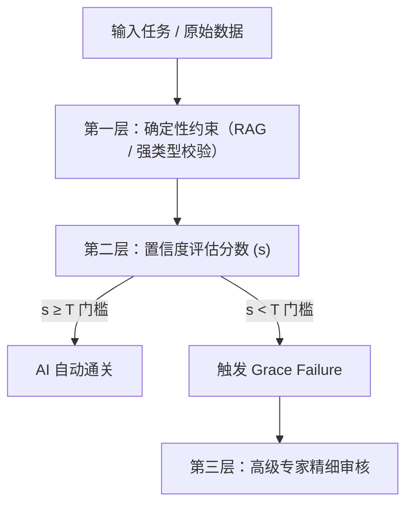
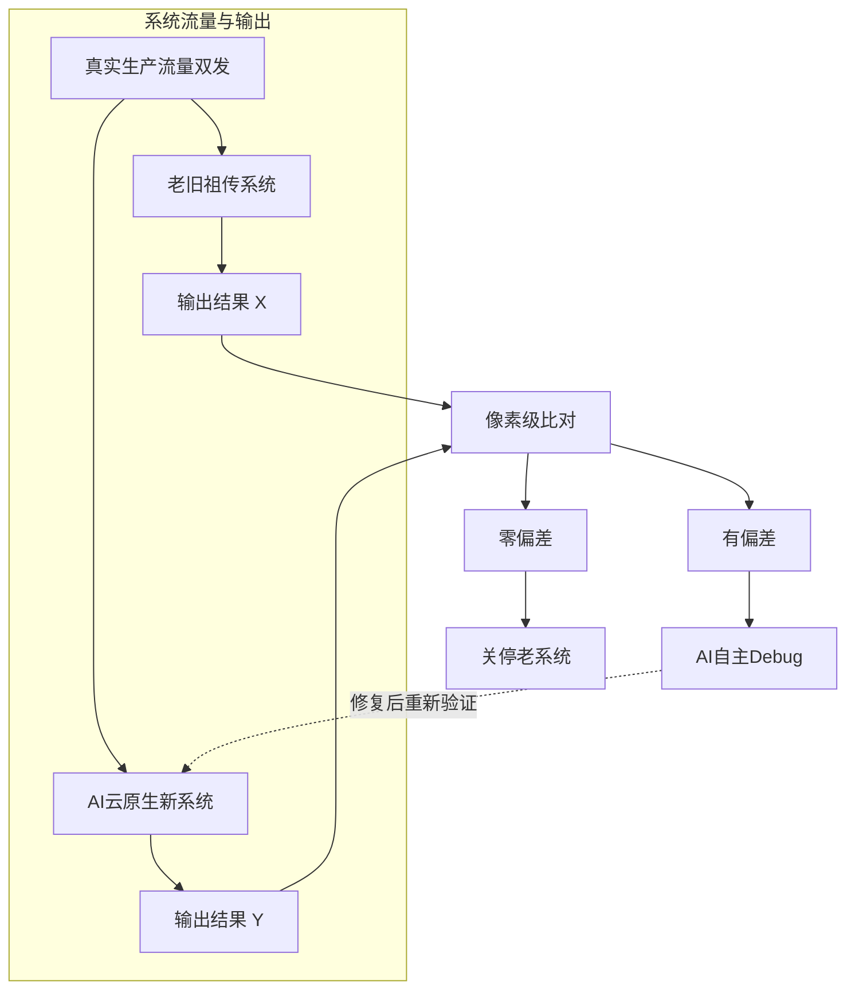

陈杰写于2026.6.2

当前的 AI 市场正处于“超级基建向应用变现切换”的牛市中后期。市面上充斥着两种截然对立的声音：一种认为它是重演 1999 年覆辙的世纪泡沫，另一种则坚信它是点石成金的通用技术革命。

穿透复杂的市场迷雾，从财务报表、工程系统和商业模式的底层逻辑来看，当前的 AI 浪潮呈现出一种极为罕见的双重奇观：**宏观上长着最危险的泡沫毒瘤，微观上却正在啃食最坚硬的产业硬核。**

---

## 宏观估值层：披着 SaaS 外衣的“资本内循环”

大模型独角兽动辄 **30x P/S（市销率）** 且伴随巨额亏损（如 OpenAI 2026 年预计亏损 140 亿美元），这在传统软件估值模型里是完全不合理的。市场正陷入三个致命的财务幻觉中：

### 1. “假 SaaS” 的毛利率陷阱

传统 SaaS 的复制成本几乎为零，毛利率普遍在 80% 以上。而大模型具有“算力吞噬型”特征，用户每调用一次 API、每生成一个 Token，都在实打实地消耗电费和 GPU 算力。大模型层目前的毛利率普遍在 **40% - 60%** 之间挣扎，这更像是高级外包或传统硬件租赁。用 SaaS 的高溢价倍数去套硬件租赁的底子，估值显然被严重透支。

### 2. 套娃游戏与自由现金流（FCF）干涸

目前科技大厂（Hyperscalers）表现出的云业务繁荣，很大程度上依赖于资本的内循环套娃（Round-Tripping）：

$$\text{巨头向独角兽注资} \longrightarrow \text{独角兽被迫将资金转手用于购买该巨头的云算力} \longrightarrow \text{巨头在财报里高调宣布驱动云业务大增}$$

然而，这种纸面富贵无法掩盖全行业每年近 **7000 亿美元** AI 资本开支（Capex）的无底洞。强如 Alphabet 也不得不启动高达 800 亿美元的股权融资，甚至连传统保守的伯克希尔·哈撒韦都通过私募介入其中。当 VC/PE 的血包被吸干后，科技资本唯一的出路就是通过修改指数规则，深度绑定被动资金（ETF）与养老金，让全人类的无意识储蓄成为高估值资产的最终接盘侠。

### 3. 卖铲人的“周期顶点”幻觉

英伟达目前看动态市盈率似乎“不贵”，但这恰恰是周期股见顶时最危险的特征——利润（E）处于历史高位。一旦下游大厂因现金流逼近预警线而削减 Capex，英伟达将面临恐怖的**戴维斯双杀**。

---

## 微观落地层：“审计师陷阱”与置信度路由模型

当大模型试图走出“纯文本/纯创意”的舒适区，切入金融、法律、编程等核心实体产业时，它迎面撞上了一堵高墙——**“审计师陷阱（Auditing Paradox）”**。

工业界在实际落地中发现了一个残酷的现象：**找错（Debugging）往往比重构（Writing）更消耗高级专家的认知带宽。** 大模型生成的法条或代码往往能做到 95% 极其完美，但由于其底层的概率本质，往往会隐藏 5% 伪装得极好、甚至言之凿凿的“胡扯”（幻觉）。如果高级合伙人或架构师必须拿着放大镜逐行去盲审 AI 的全量产出，这种高压的心智负担不仅不会提效，反而会降低整体的运营流转速度。

为了破解这个无解的死循环，2026 年的 AI 系统工程彻底抛弃了“让 AI 孤立替代人类”的幻想，转而采用运筹学中的期望成本最小化（Expected Cost Minimization）思维，构建了一套精密的三层过滤架构：**风险调节型人机协同系统（Risk-Adjusted HITL）**。


### 第一层：确定性约束——压缩错误的边界

系统首先要做的，是把大模型从“无边界创作的诗人”强行驯化为“有边界约束的机器”。

* **知识锚定（RAG）：** 系统拒绝让大模型凭空回忆知识，而是通过向量数据库和图谱检索，将海量的真实上市财报、最新法条、内部 API 规范作为“不可违背的上下文”强行喂给模型。
* **规则硬编码（Deterministic Guardrails）：** 在模型输出端，挂载 Pydantic 等强类型强 Schema 校验。凡是涉及到金额、比例、代码闭包的部分，必须通过确定性代码的硬性规则检查。
* **工程效果：** 这一步并不消除幻觉，但它能将错误率的分布从长尾无界（Unbounded）压缩到可预测的有界（Bounded）状态，为后续的数学模型提供统计基础。

### 第二层：置信度评分机制——AI 的“自我清醒度”度量

在输出交付之前，系统需要计算出一个核心指标：置信度分数 $s$ ($s \in [0, 1]$)。为了防止大模型用其惯有的“自信语气”进行欺骗，工程上采用了多维度交叉验证：

* **Token 概率（Logprobs）：** 提取模型生成核心关键词时的底层概率分布。如果连续出现概率低于 80% 的 Token，说明模型本身在“犹豫”。
* **多 Agent 一致性投票（Consistency Voting）：** 让 3 到 5 个不同的 Agent 在后台独立生成结果。如果结果高度收敛，则 $s$ 趋近于 1；如果出现分歧，则 $s$ 骤降。
* **对抗审计（Critic Agent）：** 引入一个专门扮演“杠精”的审计 AI，拼命寻找主模型的逻辑漏洞。根据审计 AI 抓到 Bug 的数量和严重程度，对初始置信度进行扣分。

### 第三层：价值触发模型——动态路由的数学引擎

有了置信度分数 $s$ 之后，系统如何决定是让 AI 直接通关，还是扔给人类专家？这就引入了最核心的**价值触发模型（Value Trigger Model）**。

系统引入了一个动态的路由门槛 $T$。其核心决策逻辑基于以下期望成本公式：

$$\text{自动通关触发条件： } s \cdot C_{\text{AI}} + (1 - s) \cdot C_{\text{Error}} < C_{\text{Human}}$$

在这套公式中，每一个变量都对应着具体的商业账本：

* $C_{\text{AI}}$：AI 的推理与校验算力成本（通常不足 $\$0.1$ 美元）。
* $C_{\text{Human}}$：高级专家介入进行重构和复核的时间成本（通常按时薪折算，极其高昂）。
* $C_{\text{Error}}$：灾难性错误惩罚（Catastrophic Error Penalty）。即如果 AI 错了且通过了审核，企业需要承担的法律诉讼、财务损失或系统崩溃的连带代价。
* $s$：在当前置信度 $s$ 下，AI 结果正确的条件概率。

### 门槛 T 的动态调节弹性

这个模型的精妙之处在于，门槛 $T$ 不是一个死板的数字，而是随着业务的“涉险资产价值（Value at Risk）”在实时漂移：

* **低风险场景（$C_{\text{Error}}$ 极小）：** 例如内部的周报摘要、常规技术文档生成。即便 AI 偶尔胡扯，代价也几乎为零。此时系统会自动将门槛 $T$ 调低至 0.4。AI 绝大多数时候都能自动通关，实现全面自动化。
* **高风险场景（$C_{\text{Error}} \to \infty$）：** 例如一份涉及 5000 万美元的投行跨境并购合同，或者核心计费系统的重构代码。任何一个微小的条款错漏或空指针异常，都意味着毁灭性的财务或法律灾难。此时，公式中的 $C_{\text{Error}}$ 趋近于无穷大，倒逼最佳门槛 $T$ 自动推高至 1.0。这意味着系统彻底关闭自动通关权限，AI 的角色瞬间切换为“初级助理”，只负责梳理逻辑、标注不确定性，强制触发 Grace Failure（优雅降级），将所有材料提交给高级人类专家进行细致终审。

### 商业账本的最终闭环：双峰分布下的红利

在实际运行的工业生态中，由于前两层（确定性约束和交叉验证）的清洗，任务的置信度 $s$ 通常会呈现出极端的**双峰分布（Bimodal Distribution）**——即绝大多数（约 75%）的常规标准任务，其置信度会高度集中在 0.9 以上；而少数（约 25%）涉及复杂歧义、边缘 case 的高难任务，置信度会暴跌至 0.3 以下。

这种分布为企业带来了非线性的巨大财务红利：

| 任务类型 | 占比 | 路由去向 | 人类工作状态 | 人力资源消耗变化 |
| --- | --- | --- | --- | --- |
| **标准高置信度任务** | 75% | AI 直接通关 | 完全不介入 | 从 75% 彻底归零 |
| **模糊/高危边缘任务** | 25% | 触发 Grace Failure 扔给人工 | 多项选择式精细复核（由于 AI 已经做好了结构化高亮与对比） | 效率翻倍（消耗折半至 12.5%） |

**最终，全行业的统计学盈利闭环达成：企业在没有承担任何额外灾难风险的前提下，直接砍掉了 85% 以上的重复性初级人力需求。** 高级专家不仅没有觉得“审核更累了”，反而因为系统自动过滤了 75% 的垃圾噪声，并把高难任务做好了精准的“连线题式”标注，真正转型为了纯粹的“终审决策者”。这就是金融、法律、编程等高薪行业愿意为大模型持续开出巨额支票的真正秘密。

---

## 终极金矿：老旧系统的“基因重组”式持续重构

在这三大行业中，最具长效商业价值、最能支撑长期营收流水的，正是被很多人视为“能跑就别动”的老旧代码系统迁移（Legacy Migration）。

全球金融、电信、航空机构的底层躺着数千亿行 30 年前的 COBOL 或 Java 4 祖传代码。这些系统重如泰山、容不下任何错误。传统的语法翻译式迁移是个胜率极低的赌博，但大模型配合现代工程方法，彻底改变了游戏规则：

### 1. 逆向工程与自动重写

百万级上下文大模型不再是死板地翻译语法，而是吞下数百万行老代码后，逆向提取出业务规则说明书。在人类架构师确认业务逻辑无误后，AI 再根据这份说明书，用最新的云原生架构（如 Go/Java 微服务）从零开始“重新开发”，并自动配齐 100% 的单元测试集。

### 2. 影子系统与零风险通关

为了攻克“错误容不下”的合规死穴，工程上采用了“影子部署与流量双发”的闭环机制：

* 新旧系统同时运行 3 到 6 个月，处理数亿笔真实历史流量。
* 一旦两边输出结果出现哪怕 1 块钱的差异，系统立刻报警，由 AI 自动抓取报错并自主打补丁（Patch）。
* 直到新系统实现零偏差，老系统才会被安全关停。



### 3. 从“一锤子买卖”到“系统演进税”

在一个企业级系统迁移完成后，很多人会产生一种惯性质疑：代码迁移终究是“一锤子买卖”，项目做完就结束了，这怎么可能支撑起大模型巨头长期、可持续的 SaaS 溢价和高估值？

要看懂这个商业闭环，必须先理解传统大型企业（如银行、保险、电信）在 IT 财务账本上面临的终极噩梦——**“维持现状税（Run-the-Bank Tax）”**。

#### 什么是传统企业的“维持现状税（RTB Tax）”？

在国际顶尖金融机构和财富 500 强企业中，全年的 IT 总预算在财务上会被严格划分为两块：

* **Change-the-Bank (CTB，变革预算)：** 用来开发新业务、做数字化转型、推进 AI 创新的“进攻型”资金。
* **Run-the-Bank (RTB，维持预算)：** 纯粹用来让现有的旧系统“别崩溃、活下去”的“防御型”资金。

这笔 RTB 预算，在工业界被极其形象地戏称为“维持现状税”。它就像企业不得不交的保护费，源源不断地填进三个无底洞：

1. **高龄技术专家的“溢价税”：** 核心系统是用 30 年前的 COBOL 或 Fortran 写的，懂这些语言的人才早已成批退休。为了修补一个底层漏洞，企业不得不以每小时上千美元的天价酬劳聘请高龄专家返聘。
2. **技术债的“利息税”：** 几十年间无数代程序员在系统里层层叠叠修补的“补丁代码（Spaghetti Code）”，导致系统牵一发而动全身。每增加一个微小的业务功能，就要动用数百人团队进行长达数月的回归测试，本质上是在为过去的“技术债”支付高昂利息。
3. **商业软件的“延保税”：** 许多老旧中间件和数据库早已被原厂停止支持，企业为了买到哪怕一份基础的安全补丁，必须向 IBM、Oracle 等巨头支付数额恐怖的“定制化延长服务费”。

在传统大型机构里，“维持现状税（RTB）”通常会残忍地吃掉整个企业 IT 预算的 **70% 甚至 80%**。这意味着一个拥有 10 亿美元 IT 预算的巨头，每年有 8 亿美元仅仅是用在“给旧机器擦机油”上，真正能用来搞业务创新的资金只有可怜的 2 亿。这种畸形的财务结构，是全球大企业 CFO 们最痛恨却又无能为力的肉体创伤。

#### 商业模式的终极质变：系统生命周期托管 Agent

大模型配合现代系统工程，直接从底层逻辑上革了“维持现状税”的命。它的核心商业模式，正在从“一次性的代码迁移项目”全面演进为“系统生命周期托管 Agent（System Lifecycle Agent）”：

* **技术债的“每日清零”：** 过去代码是人写的，必然随时间流逝而腐烂；现在系统交由 AI 托管。企业未来如果产生新的业务需求，产品经理和架构师只需要修改最上层的自然语言业务规范（Spec）。
* **基因重组式重构：** 每天晚上，托管 Agent 会在后台吞下最新的 Spec，自动将底层的几十万行代码无缝“全量重写”一遍。AI 在几分钟内就能完成人类需要数月才能跑完的微服务解耦、架构劣化治理和 100% 的单元测试对齐。

> **代码不再需要“维护”，因为代码在 AI 时代成为了可以随时揉碎、重新生成的液态资产。**

#### 结论：不可替代的 SaaS 续费

对于企业 CFO 而言，他们原本每年要上缴 80% 的预算去维持那些臃肿、危险的祖传旧设施；现在，他们只需要将其中一小部分（比如原本 RTB 预算的 20%）作为“系统演进税（Evolution Tax）”，按年续费给 OpenAI 或 Anthropic。

这笔钱在财务性质上，从原本高风险、纯消耗的“运营成本（OPEX）”，变成了能让核心资产永远保持最新状态的“高毛利 SaaS 订阅”。全球有超过 8000 亿行的存量代码债务，整个消化和持续演进周期长达 10 到 15 年。这种直击财务痛点、能帮企业省下真金白银的确定性超级长周期，正是 2026 年大模型应用端最坚硬、最具付费意愿的真实造血源泉。

---

## 终极结语：杀估值与水电煤时代——AI 必然重演的资本铁律

综上所述，当前的 AI 浪潮在 2026 年交织出了一幅魔幻的浮世绘：一边是天际线般高不可攀的资本泡沫，另一边是深挖到产业最底层的坚实掘金。

面对这种“短期高估、长期高价”的结构性矛盾，资本市场其实早就写好了剧本。科技史上面对通用技术革命（GPTs）时，几乎都在严格遵循着一条牢不可破的铁律——**“先疯狂、再幻灭、后重塑”**。从 19 世纪的铁路狂热、20 世纪末的互联网泡沫，到如今的 AI，无一例外。
```
【资本演进周期曲线】

估值
▲
│        狂热巅峰（当前一级市场）
│            ▲
│           / \
│          /   \
│         /     \                     真正蓄势期（水电煤时代）
│        /       \                         ┌─────────────────────► 长期稳步增长
│       /         \                       /
│      /           \                     /
└─────┴─────────────┴───────────────────┴───────────────────────► 时间
                     IPO/二级市场（杀估值大清洗）
```

### 1. 阵痛期：二级市场的“卸妆水”与杀估值大惨剧

目前绝大多数大模型独角兽依然躺在一级市场的温室里，靠着大厂的战略投资和内循环流水维持着高估值。然而，随着未来两年这批企业密集走向 IPO 上市，它们必将迎来二级市场冰冷的财务审计与全面清算。

二级市场的对冲基金和公募基金向来不相信“市梦率”的宏大叙事，它们只看现金流折现（DCF）、净利润率和真实客户留存率（NRR）。届时，一二级市场估值倒挂的堰塞湖将被无情冲毁，那些靠大厂“左手给云信用额度，右手算作营收”的技术水分会被瞬间榨干。

这会是一场泥沙俱下的大洗牌：伪刚需的 C 端应用成批破产，巨头市值甚至可能面临腰斩。这正如 2000 年互联网泡沫破裂时，亚马逊（Amazon）的股价在一年内暴跌了 90% 以上。但历史最有趣的地方在于：在股价暴跌的这两年里，亚马逊的实际销售额和网络基建的使用量，其实一直都在以两位数的速度稳步增长。

### 2. 蜕变期：从“狂热投机”走向“水电煤时代”

二级市场的暴跌，本质上是清除毒瘤的过程。当狂热的投机资金（Tourist Capital）被彻底清洗出局后，AI 的底层算力和工程溢价将大幅出清，从而真正开启属于它长达十年的“水电煤时代”：

* **技术门槛全面下沉：** 随着硬件供应链的产能释放，以及开源模型对商用 API 价格的持续挤压，全球推理算力的成本将迎来雪崩式下降。
* **硬核刚需的全面铺开：** 正是我们前文所推演的，像企业核心系统持续重构（解决维持现状税）、金融高危场景自动路由等高 ROI、高确定性的项目，在低成本算力的加持下，会迅速从“少数大企业的奢侈品”演变为“所有企业标准化的工业标配”。
* **长尾复利的“技术税”：** 最终在这场大屠杀中生还下来的少数巨头，将不再依赖高昂、不稳定的软件订阅账户费，而是通过将“系统演进托管 Agent”深度嵌入整个人类商业社会的底层合规与代码生命周期中，收取稳定、不可替代、且具有极高毛利的长期分成。

### 最终结论

人类在面对颠覆性技术时，短期内我们倾向于高估技术的变革速度，长期内我们又倾向于低估技术的变革深度。

AI 市场不会像当年纯炒概念的元宇宙那样瞬间归零，因为它的核心行业造血能力太强了。2026 年之后的剧本是一场结构性的大清洗：盲目跟风、无法闭环的次级泡沫将面临长达数年的估值大挤水；而退守在高薪白领行业、深度清理底层技术债的核心工程层，则将在泡沫的废墟上榨干最后一滴效率红利。

对于真正的产业投资者和从业者来说，**上市后的那一波“杀估值”，恰恰是过去几年狂热周期里，最完美、最理性的战略级买入点。**

---

## 附注：AI 下半场，市场上最火的三类人

大模型发展至今，写代码的门槛已经被打断。在“AI 每天晚上自动重构几十万行代码”的产业现实下，技术红利正在发生转移。现在市场上最火、溢价最高的，是以下三类能够“驯化 AI、定义系统、控制成本”的超级个体：

### 1. 执掌缰绳的“降噪与控险专家”（AI 系统架构师）

* **为什么最火：** 原生大模型就像一匹随时会脱缰的野马，其致命的“幻觉”会导致严重的合规或财务灾难。企业根本不敢让它直接对接核心业务。
* **他们的核心价值：** 这类人是全盘系统的“刹车和安全网关”。他们通过搭建复杂的多 Agent 交叉验证、知识图谱（Graph-RAG）以及防幻觉工程（Guardrails），把 AI 的灾难性错误成本强行压缩到合规边界内。他们不碰模型训练，但他们决定了 AI 应用能不能在金融、医疗等高危行业真正落地。

### 2. 撰写圣旨的“Spec 翻译官”（高级 AI 产品经理 / 领域解决方案专家）

* **为什么最火：** 当底层代码可以被 AI 批量、零成本地重新生成时，“编写代码”本身就失去了壁垒，唯一的瓶颈变成了——“谁来告诉 AI 到底该写什么”。
* **他们的核心价值：** 他们是顶层的系统设计师。他们能够将极度复杂的商业条款、跨境结算流程或行业合规政策，精准地翻译成毫无歧义、逻辑严密的自然语言规范（Spec）和状态机。他们用严谨的文字逻辑指挥 AI 每天晚上去重构系统。

### 3. 压榨算力的“控本与串联黑客”（Agent 工作流工程师 / MLOps 专家）

* **为什么最火：** 行业已经全面进入“推理时代”，训练一个模型是一锤子买卖，但每天调用模型、让 Agent 自动运转的 Token 算力费，却是企业割肉的长期成本。
* **他们的核心价值：** 他们是企业的“财务精算师”。他们用 LangGraph 或 CrewAI 等框架编排多 Agent 协作工作流，让 AI 能够自主查数据库、调用老旧 ERP 遗留系统。最重要的是，他们能通过动态路由和模型量化，把每次交互的 Token 成本压低 90%，直接为企业释放净利润。

---

### 一句话总结

现在的 AI 市场，最被疯抢的人不碰底层模型训练（需求太少），也不干初级搬砖（被 AI 替代）。他们站在水面之上，一人一队，**用严谨的逻辑给 AI 定规范，用硬核的工程给 AI 做合规，用精妙的编排给企业省算力。**
