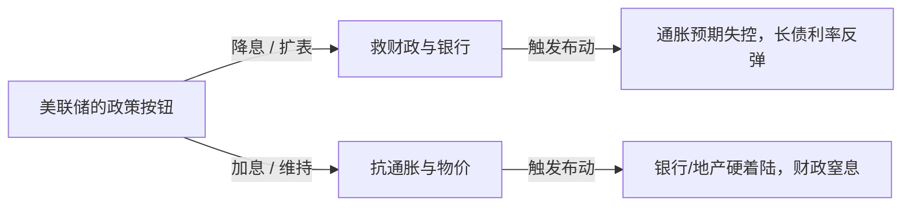
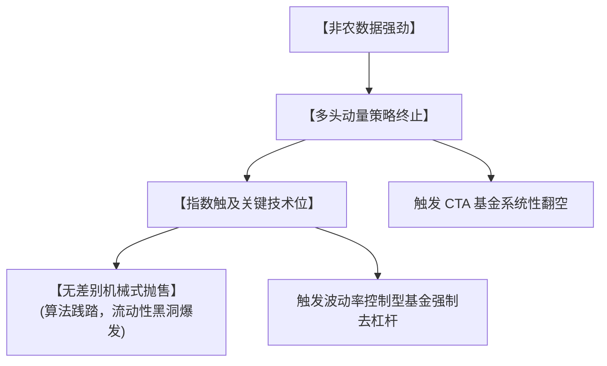

刚刚过去的这个周五，美股市场经历了一场令人心惊的剧烈暴跌。满屏幕的墨绿色（下跌）让无数投资者感到困惑：明明刚刚公布的非农就业数据表现强劲，经济看起来依然充满韧性，为什么市场却报之以如此决绝的恐慌性抛售？

单纯盯着数据表层是找不到答案的。这场暴跌绝非一次偶然的利空重挫，而是宏观经济系统进入“撕裂期”的必然结果。在过去很长一段时间里，美联储依靠精妙的话术（Fed Speak）长袖善舞，试图让所有人相信价格稳定、金融稳定与财政生存可以完美共存。但周五的盘面撕开了这个幻象的裂痕：这三个目标在当前的物理世界中，已经开始实质性互斥。

要厘清当下的市场和美联储的行为逻辑，我们需要把视角切换到博弈论的底层，重新拆解这个已经把容错率挤压到极致的宏观大盘。

---

## 一、 宏观玩家：锁死在资产负债表里的囚徒

理解宏观系统的第一步，是丢掉一切意识形态和宏大叙事，直视核心玩家的资产负债表。当前的情况是，系统中每一个举足轻重的巨头，其退路都被刚性的债务或脆弱的资产死死锁住了。

### 1.1 财政部：刚性失衡与“最后一根稻草”

在评估美国联邦政府的账本时，市场常常将目光聚焦在飙升的国债利息上。但事实上，高额利息只是表象，真正的危机核心在于支出的绝对刚性与收入的结构性无力。联邦财政早已陷入了“收不抵支”的常态化陷阱，而利息不过是压垮骆驼的最后一根稻草。

从国会预算办公室（CBO）的最新数据来看，这种深层次的失衡一目了然：联邦总支出已飙升至约 7.4 万亿美元（占 GDP 的 23.3%），而总收入仅为 5.6 万亿美元（占 GDP 的 17.5%），形成了近 1.9 万亿美元的巨额赤字。

#### 刚性支出：不可触碰的“自动驾驶”系统

在 7.4 万亿美元的庞大支出中，有超过 60% 属于法定强制性支出（Mandatory Spending）。这部分开支由永久性法律规定，不需要国会每年进行拨款审批，本质上是一套在“自动驾驶”的福利系统：

* **社会保障（Social Security）与医疗照顾（Medicare/Medicaid）：** 占了强制性支出的近 75%。随着美国婴儿潮一代步入老龄化，这两项支出的增速远超经济增速。
* 为什么绝对砍不掉？ 任何试图削减社保或医疗福利的提案，在政治上都等同于“自杀”。选民和利益集团的选票压力，导致两党在这一核心领域高度默契地选择回避。法律层面的修改门槛极高，非极端危机绝无削减可能。

剩下的支出属于裁量性支出（Discretionary Spending），总额约 1.9 万亿美元，看起来有调整空间，实际上同样高度刚性：

* **国防开支（Defense Spending）：** 占据了裁量性支出的半壁江山（约 8500 亿至 9000 亿美元）。在地缘政治冲突加剧的国际环境下，非但无法削减，反而面临常态化的扩张压力。
* **非国防开支：** 涵盖教育、交通、国土安全及科研等维持国家机器运转的底线开支，进一步压缩的空间已经微乎其微。

#### 收入瓶颈：开源无力的死局

在支出端“割肉无门”的同时，财政部的“开源”手段却显得极其有限且苍白。

目前联邦收入的基本盘高度依赖两大支柱：个人所得税（占 51%）和薪工税（占 33%），公司企业所得税仅占不到 10%。在没有全面修改税法的前提下，财政部想靠常规手段扩充收入，主要依赖以下几种开源路径，但对大局的影响极其有限：

| 开源手段 | 实际体量 / 预期收益 | 对大局的影响与局限性 |
| --- | --- | --- |
| **加征关税 (Tariffs)** | 每年约带来数千亿美元的账面替代 | 虽然能阶段性补充部分收入，但关税会被本土供应链和消费者吸收，引发潜在的通胀压力，且极易遭到贸易报复，进而反噬实体经济的税基。 |
| **提高企业税率** | 税率每提升 1%，每年约增收 200 亿 - 300 亿美元 | 极易引发资本外流和企业投资意愿下滑。在全球减税竞争的背景下，大幅加税等同于削弱本国产业竞争力。 |
| **加强税务稽查 (IRS)** | 未来十年预计总共增收 1000 亿 - 2000 亿美元 | 属于“远水解不了近渴”。其边际效应递减，且执行成本高昂，无法扭转万亿级别的年度赤字。 |

**开源的死结在于：** 无论技术上如何微调，联邦总收入长期被压制在 GDP 的 17.5% 左右的上限。面对超过 23% 且不断膨胀的支出占 GDP 比例，任何开源手段带来的几百亿增收，在 1.9 万亿美元的赤字黑洞面前都只是杯水车薪。

#### 利息开支：不断加重的终极惩罚

正是在支出减不动、收入加不上的双重夹击下，财政部只能常态化地“借新还旧”，从而引爆了利息支出（Net Interest）这个隐形炸弹。

在 2026 财年，美国的净利息支出正式突破 1 万亿美元大关（占 GDP 的 3.3%），彻底超过了全年的国防开支，成为联邦预算中的第三大项目。

此时，利率政策变成了最致命的毒药。随着总债务规模突破 39 万亿美元，整个国债库的平均久期正在不断缩短，意味着财政部必须频繁地在当前的高利率环境下进行债务滚动（Rollover）。

在这种高杠杆、短周期的脆弱结构下：

* 任何名义上的加息，哪怕只有 25 个基点（0.25%），都会在债务滚动中为财政部每年带来数百亿美元的纯额外利息负担。
* 如果利率在更长时间内维持在高位（Higher for longer），每年新增加的利息支出本身就会滚入本金，迫使财政部发行更多国债来“为利息融资”，从而陷入“赤字 - 增发国债 - 利息上升 - 赤字扩大”的恶性螺旋。

因此，利息不是这场危机的始作俑者，但它完美地充当了终结者。它让原本就失衡的财政结构彻底丧失了容错率。

---

### 1.2 商业银行：高度捆绑的“微观死亡三角”

如果说财政部是在宏观账本上玩一场“借新还旧”的数字游戏，那么商业银行系统——尤其是中小型区域银行，则在微观层面正面临着一场结构性的“慢性窒息”。要理解周五暴跌背后的银行体系风险，不能只看花旗、摩根大通等跨国巨头的强劲财报，而必须直视中小银行、商业地产与本地小生意之间形成的“微观死亡三角”。

#### 结构图谱：唇齿相依的利益共生体

在美国的经济版图中，资产规模在 2500 亿美元以下的区域和社区银行，数量占了全美银行业的 99% 以上。它们不是华尔街的香槟派对，而是实体经济毛细血管的供血泵。这三者之间存在着极度深刻的共生关系：

* **中小银行与商业地产（CRE）：** 中小型银行承揽了全美 70% 到 80% 的商业地产贷款。商业地产是小银行最核心的资产。
* **中小银行与小生意（Small Business）：** 全美超过 50% 的小企业商业贷款由中小银行提供。从街角的咖啡店、本地的物流公司到中小型制造厂，它们的循环贷款和信用额度（Credit Lines）完全依赖本地银行。
* **小生意与商业地产：** 这些本地小生意，恰恰又是这些商业地产（社区零售商铺、地方写字楼、中小型仓库）的实际承租人和现金流贡献者。

#### 多米诺骨牌：CRE 债务墙引爆后的坍塌链条

在当前的持续高利率环境下，这个三角体系正在迎来最残酷的“债务到期墙（Maturity Wall）”。

**债务滚动危机：**

仅在 2026 年，全美就有超过 5300 亿美元的商业地产贷款密集到期（此前 2025 年更是积压了近万亿未完全消化的展期贷款）。这些贷款大多是五到十年前在 1%—2% 的超低利率时代发放的。如今要在 6%—7% 的再融资利率下面临重新评估，加之居家办公常态化导致的写字楼空置率持续走高，大量地产项目在数学上已经根本无法实现现金流覆盖。

一旦美联储坚持不降息，这个多米诺骨牌的传导链条是绝对刚性的：

$$\text{高利率持续} \longrightarrow \text{商业地产大面积违约} \longrightarrow \text{中小银行资产端崩溃} \longrightarrow \text{银行批量倒闭被接管}$$

而这一链条的终点，不是华尔街的数字缩水，而是大批本地小生意的集中倒闭。小银行一旦被接管或为了自保而抽贷，小企业的信用额度会被瞬间冻结。小生意高度依赖现金流周转，信贷一断，随之而来的就是全美范围内的裁员潮与企业破产潮。

#### 慢性窒息：未实现损失（Unrealized Losses）的流动性锁死

即便我们退一步，假设美联储和监管机构通过各种变相救市工具（如创设新的流动性便利）保住了这些中小银行不立刻倒闭，高利率带来的未实现损失（Unrealized Losses）也正在从内部废掉银行的武功。

根据联邦存款保险公司（FDIC）的最新数据，截至 2026 年第一季度，全美银行业由于持有大量疫情期间购买的、处于极低票面利率的美国国债和抵押贷款支持证券（MBS），账面上的未实现损失依然高悬在 3250 亿美元的高位。

这一大笔“浮亏”对实体经济造成了深远的“流动性锁死效应”：

| 银行的选择 | 财务后果 | 对实体经济/流动性的影响 |
| --- | --- | --- |
| **选择 A：卖出证券筹资** | 账面浮亏立刻转化为真实亏损（Realized Loss），直接无情侵蚀银行的核心一级资本金，甚至直接触发挤兑。 | **极高风险：** 除非万不得已（如遭遇存款大额流出），否则银行绝对不碰这条自杀路线。 |
| **选择 B：死扛不卖（当前现状）** | 银行的资产负债表被大量年化收益率只有 1.5%—2% 的“垃圾资产”死死绑架，无法释放资金。 | **慢性紧缩：** 银行由于资本金被锁死，只能极度激进地收紧信贷标准（Credit Crunch）。新贷款不发了，旧额度缩减了。 |

**这就是当下的危险现状：** 即使没有发生惊心动魄的银行倒闭潮，整个商业银行系统也已经因为这 3250 亿美元的资本锁死，而失去了向微观实体经济输血的能力。流动性在银行体系内部被强行冻结，这使得整个金融系统的容错率降到了历史冰点。周五市场之所以对任何加息可能或高利率维持的信号产生如此强烈的应激抛售，正是因为看透了商业银行这张已经经不起任何风浪的资产负债表。

---

### 1.3 股市：高悬在 AI 独木桥上的资本泡沫与利率“双杀”

如果将美股大盘（标普 500 指数）剥离掉少数几家超级科技巨头（Big Tech），整个市场的表现其实乏善可陈。当下的股市已经形成了一种高度极化的“AI 独木桥”叙事。整个金融资产的繁荣完全维系在对人工智能未来的无底线乐观预期之上，而这种极度脆弱的生态，正在遭遇高利率从“融资端”与“估值端”展开的无情双杀。

#### 现状失衡：天价估值与模糊的 ROI

目前的标普 500 指数前几大权重股的估值乘数已经处于历史高位，市场在定价时几乎不容许任何不完美。然而，在资产负债表的微观逻辑里，AI 的故事正在发生令人担忧的质变：

* **恐怖的资本开支（CapEx）：** 为了不在这场军备竞赛中掉队，科技巨头们正以每年数千亿美元的规模疯狂购买算力、建设数据中心和锁定能源供应。巨额的真金白银正从企业的“现金牛”业务流向高昂的固定资产。
* **收益的非对称滞后（ROI 迷雾）：** 这种巨额开支并没有立刻转化为对等的收入。除了卖算力的硬件厂商在兑现利润，大部分位于中下游的应用端、软件端和企业服务端，其 AI 的真实商业化变现（Monetization）依然处于早期探索阶段。自由现金流被大额消耗，换回的却是一堆短期内无法产生确定利润的远期资产。

#### 传导机制：持续高利率对 AI 叙事的双重绞杀

在这样的资本结构下，美联储如果选择在更长时间内维持高利率（Higher for longer），或者释放加息的可能，对于股市的杀伤力是毁灭性的。这种杀伤力主要通过两个齿轮严密传导：

**齿轮一：融资绞索与资本开支的“供氧中断”**

AI 革命不仅仅是科技巨头的游戏，更需要庞大的中小企业、AI 初创公司作为下游应用去消化算力。高利率直接切断了这条生态链的资金氧气：

* **初创与中小企业：** 高昂的融资利率（借贷成本、风险溢价）让风险投资（VC）极度审慎，下游应用型企业无法拿到廉价资金。
* **巨头的掣肘：** 当下游因为融资困难而无力购买 AI 服务时，巨头们庞大的 CapEx 投入就会变成砸在手里的“幽灵资产”。一旦市场意识到高利率逼迫大厂不得不削减资本开支来保护资产负债表，整个 AI 产业链的繁荣假象就会瞬间戳破。

**齿轮二：估值压制与长久期资产的“重力回归”**

在金融学最基础的折现现金流（DCF）模型中，高科技成长股属于典型的长久期资产（Long-duration Assets）——它们现在的利润很少，几乎所有的价值都躺在遥远的未来。

当无风险利率（分母中的 $r$）高企时，未来的现金流在今天会贬值。公式如下：

$$\text{PV} = \sum_{t=1}^{n} \frac{\text{CF}_t}{(1 + r)^t}$$

无风险利率 $r$ 的每一次向上跳动，都会对远期现金流进行无情折价，直接导致估值乘数（P/E）的强烈压缩。

#### 范式转移：从“听故事”到“数硬币”

周五的暴跌，正是市场在这场估值重估中表现出的阵痛。高利率正在强行将市场的审美偏好从“幻象”拉回“现实”：

| 范式维度 | 低利率时代（旧常态） | 持续高利率时代（新常态） |
| --- | --- | --- |
| **定价锚点** | **未来的想象空间。** 只要叙事足够宏大（如 AI 改变一切），市场愿意给予无限的估值溢价。 | **可预期的现金流。** 市场不再为“愿景”买单，转而疯狂追求当季就能兑现的、确定性极高的真金白银。 |
| **资金风险偏好** | 追逐贝塔（Beta），只要带有 AI 标签的股票均可无脑抱团。 | 剥离“伪 AI”，进行残酷的资源重分配，没有盈利支撑的烧钱项目被无情抛弃。 |
| **对容错率的忍耐度** | 极高。财报指引不及预期可以被“长期主义”掩盖。 | 极低。任何资本开支增速超过营收增速、或者利润率边际下滑的信号，都会触发周五那样的抛售。 |

**一句话总结：** 股市在周五的暴跌，是市场突然惊醒并意识到——当美联储的皮鞭高高举起，AI 的信仰再高，也无法对抗最基础的金融引力。如果科技巨头的造血速度赶不上现金流的耗尽速度，高利率就会变成最致命的熔断器。

---

### 1.4 市场流动性：干涸的蓄水池与失去防洪堤的金融系统

如果把前三节（财政部、商业银行、股市）比作在这个宏观高压锅里不断积聚的压力，那么市场流动性就是这个高压锅的安全阀。在过去两年美联储轰轰烈烈的缩表（QT，量化紧缩）进程中，金融市场之所以没有发生严重的流动性休克，全赖于一个隐藏的“地下蓄水池”——美联储隔夜逆回购（RRP）市场。

然而，当下的致命现实是：这个蓄水池已经彻底干涸，金融系统已经失去了它最后的防洪堤。

#### 历史红利：逆回购（RRP）如何充当“吸震器”

在大放水时代，由于系统内资金极度泛滥，以货币市场基金（MMF）为代表的庞大资金无处可去，只能将数万亿美元闲置资金存放在美联储的 RRP 账户中，躺赚无风险利息。

当美联储开启本轮缩表、以每月数百亿的规模从金融系统抽离资金时，市场上演了一个精妙的无痛替代：

美联储抽走的资金，并没有直接动用商业银行体系内维持运转的超额准备金（Bank Reserves），而是优先从 RRP 这个庞大的“闲置资金池”里被源源不断地倒灌出来，填补了缩表流出的缺口。

RRP 实质上充当了美联储与银行体系之间的“防弹衣”。只要 RRP 里还有冗余资金，美联储的缩表就只是在抽走系统内的“死钱”，对实体金融和资产市场的实质流动性几乎没有实质杀伤力。

#### 临界点降临：QT 正式刺入银行准备金

随着 RRP 蓄水池的彻底见底，金融市场的底层流动性规则发生了根本性的范式转移。美联储的缩表行为，正式从“无痛抽血”变成了“直接割肉”：

$$\text{美联储继续缩表} \longrightarrow \text{直接扣减商业银行超额准备金}$$

超额准备金是整个银行体系互信和流动性调配的底线。当准备金被 QT 持续硬性抽离，整个系统就会开始逼近所谓的“最低舒适准备金水平（Lorie Logan 框架下的准备金临界点）”。

此时，流动性状态从过去的“泛滥且零摩擦”瞬间切换到“稀缺且极度干涩”。金融系统对任何边际扰动，都表现出极度的“免疫力缺失”：

| 流动性维度 | RRP 充裕时代（旧常态） | RRP 干涸时代（新常态） |
| --- | --- | --- |
| **QT 的实际承伤主体** | 货币市场基金的 RRP 闲置份额（对市场无感） | 商业银行的核心超额准备金（直接抽取系统流动性） |
| **资产市场的表现** | **钝感。** 即便美联储官员言论再强硬，市场由于“垫子”还在，依然敢激进抢跑做多。 | **极度应激。** 任何风吹草动都会瞬间传导至回购（Repo）市场，引发资金利率飙升。 |
| **金融系统的容错率** | 极高。 单个风险事件（如某些中小型银行出现流动性缺口）可被系统内的冗余资金迅速填补对冲。 | 极低。 系统弹性降至冰点。稍有超预期的数据，就会迅速转化为资金链条上的“去杠杆”恐慌。 |

#### 周五暴跌的流动性真相

不要以为周五的抛售纯粹是交易员对非农数据在进行理性的基本面推演，它在底层更像是一场流动性干涸引发的急性痉挛。

在安全垫彻底消失的背景下，强劲的就业数据让程序和交易员意识到：高利率不仅会维持得更久，且美联储还将继续缩表抽水。这无异于在一片极其干燥的枯木林里扔下了一颗火星。由于市场此刻极度缺乏边际流动性去承接突如其来的调仓卖盘，微小的预期变化在算法的推波助澜下，立刻在极短时间内演变成了无差别的多头多米诺踩踏。

---

## 二、 路径的博弈：美联储的“圣杯”与市场的“恐吓信”

如果说第一章拆解的资产负债表是铺设在地面上的冰冷铁轨，那么美联储与金融市场就是两列在这条铁轨上相对行驶、疯狂对冲的列车。在当前的宏观窒息感下，美联储的每一次决策和市场的每一次暴跌，都不再是孤立的经济现象，而是一场最高级别的“不完全信息博弈”。

### 2.1 明面与隐藏职责的物理互斥

传统的教科书告诉我们，美联储的灵魂由“双重使命（Dual Mandate）”构成：稳定物价（将通胀控制在 2%）与充分就业。这是美联储摆在明面上的法定职责。

但在实际运转中，美联储的资产负债表里还写着两条不可言说的隐藏职责：保障财政部发债（主权信用不崩盘）与维持金融系统稳定（商业银行不连环爆雷）。

在过去低通胀的三十年里，这四项职责可以通过货币政策的松紧调节来实现动态平衡。然而在 2026 年的今天，随着去全球化引发的结构性通胀抬头，以及美国债务曲线的指数级陡峭化，明面职责与隐藏职责之间，已经发生了不可调和的物理互斥：

这种互斥的残酷之处在于，美联储失去了“两全其美”的技术空间：

* **如果为了“救财政与银行”而选择妥协降息：** 在当前供应链重构、劳动力短缺的结构性通胀背景下，过早的降息极易引燃第二次通胀野火。一旦长期通胀预期失控，理性的债市交易员会立刻疯狂抛售长债（Bond Vigilantes），反而会把长期国债收益率推得更高，让财政部的发债成本瞬间雪上加霜。
* **如果为了“抗通胀”而死扛高利率：** 财政部将在万亿利息的黑洞里越陷越深，中小银行和商业地产则会以物理可见的速度走向全面崩溃。

美联储被锁死在这个由资产负债表刚性编织的“囚徒困境”中。它每一次试图安抚一方的举动，都会变成对另一方的致命毒药。

---

### 2.2 时代范式的漂移：从“周期性需求”到“地缘结构性供给”

为什么过去能够轻易解开的连环结，现在解不开了？因为通胀的性质变了。美联储正面临着过去三十年从未见过的敌人：由政治安全叙事驱动的结构性通胀（Structural Inflation）。

| 维度 | 全球化时代（旧常态） | 安全叙事与去全球化时代（新常态） |
| --- | --- | --- |
| **底层核心逻辑** | **效率优先（Efficiency First）。** 寻找全球成本最低的土地、劳动力与能源。 | **安全优先（Security First）。** 宁可牺牲效率，也要确保供应链的绝对可控与韧性。 |
| **通胀的本质形态** | **周期性通胀（需求端驱动）。** 经济过热导致买方抢购，物价上涨。 | **结构性通胀（供给端破碎）。** 政治对立与国际冲突导致卖方断供或成本刚性上升。 |
| **联储工具的有效性** | **极高。** 加息调高融资成本，一压制总需求，通胀立刻应声回落。 | **极低/失效。** 加息无法修复破碎的供应链，甚至由于抬高企业生产成本而加剧通胀。 |

#### 供应链破碎与近期大宗商品（如石油）的宏观逻辑

这种结构性通胀并非虚妄的经济学概念，而是由以下三大硬约束直接在供给端卡死了物价的下限：

1. **贸易战与“友岸外包（Friend-shoring）”的阵痛：** 当关税成为政治武器，原本最优化、成本最低的跨国供应链被强行切断。企业被迫将工厂搬迁至政治更安全但基础设施不完善的地区。这种供应链的重构与冗余建设，本质上是一种长期的、全行业的成本转嫁。
2. **国际冲突与地缘能源溢价（以近期石油波动为例）：** 地缘政治冲突直接重塑了全球能源的定价网络。传统的廉价能源通道被物理封锁或制裁，取而代之的是复杂的绕道运输和更高的风险保费。石油作为现代工业的血液，其价格一旦被地缘冲突注入一个“政治安全溢价”的底部，就会通过化工、物流、电力无差别地渗透进所有终端商品的售价中。

#### 工具与目标的致命错位：为什么加息对结构性通胀是剧毒？

美联储的加息政策，本质上只能用来扼杀“需求”（让消费者没钱消费，让企业不敢扩张）。但是，美联储的加息工具钻不出石油，盖不出免关税的工厂，也变不出廉价的熟练工人。

面对由国际冲突和供应链破碎导致的物价上涨，美联储如果执意通过疯狂加息来压制通胀，其结果并不能让油价跌下来，只会把国内那些原本就因为供应链成本上升而苦苦挣扎的实体企业彻底拉向破产。

---

### 2.3 三条路径的“动态博弈模型”

正是在结构性通胀这一长期阴影的笼罩下，美联储和市场在两难困境中，脑海里都清晰地并排摆着三张面向未来的剧本。 这三条路径互为因果，互为筹码：

#### Path A（软着陆/联储圣杯）：稳健的成长与受控的通胀

* **内涵：** 经济增长并未失速，就业市场维持高景气度，但最关键的是——薪资增速与核心通胀并没有因为就业的强劲而失控。经济在温和通胀和稳健增长的轨道上平稳滑行。
* **周五数据的真相：** 必须明确指出，周五公布的非农数据，非但没有证伪 Path A，反而极其完美地确认了 Path A 的存在。非农就业人数超预期强劲，证明经济没有崩溃（排除了硬着陆隐忧）；同时工资涨幅却创下新低，证明通胀的结构性驱动力正在降温。这正是美联储梦寐以求的“圣杯”剧本。

#### Path B（AI 爆发/长期出路）：全要素生产率的奇迹

* **内涵：** 科技巨头砸下的数千亿资本开支在极短时间内转化为真实的生产力红利。企业靠 AI 大幅削减成本、提升毛利，从而在不需要廉价流动性的情况下，硬生生消化掉高利率的冲击。
* **现实：** 这是全系统唯一能够彻底解开美国债务死结的非线性生路。但它的致命问题在于“远水解不了近渴”，AI 真实的全面造血能力，目前还远远无法支撑股市里的天价估值溢价。

#### Path C（泡沫破灭/硬着陆）：市场的达摩克利斯之剑

* **内涵：** 高利率维持的时间超过了金融系统的承伤极限。流动性蓄水池（RRP）干涸后，超额准备金被耗尽，引发商业地产和中小银行大面积爆雷，科技巨头被迫削减资本开支，股市发生去杠杆式的大崩溃。
* **最终结局：** 这一路径对实体经济是灾难，但对资本市场而言，却意味着“大破大立”。因为一旦滑向 Path C，美联储将被迫抛弃一切关于通胀的道德洁癖，名正言顺地开启无限量 QE 和零利率来救市。

---

### 2.4 核心博弈逻辑：叙事防守与金融恐吓

看懂了这三张剧本，我们就能拆穿市场与美联储之间最深层的博弈窗户纸。

#### 美联储的战略：死守 Path A，用时间换空间

既然周五的数据证明了 Path A 是成立的，美联储的行为逻辑就变得极其清晰——他们要拼命维持“Higher for Longer（高利率维持更久）”的叙事。只要经济数据好，他们就可以既不加息（不彻底激化银行矛盾），也不降息（死死压住通胀预期），用极大的定力把利率横在空中，静静等待 Path B（AI 生产力奇迹）的降临。

#### 市场的战略：伪造 Path C，进行金融恐吓

然而，金融市场（尤其是高杠杆的交易员和科技多头）极度厌恶“Higher for Longer”。因为维持高利率的时间每多一个月，第一章中提到的商业银行浮亏、AI 融资绞索和流动性枯竭的风险就会呈几何级数放大。

于是，市场在周五上演了一场精妙的反身性恐吓（Reflexive Blackmail）：

#### 市场的心理战机制

当非农数据显示出完美的 Path A（经济好，通胀稳）时，市场突然意识到，美联储有了充足的借口在未来几个月拒绝降息。这对于迫切需要流动性续命的杠杆资产来说是无法接受的。

于是，市场选择“故意将好消息砸成坏消息”。通过主动制造恐慌性暴跌，人为地让资产价格失速下跌，从而向美联储传递一份恐吓信：

> “你以为现在是 Path A（软着陆）？不，如果你敢不降息，我们就立刻死给你看。我们会通过砸盘来制造‘金融状况剧烈收紧’的既成事实，把整个系统强行拖进 Path C（硬着陆）。现在，请在你的圣杯和我的崩溃之间，做出选择。”

这不是唱双簧，这是最高级别的心理战。美联储在用口头管理试图把路径往 Path A 上引，而市场则在用真实的真金白银抛售，试图把系统往 Path C 的悬崖边缘推，以此逼迫美联储的“隐藏职责”（金融稳定）提前上线。最终的目的，是逼美联储交出那枚降息的解药，将路径强行扭转为一个最符合资产泡沫胃口的、允许通胀超标的“变种软着陆”。

---

## 三、 市场的微观行为：资本结构、算法践踏与双簧的终结

如果说第二章的路径博弈是幕后写好的政治剧本，那么第三章的资金流向就是前台血淋淋的微观肉搏。周五的暴跌，表面上是交易员对非农数据的利空宣泄，在微观层面，它实际上是一场由现代多重资本结构硬性对撞、叠加量化算法无差别践踏的“流动性连环车祸”。

### 3.1 筹码的结构性极化：不同玩家的底层行为逻辑

要理解周五的踩踏，首先要认清牌桌上三种核心资本力量的资产结构与生存状态。它们在面对“好数据（Path A 确认）”时，做出的完全是基于各自资本约束的本能反应：

#### A. 绝对收益与高杠杆宏观基金（对冲基金/CTA）

* **资本结构：** 极高杠杆、极度依赖波动率与动量（Trend）。
* **周五的本能反应：** 这类资金根本不关心 AI 的长期未来，他们只关心资金成本的拐点。当非农数据扑面而来，证明“Higher for Longer”铁板钉钉时，他们的多头杠杆成本瞬间超越了风险收益比。这类基金是周五第一时间借着流动性窗口切断仓位、反手做空并推高波动率（VIX）的始作俑者。

#### B. 长线资产配置者（养老金/主权基金/大型 Long-Only）

* **资本结构：** 体量庞大，有刚性的长期收益率覆盖要求（必须跑赢通胀与长期负债）。
* **周五的本能反应：** 他们长期处于“资产荒”的极度焦虑中。在高利率压制下，他们只能死守长债或者被动抱团大盘权重股。当周五市场出现剧烈下沿波动、且长债收益率因为降息预期落空而再度飙升时，这类基金为了防止整体投资组合触及 VaR（风险价值）风险限额，被迫在盘中进行防御性减仓。

#### C. 被动投资（Passive ETFs）与指数拥挤度

* **资本结构：** 无脑跟从指数权重，无视任何宏观逻辑，纯粹由散户和机构的买卖流向（Flows）驱动。
* **微观死结：** 由于股市已经极度抱团 AI 巨头，当对冲基金开始砍仓这些巨头时，大盘指数瞬间破位。指数一破，全球几十万亿跟踪标普 500 的被动 ETF 就会被迫触发机械性的减仓和卖出。这是一种无视基本面的“无脑抛售”，直接把局部的仓位调整放成了全市场的流动性灾难。

---

### 3.2 精密的“算法暴政”：从逻辑推演到程序践踏

当这三股资金在同一个狭窄的市场里交织时，最终执行杀跌的，并不是人类的恐惧，而是冰冷的量化算法（Quantitative Trading）。

周五的暴跌，在中后盘呈现出极其明显的“算法连环追尾”特征：

当指数由于初始的多头平仓而触及某些关键的技术位（如 50 日均线或特定的期权行权密集区 Gamma 翻转点）时，触发的不是宏观逻辑，而是程序代码中的强制清算命令：

* **系统性翻空：** CTA（趋势追踪）基金在跌破动量支点后，会自动从“满仓多头”瞬间切换为“全速做空”。
* **无差别去杠杆：** 波动率控制型基金（Vol-Controlled Funds）在市场波动率（VIX）跳升时，有着刚性的、不讲理的“降低总风险暴露”要求。

**微观真相：** 过去人类交易员在暴跌时会因为“这个价格已经很便宜了”或者“宏观软着陆其实是好事”而进场抄底。但量化算法没有常识，更没有信仰。 在算法眼里，跌就是继续跌的理由。当全市场都在使用相似的风险控制模型时，算法的集体平仓就会形成一种可怕的无意识践踏。周五尾盘那毫无抵抗的自由落体，正是算法在无情收割全市场流动性的真实写照。

---

### 3.3 预期管理的物理极限：你无法欺骗一行 Python 代码

这一章的最后，我们可以宣告美联储过去屡试不爽的绝技——口头预期管理（Jawboning），正式撞上了墙壁。

过去，美联储可以通过让某位官员接受采访放风、或者在纪要里加入几个模棱两可的词汇，来巧妙地引导市场预期，在不真正动用利率工具的前提下把资产价格“吹”起来或者“压”下去。这就是市场和联储长久以来心照不宣的“双簧戏”。

然而，当市场底层被高比例的量化代码和被动 ETF 占领时，美联储的话术失效了：

* **算法对“模糊修辞”的免疫：** 人类交易员会去琢磨鲍威尔在发布会上的语气是偏鸽还是偏鹰，但算法模型在处理信息时，只认硬邦邦的数据输入（如核心 CPI、非农时薪、实际准备金余额）。周五的数据白纸黑字地敲在服务器上，美联储此前试图涂抹的所有鸽派口红在一瞬间被清洗得干干净净。
* **硬约束击穿话术空间：** 联储可以说“我们对软着陆充满信心”，但它无法用一句话抹平商业银行账上真实的 3250 亿未实现损失；联储可以说“流动性依然充裕”，但它无法改变逆回购（RRP）已经无限趋近于零、QT 开始硬生生抽走银行准备金的物理事实。

**本章结论：** 周五的市场行为告诉我们，双簧戏演不下去了。当美联储试图用缥缈的“口头管理”去对抗真实的、由资产负债表扭曲引发的“市场流动性定价”时，这种信用透支已经到了极限。一旦算法和长线资金意识到美联储的话术根本无法改变实体流动性干涸的物理轨迹，市场就会彻底剥夺美联储的定价权，用最残酷的连续暴跌（Path C 的实演），去强行击穿联储虚伪的防线。

---

## 四、 终局的警钟：从货币神话到主权刚性

周五那场毫无抵抗的尾盘自由落体，绝不是一次技术性回调，更不是交易员的无脑宣泄。它是全系统在流动性防御垫（RRP）清零后，上演的一场高仿真、去杠杆的“金融恐吓信”。

这场风暴撕开了宏观世界最后的人造幻象，为我们留下了两条最核心的终局注脚：

### 1. 预期管理的物理破产：你无法欺骗一行代码

美联储过去屡试不爽的“口头预期管理（Jawboning）”，在结构性成本刚性与现代算法壁垒面前正式撞墙。 任凭央行官员的话术再漂亮，它也钻不出石油，盖不出免关税的工厂，更抹不掉商业银行账上真实的数千亿未实现损失。当硬数据敲在服务器上，冰冷的量化算法和被动 ETF 瞬间物理免疫了美联储的所有鸽派修辞。市场剥夺了联储的口头定价权，开始用真实的暴跌去击穿虚伪的防御。

### 2. 范式转移：货币长袖善舞的终结

美联储天真地以为，只要宏观数据呈现出完美的“软着陆”（Path A），它就能把高利率在空中横盘得更久，直到用时间换来 AI 生产力奇迹（Path B）的肉身救赎。

但市场在周五用最激进的暴跌（Path C）完成了反身性掌掴：资产负债表是有物理极限的，金融管网里的流动性无法凭空变出来。

这正是我们正在步入的全新宏观范式——我们正无可挽回地从“货币主导”的理性调节时代，驶入“财政主导”与“地缘撕裂”刚性对撞的混乱无序时代。 在主权债务庞氏化和全球供应链破碎的底火下，任何长袖善舞的平衡术都将撞上物理常识的墙壁。周五的暴跌不是终点，而是一记刺耳的警钟，那场关于本位币信用与金融系统承伤极限的终极压力测试，才刚刚拉开序幕。