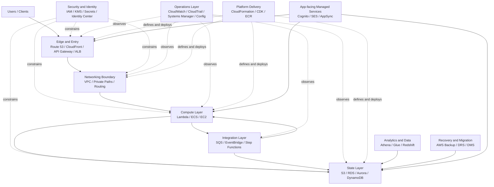

This file is the detailed study guide for the AWS architecture notes collection.

Use it for:

- the mental model of AWS
- the learning order across service families
- the expert-note standard
- cross-family architecture patterns

The goal is not to memorize service details. The goal is to:

- understand each AWS service family at decision-making level
- compare similar services inside each family
- master a small number of flagship services deeply
- go deeper on special-case services only when architecture constraints justify it
- connect service decisions into end-to-end workload patterns

## How To Study This Collection

Use the collection in four layers:

1. Read the family `_index.md` pages to learn the model and service-selection boundaries.
2. Study the flagship deep dives in the most important families.
3. Go deeper on special-case services only when constraints justify it.
4. Turn service knowledge into end-to-end reference architectures.

This structure is intentional:

- family `_index.md`: comparison and selection guidance
- flagship deep dives: expert-level service mastery where it matters most

It keeps the collection useful without turning it into a bloated service encyclopedia.

## When To Go Deeper

Deeper service-level study is usually justified by constraints such as:

- legacy application constraints
- migration constraints
- unusual compliance requirements
- unusual latency or performance requirements
- hybrid or multi-account enterprise patterns

## AWS Service Families

| Family | Role | Main Architect Question | File |
|---|---|---|---|
| Compute | Run application logic | Where should code run? | [`compute/_index.md`]() |
| Storage | Persist objects, blocks, and files | How should data be stored and accessed? | [`storage/_index.md`]() |
| Databases | Persist and query application data | What data model and engine fit the workload? | [`databases/_index.md`]() |
| Networking and Delivery | Connect, route, protect, and accelerate traffic | How do systems communicate and get exposed? | [`networking-and-delivery/_index.md`]() |
| Security and Identity | Control access and protect assets | Who can do what, and how is risk reduced? | [`security-and-identity/_index.md`]() |
| Integration and Messaging | Decouple systems and coordinate workflows | How should services exchange work and events? | [`integration-and-messaging/_index.md`]() |
| Observability and Operations | Monitor, audit, automate, and operate | How will the platform be seen and run? | [`observability-and-operations/_index.md`]() |
| Analytics and Data Engineering | Process and analyze large-scale data | How is data ingested, transformed, queried, and visualized? | [`analytics-and-data-engineering/_index.md`]() |
| DevOps and Infrastructure | Define infra and deliver changes safely | How do teams build, deploy, and standardize systems? | [`devops-and-infrastructure/_index.md`]() |
| Migration, Backup, and DR | Move, protect, and recover workloads | How do workloads migrate and recover? | [`migration-backup-and-dr/_index.md`]() |
| End-User and Application Services | Add user-facing and app-level managed capabilities | Which managed app services reduce custom build effort? | [`end-user-and-application-services/_index.md`]() |

## Main AWS Framework

AWS is easier to understand as a system of layers and cross-cutting concerns rather than a long catalog of products.

The main idea is:

- `Security and Identity` and `Networking and Delivery` define the outer control boundaries
- `Compute`, `Storage`, and `Databases` define where execution and state live
- `Integration and Messaging` defines how parts communicate safely
- `Observability and Operations` and `DevOps and Infrastructure` define how the platform is operated and changed
- `Analytics and Data Engineering` and `Migration, Backup, and DR` describe specialized platform capabilities around data and recovery
- `End-User and Application Services` describe managed product-facing capabilities built on top of those foundations

This is the mental model behind the family structure. Most AWS architecture decisions are variations of these questions:

- who is allowed to do this
- how traffic reaches it
- where code runs
- where state lives
- how components communicate
- how the platform is observed, changed, and recovered

## Core AWS Ideas

These notes assume a few core AWS ideas:

- prefer managed services when they reduce operational burden without hiding critical tradeoffs
- design for failure domains such as AZ, region, account, and service boundary
- reduce blast radius with account boundaries, least privilege, and explicit network paths
- decouple systems where scale, retries, and failure isolation matter
- choose the data model deliberately because many architecture decisions follow from it
- treat observability, security, and recovery as architecture, not post-work

Another way to read AWS is:

- control plane: identity, policy, infrastructure definition, governance
- data plane: requests, messages, jobs, and data moving through the system
- recovery plane: backup, audit, replay, restore, and failover capabilities

The point of the family structure is to help readers see those ideas repeated across many services instead of learning each product in isolation.

## Suggested Study Order

This order is guidance, not a rigid syllabus.

1. `security-and-identity/_index.md`
2. `networking-and-delivery/_index.md`
3. `compute/_index.md`
4. `storage/_index.md`
5. `databases/_index.md`
6. `integration-and-messaging/_index.md`
7. `observability-and-operations/_index.md`
8. `devops-and-infrastructure/_index.md`
9. `analytics-and-data-engineering/_index.md`
10. `migration-backup-and-dr/_index.md`
11. `end-user-and-application-services/_index.md`

## Recommended Comparison Dimensions

When comparing services in the same family, use the same dimensions each time.

| Dimension | What To Ask |
|---|---|
| Primary purpose | What exact problem does this service solve? |
| Abstraction model | VM, container, function, queue, object store, relational DB, CDN, etc. |
| Management model | Self-managed, managed, or serverless? |
| State model | Stateless, stateful, cache, durable store, ephemeral? |
| Scope | Zonal, regional, global, edge? |
| Access pattern | Sync, async, stream, batch, interactive? |
| Scaling model | Manual, autoscaling, elastic, partition-based, event-based? |
| Main strength | What makes it attractive? |
| Main weakness | What complexity or limit comes with it? |
| Typical use case | When is it the natural choice? |
| Main alternatives | What else in AWS competes with it? |
| Key settings | What knobs matter first? |

## Expert Note Standard

Expert-level notes should answer more than "what does this service do?"

They should answer:

- what breaks first
- what becomes expensive first
- what changes in multi-account environments
- what a small team can run safely vs what needs platform maturity
- what the migration or redesign path looks like
- what advice becomes wrong at higher scale or stricter compliance

If a note does not cover failure, cost shape, governance, and evolution, it is still incomplete.

Use this checklist to judge whether a note is mature enough.

| Area | Questions |
|---|---|
| Default fit | When is this the right default, and when is it the wrong default? |
| Constraints | How does the answer change under budget, compliance, latency, or migration constraints? |
| Failure modes | What fails first, and what needs human recovery? |
| Cost shape | What cost drivers appear at low, medium, and high scale? |
| Security | How do identity, keys, secrets, and audit change the design? |
| Org design | What changes in multi-account environments? |
| Resilience | What are the RPO/RTO implications and DR posture? |
| Evolution | What redesign triggers appear as the workload grows? |
| Anti-patterns | What common mistakes should be explicitly avoided? |

## Study Workflow

Use this sequence for any service:

1. Understand the family role.
2. Compare the service against its nearest alternatives.
3. Identify the 5 to 10 highest-impact settings.
4. Study the settings through scenarios, not definitions alone.
5. Tie each setting to metrics, failure modes, and cost impact.
6. Record a decision matrix for common workload patterns.
7. Re-evaluate the recommendation under compliance, org, recovery, and team-maturity constraints.

## Folder Naming Choice

The folders intentionally do not include numeric prefixes.

Use the study-order section in this file to express learning sequence instead of encoding sequence into folder names.

Reasons:

- the folders represent topic domains, not a rigid course syllabus
- the best study order can change as the collection evolves
- unnumbered names make links, filenames, and future deep dives cleaner
- service deep dives can be added naturally under each family without inheriting artificial numbering

The earlier numbered flat files made sense in the previous single-layer layout. In the folder-based structure, keeping sequence in `AWS-Solution-Architect-Study-Map.md` is simpler and easier to maintain.

## Cross-Family Architecture Patterns

Use these patterns to connect service-family decisions into end-to-end architectures.

### Web Application Baseline

- Edge and delivery: `Route 53` plus `CloudFront`
- Traffic and app entry: `ALB`
- Compute: `ECS` with `Fargate`, `Lambda`, or `EC2` depending control needs
- Data: `RDS` or `Aurora` for relational workloads, `S3` for object assets
- Security: `IAM`, `KMS`, `WAF`, `Secrets Manager`
- Operations: `CloudWatch`, `CloudTrail`, `AWS Config`

### Event-Driven Application Baseline

- Ingress: `API Gateway`, direct AWS service events, or scheduled triggers
- Decoupling: `EventBridge`, `SQS`, and `SNS`
- Compute: `Lambda` or container workers
- Data: `DynamoDB`, `S3`, or relational database depending state needs
- Safety: DLQs, idempotency keys, and replay strategy
- Operations: per-stage metrics, tracing, and failure alarms

### Data Platform Baseline

- Landing zone: `S3`
- Catalog and ETL: `Glue`
- Query: `Athena` for query-in-place, `Redshift` for curated warehouse serving
- Streaming when needed: `Kinesis` or `MSK`
- Governance: `IAM`, `KMS`, `Lake Formation` if adopted later, audit logging
- Cost discipline: partitioning, lifecycle policies, and query-budget review

### Hybrid Enterprise Baseline

- Network: `Direct Connect` with VPN backup, `Transit Gateway` when connectivity grows
- Identity: `IAM Identity Center`
- Migration and recovery: `DMS`, `Application Migration Service`, `AWS Backup`, `Elastic Disaster Recovery`
- Operations: `Systems Manager`, `CloudWatch`, `CloudTrail`
- Governance: centralized logging, key management, and restore testing

## Core Resources

Use this template when going from overview to deep study:

- [`00_Architect-Study-Template.md`]()

Current flagship deep-dive examples:

- [`compute/lambda.md`]()
- [`storage/s3.md`]()
- [`security-and-identity/iam.md`]()
- [`security-and-identity/kms.md`]()
- [`security-and-identity/secrets-manager.md`]()
- [`security-and-identity/iam-identity-center.md`]()
- [`networking-and-delivery/vpc.md`]()
- [`networking-and-delivery/cloudfront.md`]()
- [`networking-and-delivery/api-gateway.md`]()
- [`networking-and-delivery/route-53.md`]()
- [`databases/aurora.md`]()
- [`databases/dynamodb.md`]()
- [`databases/rds.md`]()
- [`integration-and-messaging/sqs.md`]()
- [`integration-and-messaging/eventbridge.md`]()
- [`observability-and-operations/cloudwatch.md`]()
- [`observability-and-operations/systems-manager.md`]()
- [`observability-and-operations/cloudtrail.md`]()
- [`observability-and-operations/aws-config.md`]()
- [`analytics-and-data-engineering/athena.md`]()
- [`analytics-and-data-engineering/glue.md`]()
- [`devops-and-infrastructure/ecr.md`]()
- [`devops-and-infrastructure/cloudformation.md`]()
- [`devops-and-infrastructure/cdk.md`]()
- [`migration-backup-and-dr/aws-backup.md`]()
- [`migration-backup-and-dr/elastic-disaster-recovery.md`]()
- [`end-user-and-application-services/cognito.md`]()
- [`integration-and-messaging/step-functions.md`]()

Recommended next expert deep dives:

To raise the collection meaningfully, prioritize these next:

1. `Redshift`
2. `SES`
3. `Transit Gateway`
4. `Application Migration Service`
5. `X-Ray`
6. `SNS`
7. `CloudFormation Guardrails / Service Catalog`
8. `GuardDuty`
9. `AppSync`
10. `DMS`

In most families, 2 to 5 flagship services are enough. Add more only when a real architectural constraint makes the extra depth valuable.
