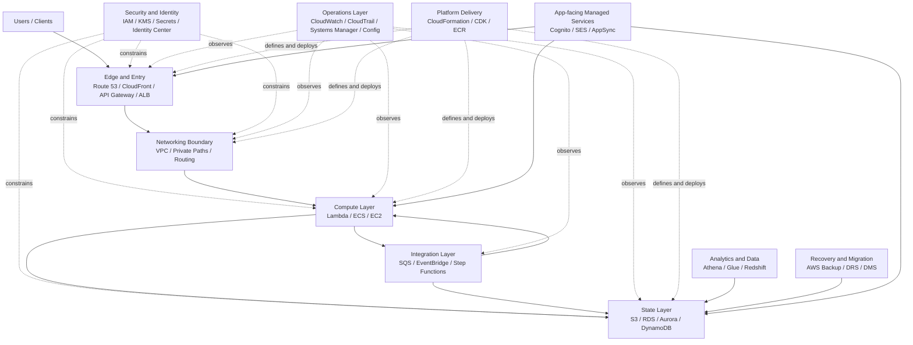

This is a structured collection of AWS architecture study notes, organized by service family, with flagship deep dives where depth matters most.

The goal is not to memorize service details. The goal is to:

- understand each AWS service family at decision-making level
- compare similar services inside each family
- master a small number of flagship services deeply
- go deeper on special-case services only when architecture constraints justify it
- connect service decisions into end-to-end workload patterns

## How To Use These Notes

Use the collection in four layers:

1. Read the family pages to learn the model and service-selection boundaries.
2. Study the flagship deep dives in the most important families.
3. Go deeper on special-case services only when constraints justify it.
4. Turn service knowledge into end-to-end reference architectures.

This structure is intentional:

- family pages: comparison and selection guidance
- flagship deep dives: expert-level service mastery where it matters most

In most families, 2 to 5 flagship services are enough. Add more only when a real architectural constraint makes the extra depth valuable.

### When To Go Deeper

Deeper service-level study is usually justified by constraints such as:

- legacy application constraints
- migration constraints
- unusual compliance requirements
- unusual latency or performance requirements
- hybrid or multi-account enterprise patterns

## Service Families

The table is ordered by the suggested study sequence, not by importance.

| Family | Role | Main Architect Question |
|---|---|---|
| [`security-and-identity`]() | Control access and protect assets | Who can do what, and how is risk reduced? |
| [`networking-and-delivery`]() | Connect, route, protect, and accelerate traffic | How do systems communicate and get exposed? |
| [`compute`]() | Run application logic | Where should code run? |
| [`storage`]() | Persist objects, blocks, and files | How should data be stored and accessed? |
| [`databases`]() | Persist and query application data | What data model and engine fit the workload? |
| [`integration-and-messaging`]() | Decouple systems and coordinate workflows | How should services exchange work and events? |
| [`observability-and-operations`]() | Monitor, audit, automate, and operate | How will the platform be seen and run? |
| [`devops-and-infrastructure`]() | Define infra and deliver changes safely | How do teams build, deploy, and standardize systems? |
| [`analytics-and-data-engineering`]() | Process and analyze large-scale data | How is data ingested, transformed, queried, and visualized? |
| [`migration-backup-and-dr`]() | Move, protect, and recover workloads | How do workloads migrate and recover? |
| [`end-user-and-application-services`]() | Add user-facing and app-level managed capabilities | Which managed app services reduce custom build effort? |

## The AWS Mental Model

AWS is easier to understand as a system of layers and cross-cutting concerns rather than a long catalog of products.

The main idea is:

- `Security and Identity` and `Networking and Delivery` define the outer control boundaries
- `Compute`, `Storage`, and `Databases` define where execution and state live
- `Integration and Messaging` defines how parts communicate safely
- `Observability and Operations` and `DevOps and Infrastructure` define how the platform is operated and changed
- `Analytics and Data Engineering` and `Migration, Backup, and DR` describe specialized platform capabilities around data and recovery
- `End-User and Application Services` describe managed product-facing capabilities built on top of those foundations

This is the mental model behind the family structure. Most AWS architecture decisions are variations of these questions:

- who is allowed to do this
- how traffic reaches it
- where code runs
- where state lives
- how components communicate
- how the platform is observed, changed, and recovered

## Core AWS Ideas

These notes assume a few core AWS ideas:

- prefer managed services when they reduce operational burden without hiding critical tradeoffs
- design for failure domains such as AZ, region, account, and service boundary
- reduce blast radius with account boundaries, least privilege, and explicit network paths
- decouple systems where scale, retries, and failure isolation matter
- choose the data model deliberately because many architecture decisions follow from it
- treat observability, security, and recovery as architecture, not post-work

Another way to read AWS is:

- control plane: identity, policy, infrastructure definition, governance
- data plane: requests, messages, jobs, and data moving through the system
- recovery plane: backup, audit, replay, restore, and failover capabilities

The point of the family structure is to help readers see those ideas repeated across many services instead of learning each product in isolation.

## How To Compare Services

When comparing services in the same family, use the same dimensions each time.

| Dimension | What To Ask |
|---|---|
| Primary purpose | What exact problem does this service solve? |
| Abstraction model | VM, container, function, queue, object store, relational DB, CDN, etc. |
| Management model | Self-managed, managed, or serverless? |
| State model | Stateless, stateful, cache, durable store, ephemeral? |
| Scope | Zonal, regional, global, edge? |
| Access pattern | Sync, async, stream, batch, interactive? |
| Scaling model | Manual, autoscaling, elastic, partition-based, event-based? |
| Main strength | What makes it attractive? |
| Main weakness | What complexity or limit comes with it? |
| Typical use case | When is it the natural choice? |
| Main alternatives | What else in AWS competes with it? |
| Key settings | What knobs matter first? |

## Expert Note Standard

Expert-level notes should answer more than "what does this service do?". Use this checklist to judge whether a note is mature enough:

| Area | Questions |
|---|---|
| Default fit | When is this the right default, and when is it the wrong default? |
| Constraints | How does the answer change under budget, compliance, latency, or migration constraints? |
| Failure modes | What fails first, and what needs human recovery? |
| Cost shape | What cost drivers appear at low, medium, and high scale? |
| Security | How do identity, keys, secrets, and audit change the design? |
| Org design | What changes in multi-account environments? |
| Resilience | What are the RPO/RTO implications and DR posture? |
| Evolution | What redesign triggers appear as the workload grows? |
| Anti-patterns | What common mistakes should be explicitly avoided? |

If a note does not cover failure, cost shape, governance, and evolution, it is still incomplete.

## Cross-Family Architecture Patterns

Use these patterns to connect service-family decisions into end-to-end architectures.

### Web Application Baseline

- Edge and delivery: `Route 53` plus `CloudFront`
- Traffic and app entry: `ALB`
- Compute: `ECS` with `Fargate`, `Lambda`, or `EC2` depending control needs
- Data: `RDS` or `Aurora` for relational workloads, `S3` for object assets
- Security: `IAM`, `KMS`, `WAF`, `Secrets Manager`
- Operations: `CloudWatch`, `CloudTrail`, `AWS Config`

### Event-Driven Application Baseline

- Ingress: `API Gateway`, direct AWS service events, or scheduled triggers
- Decoupling: `EventBridge`, `SQS`, and `SNS`
- Compute: `Lambda` or container workers
- Data: `DynamoDB`, `S3`, or relational database depending state needs
- Safety: DLQs, idempotency keys, and replay strategy
- Operations: per-stage metrics, tracing, and failure alarms

### Data Platform Baseline

- Landing zone: `S3`
- Catalog and ETL: `Glue`
- Query: `Athena` for query-in-place, `Redshift` for curated warehouse serving
- Streaming when needed: `Kinesis` or `MSK`
- Governance: `IAM`, `KMS`, `Lake Formation` if adopted later, audit logging
- Cost discipline: partitioning, lifecycle policies, and query-budget review

### Hybrid Enterprise Baseline

- Network: `Direct Connect` with VPN backup, `Transit Gateway` when connectivity grows
- Identity: `IAM Identity Center`
- Migration and recovery: `DMS`, `Application Migration Service`, `AWS Backup`, `Elastic Disaster Recovery`
- Operations: `Systems Manager`, `CloudWatch`, `CloudTrail`
- Governance: centralized logging, key management, and restore testing

## Study Notes Template

Use [`architect-study-template`]() when going from overview to deep study.

Each family page lists its flagship deep dives with links.
