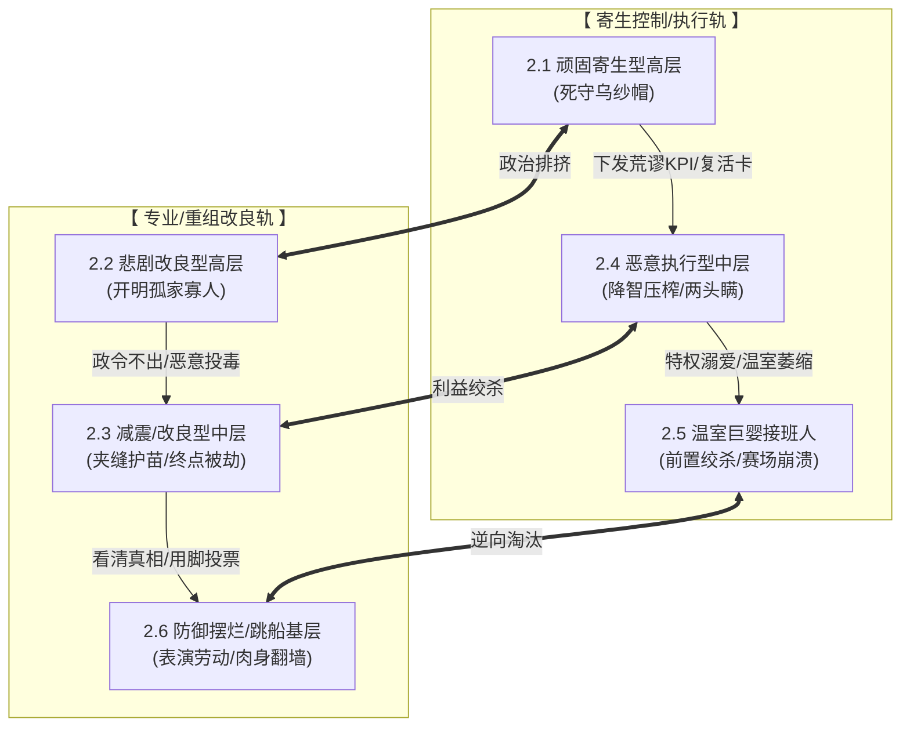

> **补充阅读推荐**
> * *[体系的不变量决定演进的方向：为什么相同的折腾会带来相反的命运？](https://cj9208.github.io/blog/systems_and_governance/system-invariants-evolution-direction/)*
> * *[威权体制的洁癖与降噪系统：为什么他们绝对不接受“不完美”？](https://cj9208.github.io/blog/systems_and_governance/chinese_government/authoritarian-noise-reduction/)*

---

## 一、 引言：频发的“空调爆冷”与三大领域的慢性溃败

### 1.1 戳破“爆冷”的遮羞布

针对国乒男队近期高频输球的诡异现象，舆论场上充斥着各式各样的“意外”与“惜败”说辞。然而，互联网的集体智慧早已看穿了这一层纸糊的遮羞布。网友用一种极具解构主义的幽默讽刺道：

> “哪有天天‘爆冷’的？你家国家队是开空调的吗？”

当所谓的“爆冷”具有了高频次、可预测的规律性时，它就不再是概率论上的偶发事件，而是系统实力整体退化后的真实水平表征。

### 1.2 三大领域的镜像奇观

这种“常态化失败”并不是乒乓球这项运动的孤立病症，而是在多个高度垄断、行政主导的领域里交替上演的镜像奇观：

* **体育界（足球标本）：** 金元高压的虚假繁荣透支了行业未来，体制内的运动员在场上贡献出令人啼笑皆非的“眼神防守”与散步式跑动。讽刺的是，在组织纯粹度上，这种高成本的精英体制反而被绝对透明、唯实力论、野蛮生长的草根“村超”全面降维打击。
* **影视界（夹生饭大片）：** 动辄数亿投资的商业类型片，由于层层行政审美干预与资本强行塞人，最终沦为逻辑稀碎的“降智缝合怪”。本该明牌比拼智商与专业度的高概念、硬核剧情，永远要在中途被强塞毫无逻辑、莫名其妙的“降智恋爱戏”，沦为资本与权力的自嗨工具。

### 1.3 揪出底层因果

追根溯源，这一系列荒谬现象的底层逻辑高度一致：**威权垄断体制对“绝对可控”的极致追求为因，信息黑箱与叙事垄断为果。**

为了维持长官意志的绝对支配权，系统不得不暴力抹除一切不受控的异质信号，消灭冷酷而客观的专业指标。最终，他们为系统内的既得利益者构筑了一套全封闭的制度防弹衣。这，正是威权体制无法摆脱的第一个死穴。

---

## 二、 剧场解剖：威权矩阵下六大角色的生存图谱与宿命

在一个完全封闭且权力高度集中的矩阵里，六大角色分属“寄生控制派”与“专业改良派”，在高中低三个阶层展开博弈。他们各自做出的“最理性选择”，最终合谋导向了系统的荒谬结局。


### 2.1 顽固寄生型高层（乌纱帽死守者）

* **生存心理：** 对任何超越掌控的“失控”怀有极度的恐惧。在他们眼中，120分的独立天才因为带有不可控的个性，反而是体制的潜在威胁；而80分听话的平庸者，才是最安全的权力底座。他们死守“功劳所有权”，任何胜利必须被归功于“组织的英明规划与体制的优越性”。
* **博弈结果：** 为了维持权力延续性，他们滥发“无限复活卡”，动用全系统资源将顶级科研或黄金配角资源“外挂化”，定向输血给指定的平庸接班人。这种揠苗助长不仅无法培养出真正的中流砥柱，反而导致整个系统内部发生惨烈的逆向淘汰。

### 2.2 悲剧改良型高层（开明的孤家寡人）

* **生存心理：** 往往具备专业背景或清晰的现实感知，率先顿悟到系统正在走向崩溃。他们试图引入“唯实力论”、推行打破裙带依附的科学管理，期望以此挽救大船。
* **博弈结果：** 他们宿命般地陷入了“合法性悖论”与“政令不出办公室”的死胡同。因为他们自身的权力基础依然依附于这套旧的威权系统，一旦他们的改革触及核心利益，就会遭到庞大中层官僚的“恶意执行”与同僚的隐形背叛。他们最终只能在信息茧房的窒息感中，像历史上的光绪或崇祯一样，流着眼泪向体制妥协。
> *参阅相关讨论：《[崇祯的死局：大明帝国的系统性崩溃与终末启示](https://cj9208.github.io/blog/systems_and_governance/chinese_government/chongzhen-deadlock-collapse/)》*


### 2.3 减震/改良型中层（夹缝中的业务大佬）

* **生存心理：** 这类人既懂专业业务，又保留了底线良知。他们在系统内部充当“高级打工人”，肉身抗下上方派发下来的种种荒谬KPI，并在微观层面试图搭建一个无菌室，偷偷保护那些没有背景的草根天才，将他们作为系统崩溃时的“灾后消防员”。
* **博弈结果：** 他们终生陷于屈辱的“信任交易”中——必须定期向系统交纳投名状（如容忍关系户、配合演造神戏），以此为代价换取极少数真正能干活的指标。而最惨烈的莫过于遭受“终点线劫持”：当天才们纯靠命硬和中层的庇护打出惊人成果时，高层会在收割期直接跨过中层，强行空降指定继承人前来“摘桃子”。中层多年的委曲求全，最终只沦为权力分赃的垫脚石。

### 2.4 恶意执行型中层（压力传导的水闸）

* **生存心理：** 典型的精致利己主义者，唯上是从。对上，他们用虚假、美化的数据构筑起坚固的信息防火墙，千方百计逢迎长官意志；对下，他们则是冷酷的中间水闸，无限放大来自上层的焦虑与危机。
* **博弈结果：** 类似于大厂管理中的恶性内卷，在这类中层的加压考核下，他们利用基层没有拒绝权的生存死穴，将高层不切实际的KPI高频、成倍地转嫁给底层。为了粉饰指标不择手段，彻底压榨干基层员工的创造力与身体，导致底层的生态彻底变形、彻底烂穿。

### 2.5 温室巨婴型“指定接班人”（权力的宠儿）

* **生存心理：** 长期躺在特权温室和长辈下发的“复活卡”上，缺乏真正的生死磨炼，导致核心业务技能发生“温室萎缩”。因为长期受到系统信息屏蔽的保护，他们患上了严重的“德不配位巨婴症”，却误以为一切资源都是自己应得的。
* **博弈结果：** 他们的核心精力从不放在提升硬实力上，而是用于“向上情绪管理”与“前置防御性绞杀”——即利用规则漏洞和人脉，提前将那些可能威胁到自己地位的草根天才掐死在摇篮里，以规避任何形式的公平对决。然而，这种人一旦走上真正全球明牌竞争、无法封锁消息的国际赛场，其画皮瞬间会被冰冷的物理规律和实力差距戳破，在全网见证下迎来心理防线的彻底崩溃。

### 2.6 防御摆烂/跳船型基层（被收割的天才与耗材）

* **生存心理：** 处于金字塔最底端，在历经无数次“拒绝权被剥夺、长官瞎指挥、成果必被劫持”的毒打后，彻底看清了体制的本质，丧失了所有的主观能动性与创造力。
* **博弈结果：**
  * **平庸者的策略：** 迅速开启“表演性劳动”。他们把所有精力都用在“看起来很拼”的姿态上（例如盲目练到吐、疯狂加班、配合宏大的苦行僧式叙事），摸鱼度日，以此寻求最低限度的政治安全。
  * **天才的策略：** 彻底放弃对系统内部改良的幻想。在积攒了一定羽翼后，决绝地选择“跳船”。正如国乒历史上那些在内部被逆向淘汰、被迫成为“暗影陪练”的边缘球员（如早期的李芬、唐娜，乃至某种程度上的海外执教潮），他们选择“用脚投票”肉身翻墙。一旦进入欧洲、日本等唯实力论的自由市场，没有了依附性枷锁的他们，瞬间破茧成蝶，反手成为旧体制最头疼的对手。


> *参阅相关讨论：《[零余量时代的微观窒息：从“强力倒查”到“恶意合规”的系统性异变](https://cj9208.github.io/blog/systems_and_governance/chinese_government/retroactive-audit-malicious-compliance/)》*


---

### 2.7 寄生基因的代际闭环：从“温室巨婴”到“寄生高层”的恐惧时间线

当我们把视线从静态的权力矩阵移开，拉出一条纵向的时间轴时，会发现一个更残酷的真相：**2.1 的“顽固寄生型高层”与 2.5 的“温室巨婴接班人”，本质上是同一个生命体在不同生命周期的投影。**

这条时间线背后，隐藏着威权体制最隐秘的权力心理学——因德不配位而引发的“存在主义恐惧”。

> **权力矩阵的时间闭环：** 因为无能，所以恐惧；因为恐惧，所以绞杀。平庸的种子一旦在温室里播下，最终长出来的只能是挥舞镰刀的暴君。

#### 一、 德不配位引发的“存在主义恐惧”

当一个人的权力不是通过冰冷的物理规律（如硬核战绩、技术突破、市场血战）在明牌对决中赢回来的，而是依靠信息黑箱、人脉裙带或组织定向派发的“复活卡”投喂得来的，他内心深处会不可避免地衍生出巨大的“冒充者综合征”（Imposter Syndrome）。

* **技术派的底气：** 靠硬实力上位的人，安全感来源于自身的肌肉与武器。他敢于使用比自己更强的人，因为他有信心驾驭系统，且不怕被技术降维。
* **寄生派的死穴：** 靠特权上位的人，安全感完全依附于屁股下的那把“椅子”。他心里比谁都清楚自己的虚弱。此时，任何一个高智商、高能力、满身反骨的 120 分天才，在他眼里都不是资产，而是致命的威胁。

天才的每一次惊艳表现，都是在光天化日之下扒光他“皇帝的新衣”；专业人士的每一次据理力争，都在无情地嘲弄他的外行与无能。这种恐惧是无法被安抚的，它直接威胁到寄生者的生存合法性。

#### 二、 恐惧的代际演变两部曲

正是这种深入骨髓的恐惧，驱动着“权力的宠儿”完成从温室巨婴到顽固寄生者的惊悚蜕变：

1. **阶段一：青年期（温室巨婴）—— 实施“前置防御性绞杀”**
此时他尚未彻底登基，正处于被保护、被培养的阶段。因为极度害怕在公平的物理规律面前被草根天才“超度”，他必须疯狂利用长辈赋予的规则裁判权，在规则之内提前把天才掐死。他不敢让天才上场，因为只要上了赛场，冷酷的比分就会让他现出原形。
2. **阶段二：中老年期（寄生高层）—— 构筑“制度性逆向淘汰”**
当他终于熬成一把手，当年的恐惧并没有消失，反而随着权力诱惑的变大而无限膨胀。此时他已经拥有了调动整艘大船的行政资源，于是他开始全盘消灭客观指标，把考核标准从“谁能打胜仗”彻底偷换成“谁更听话”。他只敢用 80 分的平庸者和 50 分的谄媚者，因为在低维度的安全区里，没有人能看穿他的无能，他的乌纱帽才是绝对安全的。

#### 三、 系统的不可逆降维趋势

这个时间闭环一经锁死，整个系统就呈现出一种“不可逆的降智趋势”。

这成了一场平庸的代际遗传：上一代寄生高层为了安全，挑中了这代温室巨婴；这代温室巨婴因为极度恐惧，未来会挑出更听话、更无能的下一代奴才。整个系统的能量，从“对外进行高水平的专业竞争”，彻底内耗在“对内掩盖无能、维持恐惧平衡”上。这种由恐惧喂养的权力矩阵，自发地斩断了向常识与专业回归的路径，直至迎来系统的最终热寂。

---

## 三、 机制深究：为什么这套体制无法“自我革新”？

威权体制的深层悲剧在于，它在运行中演化出了一套完美的自我毁灭闭环，使得任何内部的改良尝试最终都异化为更深重的内耗。

### 3.1 “表演性改革”的内耗机制

当危机爆发、常态化失败引发外界质问时，系统内部无法进行真正的外科手术，只能开启一场场轰轰烈烈的“改革表演”：

```text
系统性失败爆发
  └─> 触发“责任平移” (频繁更换主教练/业务中层作为背锅耗材)
        └─> 启动“加压考核” (以更密集的行政动作代替结构手术)
              └─> 导致底层技术生态荒漠化 (失控恐惧导致拒绝长期青训/基础投入)
                    └─> 视野内再无野生苗子 ──> 诱发更大的失败 (恶性循环)

```

* **无水养鱼的战略短视：** 由于产权确权困难（成果容易被劫持）以及对失控的极度恐惧，系统天然拒绝去做那些需要死磕二十年、夯实底层基数的长期投资（如日本足球默默坚守多年的青训大纲）。这导致系统视野之内再无野生苗子可用，整个技术生态陷入彻底的荒漠化。
* **高级大佬作为背锅耗材：** 面对失败，高层最核心的诉求是保护自己的位置，于是通过频繁换帅进行“责任平移”。他们将系统性的结构崩溃，轻描淡写地降维定义为“主教练的临场指挥问题”或“个别人员的心理波动”，通过消耗懂业务的专业大佬作为政治减震器，为官僚体系白嫖半年以上的免责蜜月期。
* **以行政动作代替结构手术：** 面对深层利益板结，高层绝不敢把刀刃削向分配制度，于是转而发起针对中层和基层的“整顿风暴”。这种“我无法真正改革，但我必须表演改革”的折腾，最终异化为恶意中层向下成倍转嫁危机，全员配合演戏，内耗进一步加剧。
> *参阅相关讨论：《[论中国微观治理中的官僚博弈与“防御性共谋”](https://cj9208.github.io/blog/systems_and_governance/chinese_government/defensive-collusion-bureaucracy/)》*


### 3.2 割肉者不能持刀的悖论

要彻底激活基层、扭转溃败，唯一的解药是赋予底层说“不”的拒绝权，以及引入绝对透明的第三方审计。然而，透明度是一条无法定向拦截的射线。一旦开启全盘透明，这道光必然会顺着权力链条向上移动，最终反噬高层，将高层的特权分赃、决策无能以及寄生本质彻底曝光。因此，要求既得利益者持刀割自己的肉，在逻辑上是无法成立的。

> *参阅相关讨论：《[组织架构的系统重构：从字节的“Context over Control”谈起](https://cj9208.github.io/blog/systems_and_governance/corporate/organizational-restructuring-context-over-control/)》*

### 3.3 纳什均衡的终极恶化

这套权力矩阵最令人绝望的地方在于：在整个坍塌的过程中，你可能找不到一个绝对意义上的“坏人”。

高层为了安全死守乌纱帽，中层为了生存两头瞒、拼命卷，基层为了自保选择摆烂表演或跳船逃生——每个角色在各自的生态位上，都做出了最符合自身利益的“理性决策”。然而，这些精明的自我保护决定汇聚在一起，刚好严丝合缝地构成了系统最黑暗、最无法自拔的死循环。它如同一个巨大的黑洞，自动绞杀一切常识、专业与善意。

---

## 结语：微观理性的闭环与宏观功能的瘫痪

回到最初的起点，国乒那场被频繁讨论的“爆冷”，剥离掉所有的偶然性面纱后，不过是这套庞大权力矩阵在物理世界投下的一道必然阴影。

纵观全篇的剧场解剖，这个系统最令人不寒而栗的特征，恰恰在于它的“高稳定性”与“零内耗感”：

* **生态位的严丝合缝：** 无论是死守乌纱帽的寄生高层、在夹缝中输血的业务大佬、成倍转嫁压力的恶意中层，还是在底层开启表演性劳动的耗材，没有任何一个角色在刻意作恶。相反，他们都在各自的生态位上，极其精准、敏锐地做出了最符合自身政治安全与生存利益的“最优解”。
* **恐惧的代际遗传：** 2.7 节所揭示的时间线，更像是一把锁，将“德不配位”带来的安全感匮乏，固化为系统新陈代谢的唯一标准。今天的温室巨婴在恐惧中前置绞杀天才，明天他们熬成高层后，自然会用更严密的逆向淘汰去挑选更安全的下一代奴才。
* **最终的权力悖论：** 每一个微观个体都在为了自保而拼命保持清醒与精明，而这些“微观理性”层层叠加、对冲、共谋的结果，恰恰构成了系统在宏观功能上的彻底降智与瘫痪。

这套体制根本不需要遭遇什么戏剧性的外敌，它的日常成功运转，本身就是对自身专业根基的一场持续性拆毁。它极其完美、高效地实现了对内部权力的绝对控制，同时，也极其完美、高效地扼杀了自身对外竞争的全部生命力。

这并非对未来的预言，而是此时此刻，正发生在这个权力矩阵每一个毛细血管里的真实生态。
