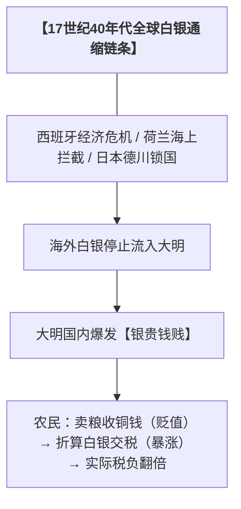

### 引言

公元1644年三月十九日凌晨，大明崇祯皇帝朱由检在景山的歪脖子树上自缢身亡，身边唯有太监王承恩相随。他在衣襟上血书：“文臣人人可杀，朕死无面目见祖宗，自去冠冕，以发覆面。”

这幕悲剧长久以来被涂抹上浓重的个人戏剧色彩——或者是崇祯的刚愎自用作茧自缚，或者是文官集团的贪婪卖国。但拨开宏观历史的迷雾，大明王朝的覆灭本质上是一场极其精确的“数学层面的系统破产”。当一个国家的刚性支出呈指数级暴涨，而其财富汲取能力被体制内的既得利益集团彻底锁死时，帝国的解空间就已经归零。

---

### 一、财税死锁：静态基因的现代经济学溃败

大明朝的财政危机，其病灶在建国之初的洪武年间就已经种下。明太祖朱元璋基于极端的重农主义和自给自足的小农理想，设计了一套高度僵化、完全排斥市场微调的财税体制。

#### 1.1 刻舟求剑的“黄册”与“鱼鳞图册”

朱元璋治国推崇静态稳定，他下令编制的“黄册”（户籍登记）和“鱼鳞图册”（土地登记）成为了后世收税的唯一依据。然而，此后200年里，中原的商品经济发生了翻天覆地的变化，人口激增，土地频繁买卖。

由于官僚体制的腐败与懒政，这些账册在此后两百年里几乎没有进行过全国性的彻底重编。朝廷拿着200年前的地图和户籍，去收200年后的税，导致税基与现实彻底脱节。江南的丝织业、盐业、海外贸易创造了天文数字的财富，但朝廷对其抽税能力极低，隆庆开关后月港的海外贸易关税一年仅区区几万两白银，几乎形同虚设。

#### 1.2 隐形的特权阶层与“投献”狂潮

与税基萎缩相伴随的，是疯狂的土地兼并和利益集团的合法逃税。明代法律规定，凡是通过科举获得功名的士绅文官，享有免除丁税、减免田税的特权。

* **投献机制**：这一制度漏洞催生了极度畸形的“投献”现象。普通自耕农为了躲避朝廷沉重的徭役和赋税，主动将自己的土地和人身所有权“献给”地方上的举人、进士或致仕官员，自己则沦为佃农。
* **财富黑洞**：结果是江南绝大部分肥沃的土地迅速向不纳税的士绅阶层集中。到了明末，不需要纳税的朱姓宗室人口膨胀至数十万人，他们吞噬了山西、河南等地大量的财政岁入（即“宗室禄米”）。国家最富庶的资产阶层在制度的保护下合法隐身，所有的税负压力只能由最底层的自耕农单向承受。

#### 1.3 全球白银危机的致命一击

明代中叶张居正推行“一条鞭法”，确立了以白银作为法定支付货币的地位。但明朝自身并非产银大国，其流动的白银极其依赖海外贸易的输入——主要是美洲西班牙殖民地通过马尼拉大帆船流入的银两，以及日本石见银山的产出。

这种恶性通缩让北方农村的经济彻底解体。农民即使面对丰收也无法缴清税款，因为他们手里不值钱的铜钱无法兑换成足够数量的官银。

---

### 二、组织瘫痪：精致利己与不合作的官僚网络

崇祯皇帝并非没有尝试过向富裕阶层开刀，但他面对的是一个深度板结、利益盘根错节的官僚同盟。

#### 2.1 “天子与士大夫共天下”的法理死结

明朝的政治合法性建立在儒家文官体制之上，崇祯虽然拥有“生杀予夺”的皇权，但他所有的政令必须依赖这套文官系统去下达和执行。当崇祯试图清查江南隐匿的田产、或者对盐商加税时，朝堂上立刻会引发山呼海啸般的道德弹劾。

朝廷里的东林党、浙党、楚党大臣，民间的豪商，地方的地主，通过姻亲、同乡、科举师生关系，构建了一个牢不可破的利益血肉同盟。皇帝如果执意进行铁血税改，就等同于砸掉整个统治阶层的饭碗，其结果必然是整个官僚体系的系统性瘫痪。

#### 2.2 信任危机下的“政治非暴力不合作”

崇祯皇帝性格多疑且极度缺乏安全感。他在位17年，如同走马灯一般更换了50个内阁大学士，处死了大批前方统帅（如袁崇焕、陈新甲）。这种极端的刻薄寡恩，让文官集团彻底看穿了皇帝“既要揽功、又要甩锅”的政治本质。

官僚们迅速进化出了高超的生存智慧：集体摸鱼，绝不主动担责。

* **陈新甲密和案**：崇祯十五年，面对双线作战的死局，崇祯密令兵部尚书陈新甲与清朝和谈。不料机密泄露，朝廷哗然。崇祯为了维护自己“不与异族妥协”的圣人形象，无耻地将全部责任推给陈新甲并将其处死。
* **李明睿南迁案**：崇祯十七年正月，李自成大军逼近。大臣李明睿密奏迁都南京。崇祯内心极想南逃，但他不愿承担“弃土”的骂名，暗示群臣“联名上书请他南迁”。而满朝文官害怕将来被秋后算账，无一人当出头鸟。最终，这种政治拉扯生生锁死了明朝最后的战略生路。

---

### 三、军费黑洞与自杀式死循环

在组织瘫痪和税基萎缩的夹击下，关外的八旗劲旅和关内的农民起义，演变成了两个吞噬一切的财政黑洞。

#### 3.1 崇祯三饷的拉弗曲线效应

为了应付庞大的军费，崇祯在正常的正赋之外，强行加派了“辽饷”（抗清）、“剿饷”（镇压起义）、“练饷”（练兵）。三饷的总额在崇祯朝末年飙升至数百万两。

| 阶段 | 朝廷的财政微操 | 地方基层的实际反馈 | 导致的系统后果 |
| --- | --- | --- | --- |
| **第一阶段** | 财政亏空，加派辽饷与剿饷。 | 地方官为了完成指标，变本加厉向下层摊派。 | 北方遭遇天灾的自耕农彻底破产。 |
| **第二阶段** | 破产农民无路可走，大规模加入叛军。 | 李自成、张献忠的队伍呈指数级滚雪球。 | 关内战火燎原，朝廷需要更多军费。 |
| **第三阶段** | 军费缺口更大，朝廷只能继续加派练饷。 | 基层社会被彻底榨干最后一滴血。 | 更多原本安分的饥民倒戈走向战场。 |

大明朝的财政机器，变成了一台高效率的“叛军生产线”。

#### 3.2 1643年：身处其中的绝望视角

后世史学家常以“上帝视角”指责崇祯不该在崇祯十六年（1643年）疯狂催促孙传庭出关。但如果回到当时的北京城，我们会看到一个真正的人间地狱。

那一年，北京城爆发了恐怖的腺鼠疫。根据史料记载，“名曰疙瘩瘟……人死不出一日”。北京城每天抬出的尸体数以万计，全城人口死亡了近四分之一，街道空绝。守城的军队大批病死、病残，原本10万人的守城部队只剩下几万半死不活的残兵。

同时，国库里的现银已经彻底耗尽，而前线的孙传庭在西安养着数万新军，每天一睁眼就是天文数字的粮饷开支。崇祯没有任何后勤资源去支持孙传庭多等一年。在崇祯的视角里，不打，军队下个月就会因为断饷当场哗变；打，或许还有万分之一的希望。这不是一个理性的战略抉择，而是一个已经破产的赌徒在赌盘上押上最后一块筹码的绝望一掷。

---

### 四、局外人的降维打击：破产重建的铁血逻辑

既然小冰期天灾、通缩和北方战乱是全方位的系统性危机，为什么随后登场的李自成和满清，能够活下来并重建秩序？因为他们作为“新玩家”，拥有旧体制绝对不具备的“零历史包袱”和“极端暴力变现能力”。

#### 4.1 李自成的大顺：存量财富的物理收割

李自成深知当时底层的民怨，因此提出了极具煽动性的口号：“迎闯王，不纳粮（三年不征税）”。不收税的流寇体制之所以能维持，是因为他彻底抛弃了明朝那套文明、繁琐的“流量税收体系”，直接转向了暴力的“存量财富清算”。

大顺军进京后，权将军刘宗敏设立了数千副夹棍，按照明朝官员的官职大小定额索要银两。大学士必须交十万两，尚书五万两，不交就直接夹碎手脚。大顺军在没有任何官僚体制层层漂流损耗的前提下，通过对前明统治阶级的物理超度，在短短40天里拧出了7000万两白银。虽然这种“海盗式掠夺”无法持久，但它在短期内释放了惊人的流动性，支撑了其庞大的军事开支。

#### 4.2 满清的征服者资产：铁血格式化

真正从制度上彻底解决明末财政和组织僵局的，是外来的征服者——满清政权。清廷入关后，展现出了前明皇帝做梦都不敢想的政治破坏力和组织穿透力。

* **物理清理沉没成本**：通过残酷的剃发易服和战争清洗，清廷在物理上彻底消灭、废除了前明数十万朱姓宗室，直接砍掉了这个帝国最大的财政寄生虫集团。同时精简合并了前明重叠臃肿的中央行政机构。
* **刺刀下的一体纳粮**：满清皇帝的权力合法性来自于八旗军队的绝对暴力，而非汉人士绅阶层的道德拥护。面对江南士绅源远流长的逃税网络，清廷没有丝毫顾虑。顺治、康熙年间爆发了震撼全国的“江南奏销案”，13000多名江浙湖广的士绅、秀才（包括大批官员）被直接抄家清洗。

清朝用血淋淋的刺刀，强行打碎了汉人特权阶层200年来免税逃税的护身符。虽然小冰期的酷寒和天灾在清初依然持续，但清廷通过暴力重组财富分配结构，严格保障了中央财政对军队的控制与发饷，从而强行熬过了这场全球性的系统危机。

---

### 结语

大明王朝的终局，是一场教科书式的系统性慢性死亡。它死于祖制基因里缺乏弹性的傲慢，死于统治基础自我寄生、无法割肉的法理死结，也死于最高决策者在系统末期因为缺乏担当而错失的所有止损点。

当一个系统由于长期的利益固化，导致其最富裕的阶层不再承担社会责任，而将所有的风险与代价全部转嫁给最底层的软柿子时，这个系统就注定走向解体。后世面对这样的历史，不应仅仅哀叹于崇祯皇帝在景山上的孤影，更应当看清那条在繁华与腐朽中悄然合拢的系统死锁曲线。

---

## 附注1：关于“天降伟人”假说与系统免疫反噬的延伸思考

如果在崇祯元年，坐在龙椅上的是一个集秦始皇的铁血、汉武帝的剥夺、雍正的极权于一身的“天降伟人”，大明在数学层面的死局确实存在被强行解开的微小概率。但这个历史假设的冰冷前提是：这位天降伟人想要救大明，就必须先成为大明体制的“掘墓人”。

他不能当一个守成的正统皇帝，而必须当一个“戴着皇冠的造反者”，对帝国的核心利益集团进行一场由上至下的铁血手术。

```
【天降伟人的破局路径】
├─ 政治重组：架空文官集团，重用边缘特务武将
├─ 战时财税：对勋戚/宗室进行物理清洗与“追赃拷饷”
└─ 战略断尾：战术性屈辱和谈（对清），或果断弃土南迁

```

### 1. 伟人剧本的三大硬核破局手腕

要打破“自己人不搞自己人”的工具悖论，这位伟人必须撕毁全部的祖宗法度，启动战时极端体制：

* **政治工具的清洗**：彻底架空兵部和内阁，建立一个由皇帝绝对控制、跨越常规官僚体制的战时最高权力机构（类似于后来的军机处）。大规模启用没有江南士绅背景的边缘武将、寒门子弟，甚至是西南的土司狼兵，直接由内廷发饷。同时将锦衣卫和东厂的特务恐怖发挥到极致，谁怠工、谁摸鱼，不经刑部审判直接秘密处决。
* **战时共产主义式的财富引爆**：放弃向北方破产农民索要“流量税”，转而向体制内的肥肉发起“存量收割”。登基之初便找借口将带头哭穷的国丈周奎、成国公朱纯臣等满门抄斩，直接从京城权贵手中榨出数千万两现银作为战争启动资金。在江南强行推行“官绅一体当差纳粮”，敢有文官上书抗议，便以“通敌谋反”罪名成批屠杀、流放，用恐怖震慑逼迫南方地主吐出商税。
* **绝对冷酷的实用主义**：彻底抛弃“天朝上国”的面子。在关内起义军做大前，极其主动甚至屈辱地迎合清朝（皇太极）的和谈条件，割地、封贡、给岁币。只要能稳住关外，就能腾出九边精锐和每年数百万两的辽饷，回过头来以绝对的军事代差将李自成、张献忠扼杀在萌芽状态。如果北方大势已去，他会抢在李自成渡过黄河前，放火烧毁北京，裹挟全部北方财富与工匠果断南迁南京，把北方百年不遇的天灾和鼠疫烂摊子，留给流寇和满清去死磕。

### 2. 系统免疫反噬：落水、暴毙与“暴君”的宿命

一个利益固化、深度板结了270年的复杂巨系统，内部拥有极其强大的“政治免疫系统”。当皇帝决定成为“体制内的造反者”，向整个文官集团、地主阶层和宗室网络宣战时，他实际上已经将自己放到了全天下统治阶级的对立面。

明朝历史上的前车之鉴，早已昭示了系统免疫反噬的无情与隐秘：

* **正德皇帝朱厚照**：试图重用武臣、建立独立于文官集团之外的军事权力中心。结果在宣府的“豹房”玩得好好的，回京途中离奇“失足落水”，随后生了一场莫名其妙的小病，在文官御医的“精心调理”下迅速暴毙，年仅31岁。
* **天启皇帝朱由校**：试图通过重用宦官魏忠贤，绕过文官集团向江南抽取矿税和商税来补贴辽东。他的手段虽然粗暴，但确实一度缓解了财政危机。结果同样是在西苑“偶遇大风失足落水”，落水后患上“水肿病”，服用尚书霍维华献上的“灵露饮”后全身肿胀而亡，年仅22岁。
* **清代的雍正皇帝**：仅仅是因为真正执行了“官绅一体当差纳粮”和“摊丁入亩”，动了读书人的奶酪，便在正史和野史中被文人集团抹黑成了嗜血成性的暴君，其本人最终也离奇暴毙，留下无数遭刺杀的传说。

在明末的政治生态中，一旦皇帝表现出要彻底掀翻利益餐桌的征兆，文官集团根本不需要公开造反。他们可以通过信息黑洞（封锁前线战报）、财政怠工（让国库一分钱也收不上来）、甚至是生物消灭（御膳里的红丸、太医的药方、莫名其妙的落水）等系统内生手段，将这位“暴君”合法地、体面地清除掉。

### 结语

因此，拯救明末的唯一方法，是用比敌人更残酷的暴力，将自己的统治阶级先血洗一遍。这要求决策者不仅要有掀翻地缘敌人的能力，更要有凭一己之力对抗整部国家机器的能量。

历史没有给大明这个剧本，因为在系统演进的冰冷规律下，与其承受一个旷世暴君的铁血刮骨，这个庞大而腐朽的统治集团，宁愿选择最体面、也最绝望地陪着崇祯皇帝，一起死在景山的歪脖子树下。

---

## 附注2：理论层面的剖析——现代政治学与组织行为学的解构

为什么一个已经深度腐败、利益固化的复杂系统（如晚明帝国），几乎无法在内部通过自我改良完成“去腐回血”？

历史学家常用“气数已尽”来形容这种绝望，而现代政治学与组织行为学（OB）则通过数个经典的理论模型，揭示了这种系统性崩溃的冰冷必然性。其核心悖论在于：当系统板结到一定程度，所有的“修复工具”本身就变成了“致病菌”。

### 1. 宏观结构锁死：分利集团、路径依赖与寡头铁律

在宏观政治学层面，复杂系统的长期稳定会带来致命的副作用——规则被食利阶层寄生并锁死。

* **曼瑟·奥尔森的“分利集团”与体制硬化（Institutional Sclerosis）**：
经济学家奥尔森在《大国的兴衰》中指出，系统在长期没有外部颠覆的情况下，内部会自然孵化出无数个密密麻麻的分利集团（如明末的东林党、科道言官、京城勋戚）。改变体制需要全系统承担高昂的改革成本，而红利却由全社会均摊；相反，阻碍改革、捞取特定私利，其好处由集团独占。这导致系统博弈彻底转向“存量分赃”，整个国家机器像患了重度关节炎一样全面硬化。
* **道格拉斯·诺斯的“路径依赖”（Path Dependence）**：
利益集团在既定制度下为了套现，所有士人、官僚都在“考科举、买土地、投献免税、拉帮结派”上投入了巨大的沉没成本。此时，清廉和按章办事反而成了高风险、低回报的异类选择。由于转换成本过高，哪怕每个个体在理智上都知道系统正在走向毁灭，他们依然会选择在既定路径上加速套现。
* **罗伯特·米歇尔斯的“寡头铁律”（Iron Law of Oligarchy）**：
无论组织最初的设立宗旨多么高尚（如大明太祖的“驱逐鞑虏，恢复中华”），随着规模扩大，核心管理层为了维持自身的特权、地位和信息垄断，必然会异化为一个独立于组织最初目标的特殊阶层。所谓的“自我改良”，其方案必须由这群寡头审批。因此，任何真正触及利益的改良在起草阶段就会被阉割，或者在执行阶段被掉包为清洗异己的政治工具。

### 2. 内部控制失效：委托-代理危机与信息黑洞

在管理学和微观经济学层面，最高决策者（委托人）对庞大官僚体系（代理人）的控制力会发生彻底的坍塌。

* **委托-代理问题（Principal-Agent Problem）**：
最高决策者（如崇祯皇帝）与中基层官僚之间存在天然的信息不对称与利益不一致。任何改良政令都必须依靠原有的官僚团队去执行，这就陷入了“让嫌疑人去侦办自己”的逻辑怪圈。官僚集团会利用信息垄断，对上瞒报灾情、虚报政绩（制造信息黑洞），对下将改革政策“武器化”。例如：朝廷本意是向富商征税，到了基层就会被执行为向赤贫农民敲诈勒索，改革政令反而变成了加速底层造反的催化剂。

### 3. 微观动力坍塌：结构惯性、逆向淘汰与越轨常态化

在组织行为学层面，组织内部的微观生态和行为激励会发生根本性逆转，彻底失去自愈能力。

* **汉南与弗里曼的“结构惯性”与“能力陷阱（Competency traps）”**：
深度腐败的系统在数十年的演进中，已经形成了一套成熟的“潜规则算法”。正直、高效的成员在这一算法中会被判定为“不合规的噪点”，从而在晋升机制中被逆向淘汰。最终留在系统高位的人，全都是精通旧算法、在腐败生态里胜出的既得利益者。这种能力陷阱导致组织完全失去了自发产生新技能（如高效税收动员、跨部门协同）的基因。
* **戴安·沃恩的“越轨常态化（Normalization of Deviance）”**：
当体制内的违规寻租、贪墨怠政行为长期没有受到惩罚，它就会被系统默认为“标准操作程序（SOP）”。在这种“坏苹果桶”的组织文化中，清廉者不仅无法获得激励，反而会被视为“潜在的告密者”或“不合群的叛徒”，遭到整个部门的排挤、孤立甚至物理清除。系统已经无法自发产生健康的细胞。

### 现代政治学视野下的晚明死局映射

| 现代核心理论 | 组织学失效表现 | 晚明帝国历史映射 |
| --- | --- | --- |
| **分利集团理论** | 存量锁死，拒绝为系统大局纳税 | 江南士绅及东林党利用免税特权疯狂兼并土地，拼死阻挠商税改革。 |
| **路径依赖效应** | 个体在错误路径上加速套现 | 边缘武将和太监明知国家将亡，依然在前线虚报军饷、克扣士兵、私通后金。 |
| **委托代理危机** | 政策在传导中被“武器化” | 中央为抗清加派的“辽饷”，被基层官僚十倍放大转嫁给农民，逼反李自成。 |
| **逆向淘汰机制** | 健康细胞被系统自动清除 | 孙传庭、卢象升等实干派将领被言官弹劾或掣肘，而真正无能投机者身居高位。 |

### 解构结论

现代组织行为学揭示了一个冰冷的共识：**刮骨疗毒的前提，是刀必须握在医生手里，而不是握在骨头上的毒瘤手里。**

大明的不可挽回，本质上是一个技术性破产的巨型组织，其内部所有有生力量的“理性选择”最终汇聚成了一个巨大的集体非理性。要拯救这种系统，渐进式的内部改良绝无可能，唯有依赖强大的外部休克式冲击（External Shock）——通过外力注入或彻底的破产重组，将原有的组织结构连根拔起。

---

## 附注3：组织演进与破局——商业巨头的破产重组与中国改革开放的解构映射

在探讨宏观治理与微观企业的组织演进时，我们常常会遭遇一个历史性的幽灵——“明朝式的组织死局”。在明朝末年，面对流寇、财政崩溃与外敌入侵，崇祯皇帝并非没有改革的意愿，但他每下一道圣旨，都在激起庞大官僚系统、地方既得利益集团和冗繁条文的疯狂反扑。崇祯是在旧的账本上、旧的办公室里，跟旧的财务和总监玩一场存量博弈 Game。这种在硬化的系统内部搞自上而下的微调，其最终结果必然是被庞大的组织免疫系统彻底吞噬。

在组织行为学（OB）的视角下，无论是封建王朝、现代国家，还是市值千亿的商业巨头，当其系统内部的利益结盟、流程依赖和文化免疫力达到板结的临界点时，常规的日常修补已无法奏效。系统要长出面向未来的新细胞，走出“明朝式”的死局，唯一的生路就是跳出旧办公室，推行一场出清旧资产、重置控制权、激活新激励的“技术性破产重组”。

商业巨头的生死自救（如IBM的郭士纳改革、微软的萨提亚转型）与中国1978年拉开序幕的改革开放，在突破组织硬化的逻辑上，展现出了惊人的同构性。

### 一、企业维度的死局突破：现代企业如何破解“组织硬化”

在商业史上，当一家企业陷入“组织硬化”时，自上而下的改良往往会变成一场漫长而绝望的内耗。真正能实现逆袭的巨头，无一例外都采用了类似“技术性破产重组”的剧烈手段，从三个层面上完成了对组织免疫系统的清洗。

**1. 主动引爆危机，制造“燃烧的平台（Burning Platform）”**
组织行为学认为，当组织处于“还行”的温水煮青蛙状态时，内部任何理性的个体都会选择维持现状。破局的第一步，往往需要领导者高调刺破虚假的繁荣，将隐性的慢性溃疡转化为显性的急性危机。

* **IBM的“财务洗大澡”**：1993年路易斯·郭士纳（Louis Gerstner）临危受命接管IBM时，面对的是一个沉迷于大型机时代辉煌、官僚作风严重的巨型机构。郭士纳没有选择安抚人心，而是顺势在当年引爆了高达81亿美元的巨额亏损（商业史上当时最大的季度亏损）。通过这种“财务洗大澡”，他向全员宣告母公司已经到了破产边缘，从而彻底剥夺了内部旧有硬件利益集团的“叙事权”和抗辩借口，为接下来的大刀阔斧凝聚了绝对的威权共识。

**2. 双元型组织的最高阶段：“反向吞噬”与架构洗牌**
如果把创新细胞留在老部门内部，它很快就会被既得利益者合法地掐死。双元型组织（Ambidextrous Organization）的精髓在于：先在外围建立隔离的“沙盒”孵化新业务，等新业务证明了自己的商业价值后，利用高层权力对母公司进行“反向吞噬”和物理清洗。

* **微软的“Azure反向吞噬Windows”**：长期以来，Windows部门是微软内部无可撼动的“太上皇”，所有资源、升迁、政治话语权全分布于此。当萨提亚·纳德拉确立了“云优先”策略，且Azure在云赛道打出名堂后，他在2018年发起了微软历史上最震撼的重组：彻底取消独立的Windows部门，将其分拆并入云计算和硬件团队。这本质上是一场精密的“内部政变”——用代表未来的独立子公司，反向吞噬并清洗了躺在Windows功劳簿上几十年的旧官僚集团。

**3. KPI与文化算法的底层重构**
硬化的组织必然伴随着多维、繁琐且相互冲突的“合规性KPI”，这本质上是系统在失去动力后，试图通过增加控制流程来掩盖效率崩溃的无用功。破局的商业巨头往往会采取“撕毁账本、重写算法”的策略，将激励机制回归到极简、结果导向的路径上。

* **奈飞（Netflix）的“极简算法”**：在转型流媒体的关键期，奈飞意识到传统的KPI不仅无法激发创新，反而锁死了决策速度。他们不仅撕毁了所有的差旅和费用报销审批，甚至废除了标准化的绩效考核，取而代之的是一条极简的算法：“你所做的决定，是否是为了奈飞的最大利益？”。这种将决策权与结果直接绑定的做法，本质上是将组织从繁琐的“过程控制”中解脱出来，让一线员工直接对结果负责。
* **杰克·韦尔奇（GE）的“物理清洗”**：在推行数字化转型与多元化重整时，韦尔奇深知旧文化守护者的破坏力。他推行了著名的“20-70-10”原则，即强制淘汰末尾10%的平庸管理者。这种强硬的物理更迭，实质上是在短时间内完成了组织内既得利益者的强制洗牌，打破了基于资历和关系的晋升链条，强行将组织从“稳定导向”扭转为“结果导向”。

这种商业实验，实际上是宏观改革中最核心逻辑的“微观预演”：即当系统无法通过“过程控制”实现增长时，唯一的解法就是通过利益留存与硬性淘汰，将个体利益与组织命运强行锚定。

### 二、宏观维度的历史映射：中国改革开放对企业管理逻辑的史诗级实践

将上述微观企业的破局逻辑放大到1978年后的中国，我们会发现，面对同样尾大不掉、极易陷入明朝式内耗的宏观大盘，决策层完全绕开了“在老办公室里跟老官僚博弈”的陷阱，而是完美实践了这套“解构旧体制、增量建新楼”的组织行为学算法。

**1. 1978年的“燃烧平台”：母公司技术性破产倒逼的共识聚合**
文革结束后的中国，国民经济濒临崩溃，国库空虚，农村温饱问题悬而未决。用现代商业眼光来看，此时的宏观“母公司”已经陷入了严重的现金流断裂和技术性破产。

然而，这种“彻底不行了”的绝境，反而转化为了宏观治理上最宝贵的组织红利。正因为系统已经没有任何可以继续挥霍和分红的存量资产，旧有的计划经济官僚体制和意识形态教条彻底失去了维持自身合法性的物质基础。上至高层，下至吃不饱饭的基层农民，在“不改就得死”的燃烧平台效应下，以极低的成本达成了全社会的改革共识。

**2. 完美的“双元型组织”演进路径**
面对体量庞大、免疫排异极强的旧体制，决策层没有选择在母公司内部进行硬着陆式的全面改造，而是采用了一套经典的“灰度测试、由点及面”的子公司孵化策略：

```
【点：独立子公司】                 【线：灰度测试扩展】               【面：母公司整体重组】
1980s 深圳等经济特区     →    14个沿海开放城市与沿江城市    →    2001年加入WTO
(彻底隔离的创新沙盒)          (扩大实验规模，形成产业链)         (全盘切换为市场经济操作系统)

```

* **第一阶段（点）**：设立深圳、珠海、厦门、汕头四个经济特区。这四个地方在地理上远离政治与传统经济中心，在政治上被赋予了“特事特办”的立法权和例外权。这等同于母公司在一片不占用核心资源的“荒地”上，建立了完全隔离的创新实验室，彻底绕过了计划经济的行政审批和意识形态免疫系统。
* **第二阶段（线）**：当特区证明了市场经济算法的巨大成功后，改革并没有立即强推至全盘，而是扩张至14个沿海开放城市和沿江城市。此时，由于“新子公司”创造的庞大财富和就业机会，旧体制内的利益集团（传统国企、行政部门）也看到了“参与增量分红”的机会，体制的“排异反应”开始被新增财富合法地“贿赂”和瓦解。
* **第三阶段（面）**：以2001年加入WTO为标志，经过20多年的外围孵化，独立子公司的市场化算法已经成长为不可动摇的经济支柱。最终，母公司顺理成章地完成了整体资产重组，全面废除旧有的计划经济操作系统，将整个国家的底层代码切换为社会主义市场经济。

**3. 经典的宏观“激励相容（Incentive Compatibility）”设计**
在宏观治理层面，中国通过两套极简的激励算法，完成了对微观主体活力的全方位激活，这实际上是对此前商业巨头“KPI重构”逻辑的顶级工程复刻：

* **家庭联产承包责任制**：“大包干”的底层逻辑极其纯粹——“交够国家的，留足集体的，剩下全是自己的”。这本质上是政治史上最伟大、最成功的全员期权/股权激励计划。它彻底撕毁了过去需要无数行政干部去监督、考核、计工分的繁琐合规流程，让农民成为了自己土地的“CEO”，生产力瞬间实现跨代跨越。
* **地方官员的GDP锦标赛**：建立了一套将宏观经济增长（GDP）与地方官员政治晋升强行绑定的“单核KPI”。在这套算法下，中基层官员的个人利益（政治前途）与组织目标（经济繁荣）达成了完美的激励相容。地方官员不再是坐在办公室里维持合规的计划官僚，而是变成了全国招商引资战场上、极具狼性的“明星项目经理”。

### 三、共通的规律总结：复杂系统重生的三条金律

无论是千亿市值的商业巨头，还是十几亿人口的宏观经济体，在对抗组织硬化、拒绝重蹈明朝式死局的道路上，都遵循着相同的系统动力学规律：

1. **没有绝对的危机，就没有绝对的权力**：组织自发的温和改良只是幻觉。无论是郭士纳在IBM获得的“教父级”重组权力，还是1978年中国决策层凝聚的改革魄力，其合法性全部源于全系统对于“不改即死”的深度恐惧。危机，是复杂系统破除利益板结最强效的洗涤剂。
2. **增量先行，存量解构**：永远不要在旧办公室里和旧势力打消耗战。最聪明的破局方式，是在系统免疫力覆盖不到的边缘地带，用全新的激励机制和组织架构培养出一支“新军”（如微软的云业务、中国的经济特区）。等新军带着庞大的财富、资源和降维技术杀回总部时，旧的阻碍和过时的体制将在新增量的红利冲刷下，自动走向解构与消亡。
3. **锚定代价，精准出清**：不要试图通过金融手段或债务展期来掩盖体制债，那只会让代价以复利形式在未来引发猝死。最高效的破局方式，是利用KPI重构这把“尺子”，将系统的隐性成本显性化，通过强制性的物理更迭（如企业裁员换血、国企重组）主动释放阵痛。只有那些敢于在压力测试中直接承担出清代价，并以此完成坏死细胞剥离的系统，才能彻底卸下历史包袱，拿到进入下一个长周期的唯一门票。

---

## 附注4：系统性硬化的“回声”——当下的困局与“晚明式”逻辑的重演

如果我们以组织行为学为透镜，审视当下的宏观困境，会发现一个令人不寒而栗的事实：系统正在进入一种“防御性僵死”状态。这种状态比单纯的腐败更为可怕，因为它意味着系统为了维持眼前的运转，正在主动摧毁其自身生存的物质基础。其底层的运行机制，正在精准地回放着历史上“晚明式死局”的每一个经典切片。

### 一、对标“晚明死局”：失控的指标与失灵的杠杆

当下的中国社会，各项微观指标的“崩塌”并非随机发生，而是系统性压力传导的必然结果：

* **结婚率/生育率断崖 vs 晚明“宗室禄米”崩溃**：在过去的粗放增长期，社会运行成本（房产、教育、医疗等）被严重抬高，变成了个体无法承受的“刚性负税”。家庭作为系统的基础细胞，因无法承受高昂的“系统运行成本”而集体选择不再为母公司繁衍未来的劳动力。
* **青年就业率崩塌 vs 晚明“流民化”**：庞大的智力资源（现代大学生）被锁死在低端的“内卷”中，而高端产业的吸纳能力被组织惯性所阻隔。正如晚明科举落榜生在体制内无出路、在体制外难生存，大量青年沦为系统内部的“闲散劳动力”，这种人才的闲置不仅是经济损失，更是社会系统不稳定的定时炸弹。
* **企业内卷与“社保强征” vs 晚明“三饷加派”**：企业在利润空间极度压缩、内需不足的困境下，不仅要承受各种隐性成本，还要面对税务与社保的“颗粒归仓”式强制高额征收。这与晚明为了支付辽饷、剿饷而进行的全面加派如出一辙：系统不顾微观主体的存活率，强行通过高压手段向市场抽干资本，这不仅剥削了利润，更是对市场微观主体进行了一次毁灭性的物理抽血。

### 二、附注3逻辑下的“破局失效”分析：为什么现在“动不了”？

基于前文（附注3）“危机驱动、增量先行、锚定出清”的组织行为学逻辑，我们可以清晰看到当下常规改良之所以完全失效的根本原因：

1. **危机引爆权的丧失**：当下的母公司（宏观系统）账面资产依然雄厚，通过大规模债务展期和行政干预，掩盖了代价。这种“还行”的幻觉，使得“燃烧的平台”无法建立。既得利益集团利用系统惯性，通过金融手段不断掩盖阵痛，错过了启动重组的最佳窗口。
2. **“增量先行”路径的断裂**：过去的特区模式是“用增量掩盖矛盾”，通过新红利化解旧体制阻力。但现在不仅增量乏力，旧系统的债务抵押品也已触底。任何试图建立新“子公司”的改革，一旦触及庞大的存量利益，就会遭到母公司内部顽固的“免疫排异”。
3. **激励算法从“相容”到“防御”**：当年的“GDP锦标赛”是激励相容，而当下的基层代理人（地方官员）面临的是“多重目标约束”。在这种架构下，“多做多错”远比“不作为”带来的代价大得多。因此，地方官员不再是“明星项目经理”，而是变成了“流程防御员”。他们宁可机械地执行“社保强征”这类显性政令来完成考核，也不愿承担任何创新改革带来的潜在个人风险。

### 三、真正的重组路径：地方债与养老金的“技术性出清”

当系统进入这种“为了维持流程而压榨要素”的死循环时，唯有跳出旧账本，引入附注3所揭示的“技术性破产重组”。针对地方债与养老金两大核心溃疡，正确的做法不是继续向微观主体挤压现金流，而是进行资产的重新对齐与债务的物理割裂。

#### 1. 地方债的处理：破除地方政府的“无限责任”幻觉，推行“分层剥离与资产证券化”的资本重整

当下的地方债死局，本质上是母公司（中央）与子公司（地方政府）之间长期存在的“软预算约束（Soft Budget Constraint）”以及道德风险（Moral Hazard）的集中爆发。在长期的“GDP锦标赛”考核下，地方政府作为事实上的“项目公司”，通过城投平台（LGFV）等影子组织进行了极度扭曲的表外加杠杆。当赖以借新还旧的“土地财政”资产包因人口与地产周期见顶而流动性枯竭时，系统目前采取的“隐性债务置换”和“借新还旧”，在组织行为学上只是将短期的“流动性危机”通过财务魔术延展为长期的“结构性无力偿还”。

这种“拖字诀”正在产生致命的次生灾害：为了给庞大的僵尸债务支付利息，地方系统不得不通过非税收入、倒查企业税款、甚至各种行政罚款去“竭泽而渔”，这直接恶化了地方的营商环境，将债务压力精准地转化为对微观企业活力的慢性扼杀（即晚明加派的现代变体）。

按照“技术性破产重组”的硬核逻辑，正确的做法是彻底进行主权资产负债表的割裂与重组，用资本市场的出清来倒逼治理架构的重构：

* **第一步：主权信用解耦与坏账“外科手术”**
    * 中央政府必须明确宣布不再为地方政府的隐性债务提供隐性担保。将地方债进行外科手术式的精算分层：凡是真正用于民生、公共安全等不具备造血功能的纯公益性项目债务，由中央财政发行超长期特别国债进行“显性化收编”，用中央的顶级信用拉长久期、降维利息；而凡是打着城投旗号进行商业化投资、本身毫无现金流回报的劣质坏账，坚决允许其平台进行破产清算，宣布债权减记。
    * **为什么正确**：这本质上是企业重组中的“资产隔离与坏账核销”。不引爆一部分城投破产，就无法打破金融机构对国家信用的盲目迷信。通过强制减记，让贪图高息而购买城投债的银行、信托等既得利益集团共同承担账面损失，才能真正完成系统性技术债务的出清，切断金融资源向僵尸平台的持续空转。
* **第二步：启动优质国资特设载体，实施结构性的“债转股”与资产证券化（资本结构重整）**
    * 地方政府不能再依赖卖地，而是必须拿出账面上的“硬资产”。将地方持有的优质、有稳定现金流的国有资产（如水务、燃气、城市交通、地方垄断国企股权）全部打包装入特设的“资产管理信托（AMC）”或发行公募REITs。对于那些不能直接核销、涉及系统性金融风险的债务，强制将其转换为这些AMC的股权或未来的资产收益权。
    * **为什么正确**：这在财务重组中叫“资本结构重整（Restructuring of Capital Structure）”。它将原本压在地方政府头上的“刚性刚兑债务”，转化为了债权人共同持有的“资产股份”。银行不再持有地方政府的无底洞白条，而是成为了城市基础设施的股东。通过未来的过路费、水费分红逐步冲销历史陈债，用存量资产的“时间价值”换取了地方财政的“生存空间”。
* **第三步：彻底重写中央与地方的“分税制算法”，重置地方治理KPI（治理机制重构）**
    * 借债务重组之机，彻底废除倒逼地方造假的“财权上移、事权下移”的旧体制。中央收回诸如基础教育、养老、跨区域基建等大宗事权，减轻地方刚性支出；同时，重构地方官僚的考核算法，将KPI从“负债驱动的固定资产投资（GDP）”，彻底切换为“辖区内企业净资产增长率、微观就业活跃度与公共服务留存率”。
    * **为什么正确**：所有的财务重组，如果最后不改变经营管理层的考核逻辑，都注定会复发。只有将地方官员的升迁代码，从“借钱搞基建的狂热项目经理”转变为“服务本地存量企业的资产运营官”，系统才能从源头上失去继续借债扩编的政治冲动，实现宏观治理大盘的激励相容。


#### 2. 养老金的处理：撕毁“现收现付”的庞氏流量，转向“资产红利供养”的二元转轨

当下的养老金死局，本质上是一个在人口红利归零、甚至严重倒置的时代，强行维持一套基于“代际剥削与流量补充”的现收现付制（Pay-as-you-go）庞氏流量模型。当系统内部的“分红人数”（退休人员）远超“注资人数”（在职打工人）时，试图通过“提高退休年龄”和“税务强征社保”来维持现金流平衡，在组织行为学上属于典型的“通过提高防御性控制来掩盖商业模式的彻底失败”。

这必然引发系统的两重致命排异：首先，它将社保从一种“风险保障契约”异化为高额的“人头税”，直接逼迫最具活力的中小微企业和年轻劳动力选择“灰色退出”（转入零工、现金交易或主动失业），导致执法成本趋于无穷大，而实际合规率趋于零；其次，这种做法严重摧毁了系统未来的预期管理，让年轻人由于极度缺乏安全感而进一步捂紧钱包、拒绝生育，加速了宏观盘面的坍塌。

按照“技术性破产重组”的正确算法，唯一的生路是将“税”与“保险”彻底剥离，用“国家资产负债表”去对冲“人口生命周期表”：

* **第一步：隐性债务显性化，实施“国资断底”的资产置换（以资抵债）**
    * 决策层必须正式承认，历史长周期累积的养老金亏空，是系统在过往发展中欠下的“历史技术债务”，绝不能再指望通过压榨当代年轻人的流量薪酬去填补。将现有的全部大型中央与地方国有企业的股权（不仅仅是目前的10%），大规模、实质性地无偿划转给国家社会保障基金，并设立专门的收益划拨与资产平准机制。
    * **为什么正确**：这本质上是企业重组中的“资产置换”。它将养老金的底层现金流算法，从对“稀缺年轻人”的榨取，切换为对“存量国家优质资产”的降维分红。用机器、算法、垄断资源产生的利润去供养老人，才能彻底将劳动力的薪酬结构从沉重的历史包袱中解放出来。


* **第二步：公共社保“降维兜底”，消灭高昂的监管摩擦（消除劣质流程）**
    * 将强制性的第一支柱（公共统筹部分）进行结构性休克疗法。大幅度调低企业和个人的强制缴纳比例（例如减半或更低），并取消繁琐、高成本的过程审计。将其功能极简化为“只提供覆盖全社会底线的、非差异化的生存救济”，其资金差额直接由中央通用税收（如消费税、资源税）统筹拨付。
    * **为什么正确**：这在管理学上叫“放弃过程控制，追求极端激励相容”。只要将强制缴费的门槛打得足够低，企业生存的窒息感就会瞬间消失，微观主体选择“灰色逃税”的边际收益将远低于合规成本。庞大的税务与社保监管部门将从“抓逃税”的对抗性博弈中解脱出来，宏观系统的“组织摩擦成本”将出现断崖式下跌。


* **第三步：个人账户“全面私有化与全球资产配置”（重塑增长红利）**
    * 彻底放开第二、第三支柱（个人养老盘）。废除目前流于形式、收益低下的名义账户，建立完全归属于个人、可随人员流动自由转移、国家给予强力税收递延（TEE/EET模式）的真实个人账户。最关键的是，打破本土投资的资产壁垒，允许该账户在全球范围内的优质、高分红、低波动资产中进行跨国界的二元多元化配置。
    * **为什么正确**：这是完美的“全员股权期权计划”。当年轻人清晰地看到每一分存进去的钱都是自己实实在在持有的资产，并且能够享受到全球顶级企业（而不仅仅是本土内卷市场）的增长红利时，他们对未来的预期将从“防御性恐慌”转变为“长期储蓄意愿”。系统不需要动用任何强制监管力，个体的理性自私本能就会自动驱动他们去完成资产积累，从而完美达成了治理层与微观个体的利益对齐。


#### 3. 理论分析的一致性和实际执行的拖延

国资划转社保的思想萌芽于上世纪90年代，核心动力在于解决养老保险制度从“现收现付制”转向“统账结合制”过程中产生的“历史欠账”（转制成本）。

* **萌芽期（1990年代末-2000年代初）**
  * 随着国企改革，老职工养老金缺口成为社会保障体制建立的最大障碍。
  * 2001年，国务院尝试“国有股减持”充实社保，但因市场反应激烈，引发股市震荡，导致政策在5个月内紧急叫停。
* **探索期（2003年-2012年）**
  * 学术界与政界（如吴敬琏、林毅夫等）不断呼吁“切出一块国资”冲抵历史欠账。
  * 2004年十六届三中全会明确提出“依法划转部分国有资产充实社会保障基金”。
  * 2009年重启探索，实行“转持国有股”政策，但由于渠道狭窄、力度小，十余年间划转资金仅占社保基金极小比例（约1%左右），被称为“杯水车薪”。
* **加速期（2013年-2017年）**
  * 2013年十八届三中全会再次强调，并将表述由“资产”改为“资本”，标志着划转进入实操准备阶段。
  * 财政部前部长楼继伟多次公开呼吁，强调这是解决养老金缺口、避免后代承受过高缴费负担的“公平办法”。
  * 2015年，山东省率先试点，探索省级层面划转模式。
  * 2017年11月，国务院正式发布《划转部分国有资本充实社保基金实施方案》，十九大后迅速落地，划转比例定为10%。


楼继伟关于养老金改革的核心主张是：通过划拨部分国有资本补充社保基金来解决历史遗留的“养老金存量缺口”，同时增量部分的养老金制度应强化个人责任，建立自我精算平衡的个人账户体系，以避免缺口完全由公共财政买单。具体逻辑与改革路径如下：

* 存量与历史负债（国资划转）：过去实行现收现付制时，老一代国企职工未缴纳养老保险，造成了巨大的“转制成本”和历史欠账。楼继伟多次指出，解决这一存量缺口的有效途径是划拨部分国有资本（股权）充实社保基金。这部分全民财富可专门用于人口老龄化高峰时期的养老金补充。
* 增量与个人账户（自我精算平衡）：对于制度增量部分，楼继伟主张强化个人责任，建立自身能够精算平衡的制度，逐步向个人账户方向转型。他认为不能将养老金缺口完全留给公共财政（即其他纳税人），否则不仅不公平，也会带来公共财政不可持续的危机。
* 改革前提：只有在划拨部分国资充实社保基金的基础上，国家才有空间和条件降低过高的社保缴费率，从而激发企业与个人的参保活力，化解社会保险费率偏高的问题。


详细信息见：
* [社保收支缺口越来越大 国资划转社保后养老有救？](https://news.sina.cn/gn/2017-12-06/detail-ifypnqvn0394083.d.html?vt=4)
* [养老保险顶层设计“信息量大” 国资划转社保方案渐行渐近](https://zjjcmspublic.oss-cn-hangzhou-zwynet-d01-a.internet.cloud.zj.gov.cn/jcms_files/jcms1/web3809/site/attach/0/d778a884db5c46d69cfa6803b81fb0cc.pdf)
* [楼继伟出任社保基金理事长:改革做派或加快国有资本划拨社保_中国经济网――国家经济门户](http://www.ce.cn/xwzx/gnsz/gdxw/201611/14/t20161114_17796239.shtml)
* [楼继伟谈十三五社保改革：实现养老金全国统筹](https://finance.sina.cn/2015-11-06/detail-ifxkmrvp5158487.d.html?from=wap)
  
见上文，我发现我分析的这个做法（存量养老债务由国资冲抵+后续全面个人账户化）从90年代就开始提出，但是直到2017年才执行一部分（划转10%），至今还在试图通过给这一代人加税来解决缺口问题，充分反应了文章中分析的，不到最后关头绝不改变。

### 四、结论：系统的“路径真空”与物理现实的最后通牒

#### 1. 防御性僵死：系统的“自杀式”求生本能
“防御性僵死”比单纯的腐败更可怕，在于它是一种复杂的系统性求生本能。当一个组织因为利益板结而无法进行底层的结构性重组时，它必然转向一种全能型的“防御性控制”——通过无限强化对微观每一个环节（如强制社保缴纳、严管税收、地方债借新还旧）的行政穿透，试图挤出最后一点残余的现金流来维持庞大母体的空转。

这在组织行为学中被称为“过度协调导致的系统休克（Systemic Shock via Over-coordination）”：系统越是试图通过压榨微观主体（企业、家庭）来解决自身的财务亏空，微观主体就越是加速选择“主动退出”。

目前生育的退出（不生）、就业的退出（躺平）、乃至企业主选择物理注销避险，都是微观个体对这套陈旧的“防御性算法”发出的无声抗议。

#### 2. 路径的丧失：存量博弈时代的“免疫排异”
在这个阶段，我们必须清醒地承认：在既得利益高度硬化、增长红利消失的存量社会中，根本不存在一条平滑、无痛、渐进的完美过渡路径。

系统内部的免疫排异反应，会精确地将所有试图进行温和改良的政策掉包、扭曲、甚至转化为加速崩溃的毒药。正如晚明不可能在不触动官僚士绅利益的前提下解决财政危机，当前的系统也无法在维持原有利益格局的前提下，找到一条通往正确道路的平滑通道。

#### 3. 物理现实的最后通牒：非线性的暴力出清
历史的教训向来冰冷且重复：当所有微观主体由于系统运行成本过高而选择“集体性退出”时，系统将彻底丧失内部自发调整的能力。

如果决策层因为恐惧出清阵痛，而拒绝在政治奇点到来前主动割裂坏死组织、解耦社会福利、划转存量资产，那么系统最终将不得不面对其自身构造出的最后通牒。这些积压的历史债务和体制欠账绝对不会凭空消失，它们终将交由系统外部的“物理现实”——如人口底盘的彻底崩溃或主权债务链条的暴力断裂——来强行完成一次无情、降维、且没有任何缓冲垫的外部暴力出清。

历史从不惩罚主动重组的改变者，它只会以极其残酷的方式，将由于恐惧阵痛而选择在“防御性控制”中耗尽最后一滴血的僵死系统，作为陈旧的历史标本予以拆解。