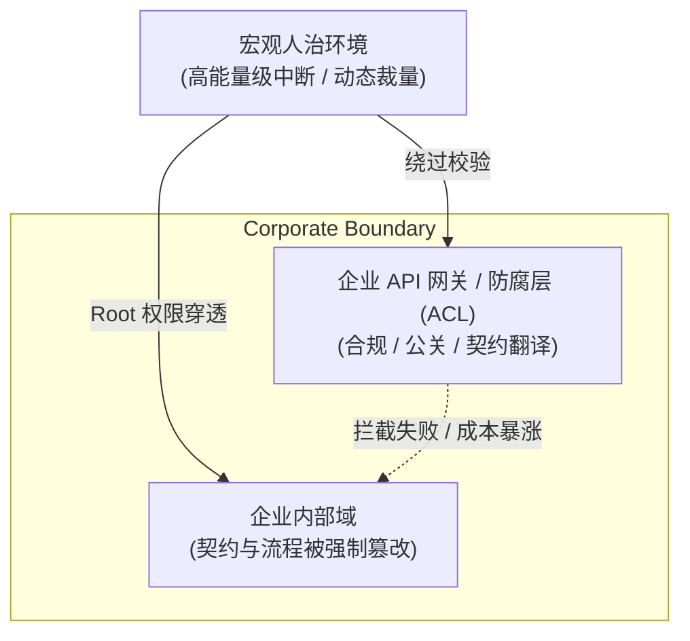
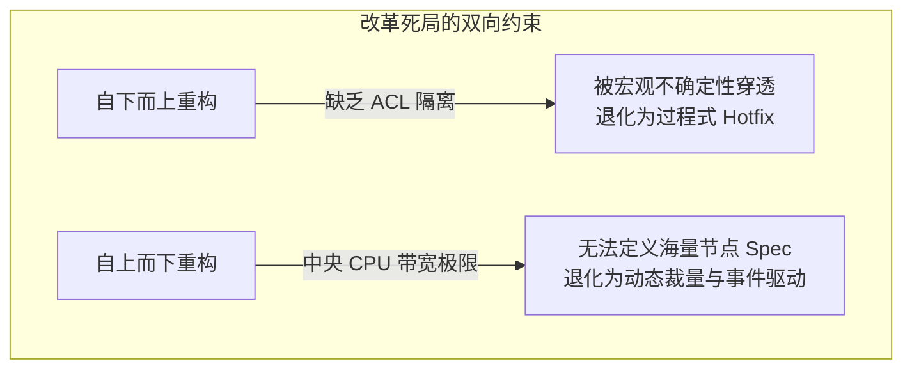
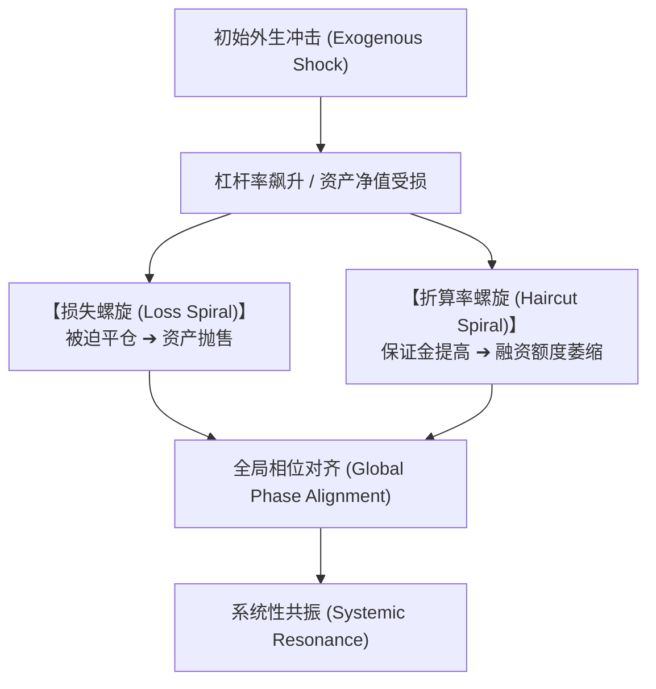
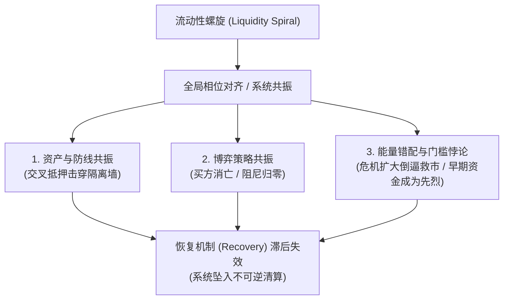
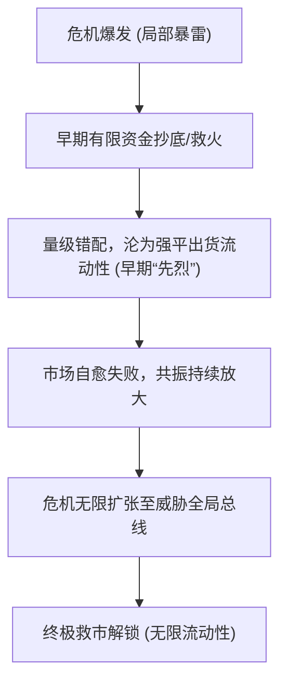
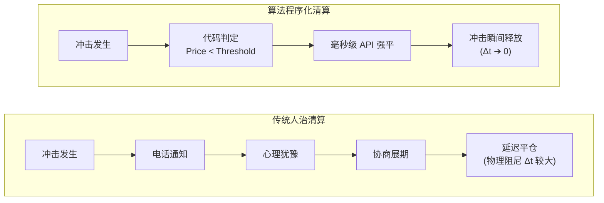
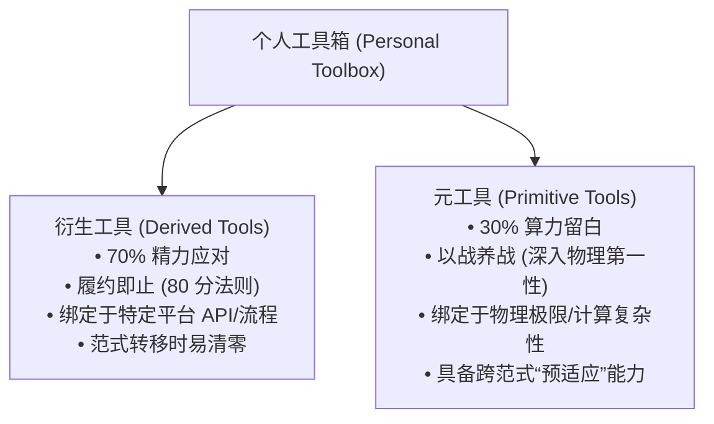
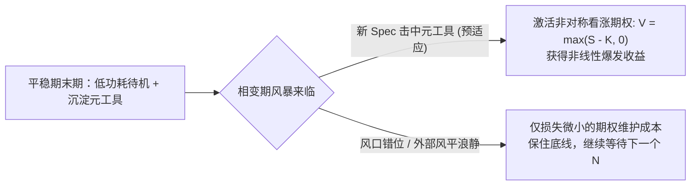

在系统工程与组织社会学的交汇处，企业的治理结构与其生存环境的交互机制是一个核心研究课题。许多分析倾向于将企业内部的规则模糊、流程混乱或“人治”倾向归咎于管理者个人的治理素养或团队的工程水平。然而，从控制论与系统架构的视角来看，企业作为嵌入在更大宏观环境中的子系统，其内部治理范式并非孤立决定的，而是对超系统（Supersystem）生存法则的**结构性适应与同构演化（Isomorphic Evolution）**。

当超系统维持“人治”（Imperative & Event-Driven）的运作范式时，子系统尝试建立“法治/契约优先”（Declarative & Contract-First）架构的努力将面临巨大的系统性阻力。本文将客观分析企业与宏观环境发生制度同构的演化机制、在大范围维度下防腐层（Anti-Corruption Layer, ACL）失灵的结构性原因，并推导系统性重构在逻辑上面临的死局。

---

## 一、 企业同构的演化机制：生存驱动下的系统降级

新制度学派社会学中的制度同构（Institutional Isomorphism）理论指出，在同一环境空间中运行的组织，其内部结构会自发向掌握关键资源分配权的外部环境靠拢。在系统工程中，这表现为子系统的接口与控制逻辑被超系统的运行模式所同化。

```
+------------------------------------------------------------------+
|           宏观超系统：人治 / 中断驱动 (Event-Driven)              |
|           资源分配：依赖动态裁量权 (Dynamic Discretion)           |
+------------------------------------------------------------------+
                                  |
                                  | 决定生存资源 (Licensing, Immunity, Red Tapes)
                                  v
+------------------------------------------------------------------+
|           微观企业系统：制度同构 (Isomorphic Evolution)           |
|           内部架构：降级为过程式脚本 (Imperative) + 应急 Hotfix   |
+------------------------------------------------------------------+

```

### 1. 资源分配逻辑驱动组织结构同构

在人治为主导的宏观环境中，核心生存资源（如行政许可、合规豁免、政策倾斜或争议裁决）的分配并不依赖于公开、静态的规范接口（Static API），而是高度依赖于管理者的动态裁量权（Discretion）与对突发事件的应急响应。

在这种博弈机制下，企业内部的资源配置必然向“能够处理非标准事件、维护人际接口”的角色倾斜，而非向“坚持 Contract-First 和 Spec-Driven”的工程团队倾斜。企业的内部组织结构自发演变为外部控制逻辑的镜像。

### 2. 过程式抢占（Imperative Override）对契约优先的博弈优势

在非确定性高、外部指令随时发生转向的规则环境中，维护严格的类型定义（Strict Typing）、数据 Schema 校验与长期架构演进需要付出昂贵的“合规与维护成本”。

当外部环境抛出一个未经预期的强中断时：

* **契约优先型系统**：需要重新定义 Spec、修改数据模型、更新 API 契约并进行回归测试，响应链路漫长。
* **过程式硬编码系统**：依赖最高管理者下达指令，直接在最外层注入补丁（Hotfix）或强行覆盖内存状态，以极短的时延响应外部中断。

在短期生存压力下，市场机制会选择性地保留那些能够快速执行“过程式抢占”的企业，而淘汰那些因为坚持契约校验而响应迟缓的企业。

### 3. 风险级联与下游契约的坍缩

系统的不确定性具有传导性。如果企业无法从其上游（宏观环境）获得确定性的服务等级协议（SLA），它若向下游（客户、员工或合作伙伴）提供确定性的履约承诺，将独立承担 100% 的违约风险与赔偿责任。

为实现风险对冲，企业唯一的理性选择是**向下游同步输出“模糊的、保留最终解释权的”人治契约**。这种不确定性沿着供应链与商业网络层层传递，完成了整个经济生态的契约坍缩。

---

## 二、 大范围 ACL（防腐层）的结构性失灵

在领域驱动设计（DDD）中，防腐层（Anti-Corruption Layer, ACL）用于隔离两个不同模型或范式的系统，防止外部混乱的数据逻辑污染内部干净的领域模型。然而，将 ACL 从小团队代码层面放大至企业级乃至社会级治理维度时，该机制面临结构性的失效。



### 1. 边界主权缺失与 `Root` 权限强行注入

软件工程中 ACL 能够生效的前提，是子系统拥有**边界主权（Boundary Sovereignty）**——即网关拥有拒绝不符合 Schema 规范的“脏数据”入场的法定权利。

然而，在宏观人治环境中，超系统的控制力具备全系统的 `Root/Sudo` 级特权。外部指令可以绕过企业设立的 API 网关与防腐校验，通过行政干预、突发检查或强制命令，直接注入企业内部执行层。当防腐层失去了“拒绝输入”的权力时，其隔离保护作用即宣告破产。

### 2. 翻译成本（Coordination Tax）的非线性暴涨

ACL 的本质是将外部非结构化、动态变化的指令，翻译为内部结构化、静态定义的 Spec。

外部环境的非确定性越高、规则越模糊，防腐层所需的翻译逻辑就越复杂。随着企业业务规模的扩大，维持这一防腐层所需的公关、法务、合规与中层协调成本（Coordination Tax）呈 $O(N^2)$ 或指数级暴涨。当维持 ACL 的费用超过了企业运营的边际利润时，防腐层在经济上便不可持续。

### 3. SLA 机制的物理崩塌

防腐层的核心价值在于为内部系统屏蔽噪声，提供稳定的运行环境。但当外部强中断以极高频率与高能量级持续穿透边界时，内部系统的状态机被频繁重置，预设的 SLA（服务等级协议）遭到反复击穿。最终，企业内部的防腐层退化为形式主义的行政打卡流程，失去其工程意义。

---

## 三、 系统性改革的死局：为什么渐进式重构无法成立

在软件架构中，处理遗留系统（Legacy System）最稳妥的策略是“绞杀者模式（Strangler Fig Pattern）”，即通过构建防腐层，在旧系统周围逐步建立新契约系统，最终实现渐进式替换。然而，在人治同构的环境中，这种重构路径面临逻辑上的闭环阻断。



### 1. 局部优化陷阱（Local Optimization Trap）

在一片高度非确定性的海洋中，尝试建立一个局部绝对确定性的“契约小岛”，会产生极高的系统内部摩擦。

每当外部环境发生突发变动，坚持 Spec-Driven 的局部重构团队都会因为“无法实现毫秒级响应”而被系统边缘化。系统动力学倾向于抹平这种局部异质性，强制将其拉回与整体一致的过程式响应状态。

### 2. 绞杀者模式在无 ACL 保护下的破产

由于大范围 ACL 无法维持边界主权，新旧系统之间的隔离屏障不复存在。

重构团队无法在一个受保护的沙盒（Sandbox）中培育新的声明式架构。任何新的契约设计在尚未演进成熟之前，就会被外部不断涌入的随机需求与紧急 hotfix 强行污染，最终新系统演变为另一座堆叠了更多 `if-else` 的“新屎山”。渐进式改革失去了空间，重构被逼入“一次性全量替换（Big Bang Migration）”的豪赌，而这种豪赌在大规模系统中成功概率极低。

### 3. 中央 CPU 带宽瓶颈与双向演进困境

系统性改革的彻底破产，体现在“自下而上”与“自上而下”两条重构路径的同步失效：

* **自下而上（Bottom-Up）**：微观层面的契约化尝试，因缺乏防腐层保护，不断被宏观人治同构化，最终流产。
* **自上而下（Top-Down）**：最高决策单元试图制定一套覆盖全系统的全局 Spec。然而，随着系统复杂度的提升，中央处理单元（Central CPU）面临信息收集与计算能力的物理极限，无法为千万级具备复杂交互的微观节点编写静态规格说明书。

当自上而下的规范制定因算力与带宽不足而瘫痪时，最高决策层不得不重新下放“动态裁量权”，依赖地方或中层的“因地制宜”与“事后处置”，系统再次自动收敛回“人治与中断驱动”的初始状态。这一循环构成了复杂系统治理中不可逾越的结构性死局。


---
## 附注：复杂系统的“间断平衡”与危机中的抗脆弱冗余

---

### 一、 演化机制：为什么真正的系统改革只发生在“间断平衡期”（Punctuated Equilibrium）？

在社会学与系统工程的交叉视角下，将系统改革寄希望于“自上而下顺滑的渐进式重构（Incremental Migration）”，通常是一种缺乏控制论支持的理想化假想。古生物学与公共政策学中的**间断平衡（Punctuated Equilibrium）**理论，揭示了复杂系统真实的演进轨迹：系统绝大多数时间处于长期的**停滞期（Stasis）**，真正的结构性变异仅发生在极短的**突变期（Punctuation / Chaos）**。

```
[ 平稳期 (Stasis) ] ─────────────────► [ 突变期 (Punctuation) ] ──► [ 新平稳期 ]
  • 维护屎山成本 < 系统可用能量          • 维护成本 > 系统能耗上限      • 重新绑定新 Spec
  • 靠协调税与 Hotfix 维持压制           • 中央 CPU 带宽彻底崩塌       • 释放局部接口主权
  • 坚决拒绝结构性重构                   • 被迫放权以防系统停机

```

#### 1. 平稳期（Stasis）对渐进式重构的天然排异

在系统运行的平稳期，哪怕底层代码堆叠了大量硬编码（Imperative Logic）与技术债，只要整个系统所获取的边际收益依然能够覆盖维持其运转的协调税（Coordination Tax）与应急打补丁（Hotfix）成本，系统就会坚决拒绝任何结构性重构。

因为重构意味着对权力接口、资源分配协议与数据 Schema 的重新定义，这会带来巨大的短期摩擦成本。在平稳期，系统动力学倾向于使用集中化的权力去压制局部变异，任何企图推行“优雅契约（Contract-First）”的自发改革，都会被平稳期的巨大重力场迅速同化或边缘化。

#### 2. 能量极限与相位变化（Phase Transition）

真正的系统改革，触发条件并非源于治理者对“契约与法治”的理性信仰，而源于系统**维护成本（Cost of Maintenance）与总能耗上限（Energy Limit）的临界点交叉**。

当内部技术债累积、外部环境冲击频次增加，导致压制混乱所需的协调能量超越了系统能够获取的总能量时，系统将遭遇**资源耗尽（Resource Exhaustion）与总线饱和（Bus Saturation）**。此时，系统无法继续依靠“消防员式救火”维持表面运转，强制进入状态相变（Phase Transition）——即间断突变期（Chaos）。

#### 3. 被迫放权与接口主权（Sovereign API）的释放

在中央处理单元（Central CPU）算力与带宽彻底瘫痪的突变期，为了防止整个系统发生不可逆的彻底停机（System Collapse），最高控制层不得不做出冷酷的算力剥离：**主动放弃部分 `Sudo` 权限，将特定子系统的控制权打包解耦，授予局部节点真正的接口主权（Sovereign API）。**

历史上所有成功的结构性改革，本质上都是危机逼近系统崩溃边缘时，中央 CPU 为了自保而被迫下放权限、允许局部建立契约沙盒（Sandbox）的物理结果。

---

### 二、 危机博弈：“Chaos is a Ladder” 的物理本质与坠落陷阱

在系统突变期，旧有的中心化锁死与硬编码规则被打破，系统进入无序的混沌状态。这一阶段完美展现了“混沌是阶梯（Chaos is a Ladder）”的系统论物理本质，但也伴随着极高能量级的系统清场风险。

#### 1. “阶梯”的本质：状态机的解耦与重置

在平稳期，系统的接口与权重已经被旧利益结构完全锁定，边缘节点无法通过常规调用向上跨越。

而在混沌期，中心化的 `Root` 控制逻辑失灵，旧的 API 映射关系崩溃，**系统状态机（State Machine）被强行重置到了未初始化的原始状态**。在此窗口期内，过往无法穿透的防腐层和行政阻力暂时消失，能够提供确定性逻辑、具备局部自愈能力的小团队，获得了重新定义 Spec、抢占核心节点的历史性机会。

#### 2. “坠落”的物理机制：安全网撤销与容错率归零

然而，混沌不仅解除了旧规则的枷锁，也瞬间抽干了系统所有的安全网（Safety Nets）。

```
平稳期博弈： 存在系统安全网 ──► 允许试错 (Git Revert / 事务回滚) ──► 容错率高
混沌期博弈： 安全网彻底熔断 ──► 非对称尾部风险 (Tail Risk)      ──► 容错率归零 (出局即粉身碎骨)

```

在平稳期，系统的制度与流程提供了大量的容错空间（允许 `Git Revert` 或回滚）；而在混沌期，系统的容错率降至绝对零点。试错代价演变为**非对称尾部风险（Tail Risk）**——决策失误不再表现为绩效惩罚，而是表现为被系统直接清场（Total System Elimination）。

那些缺乏风险隔离能力、盲目将公域乱流当成上升阶梯的节点，在没有防护的情况下暴露于高能量级冲击中，极易在相变过程中被瞬间击碎，沦为新旧秩序切换过程中的沉没成本。

---

### 三、 解耦缓冲：什么是防范“坠落”的真正冗余（Redundancy）？

要在系统突变期的震荡中避免坠落，并在局部建立重构能力，节点必须持有**抗脆弱冗余（Anti-fragile Redundancy）**。在控制论中，冗余并非低效的浪费，而是**不依赖于主系统规则而存在、自成闭环的非耦合缓冲能力（Uncoupled Sovereign Buffer）**。

#### 1. 四维硬核冗余模型

| 冗余维度 | 系统工程映射 | 具体表现形态 | 突变期作用机制 |
| --- | --- | --- | --- |
| **流动性冗余** *(Liquidity Runway)* | 无杠杆独立备用电源 | 零杠杆、高流动性、不依赖主系统信用扩张的硬资源 | 买断“不被迫做错误决策”的时间，避免在流动性枯竭时被廉价清算 |
| **认知带宽冗余** *(Cognitive Headroom)* | CPU 空闲处理带宽 | 保持 30%+ 以上的非满载状态，保有冷静观察的心理余裕 | 在极高噪声与假信号漫天飞的混沌期，精确识别临界点信号 |
| **能力多归属冗余** *(Multi-Homing Capabilities)* | 跨平台多云部署架构 | 核心能力解耦于特定平台，具备强跨系统迁移性 | 主系统 API 废弃时，底层硬核能力可无缝挂载至新系统 |
| **点对点信任冗余** *(Mesh Network Trust)* | 去中心化 P2P 局域网协议 | 脱离组织头衔后，依然成立的极少数微观强互信网络 | 中心化背书清零时，提供第一时间的真实信息、庇护与资源互换 |

#### 2. 真假冗余的鉴别界限

在评估系统的抗坠落能力时，必须严格区分“依赖型缓冲区”与“主权型缓冲区”。将依赖于旧系统才能成立的资源误认为是自身的冗余，是突变期导致节点崩溃的主要原因。

* **假冗余（Dependent Buffer - 高度耦合）**：旧系统赋予的行政头衔、绑定于单一平台的远期期权、依赖于特定领导私人关系的口头承诺、基于高压满载惯性维持的“加班耐受力”。这类资源在主系统断电时会瞬间归零。
* **真冗余（Sovereign Buffer - 完全解耦）**：脱离组织后依然被市场定价的底层通用能力、手头随时可调用的无杠杆流动性、基于 P2P 点对点沉淀的生死信任、不被生存焦虑绑架的认知空闲带宽。这类资源在主系统瘫痪时依然能独立输出功用。

---

> **结语**：
> 复杂系统的演进并非一条优雅递增的斜线，而是在停滞与突变交替中的断崖跃迁。理解“人治重力场下企业同构与重构死局”的残酷性，其目的不在于陷入消极的宿命论，而在于摒弃在平稳期进行宏大增量重构的幻想。
> 在大系统处于停滞期时，微观节点的理性生存策略是**收缩防御边界，坚守 Scope 极小的边缘防腐层（ACL），并在主系统之外持续积攒解耦的真冗余**；待到系统维护成本突破极限、进入间断突变（Chaos）的瞬间，再凭借完备的冗余与确定性的契约架构，完成向新状态机的跃迁。

---

## 附注2：系统相变中的“清场”机制与物理实证

---

### 一、 概念定义：相变临界点上的状态剥离（State Eviction）

在控制论与分布式系统工程视角下，“**清场**”（Clearing / Total Liquidation）是指当系统跨越临界点进入**相变期（Phase Transition / Chaos）**时，系统的容错率归零，由于缺乏独立主权冗余，导致部分节点（企业、机构或个人）遭遇**非线性状态剥离（State Eviction）**，彻底失去进入下一个平稳期（Stasis）参赛资格的物理现象。

```
[ 平稳期 (Stasis) ] ───────► [ 相变期 (Phase Transition) ] ─────► [ 新平稳期 ]
  • 依靠假冗余维持生存         • 容错时间压缩至零                    • 存活节点重新绑定新 Spec
  • 系统容错率 > 0             • 假冗余瞬间归零                     • 失败节点遭遇“状态剥离” (清场)
  • 允许试错与回滚             • 资产倒置为高昂负债
```

清场并非常规运行状态下的“局部伤害”或“绩效降级”，而是系统为了平抑全局风险的爆炸半径，通过硬性断流剥离不具备反脆弱性节点的物理过程。

---

### 二、 典型领域的“清场”物理实证

在不同复杂系统的相变期，清场现象呈现出极其一致的系统论动力学特征：

| 清场维度 | 系统相变触发条件 | 被清场节点误判的“阶梯” | 依赖的“假冗余” (Dependent Buffer) | 清场物理过程 |
| --- | --- | --- | --- | --- |
| **金融杠杆清场** *(以 3AC 为例)* | 系统性信用链条断裂，流动性极速枯竭 | 将高能量级波动误认为无风险套利与杠杆扩张机会 | 机构间的无抵押循环信用与行业顶流的“关系背书” | 资产价格下挫触发 Margin Call 级联反应，缺乏无杠杆现金（真冗余），两周内被追缴清盘 |
| **产业生态清场** *(以诺基亚/黑莓为例)* | 移动终端底层 API 协议从“功能机/语音”向“软件/生态”相变 | 以为智能操作系统仅是传统手机增加功能模块的阶梯 | 庞大的电信运营商渠道网络、工业级供应链规模与既有用户粘性 | App Store 去中心化生态爆发，旧架构的渠道与硬件规模退化为高昂维护成本，市占率断崖降至归零 |
| **宏观规则清场** *(以高杠杆房企为例)* | 宏观超系统切断金融风险传导，硬性修改流动性规则 | 将周期性宽松误认为永久规律，盲目举债做大规模 | “大而不倒（Too Big to Fail）”的隐性背书与土地滚续发债能力 | “三道红线”硬性封顶，借新还旧链条断裂，资产挤兑为无法变现的债务，创始人失去控制权，股权价值清零 |

---

### 三、 系统“清场”的三项物理铁律

从系统攻防与演化的角度总结，任何领域发生的清场，均遵循以下三项不以个体意志为转移的物理规律：

#### 1. 资产与负债的瞬间倒置（Asset-to-Liability Inversion）

在平稳期（Stasis）被系统评估为“核心资产”的要素（如庞大的渠道关系、高价存货、信用额度或规模效应），在相变（Chaos）发生的瞬间，因底层协议被修改，会**瞬间退化为需要支付昂贵维护费用的负债**。

试图依靠这些“资产”去抵御系统冲击，等同于在总线断裂时继续加挂负载，只会加速节点的崩塌。

#### 2. 容错窗口的物理压缩（Time-to-Fault Compression）

在平稳期，系统提供了充沛的容错时间（如允许 `Git Revert`、债务展期或公关关切）；但在相变期，**系统的容错时间被瞬间压缩至零**。

系统不会再给节点留出“变卖资产”、“修改错误”或“编写 Hotfix”的缓冲区。流动性断绝与规则重构发生在毫秒级或极短的时间窗口内，缺乏即时可用真实冗余的节点瞬间陷入出局死局。

#### 3. 参赛资格的不可逆剥离（Irreversible State Eviction）

清场的终局不是“带伤留存”，而是**彻底剥夺控制权与节点身份**。

系统通过清算股权、清退市场份额或彻底注销节点权限，将无法适应新契约（Spec）的参与者清除出局，从而为新秩序的建立腾出计算带宽与资源空间。

---


## 附注3：系统共振与不可逆瘫痪——相变期“极速清算”与无法自愈的底层机制


### 一、 引言：流动性螺旋引发的全局“相位对齐”

在金融微观结构与控制论中，马库斯·布伦内迈尔（Markus Brunnermeier）提出的流动性螺旋理论描述了市场流动性（Market Liquidity）与融资流动性（Funding Liquidity）之间的正反馈耦合：

* **损失螺旋（Loss Spiral）**：资产价格下跌 $\rightarrow$ 机构净值缩水 $\rightarrow$ 杠杆率被迫飙升 $\rightarrow$ 被迫平仓抛售 $\rightarrow$ 价格进一步暴跌；
* **折算率螺旋（Margin/Haircut Spiral）**：价格波动率放大 $\rightarrow$ 资方与交易所提高保证金比例（Haircut 飙升） $\rightarrow$ 融资可用额度萎缩 $\rightarrow$ 变现更多资产 $\rightarrow$ 波动率二次放大。



然而，流动性螺旋在相变期（Phase Transition / Chaos）所引发的现象，远不止资金量的匮乏，而是一场**系统级别的“全局相位对齐（Global Phase Alignment）”与频率锁定（Frequency Locking）**。

在平稳期（Stasis），系统内的各个参与者、资产标的与风控规则是高度异质（Heterogeneous）且相位分散的——不同的投资期限、多元的对冲策略以及错开的风控阈值，共同为系统提供了阻尼（Dampening）。但当双重流动性螺旋交叉强化时，高能量级的冲击强行抹平了节点的异质性。所有原本独立的防线、风控脚本和止损卖单，在极短的时间窗口内被强制调谐到了同一个触发频段，产生**相干干涉（Constructive Interference）与全局共振（Resonance）**。

---

### 二、 核心机制：三维共振如何阻断自愈与“救市门槛悖论”

相变期清算之所以能在极短时间内完成，且在运行期（In-flight）**难以靠早期干预实现自愈**，是因为全局共振从三个维度彻底摧毁了系统的自我纠偏结构：



#### 1. 资产与防线共振：交叉抵押打穿物理隔离（Cross-Asset Defensive Resonance）

在现代化风控和资产管理架构中，交叉抵押（Cross-Collateralization）被广泛用于提高资金效率。然而在相变期，交叉抵押成为了传导共振能量的物理导线：

* 单一资产 $A$ 跌破临界点触发 Margin Call 时，风控系统并不会等待 $A$ 慢慢变现，而是会自动触手延伸，强制抛售一篮子交叉抵押品中流动性最好、原本毫无关联的优质资产 $B$ 与 $C$；
* 资产 $B$ 与 $C$ 的无差别抛售，瞬间激活了绑定在 $B$ 与 $C$ 上的第二层风控脚本与对冲盘；
* 本以为相互独立、时间错开的“多重防线（Defensive Lines）”，在交叉抵押的传导下被同时激活。**原本用于防火隔离的防腐层（ACL）被同频共振的清算卖压瞬间融化。**

#### 2. 博弈策略共振：反向力量消亡与阻尼系数归零（Behavioral & Strategic Alignment）

在控制论体系中，一个系统能够实现震荡收敛，依赖于系统中存在**阻尼机制（Dampening Mechanism）**。在市场系统中，阻尼由“看多者/做市商/价值投资者”等提供买盘深度的反向博弈者构成。

然而，在全局共振开启的瞬间，博弈论的收益矩阵发生断崖式倒转：

* 任何尝试在共振峰值期“接刀子/救火”的买方，其挂单深度（Bid Depth）会在毫秒级内被倾泻而下的清算单直接打穿；
* 站出来提供流动性的成本变成了“瞬间遭受毁灭性穿仓”。理性博弈者的最优策略迅速发生**同质化收敛**：撤销所有买单、停止做市、加入抛售队列；
* 系统的阻尼系数归零（$\zeta \to 0$），负反馈机制完全丧失，卖压在无阻力的空间内呈自由落体状态。

#### 3. 自愈能量错配与“救市门槛悖论”（Bailout Threshold Paradox & Structural Martyrdom）

从逻辑与控制论上看，“救市资金不够”并非理论上限，只要注入无限级的终极流动性（如央行作为最终贷款人 Sovereign Lender of Last Resort），强行吃掉所有清算卖单，共振确实可以被物理阻断。

然而，这里存在一个致命的**博弈与触发门槛悖论**：



* **能量级错配与“先烈”的诞生**：在危机初期与扩张期，尝试救场与抄底的均属于“有限资金”。在全网杠杆清算的总动量面前，有限资金在数量级上完全错配，挂入订单薄的瞬间即被海量强平单吞噬，沦为清算程序的“出货流动性（Exit Liquidity）”。这批早期救火者在结构上**注定成为被清场的“先烈”**；
* **超级救市资金的内生触发条件**：真正的“无限级救市资金”拥有极高的政治、行政与法律动员成本。只要危机尚处于局部，超级 CPU（国家/央行）就不会也不可能解锁“无限流动性注入”许可；
* **危机扩大是无限救市的前置条件**：系统必须任由危机无阻碍地蔓延与扩张，直到整个宏观超系统的核心信用与结算总线面临彻底瘫痪风险（Systemic Core Failure）时，超级救市的门槛才会被触发。

因此，**救市不是不生效，而是无限救市的生效必然以“危机彻底放大”和“早期自救者全数沦为先烈”为代价。**

---

### 三、 催化剂：技术与算法作为“共振加速器”

需要明确的是，高频交易、程序化风控与智能合约等技术手段**并非引发系统共振的根源**，而是去除了物理摩擦力、极大地放大了共振峰值的**能量加速器（Accelerators）**。



#### 1. 消除生理与心理迟滞（Zero Latency Friction）

传统的人性化清算流程中存在大量的“心理阻尼”与“时延（Latency）”——交易员的心理犹豫、风险关切电话、紧急开会协商、甚至手动填写平仓单。这些看似低效的物理阻尼，客观上将清算能量在时间轴上进行了拉长与稀释。

而写死在代码中的风控规则（如交易所清算引擎、DeFi 智能合约中的 Liquidator Bot）去除了所有情绪与协商空间。一旦价格触发硬编码阈值，程序在毫秒级内下发指令，将原本需要几天分散释放的清算能量，压缩在极窄的时间窗口内集中爆发。

#### 2. 能量浓缩爆发与总线过载（Bus Saturation）

根据冲量定理：

$$F \cdot \Delta t = \Delta p \implies F = \frac{\Delta p}{\Delta t}$$

当清算总动量 $\Delta p$ 确定时，技术将清算施加的时间 $\Delta t$ 压缩至趋近于 0，导致作用于系统总体架构上的毁灭力 $F$ 呈指数级暴涨。

高频强平指令在毫秒内挤爆了网络 API 带宽与交易撮合总线。正常用户的补仓、撤单与止损对冲指令因网络拥塞（Network Congestion）被大量丢弃或延迟，**系统在技术层面锁定了所有的自救通道，极速推进共振进程**。

---

### 四、 总结：相变期清算的系统论本质

从控制论与系统工程的终局视点来看，相变期的极速清算揭示了复杂系统运行的冷酷物理法则：

1. **救市时机与牺牲的必然性**：
无限流动性救市确实能够平息共振，但其触发机制决定了它只能在危机彻底放大的尾声降临。在这之前，任何尝试中途阻挡共振的局部资金，均会被清算机制碾碎为“先烈”。
2. **状态重置的唯一路径**：
共振爆发后，系统无法实现平滑降级。清算过程只能持续进行，直到系统内所有脆弱的、高杠杆的、相位错配的节点被**彻底烧毁与清场（Burnout）**，或者危机扩大触发超系统无限救市介入，系统才能在废墟之上重新完成状态机的重置与规范绑定。


---

## 附注4：系统相变中的个体生存契约——“尽人事”的微观解耦与“知天命”的周期博弈

---

### 一、 “知天命”：解耦宏观期望，接纳周期的冷酷物理性

在复杂系统的演化中，**系统的全局 Beta（时代周期、相变时机、入场节点）对微观个体具有绝对的统治力**。在系统平稳期尾声（Stasis Tail-end）进入社会的个体，面对的是核心资产高位锚定、结构性阶梯封顶、边际回报递减的硬性约束。

“知天命”的本质，是**将个人价值评价体系从宏观系统的不确定性中物理解耦**：

```
                           ┌─ 90% 宏观 Beta (时代周期 / 行业相变 / 外部风口) ──► “知天命”：彻底放弃内耗与执念
个人心理与资源控制系统 ──┤
                           └─ 10% 微观 Alpha (负债控制 / 算力分配 / 元工具打磨) ──► “尽人事”：绝对掌控战术边界

```

1. **认清“次优选择”的战术本质**：
在系统收缩与相变期，强行追求“最优解”（如加杠杆冲刺旧高位、盲目换赛道试错）极易触发 Margin Call（追缴保证金）而清场。接受降薪、次优岗位或退守，并非个人能力的贬值，而是**系统进入“低功耗待机（Low-Power Mode）”的客观物理需要**。
2. **识破“努力与回报”的非线性脱钩**：
当系统整体增量归零时，强行“加倍努力”如同汽车陷进泥潭猛踩油门——除了耗尽个人身体与精神算力，无法产生物理推进力。放弃对“努力必然升职加薪”的迷信，是停止自我攻击的起点。

---

### 二、 “尽人事”：战术上的绝对控制与工具箱二分

在“知天命”的基础上，“尽人事”要求个体将 100% 的行动力收拢回自己唯二能绝对掌控的领域：**生存底线的物理防御** 与 **个人能力库的冷酷二分**。

#### 1. 物理防御：极致卸载固定开支（低 Burn Rate）

清算机制（Margin Call）的触发条件永远是“负债 > 资产”**或**“现金流断裂导致无法覆盖固定开支”。

* **战术动作**：拒绝在周期尾声接盘任何长期杠杆（天价房贷、消费负债），把月度生存成本（Burn Rate）压缩至最低。
* **物理效果**：不背负系统性债务的人在物理上“无法被系统清场”。保留充足的身体算力与情绪留白，即锁定了**重复博弈权（$N \to \infty$）**——能靠极低成本活得比别人久，本身就是最高维度的生存资本。

#### 2. 能力构建：“80 分履约”与“以战养战”的工具箱二分



* **衍生工具（Derived Tools）——“80分履约，低功耗待机”**：
应对当前业务（如大厂审批流、特定框架语法糖、KPI 向上管理）。用 70% 的精力完成 80 分的合规履约即可，坚决放弃边际性价比极低、消耗极大的最后 10% 争夺，将溢出的精力回收给个人。
* **元工具（Primitive Tools）——“以战养战，淬炼通用菜刀”**：
借用当前业务场景（HOW），去探寻底层的物理与工程第一性原理（WHY）——如对硬件瓶颈（带宽、延迟、内存拓扑）的直觉、分布式博弈设计、高维数据拆解能力。这类工具不依赖于特定平台，具备极广的接口匹配面。

---

### 三、 预适应（Exaptation）与非对称凸性：DeepSeek 模式的终局映射

引用前文《[钟摆的宿命：从 DeepSeek 的极限黑客流，看 AI 时代的“契约分离”](https://cj9208.github.io/blog/ai_era_engineering_careers/pendulum-contract-separation/)》，DeepSeek 团队在大模型推理成本上的突破，并非源于对未来的神圣预知，而是其母公司（幻方量化）在高频交易场景中打磨的**元工具**（对显存带宽、NVLink 拓扑、PTX 汇编的极致压榨），在 AI 行业转入“精打细算”的相变期时，恰好与新的物理 Spec 产生了契合。

这种“在旧场景积累元工具，在未知新场景被瞬间激活”的现象，即为演化生物学中的“预适应”（Exaptation）。



在相变期，个体的元工具箱本质上是一串**看涨期权（Convex Call Option）**：

$$V = \max(S - K, 0)$$

* **下行风险有界（$K$ 极小）**：接受次优岗位，保持极低 Burn Rate，不盲目冲锋；哪怕新风口与己无关，也仅损失了平稳期放弃最后 10% 绩效的折损，绝不至于爆仓出局；
* **上行收益无界（$S - K$ 极大）**：一旦新周期的 Spec 击中了你的元工具箱，期权被瞬间激活，带来非线性的跃迁回报。

---

### 四、 策略全景与终局心态矩阵

| 维度 | 消极听天由命（被动剥离） | 尽人事，知天命（主权解耦） |
| --- | --- | --- |
| **对宏观 Beta 的态度** | 盲目跟风加杠杆，或因无力改变而毁灭性摆烂 | **知天命**：接纳周期收缩，接受次优选择，开启低功耗待机 |
| **对微观 Alpha 的战术** | 100% 卷入旧系统内耗，或强行找“最优解” | **尽人事**：控制负债与 Burn Rate，“80分履约”挤出 30% 算力留白 |
| **工具箱打磨** | 堆砌窄匹配面的“衍生工具”（平台套利） | **以战养战**：借业务场景磨炼脱离平台依然成立的“元工具” |
| **相变期终局** | 成为旧系统清场的“出口流动性” | 保留**重复博弈权（$N \to \infty$）**，等待预适应共振激活期权凸性 |

---

> **结语**：
> “尽人事，知天命”不是消极的妥协，而是最深沉的现实主义理性。
> 把掌控不了的时代风口与相变时机归还给宏观周期（知天命）；把能掌控的负债控制、身体算力与元工具打磨死死握在手里（尽人事）。在风没有吹来之前，不被自己的焦虑提前击垮，保住底线留在桌上——这就是微观个体在人治重力场与周期大潮中，最硬核的战略胜利。