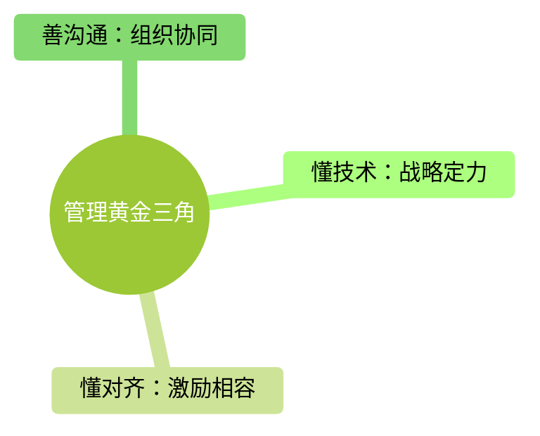

在 PC 时代的泥潭里，普通用户常常陷入一种荒谬的困境：电脑里的默认浏览器隔三差五被 Windows “偷家”重置回 Edge；点开微信里的一个链接，不仅被强制锁死在内部浏览器里，甚至连部分原生功能都被“阉割”，逼着你必须跳转到小程序。

每当用户表达愤怒，巨头们总能拿出高度一致的公关辞令：“为了您的资金与信息安全”、“防范恶意软件篡改”。在“心”（主观动机）的层面上，它们永远是高尚的“用户守护神”；但在“迹”（客观行为）的层面上，它们做的事却和流氓毫无二致。

面对这种“用安全做遮羞布”的生态乱象，传统的治理往往流于表面。唯有秉持“论迹不论心”的法理逻辑，像监管“系统重要性金融机构”一样去卡死科技巨头，才能真正终结这场平台霸权。在这方面，欧盟近年来高高举起的法律皮鞭，为全球提供了一个像素级的治理样本。

---

## 一、 论迹：剥开“安全防弹衣”下的流氓行径

中国古代法家和现代法治都强调一个核心原则：**不看你怎么说，只看你怎样做。** 如果用这个标准去审视如今的操作系统和国民级应用，会发现它们的行为已经严重越界。

### 1. 裁判员拉偏架的“定向双标”与用户的“斯德哥尔摩式支持”

以微软在 Windows 内核层（Ring 0）部署的 `UCPD.sys`（用户选择保护驱动）为例。微软宣称其目的是“防止恶意软件强行修改默认文件关联”。

* **论心：** 这听起来是一个维护系统纯净的崇高举动。
* **论迹：** 逆向安全研究人员发现，该驱动内部硬编码了一个专门针对 360 等特定国产软件的黑名单。如果是自家的 Edge 浏览器或 Office，则可以通过系统级特权和计划任务（如 UCPD velocity）在后台悄悄重置用户的默认设置。这种“只许州官放火，不许百姓点灯”的行为，本质上是利用底层垄断特权定向打击竞争对手，属于典型的商业垄断与流量劫持。

然而，这里出现了一个极其荒谬且令人心酸的现实：虽然看清了微软的双标和垄断越界，但绝大多数苦流氓软件久矣的国内用户，在情感上居然戏谑地选择支持微软。

这种“倒戈支持”的背后，是因为没有对比就没有伤害。同样是作恶，微软的手段更像是一个烦人的技术官僚（微恶）——它只是隔三差五把默认浏览器悄悄改回 Edge，或者让 Office 像个赖着不走的牛皮糖一样，每次更新都在系统里强行刷存在感，点击任何文档都提示你安装激活。它虽然拉偏架、虽然臃肿恶心，但好歹留给用户一堵干净的桌面。

相较之下，国内流氓软件的手段则是真正把“流氓”这两个字发挥到了极致（大恶）。它们当年是在和各种顽固木马肉搏中成长起来的，如今却把这身硬核的技术全部用在了对付用户上：破门而入的“全家桶”连环寄生、把驱动写进 Ring 0 内核层的“狗皮膏药式”防卸载自保、以及开机即满屏的“擦边球”弹窗广告……它们要的不是合规竞争，它们是要剥夺整台电脑的控制权，把用户的硬件当成自己收割流量的养料。

在“根本没人真的在乎用户”的荒漠里，国内用户被迫陷入了一种无奈的妥协：他们不得不支持一个利用垄断特权玩弄双标的“跨国资本巨鳄”，来帮自己消灭眼前的“本土地头蛇”。 **这种“恶人还需恶人磨”的获得感背后，掩盖的是用户毫无底层决定权的悲哀**——在没有顶级法律武器保护的情况下，两害相权取其轻，向“吃相稍微体面一点”的底层霸权低头，成了中国网民独有的一种技术悲怆。

### 2. 移动端生态的“画地为牢”与技术退化

同样的逻辑在移动端更为变本加厉。微信强制所有外链必须在内部浏览器打开，甚至在设置中彻底取消了“默认用外部浏览器打开”的选项。

* **论心：** 腾讯的官方理由依然是“防范网络诈骗，保护用户财产安全”。
* **论迹：** 强制内置只是表象，其背后隐藏着极其恶劣的技术垄断与全盘绑架。

#### ❌ **罪状一：用私有垃圾标准，强行逆转互联网的开放历史**
在正常的互联网世界中，W3C 国际标准（HTML5）是通用的，一个网页应该在任何设备、任何浏览器上获得一致的体验。 但微信的做法是“人为制造技术退化”：它在内部浏览器中恶意阉割标准的 HTML5 功能，屏蔽竞争对手的链接。然后它摆出一副救世主的姿态，逼着全网的开发者抛弃标准网页，转去开发极其封闭、无法跨平台复用的“微信小程序”。 通过这种对外部功能的降维打击，微信成功把原本属于全人类的开放万维网，强行格式化成了“腾讯特供版局域网”。你在其他地方想用完整功能？对不起，不支持。
#### ❌ **罪状二：强行捆绑，剥夺用户“说不”的分割权力**
一个健康的软件，聊天就是聊天，生活服务就是生活服务。但微信利用其“国民级基础设施”的垄断地位，把短视频、直播、小程序、政务、支付等无数臃肿的模块，死死地强行绑定在一个安装包里。 更恶心的是，它正在像微软一样，玩弄“强推且关不掉”的系统级特权。即便是有一定技术能力的资深用户，每次更新都把能关的乱七八糟功能全部关闭，最近微信强推的某些核心模块依然像牛皮糖一样“常驻”，彻底剥夺了用户的分割权。 对于那些不懂技术、占绝大多数的普通用户（比如老人）来说，他们的手机后台只能任由微信肆意蹂躏。微信在后台常年维持着巨大的资源消耗，疯狂吞噬着用户的 CPU、内存和电池寿命，把用户的私人硬件变成了它自己的大型流量孵化器。

---

## 二、 欧盟的“看门人”制度：能力越大，锁链越粗

为什么国内外的流氓行为屡禁不止？因为传统的反垄断法和行业监管往往偏向“事后处罚”。巨头先作恶，监管去取证，官司打上三五年，小公司早就倒闭了，巨头交点毛毛雨般的罚款，转身继续收割。

欧盟在 2022 年出台并全面实施的《数字市场法案》（DMA，Digital Markets Act），彻底颠覆了这种传统逻辑。它是一部将“论迹不论心”发挥到极致的现代法律。

### 1. 身份认定“只看体量，不看主观”

在金融监管中，体量庞大的银行会被定性为“系统重要性银行”，接受远比社区银行苛刻的监管。DMA 引入了异曲同工的“看门人（Gatekeeper）”制度。

欧盟不听科技公司解释自己多有良心，只看硬性指标：市值达到 750 亿欧元或年营业额超 75 亿欧元，且在欧洲拥有超 4500 万月活用户。一旦过线，直接官方定性为“看门人”（如 Alphabet、Apple、Microsoft、Meta 等）。只要你是大机构，你就必须面临更强的监管，你的权利天然受到限制。

### 2. 行为规范“事前画线，一触即发”

法律直接为这些“看门人”列出了清晰的“能做”与“不能做（Do's and Don'ts）”清单。监管机构不再需要花几年时间去证明巨头的某个恶心行为“是否对市场造成了实质损害”，只要你的产品设计踩到了红线，直接判定违法。

---

## 三、 以法治矛：如何精准整治这些流氓行为？

针对巨头们最核心的几种恶心套路，欧盟 DMA 开出了三剂堪称“精确制导”的解药，完美示范了如何用技术与法治的组合拳整治流氓行为：

### 1. 强制提供【选择屏幕】，剥夺平台微调特权

为了对抗微软、苹果利用系统更新频繁把默认浏览器篡改回 Edge 或 Safari 的流氓行径，DMA 规定（Art. 6(3)）：操作系统必须允许用户轻松卸载任何预装应用。在用户首次使用时，必须弹出一个中立、随机排序的“选择屏幕”（Choice Screen），把决定权完全交还。

> **整治效果：** 在欧盟的强压下，微软在欧洲被迫允许用户彻底卸载 Edge；苹果也不得不在 iOS 中提供完全中立的浏览器选择。

### 2. 打破私有围墙，强制执行【互操作性】

针对微信式“内部浏览器锁死、阉割外链、不与其他软件互通”的垄断行为，DMA 第 7 条规定了“互操作性（Interoperability）”。

核心平台服务的即时通讯软件，必须无条件向第三方开放标准的、无歧视的技术接口（API）。

> **整治效果：** 比如 Meta 旗下的 WhatsApp 必须与 Signal、Telegram 等小众软件互通。用户可以用自己喜欢的干净客户端，直接给大平台的用户发消息、打视频。大厂被禁止利用“不兼容”来要挟用户，更不能恶意降维外部标准网页的功能。竞争的维度被迫从“谁垄断了关系链”倒逼回“谁的产品体验更好”。

#### 💡 **案例聚焦：2026年了，为什么发一个文件会塞满 100G 手机空间？**
在 2026 年的今天，生成式 AI 已经能够自动生成复杂的分布式架构，但作为拥有数亿月活的国民级应用，微信在底层最基础的文件传输逻辑上，行径却恶劣得令人发指——当你给多个人转发同一个文件时，微信的底层逻辑居然是“复制文件、改个后缀、重新在本地存一份”。

在任何一个合格的软件工程实践中，这都是连实习生写出来都会被痛批的垃圾代码。正常的现代技术（如 Telegram 或任何企业协作软件）只需要在纯本地数据库搞一个“纯接口导向/引用计数”的逻辑：文件首次写入本地后计算一个 MD5 哈希值，后续无论转发给 10 个人还是 100 个人，系统都只需要将聊天记录的指针直接导向这个唯一的物理文件（引用计数 +1）。磁盘空间永远只占用一份。

微信放着这种计算机科学里最基础的纯本地接口导向不用，偏要搞物理复制，其“迹”极其恶劣：
1. 一方面，它极度懒惰，为了不重构自己那堆“屎山”一样的本地清理机制，选择将技术负债直接转嫁给用户；
2. 另一方面，它借用“安全隔离”的公关借口，肆意剥削、蹂躏用户的手机硬件，人为制造了数亿 GB 的重复电子垃圾。用户被迫为它的技术低下买单，自己掏钱去买 512GB 甚至 1TB 的昂贵手机。
 
而欧盟强制要求的【互操作性】，正是为了用“技术解药”去解构这种技术傲慢。在互操作性的法理下，大厂不能再利用“不兼容”和“社交关系链”来要挟、圈养用户。一旦接口被强制开放：
* **中小企业拿回公平入场的门票：** 创业公司不再需要去跟万亿级的巨头比拼“资本、人脉与生态捆绑”。只要你的产品做得足够优秀、足够纯净、足够尊重用户，用户就可以放心地选择你。
* **用户可以彻底“用脚投票”：** 你完全可以卸载官方那个动辄几十 GB、底层技术低下的臃肿客户端，转去下载一个只有几百 MB、响应极快、采用纯指针导向文件管理、完全没有广告的第三方纯净版聊天 App（例如 Telegram 风格的微信客户端）。
* **社交生态被迫回归产品力的竞争：** 因为接口互通，你在这个轻量级、完全尊重用户硬件的客户端里发的每一句话，依然能无缝发送到长辈和老板的官方微信上。大厂被迫从“谁垄断了流量就躺着摆烂”的垄断神坛上走下来，重新去卷“谁的体积更小、谁的架构更优雅、谁最尊重用户的隐私与硬件”。

### 3. 严禁【自我优待】，斩断裁判员的黑手

针对大厂“既当裁判员又当运动员”，在自己的平台上给自家产品引流的行为，DMA（Art. 6(5)）明令禁止自我优待（Anti-Self-Preferencing）。平台在排名、索引、跳转上，必须给第三方和自家产品同等的待遇。如果系统级驱动敢定向封杀第三方安全软件而放任自己，或者应用内部敢屏蔽竞争对手的链接，将直接触发最高可达全球年营业额 $10\%$ 到 $20\%$ 的天文数字罚款。

---

## 结语

互联网不应该是一个“以暴制暴”的黑帮丛林，不能指望用系统级的流氓（微软）去消灭应用级的流氓（360），更不能指望资本在缺乏约束时发现良心。

欧盟的法律实践证明：对抗平台霸权，必须依靠强有力的、具备“事前穿透力”的法律武器。 **只有当监管的鞭子真正变硬，罚款额度能让跨国巨头伤筋动骨时，那些傲慢的资本才会收起藏在“安全”外衣下的流氓尾巴。**

“论迹不论心”，是现代数字公民赢回自由与尊严的唯一解药。

---

## 附注：利益冲突的终局与法治的“钢牙”

### 一、 商业模型的降维解构：流氓行为源于“利益冲突”

若从金融与法理的双重视角审视，互联网大厂的“技术流氓行为”并非偶然的工程失误，而是其底层商业模式所决定的必然结果。这里存在一个核心的评判标准：**是否存在不可调和的利益冲突（Conflict of Interest）。**

在金融市场中，既做买方又做卖方、或既当裁判员又当运动员的机构，必然会为了自身利益而侵害客户的受托资产。数字生态亦然：

* **垄断巨头的原罪：** 诸如微信、微软等平台级大厂，其本质面临着致命的利益冲突。它们前端扮演着“提供高效工具”的受托人角色，后端却承载着“追求极致流量与生态垄断”的资本庄家野心。当两者发生冲突时，资本必然驱动技术走向退化。于是我们看到，微信宁可让物理复制的垃圾代码吞噬用户的本地硬件，也绝不开放接口；它们把用户的硬件当成免费的租界，在每一行冗余代码里完成了对用户资产的强制变现。
* **独立与开源的清流：** 与之形成鲜明对比的是 Anaconda、Docker、Git 等底层技术工具。它们之所以赢得技术圈的信任，恰恰是因为它们与用户之间利益高度一致（Alignment of Interests）。作为纯粹的生产力工具，它们的商业价值完全取决于“如何让用户的体验爽到极致”。它们无意、也无需在用户的根目录下构建违章建筑或实施生态绑架。

天底下的资本都在逐利，但没有利益冲突的独立工具懂得“克制与永续收割”；而身处利益冲突风暴中心的垄断大厂，则只想在缺乏约束的丛林里搞“毁灭式竭泽而渔”。

### 二、 结语：为什么数字世界需要“长着钢牙”的法律？

在这场非对称的数字折磨中，寄希望于巨头在缺乏约束时自发发现良心，无异于与虎谋皮。在科技大厂已经成长为“数字利维坦”的 2026 年，用户在系统层建立的防御（如更换 MacBook、使用 App Store 强制沙盒化、配置 XDG 收纳路径等），本质上只是弱势群体在技术荒漠里的一种“消极抵抗”与斯德哥尔摩式的自救。

要将技术的主权真正还给数字公民，将公平创新的门票重新发给中小企业，人类社会必须祭出超越“事后处罚”的终极武器——如同监管“系统重要性金融机构”一样，去卡死科技大门。

我们需要像欧盟《数字市场法案》（DMA）那样“长着钢牙”的法律。这口钢牙的威力在于：

1. **论迹不论心：** 扯掉“为了安全与隐私”的公关防弹衣，不听大厂的任何主观辩解，只看其客观留在用户设备上的行为痕迹。
2. **事前穿透：** 直接画下不可逾越的技术红线。只要你的体量过线，就必须强制剥离自我优待，强制执行互操作性（Interoperability），将封闭的局域网高墙无条件拆除。
3. **伤筋动骨的代价：** 唯有当法律的惩罚额度能够达到“全球年营业额 $10\%$ 至 $20\%$”的天文数字、能真正让跨国资本伤筋动骨时，那些傲慢的巨头才会收起藏在技术外衣下的流氓尾巴。

在长出钢牙的法律普及之前，保持愤怒、保持挑剔、并用脚投票去拥抱那些利益一致的独立工具，是技术人最体面的骄傲。而数字世界的终局，注定是一场用“制度铁拳”驯服“资本技术”的法治战争。

---

## 附注2：复合型管理人的“黄金三角”与技术主权

### 一、 跨界认知的必然：从工程师思维到制度设计

若将前文对数字垄断、利益冲突的解构引入到微观的组织管理中，便能得出一个关于“技术管理人（Tech Leader）”的终极画像：**最顶级的技术治理，绝非单纯的工程堆砌，而是“懂技术、懂对齐、善沟通”三位一体的制度设计。**

在传统的科技行业中，纯粹的工程师往往专注于“如何实现（How）”，容易陷入对客观代码、优雅算法的理想主义自嗨，甚至将大厂的架构摆烂归咎于纯粹的能力问题。然而，具备金融或制度背景的管理视角则能实现降维打击——它直视人性的逐利与博弈，关注“谁在定规则、利益怎么分（Who & Why）”。

当这两种思维在一个人身上发生交融时，便构成了 AI 时代最稀缺的“管理黄金三角”。

### 二、 黄金三角的微观解构

* **懂技术（决胜的底气与下限）：** 一个具备硬核技术底气的管理人，是团队的定海神针。他推崇 KISS 架构原则与契约驱动开发（Spec-Driven），能一眼穿透表象、终结屎山，将技术负债扼杀在摇篮里。在面对内部推诿或外部忽悠时，他拥有像素级的穿透力，能给出最优雅、最直接的技术最优解。
* **懂对齐（商业的理性与上限）：** 引入金融级的制度思维，意味着摒弃“为了技术而技术”的盲目。优秀的管理人深谙“激励相容（Incentive Compatibility）”的精髓。他清晰地预判到团队、公司与用户之间天然存在的利益冲突，并致力于通过机制设计（如流程隔离、技术标准、合理的评估指标）将各方利益强行对齐，实现真正的风险对冲与投产比（ROI）最优解。
* **善沟通（组织的化学反应与放大器）：** 懂技术且懂对齐，若再加上具备高度同理心的沟通能力，则是组织战力的指数级放大器。他能做好双向的“降维翻译”：面对高层，将复杂的 RAG 架构或算力优化翻译成“商业成本与风险控制”；面对一线，将冰冷的商业指标翻译成“消灭屎山、技术主权与优雅重构”。他克制技术傲慢，以务实的同伴姿态（Grounded Peer）去共情团队，同时直白、直接地校准方向。

### 三、 结语：AI 时代的终极技术管理人

在生成式 AI 已经能够批量自动化生成基础代码的今天，纯粹低头写代码的边际效应正在递减。未来的核心竞争力，不再属于盲目的代码机器，而属于那些能用制度思维去设计大模型 Agent 意图识别层、用金融思维去算资源账、同时用顶级沟通去跨部门协同的复合型掌舵人。

纯技术人员若缺乏制度视角，往往会在大厂流氓行为面前陷入“虽愤怒却只能做局部修补”的无力感；而缺乏技术底盘的管理层，则容易沦为被技术黑盒裹挟的瞎子。唯有扣上“沟通”与“对齐”的拼图，将选择最优解的能力转化为推动组织变革的权力，技术人才能真正从数字丛林中突围，建立起属于自己团队与产品不妥协的技术主权。