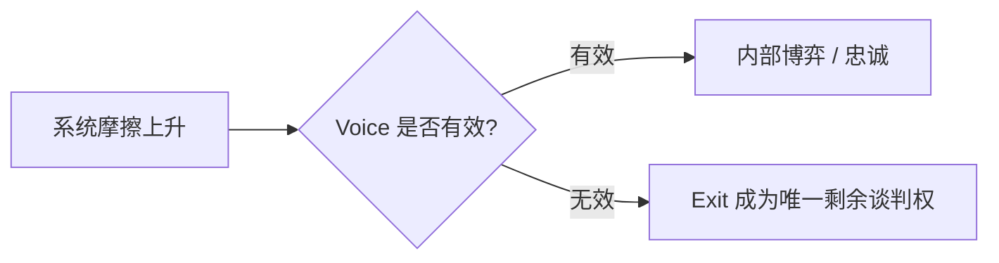
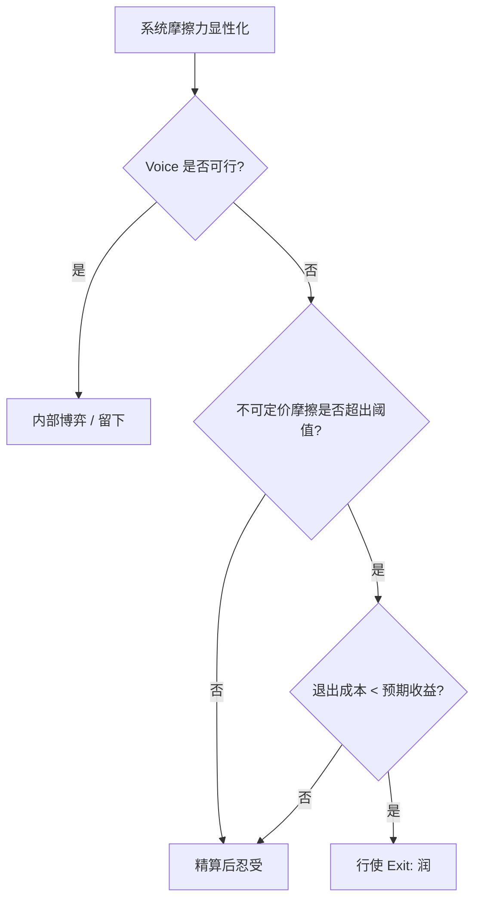

## 引言：换一个提问

“要不要润”是一个被普遍误置的问题。它预设了国家之间存在一套可排序的优劣坐标，个体只需找到排名最高的那一格。但任何经历过真实权衡的人都会发现，这个问题在数学上无解——因为“更好”缺少统一的度量衡：一个在 A 系统损失心理带宽、在 B 系统损失职业天花板的人，无法通过任何加权公式得到唯一解。

可解的问题不是“哪里更好”，而是 **“我的目标函数，与这套系统的默认值（System Defaults）是否兼容”**。

这一提法的直接来源，是[《免于提防的自由：论“默认安全”与中产社会的制度成本》](https://cj9208.github.io/blog/systems_and_governance/freedom-from-vigilance/)。该文记录了一次入职背调中的具体摩擦：系统以“合规”为名单向索取隐私，却用隐藏开关与盲打（Cold Call）执行越界核查。作者由此意识到，逼人重新校准生活坐标的，往往不是工资条的差额，而是“必须时刻提防、必须时刻精明”的系统摩擦力。本文要做的是把这个直觉，从个人体验上升为一条可检验的决策逻辑。

## 退出权：Voice 失效后的最后谈判

Albert O. Hirschman 在 *Exit, Voice, and Loyalty* 中给出一个简洁框架：面对组织或系统的衰退，成员存在三种反应——**退出（Exit）、发声（Voice）、忠诚（Loyalty）**。三者并非平行选项，而存在替代关系：Voice 的边际成本越高，Exit 的相对吸引力越大。

判断 Voice 是否“可用”，取决于三个条件的同时满足：

| 条件 | 含义 | 失效表现 |
| --- | --- | --- |
| 渠道存在 | 存在被制度承认的表达通道 | 通道形同虚设 |
| 信号被接收 | 表达能进入决策函数 | 反馈永远停留在“人人如此” |
| 具备议价后果 | 表达能改变对方成本 | 表达无惩罚、亦无收益 |

当三者同时缺失时，Voice 退化为纯粹的情绪消耗，而不再是一种策略。[《秩序与穿透：论治理体系中“合规”与“动员”的内在张力》](https://cj9208.github.io/blog/systems_and_governance/order-compliance-mobilization/)所描述的“合规只约束下位者”结构，正是 Voice 结构性失效的样本：规则的解释权与执行权同源，申诉通道的终点即是被申诉的对象。个体越孤立，Voice 的单位成本越高。

因此，“润”的准确含义不是对某地的情绪性否定，而是在 Voice 被结构性关闭后，行使最后一个仍然有效的谈判工具——把肉身与资产从博弈中撤出。这也解释了它为何总被道德化：**Exit 对个体是理性的风险对冲，对系统却是无议价信息的存量流失。**

## 大前提：增长滤镜的碎裂

任何关于制度优劣的讨论，脱离时代周期都是空谈。这一前提在[《全球服务器列表：宏观抉择（Trade-off）与制度摩擦（Friction）的双重精算》](https://cj9208.github.io/blog/systems_and_governance/global-server-list-tradeoff-friction/)中已被系统论证，此处仅压缩复述其结论：

- **增量期**：高增长红利（High Yield）像滤镜一样对冲掉系统内部的粗暴。只要大盘在涨、机会在翻倍，劳动法形同虚设、政策频繁变动、空间逼仄等摩擦力都被视为可接受的背景噪音。
- **存量期**：全球同步撞上存量天花板与深度老龄化重力，大盘收益锐减，滤镜碎裂。曾被高收益掩盖的**制度摩擦力**，开始显性化为个体肉身承受的隐形负债。

换言之，“润”从不是一个静态的地理偏好问题，而是特定周期下摩擦成本与收益比发生逆转的产物。讨论它，必须锚定在存量期这一大前提上。

## 变量一：目标函数

决策的第一步，是把“我究竟要优化什么”显式化。不同个体的目标函数差异极大，且并非所有项都可货币化：

| 目标项 | 属性 | 典型系统偏好 |
| --- | --- | --- |
| 财富爆发力 | 可精算 | 高能效率厂（东亚节点） |
| 税率与资产保值 | 可精算 | 低摩擦城邦 |
| 松弛与闲暇 | 半可精算 | 养老温室（欧陆/日本） |
| 子女教育与身份 | 长期、难折现 | 身份性系统 |
| 尊严与心理带宽 | 不可精算 | 默认安全型系统 |
| 表达与边界感 | 不可精算 | 契约优先型系统 |

关键约束在于：**这些目标项之间存在硬性 trade-off，无法通过提高收入同时满足。** 追求财富爆发力，通常要出让闲暇与生育留白；追求松弛兜底，通常要接受阶层流动锁死与平庸增速。目标函数的显式化，本质上是一次无法回避的自我排序，而非一次外部比价。

## 变量二：摩擦力的可定价性

这是全文的核心判别式，也是与单纯的“国家排名”叙事最根本的分野。系统摩擦力可分为两类：

- **可定价摩擦（Priceable Friction）**：可被量化为明确成本的项目——税负、租金、拥车证（COE）、医疗账单。其特征是**可预期、可入账、可对冲**。
- **不可定价摩擦（Unpriceable Friction）**：无法预先计入任何预算表的项目——规则的非预期突变、隐私与尊严的让渡、申诉通道的失效，以及长期保持警惕所消耗的**心理带宽**。

[《免于提防的自由》](https://cj9208.github.io/blog/systems_and_governance/freedom-from-vigilance/)所定义的**认知防御税（Cognitive Defense Tax）**，正是不可定价摩擦的微观计量：当个体必须在每个专业领域进化为“防守型专家”，其注意力与精力这一稀缺生产要素被无谓抵消，且这种损耗无法通过提高收入来补偿。

由此得到一条反直觉的推论：**可定价的摩擦，靠精算忍受；不可定价的摩擦，才是润的真正推力。** 一个人可以为了更高的税率而留下，却很难为持续的心理应激而留下——因为前者有价格，后者没有，而人对没有价格的东西无法建立预算。

## 变量三：退出成本与不可逆性

润是带摩擦的准单行道，退出成本直接决定决策的实际门槛。可把要素按可逆性分层：

- **可逆要素**：金融资产、职业履历、跨境业务逻辑。这类要素的迁移成本相对可控，甚至可以在原系统内以“离岸能力”的形式预先储备。
- **不可逆要素**：身份归属、父母的养老安排、子女的成长路径，以及部分系统的强制兵役（NS）。这类要素一旦投入，回程通道即被显著收窄。
- **期权价值折损**：每一次不可逆投入，都在减少未来重新选择的自由度。个体常常低估的不是迁移的显性成本，而是**关闭回程的隐性代价**。

综合三个变量，决策逻辑可形式化为一条门控流程：

## 润的谱系：三种可逆性

将“润”简化为二元开关是一种常见误读。按可逆性与目标函数，它至少可分为三类，其决策门槛与沉没成本逐级递增：

| 类型 | 核心诉求 | 主要动作 | 可逆性 |
| --- | --- | --- | --- |
| **财务性润** | 资产保值、税务优化 | 离岸配置、身份备选 | 高 |
| **生存性润** | 安全、尊严、心理带宽 | 物理迁移、长期居留 | 中 |
| **身份性润** | 子女教育、归属重构 | 入籍、代际安置 | 低 |

三者的区别不在“走不走”，而在“走多远、留多少退路”。财务性润可以与留在原系统并行，本质是风险对冲；身份性润则意味着把下一代的时间轴整体重写，本质是代际承诺的转移。[《宏观长周期转型下的系统精算与个体策略解耦》](https://cj9208.github.io/blog/systems_and_governance/chinese_government/macro-transition-individual-strategy/)把这类选择概括为“寻觅契约更明确的池子”，其精确之处在于：它把润界定为**跨系统的风险对冲**，而非一次性的立场表态。

## 天花板：没有零摩擦服务器

任何把润写成“解决方案”的叙事都不可信。真实约束是：**不存在零摩擦服务器，润的本质是更换一种你能代谢的摩擦类型。**

- [《新加坡定居：是技术中产的天堂，还是极致精算的围城？》](https://cj9208.github.io/blog/systems_and_governance/singapore-tech-middle-class/)给出了最典型的样本：极低的制度摩擦与行政确定性，代价是 700 平方公里的空间沙盒、单一气候的精神单调、以及入籍绑定的强制兵役。它提供的是“生活作为服务（Life as a Service）”的极致版本，而非没有代价的乌托邦。
- 养老温室型系统以阶层流动锁死与经济停滞换取松弛；自由修罗场型系统以治安不确定性与医疗资本化换取天花板。**每一种低摩擦，都在别处标好了价格。**

因此，理性的润不是“寻找完美系统”，而是“选择自己更能长期承受的摩擦组合”。这一节的意义在于给全文装上刹车：承认代价，才使前面的决策逻辑不至于滑向爽文。

## 结语：允许自己不精明

剥离掉所有阶层与财务的算计，润的终极逻辑可以压缩为一句：**获得免于时刻提防的自由。**

这正是[《免于提防的自由》](https://cj9208.github.io/blog/systems_and_governance/freedom-from-vigilance/)的落点——一个需要个体随时保持警惕、随时准备维权的环境，其后台的“威胁扫描”程序不得不常亮，使人长期处于低频应激状态。而人最核心的诉求，不过是在一个托底的系统里，拥有“允许自己不精明”的权利，把智力与热情留在创造与体验上，而非挥霍在防范暗坑与套路里。

在此意义上，润不是逃离，而是退出；不是立场的宣示，而是权利的行使。它不承诺“更好”，只承诺“可预期”。在一个高摩擦系统里，用脚投票，是个体在时代重力下所能争取的、最高级别的自由。

---

## 更多阅读

**退出、发声与系统摩擦**

- [《免于提防的自由：论“默认安全”与中产社会的制度成本》](https://cj9208.github.io/blog/systems_and_governance/freedom-from-vigilance/)：本文的心理内核与“认知防御税”的出处。
- [《秩序与穿透：论治理体系中“合规”与“动员”的内在张力》](https://cj9208.github.io/blog/systems_and_governance/order-compliance-mobilization/)：解释了 Voice 为何会结构性失效。
- [《声明式与过程式：系统工程视角下“人治”与“法治”的四大差异》](https://cj9208.github.io/blog/systems_and_governance/declarative-imperative-governance/)：把“默认安全 vs 运行时兜底”落到执行范式上。

**服务器选择与个体精算**

- [《全球服务器列表：宏观抉择（Trade-off）与制度摩擦（Friction）的双重精算》](https://cj9208.github.io/blog/systems_and_governance/global-server-list-tradeoff-friction/)：本文“目标函数 + 摩擦力”框架的完整版。
- [《新加坡定居：是技术中产的天堂，还是极致精算的围城？》](https://cj9208.github.io/blog/systems_and_governance/singapore-tech-middle-class/)：单一目标国的落地账本。
- [《宏观长周期转型下的系统精算与个体策略解耦》](https://cj9208.github.io/blog/systems_and_governance/chinese_government/macro-transition-individual-strategy/)：把润界定为跨系统风险对冲的宏观版本。

**托底与契约**

- [《回旋镖掠过头顶：我们为什么需要福利社会》](https://cj9208.github.io/blog/systems_and_governance/why-we-need-welfare-state/)：论证托底为何是文明而非负担。
- [《从“多劳多得”到“社会级PUA”：优绩主义是如何在垄断中走向异化的？》](https://cj9208.github.io/blog/systems_and_governance/meritocracy-to-social-pua/)：本文所反思的“应试与竞逐逻辑”如何异化。
