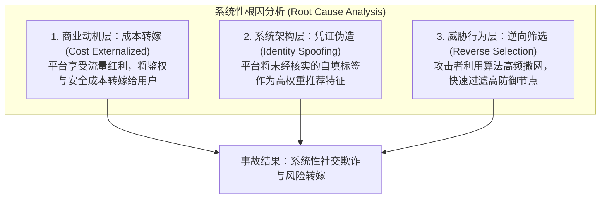
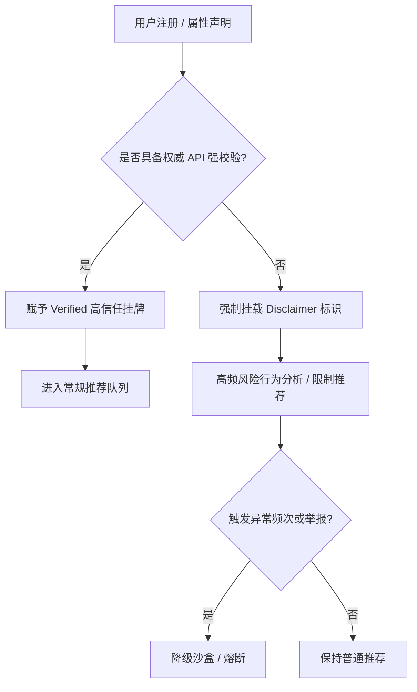

近期发生的“美籍网红虚假人设欺诈事件”在网络上引发了关于社会伦理、个体责任与网络安全的讨论。涉事博主通过将短期的非学历语言进修身份包装为名校研究生学霸人设，利用短视频平台的流量推荐机制进行社交套利，并在亲密关系中隐瞒防护承诺，导致了健康风险的转嫁与伤害。

本文采用系统工程中的 **Post-Mortem（事后复盘）** 方法论，摒弃情绪化的道德审判，从**个体风险管理**与**系统架构设计**两个维度对该事件进行客观的根因分析（Root Cause Analysis），并提出基于契约优先（Contract-First）原则的平台风控重构方案。

---

## 一、 事故表现：个体风控断层与安全防线让渡

在事故分析中，终端节点（个体）的安全防御失效通常是风险显性化的直接原因。从现实风险控制的角度分析，受害个体在应对虚假人设攻击时存在明显的风险管理断层。

### 1. 高价值标签带来的防御降级

涉事博主构建的“名校学霸 + 外籍 + 流量网红”组合，属于高价值社会信用标签。受害个体在面对此类标签时，容易产生过度信任，从而将常规社交中对陌生人的警惕性降低。

```
常规社交防御级别：高警惕 -> 身份核验 -> 长期观察 -> 安全防护
高价值标签防御降级：信任背书 -> 快速接纳 -> 规则让渡 -> 风险暴露

```

### 2. 安全硬性约束的让渡

无论前置信任度如何，生理健康与个人安全的防护属于**不可让渡的底线约束**。受害个体在缺乏深度了解与确定性关系承诺的前提下，放弃安全防护措施（无套亲密行为），属于个体风险管理上的失职。

社会舆论对此类行为的批评，本质上是对“个体主动放弃风险防线”这一行为的风险警示。强调个体责任并非洗白欺诈者，而是明确成年人在自身健康与安全管理上具有不可替代的最终责任。

---

## 二、 根因分析：系统底层信任机制的缺失

个体风控的失效仅是攻击成功的表象，平台在**身份鉴权、流量放大与风险隔离**机制上的缺陷，则是导致此类社会工程学攻击（Social Engineering Attack）能够高频发生的系统性根因。



### 1. 凭证伪造与信任背书（Identity Spoofing）

平台将用户自填或未经严格核实的“名校/学霸”等标签挂载于公开 profile，并在推荐算法中赋予高推荐权重。这相当于网关（Gateway）颁发了未经过权威机构签名的凭证，使下游用户产生了该身份已获得平台信用背书的错觉。

### 2. 算法推荐下的低成本逆向筛选

攻击者利用短视频平台的高并发推荐机制，以极低的情绪成本进行全网撒网。通过放弃所有要求“长期投入、规则约束与身份校验”的理性节点，专一捕捉防御降级的节点，实现了高效的情感套利。

### 3. 风控成本的结构性转嫁

平台基于“人设经济”获取了高粘性的讨论度与广告收益，但在身份真实性校验与安全提示上采用了“不知道、不核验”的低成本策略。平台享有了流量收益，却将身份鉴权与风险防范的全部成本转嫁交给了终端个体。

---

## 三、 系统重构：基于 Contract-First 的社交风控架构

为阻止同类事故复发，平台与司法体系需要引入**契约优先（Contract-First）**与**防呆设计（Poka-Yoke）**，将信任控制由“事后公关”转向“程序化约束”。



### 1. Happy Path（正常路径：契约优先与强类型鉴权）

* **数据规格强类型定义（Type Safety）**：系统必须对“学历/社会身份”进行枚举类型隔离。例如划分 `Degree_Candidate`（学历生）与 `Short_Term_Trainee`（非学历进修生），禁止模糊化挂牌。
* **权威接口自动化校验**：对于声明高价值标签的账户，必须对接国家级学信网或官方数字凭证 API。
* **默认免责声明（Default Disclaimer）**：未通过官方 API 核验的个人声明，前端展示层强制挂载“个人自填，未经官方验证”的系统级标识，消除信息不对称。

### 2. Fallback & Circuit Breaker（异常隔离与熔断机制）

* **风险模式沙盒隔离（Sandboxing）**：风控中间件对触发“高频跨区域私信”、“特定引流套路词”的账号自动降低权重，将其限制在低风险沙盒队列。
* **并发举报自动熔断（Circuit Breaker）**：当系统短时间内收到多起针对“身份欺诈”或“健康风险隐患”的并发举报时，自动暂停该账号的私信与推荐功能，进入隔离待审状态。

### 3. Reward & Penalty（博弈设计与攻击成本重构）

改变攻击者的预期收益公式，使攻击成本远大于潜在收益：

$$\text{预期收益} = \text{流量套利收益} - (\text{法律赔偿成本} + \text{设备及身份永久封禁成本})$$

* **法律界定与侵权惩罚**：将“重大虚假身份欺诈”与“隐瞒防护承诺（Stealthing）”明确界定为民事意图侵权（Intentional Tort），引入惩罚性赔偿，建立司法救济通道。
* **全局硬件与身份黑名单**：平台联动设备指纹（Device Fingerprint）与实名信息进行全局风控，对确认欺诈的账号实施跨平台永久封禁，剥夺其再次套利的能力。

---

## 四、 结论与改进倡议 (Action Items)

从 Post-Mortem 分析的角度看，该事件并非单纯的个体道德滑坡，而是**个体风险防御失范**与**系统鉴权机制缺失**叠加的结果。

1. **个体层面**：必须建立明确的健康与安全熔断机制。任何外部标签与信用背书，均不可替代物理安全与自我保护底线。
2. **系统层面**：鉴权技术在工程上并不存在壁垒。解决这一问题的核心在于通过立法与监管，将虚假人设带来的社会危害成本内生化为平台的法律责任，倒逼平台建立 Contract-First 的风控中间件，用确定性的规则约束对抗人性的脆弱与风险。

---

## 附注：论系统设计的终极目标——控制风险与爆炸半径（Blast Radius）

在讨论平台风控与系统架构时，一个常见的认知误区是追求理想化的“零风险”（Zero Risk）。然而在复杂的开放社会系统与社交网络中，**系统设计的本质绝非消灭风险，而是控制风险的爆炸半径（Blast Radius Control），并将攻防对抗重构为法律与风控资源可承受的规模。**

---

### 1. 爆炸半径控制与风控漏斗压制

传统平台设计的根本病灶，在于推荐算法充当了风险放大器：极低门槛的欺诈行为被算法赋予暴涨的流量，导致受害人群呈指数扩散。这彻底击穿了线下司法与平台人工复核的能力上限，最终陷入“普遍违法、难以追责、依赖舆论倒逼”的治理溃败状态。

系统重构的核心使命在于构建层层截断的风控漏斗：

$$\text{完全敞口的公域流量（千万级）} \xrightarrow{\text{沙盒限制}} \text{限制配额的私域触达（百人级）} \xrightarrow{\text{强风险提示}} \text{受害概率压制（个位数）}$$

对未核验或高风险账号实施配额限制与流量截断（如单日主动私信上限、算法推荐权重上限），**强制将下游受害概率压制至个位数**。系统并不需要做到 100% 的绝对防范，只需将风险从“社会级舆论事故”收敛为“可控个案”，后置的司法追责与平台追偿机制才能真正恢复运转。

---

### 2. 零信任缺省与高风险降级（Zero-Trust Default）

在系统架构中，未经过权威机构签名的输入（如跨国背景、名校学历、高收益人设）均属于“脏数据”（Dirty Input）。针对此类天然具备高社会信用价值的属性，系统必须采取缺省降级（Default Degradation）策略：

* **强风险挂牌**：未完成权威 API 强校验的高价值标签，前端强制挂载不可移除的系统级免责声明（Disclaimer）与高风险警示；
* **沙盒隔离**：限制其冷启动推荐权重与主动跨区引流能力；
* **契约对等**：赋予用户明确的契约选择——若想获取高人设带来的爆款流量溢价，就必须付出强鉴权的摩擦成本；若拒绝鉴权，其行为边界与流量配额将被严格限制在低风险沙盒（Sandbox）之内。

---

### 3. 破除“技术壁垒”伪命题：工程资源错配与技术的功利性归位

将“跨国接口难对接”、“隐私保护壁垒”等工程挑战作为平台在风控鉴权上免责的理由，是一个典型的伪命题。平台并非缺乏技术能力，而是存在严重的**工程资源错配**。

现实中，平台在“防流量外泄（防导流）”上展现出了顶尖的技术水准：运用极其敏捷的毫秒级 NLP、多模态 OCR、音视频语义检测与图像隐写对抗算法，能够精准识别并拦截“加微”、“v信”、“📱”等各种花式变体与变形文字；但在面对“虚假学历”、“伪造高光人设”等真正关乎用户安全的欺诈行为时，却突然切换为“技术受限、装聋作哑”的低成本策略。

这充分证明，所谓的“技术难度”与“隐私悖论”在商业利益面前完全是选择性失明。在工程实现上，同态加密、零知识证明（Zero-Knowledge Proofs）以及去中心化身份（DID）等技术，完全具备在不泄露用户原始隐私的前提下完成身份真实性校验的能力。技术资源不应被异化为各大厂划界自守、防范导流的“围墙花园（Walled Garden）”工具，而必须重回风险隔离、信任搭建与安全保障的工程本位。

---

### 4. 攻防非对称性与经济模型重构（Asymmetry of Attack Costs）

风控架构的目标并非击败 100% 的极少数高阶专业黑产，而是彻底破坏占全网 90% 以上脚本化、低成本漫游式欺诈的经济模型：

$$\text{欺诈预期收益} = \text{流量套利收益} - \left( \text{硬件及接码成本} + \text{身份鉴权门槛} + \text{熔断概率} \times \text{惩罚性赔偿} \right)$$

通过设备指纹全局封禁、高频行为熔断与强风险提示，大幅推高攻击者的硬件与合规门槛（Cost of Attack）。当欺诈套利的 ROI（投资回报率）被推至负值，绝大多数机会型与低成本欺诈者将被直接清退出场。

---

> **结语**：技术无法也不必彻底抹平人性的脆弱与风险，但确定性的程序规则（Contract-First）能够重新锚定平台的法律责任与风控边界，将风险收敛于系统可控的“爆炸半径”之内。


---
## 附注2：权责对等与追责锚点——破解“低成本制造公域大新闻”的治理闭环

在现代算法推荐与社交网络中，系统设计常年忽视了一个最致命的失衡：**权责不对等（Asymmetry of Rights and Responsibilities）**。当一个虚拟账号能够通过包装轻易撬动巨大的公域流量与社会影响力（“权/利”），而其背后却没有任何物理世界的法律与身份锚点承载代价（“责/成本”）时，系统就必然沦为社会工程学欺诈与黑天鹅事件的温床。

---

### 1. 流量杠杆与不对称威胁模型

在传统现实社会中，一个能够大范围影响公众信任的主体，通常需要经过长期的制度性背书、商业合规或实体信用积累。然而，在当前的算法分发架构下：

* **攻击方的无穷杠杆**：一个通过接码平台注册、虚假包装的“皮囊账号”，只需零成本的文字与图片，就能通过推荐算法的杠杆在一夜之间触达数百万用户，制造舆论风暴或实施精准诈骗。
* **防御方的无限成本**：一旦事发，受害个体、被卷入的公众以及线下司法体系，往往需要付出极高的跨国取证、举证与社会治理成本。

这种“无限流量收益 vs 零代价抛弃账号”的不对称性，导致恶性欺诈事件频发。因为“随便一个假账号就能在公域搞出大新闻”，且事后可以全身而退，这才是最可怕的系统漏洞。

---

### 2. 鉴权的实质：建立数字行为与物理世界的“追责锚点”

在系统工程中，鉴权（Authentication）的本质绝不仅是功能性的“开门放行”或视觉上的“荣誉徽章”，而是**将数字身份（Digital Identity）映射为法权主体（Legal Entity）的“追责锚点”**。

* **没有鉴权，追责就是空话**：如果系统允许一个未经核实的虚假高光人设自由获取公域流量，一旦出事，被销毁的只是一具随时可以丢弃的数字外壳，背后的作恶者可以毫无代价地换号重来。
* **强鉴权即法律震慑**：通过官方 API 校验或权威凭证绑定，将账号的线上公域行为与现实中的民事、刑事责任严格锚定。一旦打通这条确定性的追责路径，潜在攻击者的心理预期就会从“低风险暴利套利”瞬间跃升为“巨额赔偿与牢狱之灾”。

---

### 3. 基于权责对等的渐进式赋权架构（Graduated Empowerment）

系统应当建立“多大权力，多大责任；多高流量，多强鉴权”的防线：

* **未核验 / 匿名账号（低权限/低风险）**：限制公域大范围推荐，主动私信配额严格受限，所有交互处于沙盒内。即便出现违规，也仅需通过设备指纹或 IP 封禁即可切断。
* **高价值标签账号（高权限/高杠杆）**：如涉及名校、名企、专业资质或高影响力的“人设标签”，必须强制接入权威强鉴权。平台赋予其破圈流量的前提，是该账号必须具备等同于其影响力的物理追责身份。

---

### 4. 平台连带责任的内生化

当平台享有了高流量带来的商业溢价（Privatized Profit），却对未鉴权账号在公域“搞出大新闻”的风险采取放任态度时，监管与法律必须让平台付出代价。

只有将“不鉴权、不审核”导致的社会损害，通过连带责任（Joint Liability）直接内生化为平台的财务损益与合规成本，大厂才会真正收起“技术中立”的借口，转而构建严密的契约优先（Contract-First）风控体系。