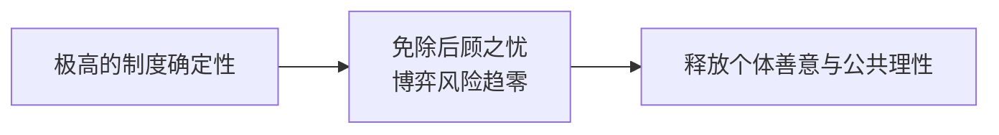
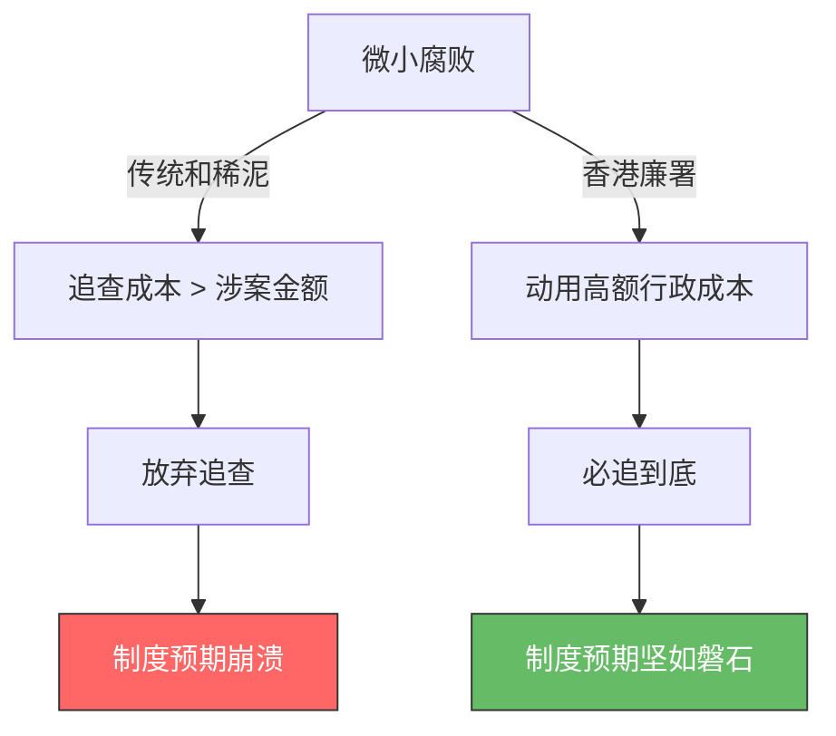

在新加坡小贩中心，常能看到这样的场景：华裔、印度裔、马来裔以及欧美游客在人声鼎沸中规规矩矩排队，餐后自觉归还托盘，甚至用一包纸巾就能稳稳占住一张桌子；在地铁站，不同族裔的陌生人会因为看到你遇到充值障碍，主动停下脚步、切换语言指引位置。

很多人倾向于将这种现象归结为“国民素质”或“文化差异”。但只要深入观察就会发现，当同一个印度裔摊主或欧美游客换一个混乱的社会环境时，其行为模式也会迅速发生改变。

**社会的文明与冷漠，本质上不是道德问题，而是预期管理问题。**

在金融市场中，决定资产价格与资本流向的往往不是当前利益，而是“预期”；而在社会学与博弈论的视野里，**规则的“确定性”与“可预测性”，直接决定了社会信任的折价率。** 当制度能够提供强有力的“确切预期”时，个体的最优博弈策略是遵守规则与释放善意；当制度频繁呈现“不可预测”与“和稀泥”时，个体的最优博弈策略则是冷漠、防备与投机。

---

## 一、 新加坡模式：精算主义下的“绝对可预期”

新加坡常被戏称为一个精密运转的“大型上市公司”。其社会治理逻辑带有极其鲜明的前瞻性指引（Forward Guidance）与精算主义色彩。

从1989年推行的组屋“民族配额政策”（EIP），强制规定每个社区和楼栋各族裔的入住比例上限，到拥车证（COE）制度，再到极度细化且严格执行的公共卫生法案，新加坡通过顶层设计彻底打碎了“自然聚集与自发秩序”的不确定性。

这种“精算”虽然牺牲了一定的绝对自由，却给全社会提供了一个极其稳定的**预期锚（Expectation Anchor）**：

* **规则边界极其硬核**：违法成本高昂且触发概率极高，极大地挤压了违规套利的空间。
* **行为归因极其明确**：个体在公共空间行善或守规时，无需担心陷入复杂的隐性社会风险。

在这样的博弈结构中，坏人作恶的期望收益为负，好人施善的隐性风险被大幅压低。因此，即使是在烟火气十足、族裔背景复杂的竹脚中心（Tekka Centre），人们也能迅速收敛私人习性，无缝嵌入同一套高效、文明的公共秩序中。

---

## 二、 香港模式：不惜成本确立“制度信任”

如果说新加坡展现的是精算下的预期锚定，香港廉政公署（ICAC）的历史则完美诠释了”不惜成本的信用确立”（Costly Signaling for Credibility）。

在20世纪70年代之前，香港同样面临严重的结构性腐败与规则失序。ICAC成立后的核心治理逻辑，不是简单的道德宣讲，而是**彻底重塑全社会对“规则执行概率”的预期**。

即使涉及金额极小（如一盒月饼、几十块钱的便当），只要触犯廉政条例，廉署也会动用高昂的调查资源追查到底。从短期财务账本看，这种“亏本追查”极不经济；但从博弈论角度看，它向全社会传递了一个极其强烈的信号：**规则是坚硬的石头，没有任何套利缝隙。**

当「腐败收益极低、被捕概率极高」成为全社会的坚固预期后，香港从”贪腐之都”迅速跃升为全球交易成本最低、商业信任度最高的国际金融中心之一。这种由制度确定性带来的社会高信任，最终以经济繁荣的形式几十倍地回报了最初的”追查成本”。

---

## 三、 弹性治理与“和稀泥”：当预期遭遇折价

对比上述两个模式，当社会治理过于偏向“情理法混同”或“维稳导向”时，规则的严肃性往往会让位于“各打五十大板”与“谁弱/谁闹谁有理”的弹性裁决。

这种”和稀泥”的治理方式，表面上维持了短期的平静，实则在底层制造了极其严重的**逆向选择（Adverse Selection）**：

1. **信任折价率暴跌**：当“扶不扶”、“救不救”等善意举动可能招致不可预期的赔偿风险，且司法与执法过程缺乏快速、明确的免责庇护时，做善事的“不确定性溢价”被无限放大。
2. **防守型冷漠成为最优解**：在交易成本与博弈风险不可预期的环境里，个体为了自我保护，只能选择最理性的策略——退回“流动性陷阱”，关闭信任大门，对陌生人甚至同胞保持高度防备。

这解释了为什么在某些环境下，即使是同族同胞之间也难以建立信任。**人们退缩、冷漠，不是因为道德沦丧，而是在应对“不可预期风险”时演化出的防卫机制。**

---

## 四、 重建确定性，才是最大的社会红利

金融市场里，缺乏确切预期会导致资本逃逸；现实社会中，缺乏确切规则则会导致善意退场。

| 维度 | 新加坡 / 香港模式 | “和稀泥”弹性模式 |
| --- | --- | --- |
| **规则属性** | 坚硬、透明、一贯、可预测 | 弹性、模糊、因人因事摇摆 |
| **个体博弈策略** | 遵守规则、释放善意、高效合作 | 谨慎防备、投机套利、避险冷漠 |
| **社会交易成本** | 极低（无需疏通关系与猜忌） | 极高（消耗大量精力于防范风险） |
| **核心底层逻辑** | **用制度确定性保护善意与信任** | **用模糊规则转嫁风险给守规者** |

现代社会的文明与温度，从来不是靠空洞的道德说教堆砌出来的，它本质上是良好制度与明确规则的**副产品**。

当一个社会能够提供坚硬、公平、一贯且可预测的制度底座，把作恶与套利的预期收益归零，把行善与守规的隐性风险抹平，人性里最温情、最互助、最通情达理的一面，自然会在日光下肆意生长。重建规则的确定性，是降低全社会内耗、重建人与人之间信任最根本的路径。

## 延伸阅读

**制度确定性与信任**

- [《白盒与黑箱：廉政公署与纪委的架构对比与系统反噬》](https://cj9208.github.io/blog/systems_and_governance/white-box-black-box-icac-disciplinary-inspection/)：从组织架构角度深化第二节 ICAC「不惜成本的信用确立」论证，对比白盒独立反腐与黑盒内部监督的系统差异。
- [《免于提防的自由：论"默认安全"与中产社会的制度成本》](https://cj9208.github.io/blog/systems_and_governance/freedom-from-vigilance/)：从个体感知角度支撑本文核心命题——制度确定性的终极产物是「无需提防」的自由。
- [《声明式与过程式：系统工程视角下"人治"与"法治"的四大差异》](https://cj9208.github.io/blog/systems_and_governance/declarative-imperative-governance/)：用系统工程框架辨析「规则确定性」与「弹性裁量」的底层差异，为本文的博弈论分析提供互补视角。

**新加坡与弹性治理**

- [《新加坡定居：是技术中产的天堂，还是极致精算的围城？》](https://cj9208.github.io/blog/systems_and_governance/singapore-tech-middle-class/)：展开新加坡精算主义的全貌，包括其代价与边界，平衡本文第一节的正面叙述。
- [《从维稳逻辑看政策扭曲：当行政规避成为社会内耗的推手》](https://cj9208.github.io/blog/systems_and_governance/chinese_government/zero-cost-stability-distortion/)：用具体案例填充本文第三节「和稀泥」的论证，展示弹性治理如何在基层制造系统性内耗。