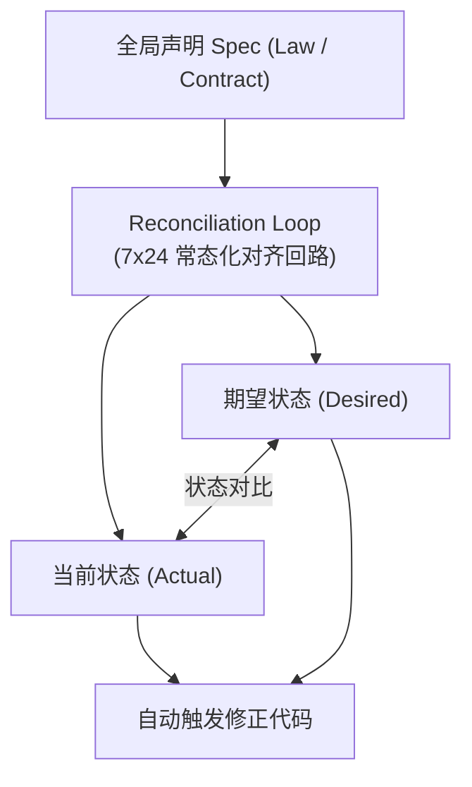
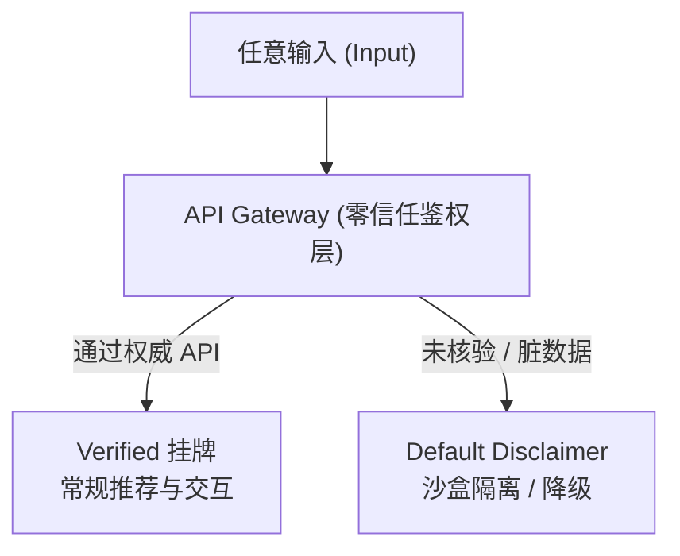

在政治哲学与社会治理的历史长河中，“人治”（Rule of Man）与“法治”（Rule of Law）的论争持续了数千年。然而，当剥离其中的道德修辞与意识形态色彩，从纯粹的系统工程（Systems Engineering）与控制论（Cybernetics）视角审视时，这两种模式在底层机制上有着清晰且明确的架构映射：

* **人治（Rule of Man） $\equiv$ 过程式脚本（Imperative） + 中断驱动（Interrupt-Driven）**
* **法治（Rule of Law） $\equiv$ 声明式架构（Declarative） + 契约优先（Contract-First）**

一个复杂系统的运行质量，本质上取决于其治理范式的架构设计。本文将从执行范式、触发机制、边界接口与扩展演进四个工程维度，解构人治与法治的底层运行机理及其演进宿命。

| 维度 | 人治 (Rule of Man) | 法治 (Rule of Law) |
| --- | --- | --- |
| **执行范式** | 过程式指令 (Imperative) | 声明式收敛 (Declarative) |
| **触发机制** | 中断驱动 (Interrupt-Driven / Event-Driven) | 常态对齐 (Continuous Alignment / Reconciliation) |
| **边界与接口** | 动态裁量权 (Dynamic Discretion) | 类型安全与零信任 (Type Safety & Zero-Trust) |
| **扩展与演进** | 单体 CPU 瓶颈 (Centralized Bottleneck) | 分布式自愈 (Distributed Self-Healing) |

---

## 一、 执行范式：过程式指令（Imperative）vs. 声明式收敛（Declarative）

软件工程中，过程式编程（Imperative Programming）关注的是“如何做”（How to do），而声明式编程（Declarative Programming）关注的是“期望状态是什么”（What to achieve）。这一差异构成了人治与法治的核心执行分野。

### 1. 人治的过程式逻辑（Imperative Execution）

人治系统的运作高度依赖于最高治理者下达的具体操作指令。就像一段写满了 `if-else` 的过程式脚本，系统本身缺乏对全局“最终状态”（Desired State）的静态规格说明（Spec）。

在过程式执行下，每一次社会治理行动都是针对特定场景的硬编码微调。因为没有统一的全局 Spec，每次指令下达都会产生不可预测的侧面效应（Side Effects）。随着业务复杂度增加，代码库迅速退化为不可维护的“屎山架构”，系统逻辑变得离散且极度脆弱。

### 2. 法治的声明式收敛（Declarative Reconciliation）

法治系统的底层逻辑是**声明式状态机**（类似于 Kubernetes 的 Reconciliation Loop 控制回路）。

系统通过法律与契约预先声明全局的终态规格（Specification）。后台守护进程（Daemon）7×24 小时不断轮询（Polling），无间断对比“现实状态（Actual State）”与“声明状态（Desired State）”。一旦发现偏离，系统无需等待人工下发批示，便会自动触发修正代码（Enforcement Loop），强制将系统状态收敛至声明好的理想区间。

---

## 二、 触发机制：中断驱动（Interrupt-Driven）vs. 常态对齐（Continuous Alignment）

治理系统的调度模式，决定了系统对风险的响应时效与爆炸半径控制能力。

### 1. 人治的中断驱动（Interrupt-Driven / Event-Driven）

人治是以“中央管理者大脑”为单体 CPU 的运行体系。但在海量并发的复杂社会系统中，管理者的认知带宽是极度受限且无法水平扩展（Horizontal Scaling）的物理资源。

因为不存在客观的自动执行代码，人治系统无法做到常态化的全量巡检。系统默认维持“不出事即正常”的假象，唯有当风险积累爆发为群体性大事件（Event）时，强烈的舆情或危机才构成一个高能量级的“硬件中断信号（Hardware Interrupt）”，打断管理者的注意力。

这种机制决定了人治必然表现为“消防员式治理（Firefighting）”：平日里任由风险隐蔽蔓延，出事后依靠雷霆手段搞“专项整治”。这种方式控制的仅仅是“舆情的爆炸半径”，而无法消除系统底层的结构性风险。

### 2. 法治的常态对齐（Continuous Alignment）

法治架构将风险隔离与合规校验内建于系统的网关（Gateway）与中间件（Middleware）层。

通过防呆设计（Poka-Yoke）与契约约束，系统在运行期（Runtime）就完成了前置的安全校验与拦截。虽然这种“安全左移”在前期设计与注册阶段增加了些许摩擦成本，但它将风险消解于无形，真正实现了高并发环境下的风险爆炸半径控制。

---

## 三、 边界与接口：动态裁量权（Discretion）vs. 类型安全与零信任（Type Safety & Zero-Trust）

边界定义是系统攻防对抗的核心。规则是确定性的还是模糊的，直接决定了系统接口的安全性。

### 1. 人治的动态裁量与黑盒（Dynamic Discretion）

“刑不可知，则威不可测”是人治权力的底层心理学依据。人治体系倾向于保持规则的弹性、模糊性与事后解释权。

在系统架构中，这相当于抛弃了类型检查（Type Checking），采用无约束的动态类型（如 `any` 泛型），并赋予了特定角色运行时修改全局变量、越权调用私有 API 的特权。模糊的规则使得接口缺乏校验依据，系统的攻击面（Attack Surface）被无限放大，黑产与社会工程学攻击者可以轻易通过“寻租”与“套利”穿透整个系统。

### 2. 法治的类型安全与零信任（Type Safety & Zero-Trust）

法治系统严格遵循 **Contract-First（契约优先）** 原则，对系统中的身份、权限与行为进行强类型定义（Strict Typing）。

系统践行**零信任架构（Zero-Trust）**：未经过权威签名与强 API 校验的输入，一律被定义为“脏数据（Dirty Input）”并强制降级（Default Degradation）。没有隐式信任，所有公域能力的调用都必须出示明确的凭证与契约断言，从而切断了利用规则模糊性进行套利的通道。

---

## 四、 扩展性与演进成本：单体 CPU 瓶颈 vs. 分布式自愈（Scalability & Self-Healing）

系统规模与复杂度的指数级增长，是检验治理架构终极生命力的试金石。

### 1. 人治的单体 CPU 性能墙（Centralized Bottleneck）

在系统初期（如早期部落或初创公司），人治凭借其极低的前置设计成本与极高的决策灵活性，具有明显的响应优势。

然而，随着系统节点数 $N$ 呈指数增加，节点间的交互复杂度以 $O(N^2)$ 暴涨。人治系统受限于中央决策单元（Central Processing Unit）的物理带宽，会出现严重的信息传递失真、决策延迟与治理成本暴涨。最终，系统会因为无法承载海量并发而陷入响应瘫痪，走向崩溃的宿命。

### 2. 法治的分布式自愈系统（Distributed Self-Healing）

法治系统的契约与规则，本质上是下沉至各个边缘节点的分布式代码（Distributed Policy Engines）。

它无需将所有数据汇聚至中央大脑进行逐一审批，各个节点（下级机构、市场主体、终端用户）只需根据本地挂载的契约独立履约与纠偏。这种去中心化的设计使得系统具备了极高的水平扩展能力（Horizontal Scaling），能够在节点数量爆炸的同时，依然保持毫秒级的局部自愈能力。

---

## 五、 结语：复杂系统的工程宿命

从系统工程的视角来看，人治向法治的演进，并非一种纯粹的文明伦理偏好，而是**复杂系统在对抗熵增与规模爆炸过程中的必然工程选择**。

当系统规模尚小、场景简单时，过程式的人治脚本能够凭借灵活度快速完成跑通；但当系统跨越临界规模，试图以“人的注意力”去管理“高并发风险”，无异于用单核 CPU 运行百万级 TPS 的系统，其结果必然是频频暴雷、消防员式救火与最终的系统瘫痪。

唯有回归声明式架构（Declarative），坚持契约优先（Contract-First）、类型安全（Type Safety）与常态化状态对齐，将治理规则程序化为确定性的代码与中间件，才能在动荡与复杂的环境下，将系统的风险收敛于可控的爆炸半径之内，实现复杂系统的长治久安。