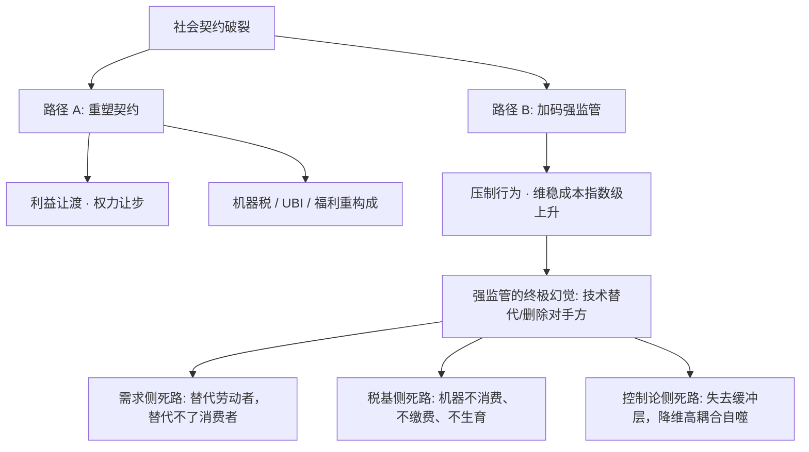
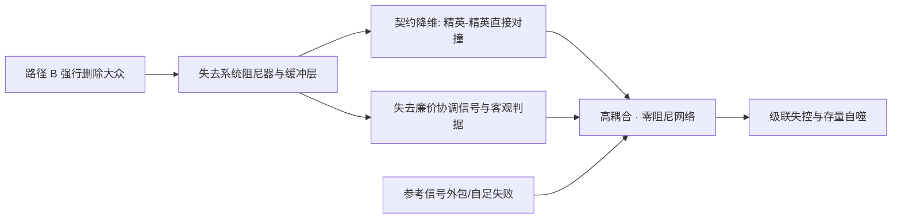
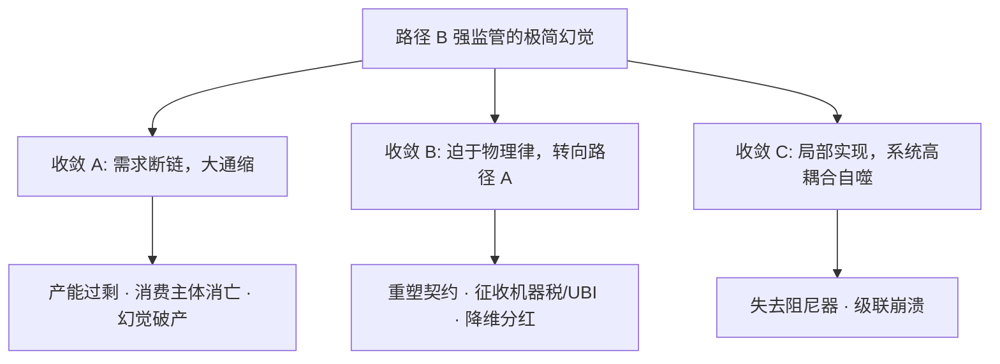

上一篇文章《[社会契约的异化：过度开采与控制的路径依赖](https://cj9208.github.io/blog/systems_and_governance/social-contract-exploitation-path-dependence/)》给出了一道经典的两难决策：当社会契约被过度开采、远期回报率转负、微观个体开始以“消费收缩、行为摆烂、生物学不育”退场时，系统的应对本质上只存在两条路径——**重塑契约（路径 A）** 或 **加码强监管（路径 B）**。

不少技术官僚与政策设计者试图寻找一条脱离政治博弈的“技术第三条路”：用机器人、AI 与自动化生产网络，把契约对手方——劳动者与消费者——从系统里整个“删除”。然而，在严密的政治经济学与控制论框架下，**“技术替代”绝非独立于“改革”与“控制”之外的第三条路，而恰恰是路径 B（加码强监管）在拒绝让渡利益、维稳成本趋于无限大时，推演至逻辑极限后产生的终极技术幻觉。**

至于社会讨论中常被提及的“机器税”与“无条件基本收入（UBI）”，其本质是通过强制力要求资本与行政权力让渡垄断收益、重新划定剩余索取权，因而**自然归属于路径 A（重塑契约）在自动化时代的具体表现形式**。本文将这一“删除对手方”的强监管终极幻觉显性化为一个可证伪的系统假说，并在需求侧、税基侧与控制论侧三条线上做压力测试。



---

## 一、 二元对峙：为何“技术替代”是路径 B 的终极幻觉

当社会契约破裂时，治理机器面对的始终是严苛的二元抉择。所谓的“技术替代”，本质上是路径 B 压制失败后的逃逸路线：

| 维度 | 路径 A：重塑契约（含 UBI / 机器税） | 路径 B：加码强监管（极限形态：技术删除幻觉） |
| --- | --- | --- |
| **核心动作** | 重新分配利益、出清坏账、让渡裁量权 | 增密监察 $\rightarrow$ 压制行为 $\rightarrow$ 尝试用自动化节点替换人力节点 |
| **博弈成本** | 高（政治谈判 + 承认旧模式失效 + 重新确权） | 表面极低（企图实现零谈判、零执法、零福利支出） |
| **对对手方处置** | 保留对手方，重签协议或打入 UBI 维持消费 | **取消对手方的契约主体资格，将其从系统循环中删除** |

路径 A 与路径 B 的本质分野在于**是否承认“人”作为契约对手方的不可消解性**。

路径 A 哪怕引入 UBI 或机器税，也承认系统必须向大众支付对价，以维持需求与合法性底座；而路径 B 的终极形态则幻想一台“不需要签名、不需要谈判、不需要支付福利的全自动统治机”。这种表面的“零摩擦”正是其强烈的诱惑力来源。但任何处置协议都必须在物理世界中结算，物理律不会因为系统选择了技术幻觉，就豁免它支付需求侧、税基侧与控制论侧的账单。

---

## 二、 压力测试：三个不可能性定理

### 1. 定理一（需求侧）：技术替代劳动者，替代不了消费者

《[工业第一会自动结出科学霸权吗？](https://cj9208.github.io/blog/systems_and_governance/industrial-first-science-hegemony/)》在论证国家间竞争格局时提出了一个关键命题：**技术能够替代“劳动者”，但无法替代“消费者”**。这一命题在阶级间契约的语境下依然成立，且更为严苛。

劳动与消费在系统回路中承担着不对称的角色：

* **劳动者**提供的是供给侧的生产力，可以被机器人以更高强度、更低边际成本复刻；
* **消费者**提供的是需求侧的购买力存量，其来源是劳动者获得的薪酬分配。

当自动化替换掉底层劳动力时，被删除的不只是一个生产节点，而是这个节点所依附的整个购买力网络。**自动化压缩的是成本端，删除的却是收入端。** 生产端越高效，分配端越收窄，最终导致产能与购买力的剪刀差放大，引发极端的大通缩——这与[《在生产力过剩的时代：一场向下的内卷有多荒谬》](https://cj9208.github.io/blog/systems_and_governance/productivity-surplus-involution-absurdity/)所讨论的产能过剩现象同构。

若尝试通过“机器税 + UBI”来修补需求侧（关于 UBI 为何能守住购买力底线的机制，见[《底线重塑：为什么给底层发钱不会被通胀吃掉》](https://cj9208.github.io/blog/systems_and_governance/why-ubi-wont-cause-inflation/)），系统实际上已经切换到了**路径 A（重塑契约）**——因为 UBI 要求统治与资本节点让渡机器产生的垄断利润。拒绝路径 A 却想维持循环，本质上是逻辑上的自我矛盾。

至于“看出口”的反驳，出口只是**把大众外包到国境之外**——消费者依然存在，只是换成了精英无法直接控制的主体。而外部需求由外国的财政、政治、货币与选举共同决定，其波动性放大机制将直接冲击国内脆弱的平衡。

### 2. 定理二（税基侧）：机器人不纳税、不缴费、不生育

即使需求侧的断裂可以被海外市场或存量资产暂时对冲，税基侧的死路也无法回避。社会契约的财政支撑建立在三个“活体税源”之上：

* **流转税**：由劳动者的消费支出产生；
* **社保缴费**：由劳动者的工资单产生；
* **代际供给**：由劳动者的生育行为产生。

机器人三样都不提供。它不消费，因此不产生流转税；它无工资，因此不进入社保缴费池；它不生育，因此不延续代际接盘链条。[《灰犀牛的连锁清算》](https://cj9208.github.io/blog/systems_and_governance/chinese_government/grey-rhino-demographic-crisis/)演示了抚养比名义数字的欺骗性，而路径 B 的技术幻觉在此基础上更进一步：**它试图用“机器养人”替代“人养人”，却拒绝建立“机器利润打入福利池”的税收抽提管道。**

在税收结构锚定于出厂流转与工资单的体系中（见[《从技术乌托邦到制度次优解：大国资源分发的隐性转轨》](https://cj9208.github.io/blog/systems_and_governance/chinese_government/tech-utopia-second-best/)，被替代的劳动者省下的每一分人力成本，并不会自动进入财政池，而是沉淀为资本与行政节点的留存利润。系统省下了对“人”的支付，同时也省下了从“人”身上抽取的税基。替代收益是私有的，替代成本是全系统的——这种不对称性是税基侧死路的数学本质。

### 3. 定理三（控制论侧）：删除缓冲层，引发降维级联崩溃

如果幻想删除的是所有人类，控制问题确实归零；但路径 B 的精英从来不是要消除自己，而是要删除作为“负担”的大众。**只要系统里还有多智能体存在，控制问题就不会消失，只会降维移交。**

大众远不只是契约的一个对手方，更是让系统保持稳定的**阻尼器（Dampener）与中立缓冲层**：

* **公共客观函数**：大众福利是系统唯一可外部判定的“成功尺度”，让精英内部的博弈拥有可比较的共同语言；
* **分散式波动吸收**：亿万大众作为一个庞大的分布式网络，吸收了大量的微观摩擦、经济震荡与社会热量；
* **共同依赖资源**：精英双方都离不开同一个不可分割的劳动与消费池，互相挟持由此强制合作；
* **廉价协调信号**：大众的自愿遵从（自规训）是治理成本趋近于零的最廉价反馈通道。

**删除大众，等于删掉了系统中最关键的阻尼器。** 系统降维为“精英—精英”的硬碰硬博弈。

失去了大众这一公约数与缓冲垫，冲突从“可谈判的分配问题”退化为“不可谈判的定义问题”；博弈从公共品供给退化为零和博弈。原本由大众分散吸收的微观波动，被压缩进少数精英节点之间直接对撞。这是控制论中最危险的高耦合、零阻尼配置，极易触发[《间断平衡：为什么庞大系统永远无法优雅地自我改良》](https://cj9208.github.io/blog/systems_and_governance/chinese_government/punctuated-equilibrium-system-reform/)所描述的级联崩溃。

此外，控制论中的反馈服务于参考跟踪。机器网络“为了什么”而运转，必须来自外部信号：

* **若自足（关闭外部信号）**：系统失去价格与需求反馈，过剩与短缺无法被判定，陷入经典的大计划经济“经济计算危机”；
* **若外包（需求看出口）**：系统的参考信号控制权被放到国境之外，关税、制裁、外国换届等外部冲击将直接经由高耦合的生产网络无阻尼回传，造成系统震荡。



三条死路共享同一条因果链：**拒绝利益让渡（拒绝路径 A） $\rightarrow$ 强行技术删除 $\rightarrow$ 需求与税基双重枯竭 $\rightarrow$ 阻尼器消失，系统在高耦合对撞中级联崩溃。**

---

## 三、 诱因诊断：从“青年血包”到“机器血包”的算法惯性

技术替代幻想虽然在物理上不成立，但作为一种**制度惯性下的理性产物**，其发生机制值得严肃诊断。

### 1. 血包思维：现收现付制的底层算法

养老金与社保的现收现付制，本质上是用当代劳动人口的缴费，兑付上一代人的远期权益。当人口塌方成为现实，算法唯一的本能反应是提高单包抽取率——这正是[《缩水的血包与消失的脂肪》](https://cj9208.github.io/blog/systems_and_governance/chinese_government/aging-crisis-china-japan/)中“血包”隐喻的由来。

### 2. 路径依赖：拒绝清算，更换血包

当青年人口这个“血包”萎缩时，系统面临两个选择：

* **路径 A（重塑契约）**：清算制度，确权改约，承担高昂政治成本，通过机器税/再分配建立新福利池；
* **路径 B 延伸（更换血包）**：沿着既有算法惯性，寻找无需谈判的新血包——“机器人”。机器人不抱怨、不罢工、不要求社保。

这种路径依赖完全同构于“以控制替代重塑”：**沿着既有掌控力的惯性向前推（哪怕推向幻觉），永远比停下来推倒重来更符合行政机器的本能。** 微观节点的成本削减即时且私有化，宏观税基坍塌滞后且由全社会分担——这种错位正是[《社会契约的异化》](https://cj9208.github.io/blog/systems_and_governance/social-contract-exploitation-path-dependence/)所述“短视博弈与成本外部化”在自动化语境下的个体理性延伸：明知集体终局崩溃，单一节点也无法自行刹车。

---

## 四、 传承的死结：世袭技术贵族的逻辑悖论

即便假设路径 B 在局部实现了“删人成功”，其最后一环——通过垄断尖端科技实现世袭统治——也会在自身逻辑上崩溃：

* **封闭系统的创新熵增**：全行业自动化消除了基于劳动力的规模优势后，竞争的决定性因素被拉回“0→1”的源头算法范式与开放人才生态。继承可以传递既有技术资产（存量），却无法传递创新的涌现能力（增量）。封闭的世袭技术阶层必然陷入创新熵增。
* **康威定律的反噬**：系统的结构最终会复制其组织的沟通结构。一个将“删除对手方”作为核心算法的组织，其内部必然排斥反馈、压制异质——这种形态与“0→1”创新所要求的开放、试错完全互斥。用于对外控制的架构，最终封死了自身技术演进的可能。

---

## 五、 终局收敛：强监管的技术幻觉如何收敛

“技术删除对手方”的幻想无法以原样形态维持，现实系统最终只会收敛到以下三种结局之一：



* **收敛 A：需求断链，大通缩（幻觉破产）**
自动化压缩成本的同时切断收入，产能与购买力剪刀差无限放大，系统拥有高度自动化的工厂，却因没有任何具备购买力的消费群体而陷入全面瘫痪。
* **收敛 B：契约重签，再分配（被迫转向路径 A）**
统治与资本节点承认技术无法删除消费者，被迫转向路径 A：通过征收机器税、发放 UBI 或重建福利池，将机器产生的垄断利润打回社会循环。**这是理性的制度清算，其与路径 B 的本质区别在于：把“人”保留为利益让渡的受益方，而非删除对象。**
* **收敛 C：局部实现，阻尼消失（系统级联自噬）**
在封闭局部内短暂“删人成功”，但代价是失去了大众这一系统阻尼器。微观震荡被压缩进精英内部直接对撞，系统进入高耦合、零阻尼的级联崩溃，最终指向[《弹性威权的套利终结：从资源宽容到存量自噬的系统终局》](https://cj9208.github.io/blog/systems_and_governance/chinese_government/elastic-authoritarianism-arbitrage/)所描述的存量自噬终局。

---

## 六、 结论：技术许诺是真的，分配虚构是假的

把这场压力测试的结论收拢为一句话：**自动化兑现生产力是真实的许诺，“拒绝让渡利益而独享成果”是虚构的分配。**

真实的部分在于，AI 与自动化确实能替代绝大多数“劳动者”职能，带来巨大的生产力红利。虚构的部分在于，治理机器幻想可以沿着路径 B（加码控制）一路狂奔，用技术按掉契约的删除键，在不让渡利益（不转入路径 A）的前提下独占红利。

因为替代收益的私有化，在数学上必然以需求侧、税基侧与控制论侧的全系统成本结算；而这三张账单的总和，恒大于被“省下”的人力成本。技术可以替代劳动者，却必须把消费者当人；可以试图绕开契约的谈判，却绝对绕不开契约的物理学。

---

## 附注：日本经验的再解读——受控通缩（终局 A）与微型契约重塑的混合样本

不少讨论常将日本过去三十年的自动化与老龄化调适视为“技术成功替代人口”的典范，但若放在本文的框架下审视，**日本本质上并非跳出了“需求侧死路”，而是通过巨大的存量资产，将本该剧烈爆破的“大通缩（收敛 A）”平滑并延展为了长达数十年的“受控缓释态”（Managed Deflation），同时混合了局部路径 A 的微调。**

日本的实证样本恰好验证了本文的压力测试：

1. **替代作为“填空”而非“清零”**：日本企业的自动化主要用于填补人口老龄化带来的绝对劳动力缺口，而非以“压低成本、清零对手”为目的的无差别剥离。由于替代节奏相对温和，微观居民的薪酬收入流未被剧烈切断。
2. **存量资产充当“通缩缓冲垫”**：日本在进入老龄化与高自动化之前，已经完成了“先富”积累（拥有庞大的居民金融资产与全球第一的 GPIF 养老基金）。它通过海外资产派息与政府极度扩张的财政负债充当“最后买单人”，把原本会引发社会崩溃的断崖式大通缩，摊薄成了低空平飞的“低欲望社会”。
3. **隐性的利益让渡（微型路径 A）**：日本虽然没有打出“机器税”或“UBI”的激进旗号，但通过高额的遗产税、法人税，以及强制企业承担社会责任、补贴看护与医疗体系，实质上完成了一场去政治化的利益再分配——把自动化与资本的收益打入社会福利池，用以供养老年消费群体。

**总结：**
日本的经验绝非证明了“路径 B（强监管/技术删除幻觉）”的可行性，相反，它证明了**即便是拥有全球最高存量资产与社会同质性的系统，也无法凭空抹去需求侧与通缩的物理律——它能做到的极限，也只是将一场瞬间爆发的致命冲击，摊薄成长达数十年的受控折旧。**

---

## 附注2：收敛 C 的本质——“零阻尼”下的算法闪电崩溃与系统自噬

科幻叙事常将“精英用技术淘汰底层”描绘为一种长期稳定存在的“赛博封建制”。但从系统控制论视角来看，**收敛 C（局部删人成功、缓冲垫消失）绝非某种长期稳态，而是一个具备极高爆破力的瞬态——其终局是算法化极速升级导致的系统“闪电崩溃”（Flash Crash）。**

```
古代逻辑：土地兼并 → 农户脱节（税基/肉身阻尼） → 藩镇争夺存量 → 漫长内战与帝国坍塌
现代逻辑：技术删除 → 零肉身执行层（延时归零 τ→0） → 高频算法对撞 → 毫秒级闪电崩溃（Flash Crash）
```

收敛 C 之所以会迅速转化为系统的瞬间骤崩，源于其在控制论与博弈结构上的三重失控机制：

* **1. 博弈性质变：增量消失后的存量极速零和**
失去大众提供的消费需求与增量空间后，系统无法依靠治理扩大蛋糕。精英博弈彻底退化为死抠算力、能源与自动化生产线控制权的存量零和游戏。在没有外部增量与公共合法性判据的闭环中，博弈必然向最原始的强力对抗收敛。
* **2. 熔断机制缺失：控制回路延时归零（$\tau \to 0$）**
传统治理中，中下层执行官僚与大众不仅是震荡吸收器，更是系统的“物理熔断器（Circuit Breakers）”与“纠错延时层”。人的犹豫、推诿、怠工与政治谈判，强行给极端的决策指令增加了系统延时（$\tau$）。删去肉身执行层后，控制回路的时延归零——政治意图直接编码为自动化节点的物理动作，系统失去了任何降温与防止连锁误判的缓冲空间。
* **3. 高频算法对撞与闪电崩溃（Flash Crash）**
失去肉身缓冲后，精英之间的博弈被置换为自动化生产与维稳网络之间的**高度耦合对撞**。这类似于金融市场的高频交易（HFT）：系统对微小扰动极其敏感，**一个传感器异常、算法逻辑死循环，甚至一条代码 Bug，都能在毫秒级内被无阻尼放大为全网的自动化报复与资源阻断**，在几秒钟内引发整个社会基础设施的物理级“闪电崩溃”。

**总结：**
试图通过路径 B“按下契约删除键”的精英，以为自己拆掉的是底层的勒索工具，实际上是**拆掉了系统唯一的物理熔断器与降温套管**。系统并未进入永久掌控的乌托邦，而是降维成一台高度敏感、极易因微小代码错位而触发自动殉爆的死锁机器。

---