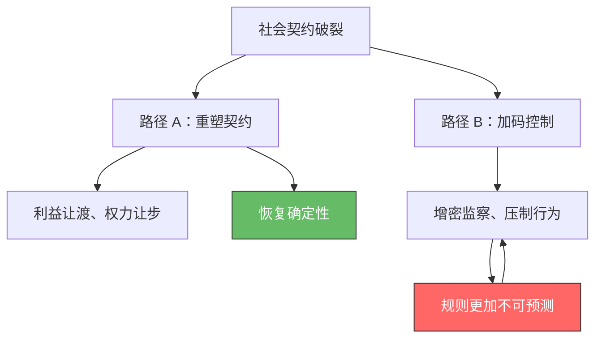

## 导言：说来说去就那么几件事

这组文章写了不少，从新加坡排队到香港反腐，从法治与人治的系统工程对比到社会契约的异化与崩溃。回头看，这些文章看似各自独立——有的讲博弈论，有的讲架构设计，有的讲个体感知，有的讲宏观动力学——但剥掉案例和术语的外壳，说来说去其实在论证同一件事。

物理学里，电、磁、光在麦克斯韦之前是三个完全不同的现象，之后人们发现它们不过是同一个方程组的不同投影。社会治理理论也有类似的时刻：看似百花齐放的各家学说，收敛到底，只是一个不变量在不同维度上的投影。

> **姊妹篇：** [极简组织行为学与管理学概论](https://cj9208.github.io/blog/systems_and_governance/ob-management-overview/) 将同一不变量在企业组织层面展开——增量与存量的行为逻辑转轨、间断平衡的宿命。

---

## 不变量

**制度规则的确定性，是系统中所有个体最优博弈策略的唯一参数。**

不是道德，不是文化，不是素质——是这一个参数。

金融市场里，决定资产价格的不是当前盈利，而是对未来现金流的预期。社会秩序同理：决定个体行为的不是规则本身的好坏，而是规则执行的**确定性**。当确定性高时，合作与善意是纳什均衡；当确定性低时，冷漠与投机是纳什均衡。

| 确定性水平 | 个体最优策略 | 社会均衡 |
| --- | --- | --- |
| 高（坚硬、透明、一贯） | 遵守规则、释放善意 | 合作型纳什均衡 |
| 低（弹性、模糊、摇摆） | 谨慎防备、投机套利 | 冷漠型纳什均衡 |

道德和文化是这个参数的**副产品**，不是原因。同一个印度裔摊主，在香港和在新加坡规规矩矩排队，到了另一个环境就插队加塞——变的不是文化，是博弈结构。

---

## 六次投影

同一个不变量，在六个不同维度上投射出不同的观测面。每一篇都是完整论证，这里只标注切入角度：

| 投影 | 切入角度 | 核心命题 | 展开 |
| --- | --- | --- | --- |
| **博弈论** | 预期与信任 | 规则硬度决定善意与冷漠的均衡切换；"和稀泥"制造逆向选择 | [从预期理论到社会秩序](https://cj9208.github.io/blog/systems_and_governance/expectation-certainty-civilization/) |
| **架构** | 开环 vs 闭环 | 反腐的确定性不靠决心，靠架构解耦——白盒输出合规预期，黑箱输出恐怖感 | [白盒与黑箱](https://cj9208.github.io/blog/systems_and_governance/white-box-black-box-icac-disciplinary-inspection/) |
| **个体感知** | 默认值方向 | 保护型架构卸载认知防御税；捕食型架构把风险转嫁给最没有信息优势的个体 | [免于提防的自由](https://cj9208.github.io/blog/systems_and_governance/freedom-from-vigilance/) |
| **工程范式** | 声明式 vs 过程式 | 法治 $\equiv$ 声明式收敛（Spec 公开、修正自动）；人治 $\equiv$ 中断驱动（每次领导意志都是新中断） | [声明式与过程式](https://cj9208.github.io/blog/systems_and_governance/declarative-imperative-governance/) |
| **系统动力学** | 底层规则稳定性 | 制度根基坚固（产权、法治）→ 进化；权力结构不可触碰 + 微观指标频变 → 退化 | [体系的不变量决定演进的方向](https://cj9208.github.io/blog/systems_and_governance/system-invariants-evolution-direction/) |
| **治理张力** | 合规与动员的摆钟 | 确定性在时间轴上周期震荡——系统无法同时维持坚硬与灵活，只能在两端摆动 | [秩序与穿透](https://cj9208.github.io/blog/systems_and_governance/order-compliance-mobilization/) |

---

## 当不变量被违反——确定性塌缩

当制度确定性持续下降，系统会进入一条可预测的退化链。

社会契约是公共权力与个体之间的隐性交易算法：个体让渡部分自由，换取规则确定性与远期收益预期。当这种确定性被过度开采——隐性违约、规则频繁摇摆、远期回报转负——个体开始以"消费收缩、行为摆烂、生物学不育"退场。

此时系统面对二元抉择：

路径 B 是一个自噬死循环：加码控制 → 规则更不可预测 → 加码控制。当系统拒绝路径 A，最终会触发"契约的删除键"——试图用技术替代把对手方（劳动者、消费者）从系统中整个删除。但这不过是路径 B 推至逻辑极限的终极幻觉。

所有确定性塌缩的症状——契约异化、塔西佗陷阱、运动式治理、社会冷漠——都是同一个不变量被违反后的不同临床表现。

详细展开：

- [社会契约的异化](https://cj9208.github.io/blog/systems_and_governance/social-contract-exploitation-path-dependence/)：契约过度开采→远期回报转负→个体以消费收缩与生物学不育退场的退化动力学。
- [契约的删除键](https://cj9208.github.io/blog/systems_and_governance/contract-deletion-technological-replacement/)：拒绝重塑契约时，系统试图用技术替代把劳动者与消费者整个删除的终极幻觉。
- [技术性装傻与分布式甩锅](https://cj9208.github.io/blog/systems_and_governance/chinese_government/technical-foolishness-tacitus-trap/)：确定性塌缩传导到公信力维度——越辟谣越不信的塔西佗负反馈闭环。
- [从维稳逻辑看政策扭曲](https://cj9208.github.io/blog/systems_and_governance/chinese_government/zero-cost-stability-distortion/)：零成本维稳逻辑如何在确定性塌缩后进一步加速制度根基的自噬。

---

## 结语：所有制度问题的终极判据

| 维度 | 确定性充足 | 确定性塌缩 |
| --- | --- | --- |
| 个体策略 | 合作、善意、高效 | 防备、投机、冷漠 |
| 交易成本 | 极低 | 极高 |
| 契约效力 | 自我执行、边际成本趋零 | 失效、需要高密度强制力 |
| 系统韧性 | 高（柔性吸收冲击） | 低（刚性脆断） |
| 治理成本 | 低 | 趋向无穷 |

现代社会的文明与温度，从来不是靠道德说教堆砌出来的，它是制度确定性的**副产品**。

所有制度问题的终极判据只有一个：**它是在增加还是减少规则的确定性？**
