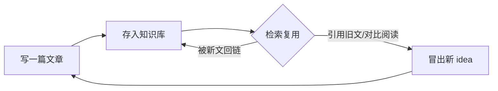

# 《我的个人知识库：为什么它越用越值钱》— 大纲（面向非技术听众）

**一句话主旨（贯穿全场）**：知识库的价值不是「存了多少」，而是「复利了多少」——而你只需要做决定的那个人。

---

## 0. 开场钩子：一个让人共情的痛点（2 分钟）

- 具体场景提问：六个月后你要写篇东西，想引用三个月前读到的一个观点——
  - 普通人：收藏夹吃灰 / 文件散落各处 / 格式不统一，最终放弃，重查一遍。
  - 我：两分钟内搜出出处，还顺手找到两篇相关旧文直接对比。
- 抛出核心问题：资料是「攒出来的」还是「用出来的」？

## 1. 主菜先行：内容飞轮（为什么越用越值）（5 分钟）

- 一句话定义：每完成一次「写」，就多一份可检索、可复用的资产；资产越多，下一次产出越省力、越有料。
- 飞轮图画出来（见下方示意）：
  > 写一篇文章 → 存入知识库 → 检索复用（写新文时引用/对比）→ 对比中冒出新 idea → 再写新文 →（回到起点）
- 强调主飞轮 = **你自己的知识复利**；顺带彩蛋 = AI 也被养熟（详见第 4 节）。
- 先亮结论，让听众带着「它怎么转起来」的疑问进入后面的机制。

## 2. 回填地基：内容与格式分离（为什么我写「纯文本」）（3 分钟）

- 类比：内容写在白纸上，版式由模板决定——你只管写字，排版系统自动完成。
- 对比现实：`.docx` 里内容、格式、历史纠缠在一起，改版式 = 动内容。
- 真正的高级卖点不是「易管理」，而是 **可迁移 + 永不过期**：纯文本十年后照样打得开，软件倒闭不心疼。

## 3. 操作系统：把 AI 当作一位新员工（5 分钟）

- 总类比一句话：我不教 AI「魔法」，我只给它一份入职配置，然后下工单。
- 四件套（用同一套「新员工」比喻贯穿）：
  | 概念 | 类比 | 作用 |
  |---|---|---|
  | system prompt | 岗位说明书 | 定义它怎么思考、什么文风、什么偏好 |
  | tools / skills | 工具箱 + 标准作业流程 | 重复劳动自动化，操作一次、永久复用 |
  | context | 公司资料库 | 就是第 1、2 节积累的文章本体 |
  | instruction | 今日工单 | 每一次具体要做什么 |
- 强调：四件套里，只有「今日工单」每次是新写的，其余三件是**持续长大**的存量——引出第 4 节。

## 4. 咬合：每生产一次，系统就长一截（5 分钟）

- 一个生产周期如何反向喂养三个存量：
  - 偏好与逻辑 → 沉淀进 **system prompt**（它越来越像你的表达）；
  - 重复性苦活 → 沉淀进 **tools/skills**（流程越来越自动化，省下的力气转投内容）；
  - 同一主题的旧文 → 汇入 **context**（文章多了就能汇总、能对比，对比出新题）。
- 回到第 1 节飞轮，明确告诉听众：**第 1 节的「省力」不是凭空来的，就是这三处存量喂养的。**
- 点出边界：存量不是越多越好，需要 review 与清理（garbage in, garbage out）——所以系统里有专门的「检查/修链」环节。

## 5. 设计原则：为什么偏偏是这套工具（2 分钟）

- 先抛听众心里的疑问：前面又是纯文本、又是技能、又是自动发布——看着很「极客」，其实全部只遵循同一条原则：

  > **凡是「不需要判断」的重复活，都不该由人来做；人的精力只留给真正需要判断的地方。**

- 用一张小表把「看起来分散」的选择收拢成「同一个理由的三个侧面」：

  | 你会问 | 答案 | 省下的是什么 |
  |---|---|---|
  | 为什么内容与格式分离？ | 排版交给模板，改版式不动内容 | 复杂度（结构清爽，改版/迁移不返工）|
  | 为什么做一堆 skills / 模板流程？ | 每篇都要做的固定杂活一键跑完 | 重复劳动（发文流程自动化）|
  | 为什么保存即自动构建发布？ | 不用手动部署，历史可回退 | 重复劳动 + 犯错风险 |

- 点破「技能」不是例外而是缩影：**skill 就是在 AI 那半边执行同一条原则**——你自己的重复活外包给了模板和流程，AI 的重复活（给新文章加格式、修链接、查规范）被封装成 skill 自动跑，两边是同一种设计。
- 一句收束：这套系统里没有「最新最酷」，只有「是不是省下了不该人做的事」这一个标准。
- 注意：技术名词全部浅化成「人话」（模板、一键流程、保存即发布），别出现 Hugo、git、workflow 这类词。

## 6. 信任与护栏：人还是老板（2 分钟）

- 整条流水线上，AI 只负责「提议」，**你负责「决定」**：留什么、发什么、什么值得进知识库。
- 这句收束也是给非技术听众的安全感：工具不会替你做判断，你的品味和判断才是知识库的核心资产。
- 顺带交代一个诚实边界：这座「知识库」的对外子集才是博客——很多文章其实是写给未来自己的。

## 7. Demo：一条真实完整的链路（5 分钟，可选现场演示）

- 从灵感到沉淀，把前面所有抽象概念落进一条看得见的线：
  1. 冒出一个问题/灵感
  2. 先用对话把想法聊透（brainstorm）
  3. 生成结构化大纲 → AI 依据大纲扩写成文
  4. 走自动检查流程（front matter、格式、链接、编码规范）
  5. 发布
  6. 数周后，一篇新文章引用了它 → 完成一次闭环（单篇级）
  7. **数月后回看，同一话题攒够时，知识库会长出更高层的结构（集合级）**——具体例子不必深讲，跑一遍即可，两个例子合起来证明「越用越厚、越用越原创」：
     - **例子 A：攒多 → 归并成文件夹 → 长出综述**（`corporate` / `systems_and_governance`）：写企业的文章越来越多，集中成 `corporate` 子目录，入口页补一页「这是什么 + 板块划分 + 推荐读法」的 story；整个目录再大时，再补一篇把各条主线串成阅读路径的总纲挂到首页。
     - **例子 B：按书整理笔记 → 撞上真实问题 → 被撑成自己的框架**（`system_design`）：起初只是照着计算机书整理学习笔记（System Design Master Roadmap）；后来发现书里根本不讲日常的真实问题——compliance、risk、audit，试着往里塞，塞不下，反而把主题撑大了：于是拆出 trust & governance（对监管、审计、客户证明系统可信）与 coordination（组织协作）两条新线，最后三线合成一个把架构重定义为「消除摩擦」的框架入口。笔记的「天花板」从一本书，长成了你自己的框架。
- 现场演示 > 口头描述：第 1–6 步做给观众看；第 7 步两个例子各「跑一下」即可——A 用「半年前的目录 vs 现在的目录」两张快照，B 翻两页笔记 + 一页最后的入口框架。点题：一个展示知识库「重组长高」，一个展示「越用越原创」，都是复利。
- 这一步回答听众最可能的疑问：「难道只是越存越多？」——不是。知识库会**定期重组**（例子 A），并被真实问题**逼出新框架**（例子 B）。这些判断都由人来做（呼应第 6 节）；重组本身也复用四件套里的 skills 帮忙盘点、搬文件、更新索引。

## 8. 收尾：一句话带走（1 分钟）

- 落到听众能带走的东西：**你不需要懂技术也能借鉴——开始记录你那个领域的「文章」，让它们互相引用，剩下的交给时间。**
- 最后一页只放一句话 + 博客地址。

---

**飞轮示意（第 1 节用）**

**可选扩展（演示第 7 步「集合级复利」时）**：在图上补一条合成回路——同一主题的文章攒够 → 重组为文件夹并写综述 → 综述本身成为导航入口与新的产出 → 吸引更多同主题写作。这条线体现的是「知识库不只越存越多，还会长出第二层结构」。

**整体时间占比建议（共约 30 分钟）**：飞轮（约 17%）≈ 四件套（约 17%）≈ 咬合（约 17%）≈ demo（约 17%）为四大块；地基（约 10%）、设计原则（约 7%）、护栏（约 7%）、开场 + 收尾（约 10%）为辅。原则与护栏都是「点题」，讲透一句即可，别展开成技术清单——主故事永远是「复利」。
