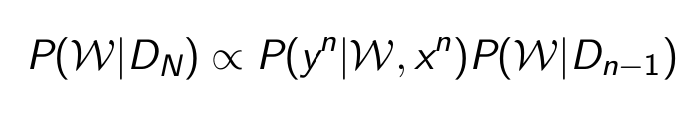
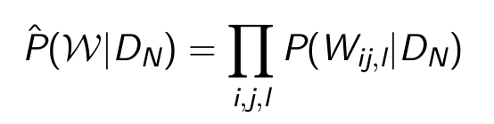
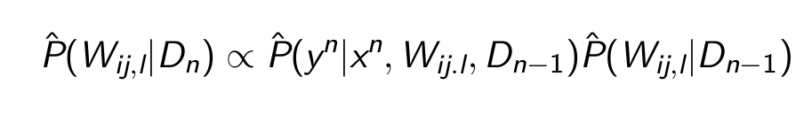
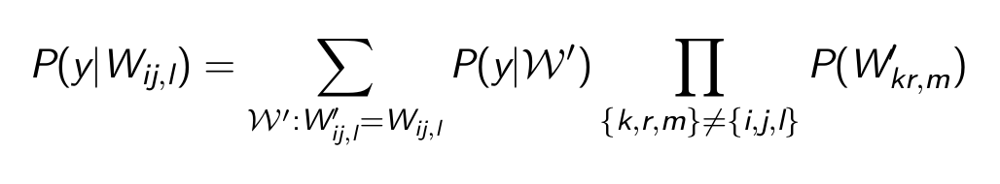
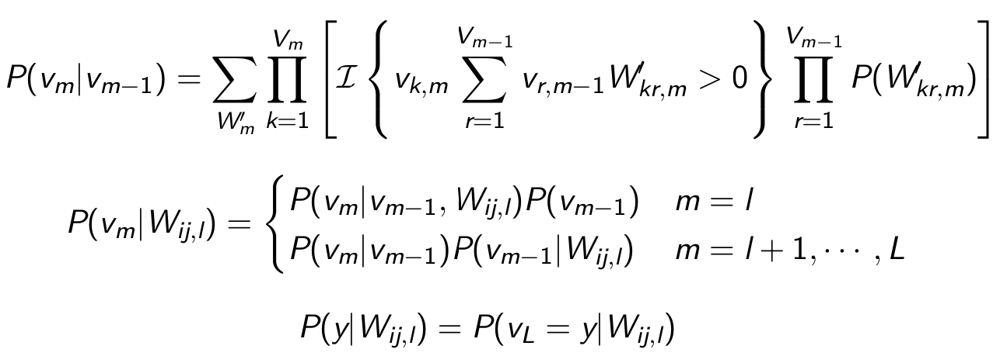
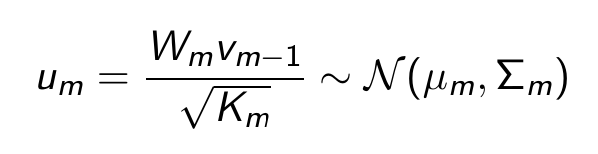
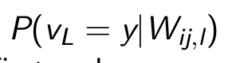
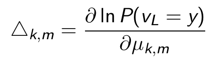

# EBP
- compute the posterior distribution
  - 
  - hard to compute
- Approximation 1
  - mean-field
    - $W_{ij,l}$ are independent
    - 
  - 
- Simplify marginal distribution
  - 
  - perform the summation layer by layer
    - 
- Approximation 2
  - CLT
    - 
- Approximation 3
  - 
  - use Taylor series w.r.t. mean of $W_{ij,l}$ to first order
  - first derivative
    - 
    - compute using BP