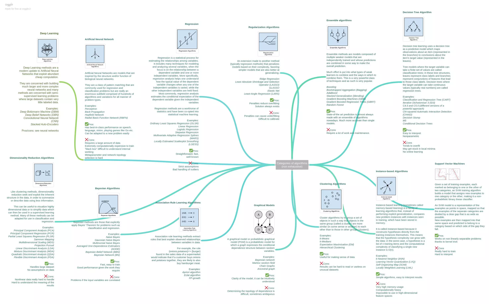

# scikit-learn
- whole pictures
  - 
  - 
- computing with scikit-learn
  - stategies to scale computationally
  - computational performance
  - parallelism, resource management and configuration
- supervised learning
  - classification
    - supervised learning
    - SVM
      - $\min \frac{1}{2}\|w\|^2 \text{ subject to } y_i(w_ix+b)\geq 1$
      - Lagrangian duality, KKT condition
        - $\max W(a) = \max \left( \sum_{i} a_i + \sum_{i,j}a_ia_jx_i^Tx_j \right)$
      - kernel
        - $\text{replace } x_i \text{ with } \Phi(x_i)$
          - Gaussian kernel
            - $k(x,y) = e^{-\|x-y\|^2/2\sigma^2}$
          - radial basis functions
            - $\phi_j(x) = h(\|x-\mu_j\|)$
      - soft margin
        - non-seperable data
        - $\min \frac{1}{2}\|w\|^2 + C \sum_i \xi_i \text{ subject to } y_i(w_ix+b) \geq 1 - \xi_i, \xi_i\geq 0$
    - naive bayes
      - $P(Y|X) = \frac{P(X|Y)P(Y)}{P(X)}$
      - features are independent
        - $P(X|Y) = \prod_i P(x_i|Y)$
    - decision tree
      - non-parametric
      - Purity Measures
        - entropy
        - variance measure
          - for a two class problem
        - Gini measure
        - misclassification measure
      - RandomForest
      - GBDT
        - 梯度下降树
        - XGBoosting
          - 基本思想
            - 贪心法，逐棵树进行学习，每棵树拟合之前模型的偏差
    - Logistic regression
      - cost function
        - $y_i\log\hat{y}_i + (1-y_i)\log (1-\hat{y}_i)$ $]$ $]$
      - cross entropy 交叉熵
        - $H(p,q) = -\sum_{x} p(x)\log q(x)$
      - likelihood
        - $L(\theta|x) = P(X=x|\theta)$
      - generalization to multi-class
        - softmax
  - regression
    - from sklearn import linear_model
    - Ordinary Least Squares(OLS)
      - linear_model.LinearRegression()
      - 理论部分
        - 假设
          - 自变量和因变量线性性
            - 不能很好描述非线性关系，会有很大的泛化误差
          - 自变量相互独立
            - 当多重共线性性出现的时候，变量之间的联动关系会导致我们测得的标准差偏大，置信区间变宽
          - 误差独立同分布（高斯分布）
            - 自相关性经常发生于时间序列数据集上，后项会受到前项的影响。当自相关性发生的时候，我们测得的标准差往往会偏小，进而会导致置信区间变窄
        - 假设检验
          - $RSS = \sum_k e_k^2$
          - $RSE = \sqrt{\frac{RSS}{n-2}}$
          - 系数检验
            - 置信区间
          - 模型准确度
            - RSE, $R^2, F$
      - $min \|Xw-y \|_2^2$
      - The coefficient estimates for OLS rely on the independence of the features
      - the least-squares estimate becomes highly sensitive to random errors in the observed target, producing a large variance
    - $L^2$ regularization-Ridge Regression
      - linear_model.Ridge(alpha=.5)
      - $min \|Xw-y \|_2^2 + \alpha \|w \|_2^2$
      - impose a penalty on the size of the coefficients
    - $L^1$ regularization
      - the coefficients will be sparse
        - near zero, the gradient is not zero
    - Bayesian regression
      - $p(y|X,w,\alpha) = \mathcal{N}(y|Xw,\alpha)$
    - polynomial regression
- unsupervised learning
  - clustering
    - k-means
      - instance learning
      - $J = \sum_n\sum_k r_{nk} \|x_n-\mu_k\|^2$
    - Gaussian mixture
      - $p(x) = \sum_k \pi_k \mathcal{N}(x|\mu_k,\Sigma_k), \sum_k\pi_k = 1$
      - general form
        - $p(x) = \sum_k p(x|z_k)p(z_k)$
      - maximzie likelihood
        - $\log p(X|\pi, \mu, \Sigma) = \sum_k \log p(x_k|\pi, \mu, \Sigma)$
      - EM algorithm
        - $p(X|\theta) = \sum_{Z} p(X,Z|\theta) = \sum_{Z}p(Z|X,\theta)p(X|\theta)$
    - feature agglomeration
      - merge similar features together
    - hierarchical clustering
      - MSRA use it determine the change sequence of RNA
  - dimension reduction
    - PCA
    - ICA
- preprocess
  - transformations
    - Standardization
      - mean removal and variance scaling
    - quantile transforms and power transforms
      - mapping to a uniform/Gaussian distribution
    - Encoding categorical features
    - Imputation of missing values
  - loading utilities
- model selection and evaluation
  - Cross-validation
  - Grid-search
  - plotting scores to evaluate models
    - validation curve
    - learning curve
- ensemble methods
  - Bagging
    - bootstrap sample
    - eg.
      - RandomForest
  - boosting
    - fit a sequence of weak learners on repeatedly modified versions of the data
    - eg.
      - AdaBoost
  - stacking
- text data
  - bag of words